Honestly, the book jumps straight into Apache terminology without first explaining **what problem Apache solves**. Let's fix that first.

---

# 6.3.4 Apache Web Server (The Easy Version)

## First: What Is Apache?

Apache is a:

```text
Web Server
```

A web server's job is:

```text
Someone opens a browser
↓
Requests a webpage
↓
Apache sends the webpage
```

---

# Before Apache

Imagine you create:

```text
index.html
```

containing:

```html
<h1>Hello World</h1>
```

How does another computer see it?

They can't.

It's just a file on your disk.

---

# After Apache

Apache acts like a waiter.

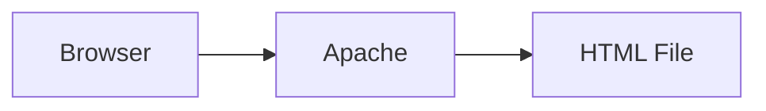

Request:

```text
http://server-ip
```

Apache:

```text
Reads File
↓
Returns Webpage
```

---

# Apache = Web File Server

Think:

```text
Apache
=
FTP Server for Websites
```

Except instead of downloading files:

```text
Browser gets webpages
```

---

# Why Is Apache Installed In Kali?

Many pentesting tools provide:

```text
Web Dashboards
Web Interfaces
Phishing Pages
Payload Hosting
C2 Panels
```

Examples:

```text
King Phisher
Gophish
BeEF
Custom Web Apps
```

These need:

```text
Apache
or
Nginx
```

to serve pages.

---

# Apache Architecture

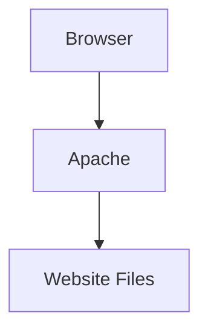

---

Example

You visit:

```text
http://192.168.1.10
```

Apache receives:

```text
GET /
```

Apache checks:

```text
/var/www/html
```

Finds:

```text
index.html
```

Returns it.

---

# Starting Apache

Apache is installed.

But Kali keeps it disabled.

Start it:

```bash
sudo systemctl start apache2
```

Check status:

```bash
systemctl status apache2
```

---

# Default Website Location

The first thing everyone should know:

```text
/var/www/html
```

---

Visualized:

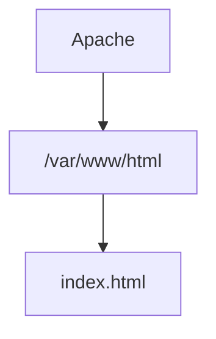

---

Example:

```bash
echo "<h1>Hello Kali</h1>" > /var/www/html/index.html
```

Now browse:

```text
http://localhost
```

You see:

```text
Hello Kali
```

---

# Apache Configuration Structure

This is where beginners get lost.

Think of Apache as:

```text
Apache
├── Modules
├── Sites
├── Ports
└── Logs
```

---

Main Directory:

```text
/etc/apache2
```

---

Look at it:

```bash
tree /etc/apache2
```

or

```bash
ls -l /etc/apache2
```

---

# Important Directories

|Directory|Purpose|
|---|---|
|/etc/apache2|Main Config|
|/etc/apache2/mods-available|Available Modules|
|/etc/apache2/mods-enabled|Enabled Modules|
|/etc/apache2/sites-available|Available Websites|
|/etc/apache2/sites-enabled|Enabled Websites|
|/var/www/html|Default Website|

---

# What Is A Module?

Apache is modular.

Meaning:

```text
Features
=
Separate Plugins
```

---

Think:

```text
VS Code Extensions
```

for Apache.

---

Without modules:

Apache only serves:

```text
HTML
CSS
Images
```

---

Modules add:

```text
PHP
SSL
Authentication
Compression
Proxying
```

---

Architecture:

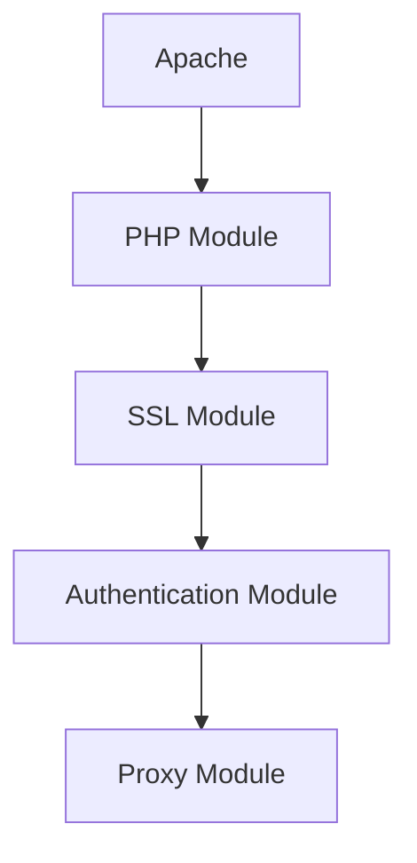

---

# Available vs Enabled Modules

Think:

```text
Installed
≠
Active
```

---

Available:

```text
/etc/apache2/mods-available
```

---

Enabled:

```text
/etc/apache2/mods-enabled
```

---

Visualized:

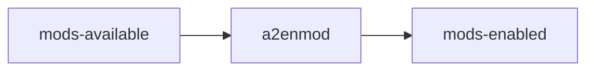

---

# Enable Module

Example:

```bash
sudo a2enmod ssl
```

Meaning:

```text
Enable SSL Support
```

---

Disable:

```bash
sudo a2dismod ssl
```

---

# What Does a2enmod Actually Do?

Surprisingly simple.

It creates:

```text
Symbolic Link
```

---

Visualized:

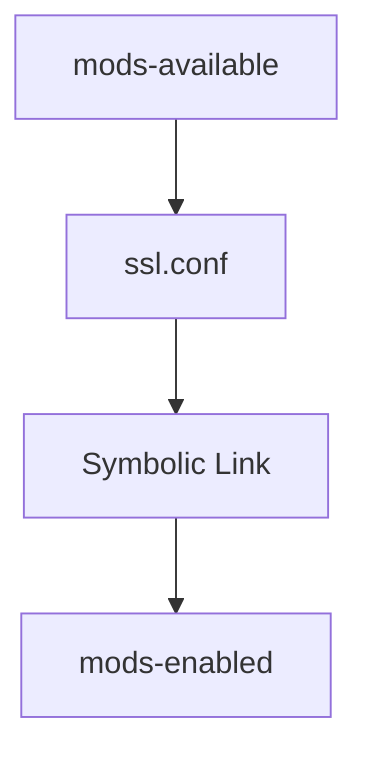

---

# PHP Module

Suppose website contains:

```php
<?php
echo "Hello";
?>
```

Browser cannot run PHP.

Apache uses:

```text
PHP Module
```

to execute it.

---

Flow:

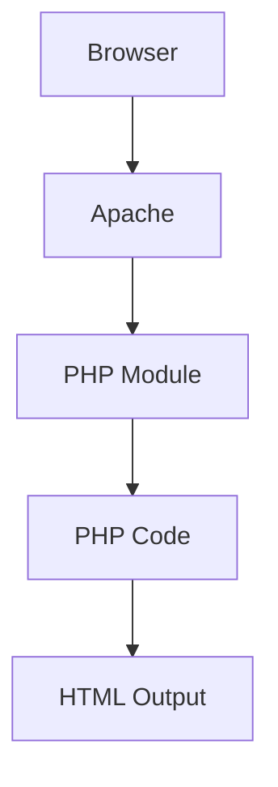

---

# SSL / HTTPS

Without SSL:

```text
HTTP
Port 80
```

---

With SSL:

```text
HTTPS
Port 443
```

---

Flow:

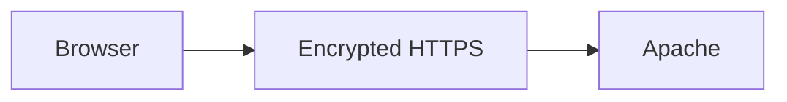

---

Enable SSL:

```bash
sudo a2enmod ssl
```

---

Configuration template:

```text
/etc/apache2/sites-available/default-ssl.conf
```

---

# Ports

Apache listens on:

```text
Port 80
```

by default.

---

Config file:

```text
/etc/apache2/ports.conf
```

---

Example:

```text
Listen 80
```

---

Visualized:

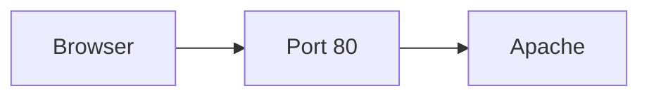

---

# What Is A Virtual Host?

This is the most important Apache concept.

---

Without Virtual Hosts:

```text
One Apache
=
One Website
```

---

With Virtual Hosts:

```text
One Apache
=
Many Websites
```

---

Visualized:

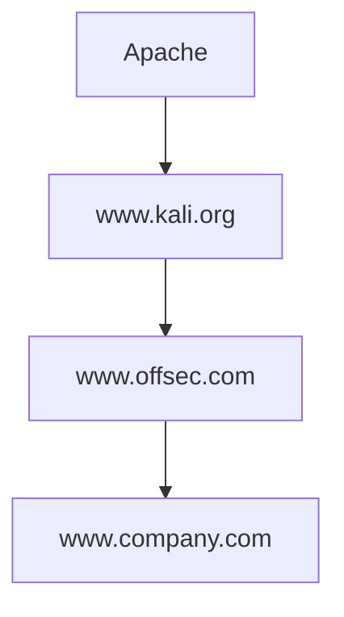

---

# Real Example

Request:

```text
www.kali.org
```

Apache serves:

```text
Website A
```

---

Request:

```text
www.offsec.com
```

Apache serves:

```text
Website B
```

---

Same server.

Same Apache process.

---

# Virtual Host Configuration

Stored in:

```text
/etc/apache2/sites-available
```

---

Example:

```text
www.kali.org.conf
```

---

Contents:

```apache
<VirtualHost *:80>

ServerName www.kali.org

DocumentRoot /srv/www.kali.org/www

</VirtualHost>
```

---

# Let's Decode That

---

## VirtualHost *:80

```text
Listen on Port 80
```

---

## ServerName

```apache
ServerName www.kali.org
```

means:

```text
Website Name
```

---

## DocumentRoot

```apache
DocumentRoot /srv/www.kali.org/www
```

means:

```text
Website Files Are Here
```

---

Architecture:

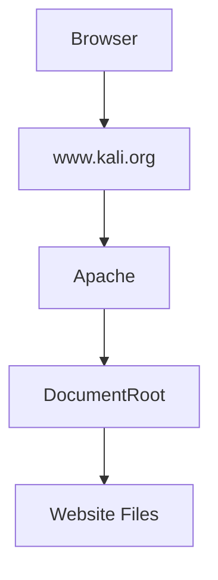

---

# Enable Website

After creating config:

```bash
sudo a2ensite www.kali.org
```

---

Disable:

```bash
sudo a2dissite www.kali.org
```

---

Again:

```text
sites-available
≠
sites-enabled
```

Same idea as modules.

---

# What Is 000-default.conf?

File:

```text
/etc/apache2/sites-enabled/000-default.conf
```

---

Think:

```text
Default Website
```

---

If request arrives:

```text
unknownwebsite.com
```

Apache serves:

```text
000-default.conf
```

---

Because:

```text
000
```

loads first alphabetically.

---

# Directory Blocks

Example:

```apache
<Directory /var/www>

Options Includes FollowSymLinks

DirectoryIndex index.php index.html

</Directory>
```

---

Meaning:

```text
Rules for this folder
```

---

# DirectoryIndex

This is easy.

Suppose browser requests:

```text
http://site.com/
```

---

Apache checks:

```text
index.php

index.html

index.htm
```

in that order.

---

Visualized:

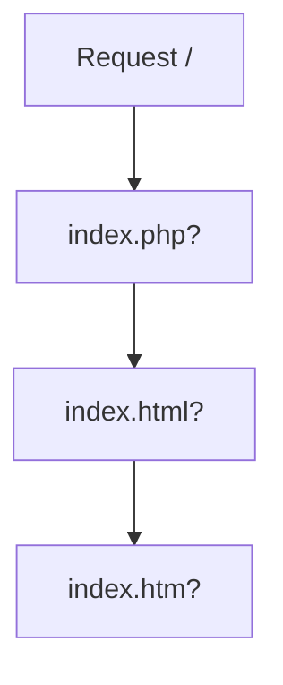

---

# Options

These enable features.

---

# FollowSymLinks

Allows:

```text
Symbolic Links
```

---

Example:

```bash
ln -s /home/kali/files /var/www/html/files
```

Apache follows link.

---

# Indexes

Very important.

---

Without:

```text
Directory Listing Disabled
```

---

With:

```text
Indexes
```

Apache shows:

```text
folder/
├── file1
├── file2
├── file3
```

---

Browser sees file list.

---

Useful:

```text
Downloads
Repositories
File Hosting
```

---

Dangerous:

```text
Information Leakage
```

---

# Authentication

Suppose:

```text
/admin
```

should require login.

---

Apache can protect it.

---

Flow:

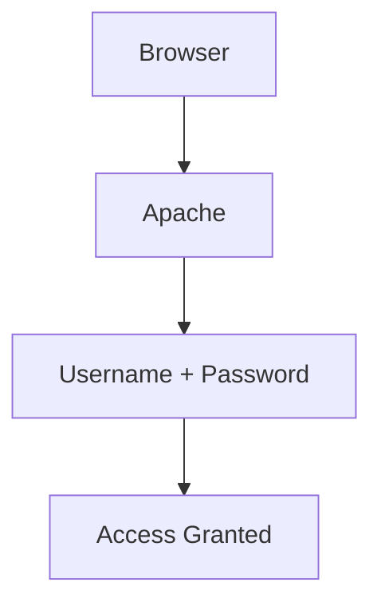

---

# .htaccess

This file contains rules.

Example:

```text
/var/www/html/.htaccess
```

---

Think:

```text
Folder-Specific Apache Config
```

---

Example:

```apache
Require valid-user

AuthName "Private Directory"

AuthType Basic
```

---

Meaning:

```text
Require Login
```

---

# Where Are Passwords Stored?

Example:

```apache
AuthUserFile /etc/apache2/authfiles/htpasswd-private
```

---

File contains:

```text
Username
Password Hash
```

---

Create user:

```bash
htpasswd /etc/apache2/authfiles/htpasswd-private john
```

---

# Basic Authentication

Login popup:

```text
Username:
Password:
```

---

Problem:

```text
Not Encrypted
```

only:

```text
Base64 Encoded
```

---

Therefore:

```text
Basic Auth
+
HTTPS
```

should always be used together.

---

# Restrict Access By IP

Example:

```apache
Require ip 192.168.0.0/16
```

Meaning:

```text
Only Local Network Allowed
```

---

Visualized:

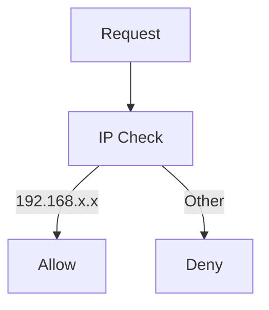

---

# Complete Apache Request Flow

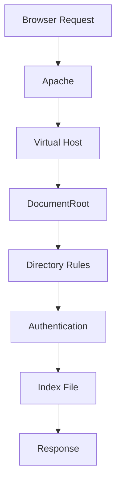

---

# Commands To Remember

```bash
systemctl start apache2
```

Start Apache

---

```bash
a2enmod ssl
```

Enable SSL module

---

```bash
a2dismod ssl
```

Disable SSL module

---

```bash
a2ensite site.conf
```

Enable website

---

```bash
a2dissite site.conf
```

Disable website

---

```bash
htpasswd file user
```

Create website user

---

# The 5 Things You Must Remember

```text
Apache = Web Server

/var/www/html
    = Default Website Files

a2enmod
    = Enable Module

a2ensite
    = Enable Website

Virtual Host
    = Multiple Websites On One Apache

.htaccess
    = Folder-Level Rules

Require ip
    = IP Restrictions

htpasswd
    = Create Website Users
```

This chapter makes much more sense if you imagine Apache as a **traffic cop**:

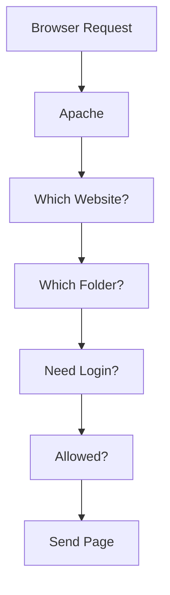

Every Apache feature (virtual hosts, authentication, SSL, directory rules) is just Apache deciding **who gets what content and under what conditions**.