# 6.3.3 Configuring PostgreSQL Databases

> PostgreSQL is one of the most popular relational database systems in Linux. Many tools and applications don't store data in files—they store it in PostgreSQL databases.

---

# First: What Is a Database?

Without a database:

```text
Application
    ↓
Text Files
```

---

With a database:

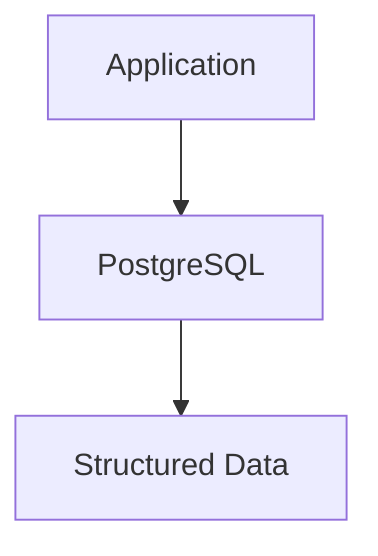

---

Examples:

|Application|Stores In PostgreSQL|
|---|---|
|Metasploit|Hosts, exploits, sessions|
|King Phisher|Campaign data|
|Web Applications|Users, posts, settings|
|Monitoring Tools|Logs, metrics|
|ERP/CRM Systems|Business data|

---

# PostgreSQL Architecture

Think of PostgreSQL as a service running in the background.

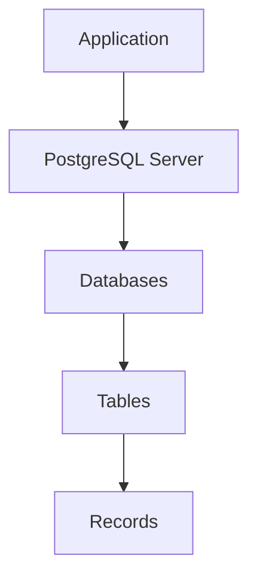

---

# Real World Analogy

Think of PostgreSQL like a building.

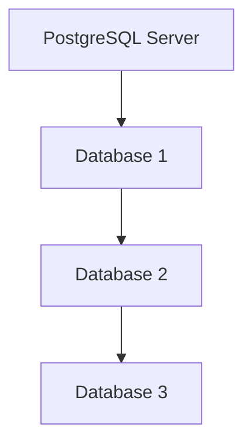

Inside each database:

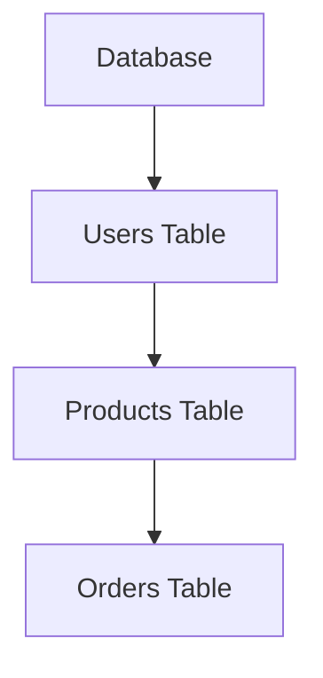

---

# PostgreSQL Service

PostgreSQL runs as a Linux service.

Start it:

```bash
sudo systemctl start postgresql
```

---

Check status:

```bash
systemctl status postgresql
```

---

Visualization:

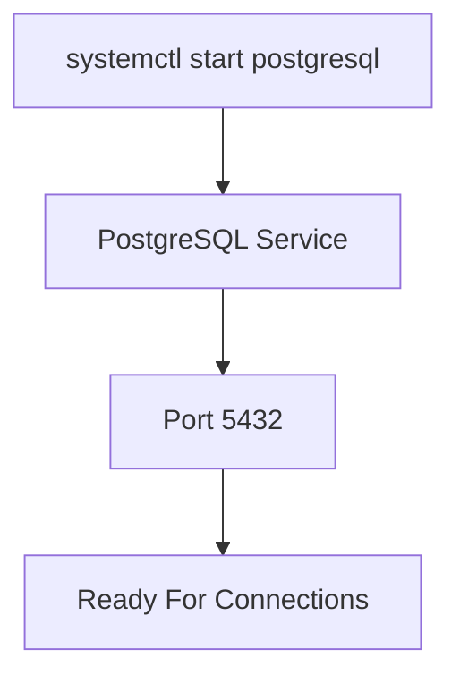

---

# PostgreSQL Server Process

The main daemon is:

```text
postgres
```

Sometimes called:

```text
postmaster
```

Historically.

---

# PostgreSQL Terminology

This is where many beginners get confused.

---

## Linux User

Example:

```text
kali
postgres
root
```

Managed by Linux.

Stored in:

```text
/etc/passwd
```

---

## PostgreSQL User

Example:

```text
king_phisher
metasploit
webapp
```

Managed by PostgreSQL.

Stored inside PostgreSQL.

---

These are NOT the same.

---

Visualization

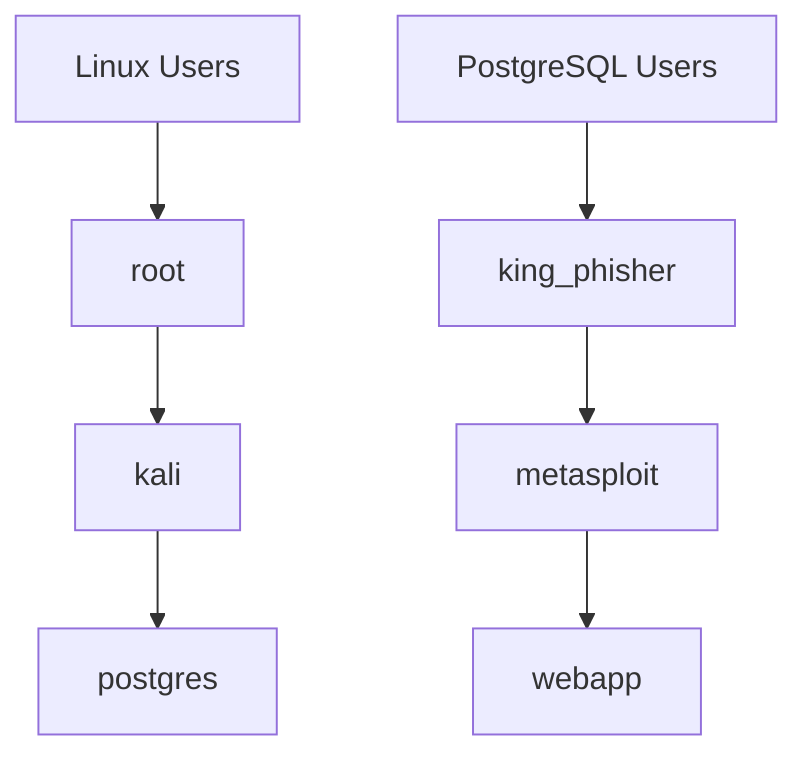

---

# The Special postgres User

PostgreSQL automatically creates:

```text
postgres
```

---

This is equivalent to:

```text
root
```

for PostgreSQL.

---

Think:

|Linux|PostgreSQL|
|---|---|
|root|postgres|

---

Visualization

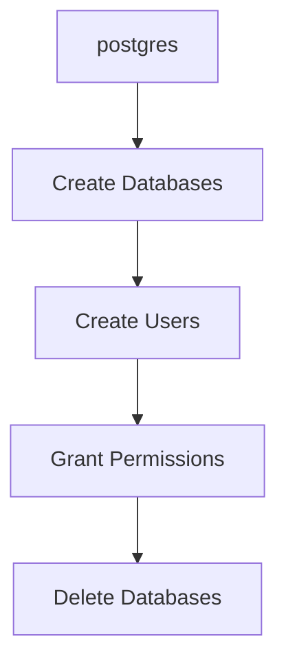

---

# Why Use su - postgres?

Instead of:

```bash
sudo createuser
```

the common method is:

```bash
su - postgres
```

---

Why?

Because:

```text
postgres
```

already has:

```text
Full Database Permissions
```

---

Flow

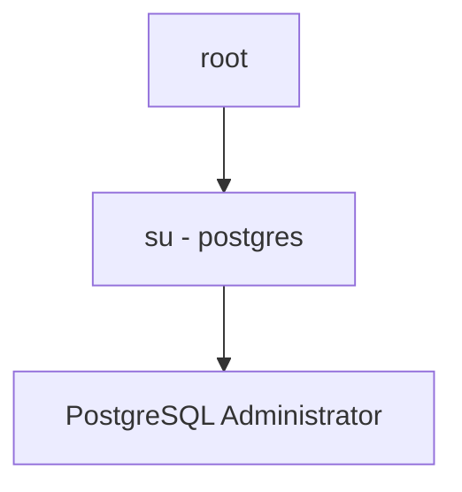

---

# PostgreSQL Connections

PostgreSQL accepts connections in two ways.

---

## Method 1: TCP

Network connection.

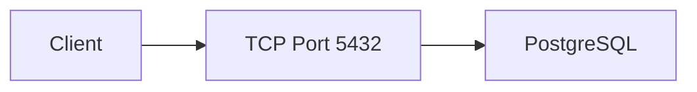

---

Default port:

```text
5432
```

---

## Method 2: Unix Socket

Local filesystem socket.

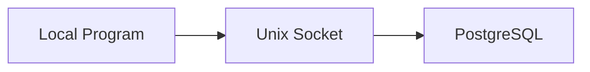

---

Socket file:

```text
/var/run/postgresql/.s.PGSQL.5432
```

---

# Why Two Connection Methods?

TCP:

```text
Network Access
```

---

Socket:

```text
Local Machine Access
```

---

Sockets are:

```text
Faster
More Secure
No Networking Required
```

---

# PostgreSQL Authentication

Authentication depends on connection method.

---

# Socket Authentication

Default:

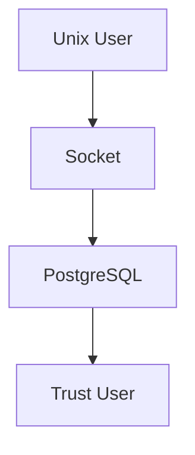

---

Example:

```bash
su - postgres
psql
```

No password needed.

---

Why?

Because Linux already authenticated you.

---

# TCP Authentication

Different.

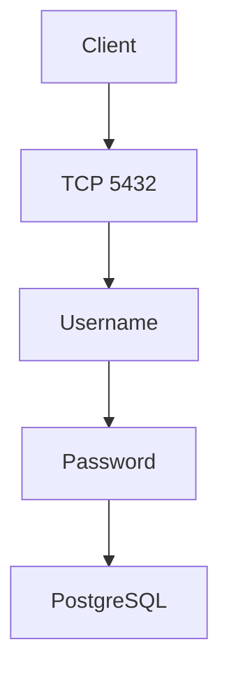

---

Requires:

```text
PostgreSQL Username
PostgreSQL Password
```

---

Not Linux credentials.

---

# Important Configuration Files

---

# postgresql.conf

Main PostgreSQL configuration.

Think:

```text
sshd_config
for PostgreSQL
```

---

Contains:

```text
Port
Listen Addresses
Memory
Logging
Performance
```

---

# listen_addresses

Example:

```conf
listen_addresses='localhost'
```

Meaning:

```text
Accept Local Connections Only
```

---

Visualization

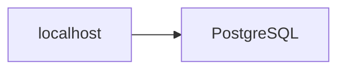

---

If changed:

```conf
listen_addresses='*'
```

Then:

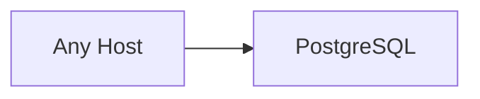

---

# port

Default:

```conf
port = 5432
```

---

# unix_socket_directories

Controls:

```text
Where Socket Files Are Created
```

Example:

```text
/var/run/postgresql
```

---

# pg_hba.conf

Most important PostgreSQL security file.

---

Think:

```text
Firewall For Database Logins
```

---

Purpose:

```text
Who Can Connect?

From Where?

Using Which Authentication?
```

---

Visualization

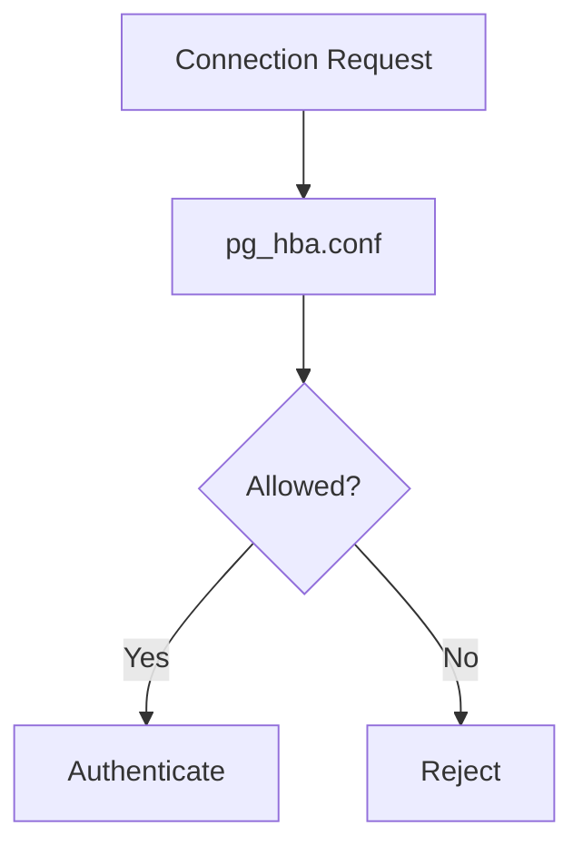

---

# Creating PostgreSQL Users

Command:

```bash
createuser
```

---

Example:

```bash
createuser -P king_phisher
```

---

What Happens?

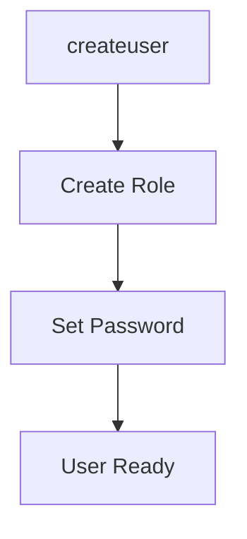

---

# Why Does PostgreSQL Call Them Roles?

Modern PostgreSQL terminology:

```text
Role
```

instead of:

```text
User
```

---

For exams and troubleshooting:

```text
Role ≈ User
```

---

# The -P Option

```bash
createuser -P king_phisher
```

---

Meaning:

```text
Prompt For Password
```

---

Flow

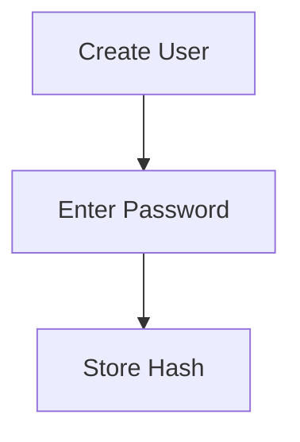

---

# Creating Databases

Command:

```bash
createdb
```

---

Example:

```bash
createdb \
-T template0 \
-E UTF-8 \
-O king_phisher \
king_phisher
```

---

Let's Decode It.

---

# Database Name

```text
king_phisher
```

Creates:

```text
Database:
king_phisher
```

---

# Owner

```bash
-O king_phisher
```

Means:

```text
Owner = king_phisher
```

---

Visualization

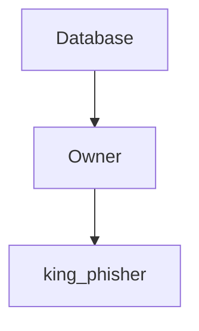

---

Owner gets:

```text
Create Tables
Delete Tables
Grant Permissions
Modify Data
```

---

# UTF-8

```bash
-E UTF-8
```

Means:

```text
Unicode Support
```

---

Supports:

```text
English
हिन्दी
日本語
中文
```

---

Without UTF-8:

Many languages break.

---

# Template Databases

This is unique to PostgreSQL.

---

When creating a database:

PostgreSQL actually copies another database.

---

Visualization

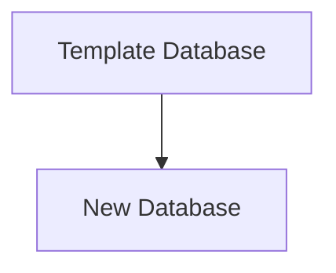

---

Default template:

```text
template1
```

---

Book uses:

```bash
-T template0
```

---

Why?

To create a clean database.

---

# Testing Connection

Command:

```bash
psql -h localhost -U king_phisher king_phisher
```

---

Breakdown:

```text
-h localhost
    Connect To Localhost

-U king_phisher
    Username

king_phisher
    Database Name
```

---

Visualization

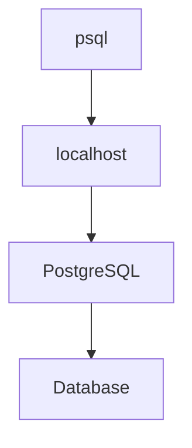

---

# What Is psql?

Equivalent of:

```text
Cisco CLI
```

for PostgreSQL.

---

It is the PostgreSQL shell.

Example:

```text
king_phisher=>
```

---

From here you run SQL commands.

---

# PostgreSQL Clusters

This is Debian/Kali specific.

---

Most people think:

```text
One PostgreSQL Server
```

---

Debian allows:

```mermaid
flowchart TD

A["Machine"]

--> B["Cluster 14"]

--> C["Cluster 15"]

--> D["Cluster 16"]

```

running simultaneously.

---

# What Is A Cluster?

In Debian:

```text
One PostgreSQL Instance
+
Its Databases
+
Its Configurations
```

---

Think:

```text
Independent PostgreSQL Server
```

---

# Why Multiple Clusters?

Example:

```text
PostgreSQL 14
PostgreSQL 15
```

running together.

---

Visualization

```mermaid
flowchart TD

A["Cluster 14"]

--> B["Port 5432"]

C["Cluster 15"]

--> D["Port 5433"]

```

---

# Cluster Configuration Location

```text
/etc/postgresql/version/cluster-name/
```

Example:

```text
/etc/postgresql/15/main/
```

---

# Viewing Clusters

Command:

```bash
pg_lsclusters
```

---

Output shows:

```text
Version
Cluster Name
Port
Status
```

---

Visualization

```mermaid
flowchart TD

A["pg_lsclusters"]

--> B["Version"]

--> C["Port"]

--> D["Status"]

```

---

# Managing Clusters

Common commands:

|Command|Purpose|
|---|---|
|pg_createcluster|Create Cluster|
|pg_dropcluster|Delete Cluster|
|pg_ctlcluster|Start/Stop Cluster|
|pg_upgradecluster|Upgrade Cluster|
|pg_renamecluster|Rename Cluster|
|pg_lsclusters|Show Clusters|

---

# PostgreSQL Upgrade Process

Example:

Current:

```text
Cluster 14
Port 5432
```

Install new version:

```text
Cluster 15
Port 5433
```

---

Migration:

```mermaid
flowchart TD

A["Old Cluster"]

--> B["pg_upgradecluster"]

--> C["New Cluster"]

```

---

After testing:

```bash
pg_dropcluster
```

removes old cluster.

---

# Complete PostgreSQL Architecture

```mermaid
flowchart TD

A["Applications"]

--> B["PostgreSQL"]

B --> C["TCP 5432"]

B --> D["Unix Socket"]

B --> E["Users / Roles"]

B --> F["Databases"]

F --> G["Tables"]

F --> H["Records"]

B --> I["pg_hba.conf"]

B --> J["postgresql.conf"]

B --> K["Cluster"]

```

---

# Commands To Remember

## Start PostgreSQL

```bash
systemctl start postgresql
```

---

## Switch To PostgreSQL Admin

```bash
su - postgres
```

---

## Create User

```bash
createuser -P username
```

---

## Create Database

```bash
createdb -O username dbname
```

---

## Connect To Database

```bash
psql -h localhost -U username dbname
```

---

## Show Clusters

```bash
pg_lsclusters
```

---

# Quick Memory Diagram

```mermaid
flowchart TD

A["PostgreSQL"]

--> B["postgres User"]

--> C["Roles"]

--> D["Databases"]

--> E["TCP 5432"]

--> F["Unix Socket"]

--> G["pg_hba.conf"]

--> H["postgresql.conf"]

--> I["Clusters"]

```

### Remember

```text
postgres
    = PostgreSQL root

5432
    = Default Port

createuser
    = Create Database User

createdb
    = Create Database

psql
    = PostgreSQL CLI

pg_hba.conf
    = Authentication Rules

postgresql.conf
    = Main Configuration

pg_lsclusters
    = Show PostgreSQL Instances
```