# 6.3.2 Configuring SSH for Remote Logins

> SSH is one of the most important services in Linux. It allows you to remotely access, administer, transfer files, and execute commands on another machine securely over a network.

---

# What is SSH?

SSH stands for:

```text
Secure Shell
```

Think:

```text
Remote Terminal Access
```

Instead of physically sitting in front of a machine:


You connect remotely and get a shell.

---

# Before SSH Existed

Old protocols:

```text
telnet
rlogin
rsh
```

Problem:

```text
Everything Sent In Plaintext
```

Including:

```text
Passwords
Commands
Data
```

---

Example

Attacker sniffing network:

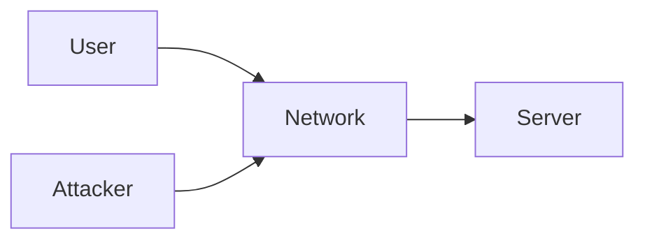

Could see:

```text
Username
Password
```

---

# SSH Solves This

SSH encrypts everything.


Attacker sees:

```text
Random Encrypted Data
```

instead of:

```text
Passwords
Commands
Files
```

---

# SSH Components

SSH actually consists of:

|Component|Purpose|
|---|---|
|ssh|Client|
|sshd|Server (Daemon)|

---

# Client vs Server

## SSH Client

Program:

```bash
ssh
```

Used to connect.

Example:

```bash
ssh kali@192.168.1.50
```

---

## SSH Server

Program:

```text
sshd
```

Runs on target machine.

Waits for connections.

---

Visualization


---

# Kali Default Behavior

Interesting Kali security policy:

```text
SSH Installed
BUT
SSH Disabled
```

---

Why?

Because Kali tries to minimize:

```text
Attack Surface
```

---

Default state:

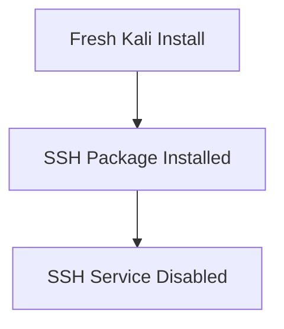

---

# Checking SSH Status

```bash
systemctl status ssh
```

---

Possible output:

```text
active (running)
```

or

```text
inactive (dead)
```

---

# Starting SSH

Start immediately:

```bash
sudo systemctl start ssh
```

---

Visualization

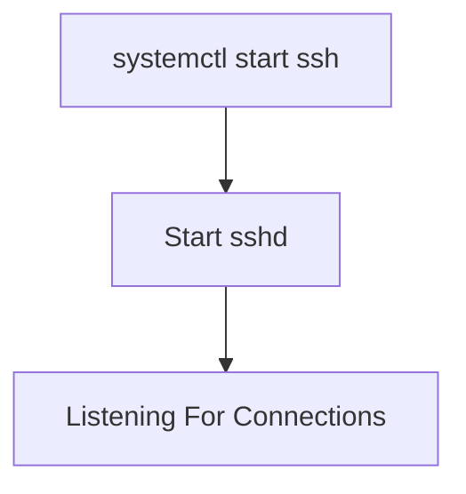

---

# Enable SSH at Boot

Current session only:

```bash
systemctl start ssh
```

---

Persistent:

```bash
systemctl enable ssh
```

---

Difference:

|Command|Purpose|
|---|---|
|start|Start now|
|enable|Start at every boot|

---

Visualization

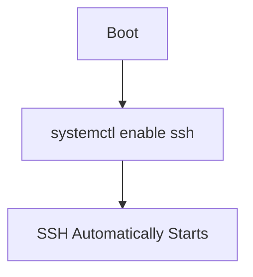

---

# SSH Configuration File

Main file:

```text
/etc/ssh/sshd_config
```

---

Think:

```text
Brain Of SSH Server
```

---

Architecture

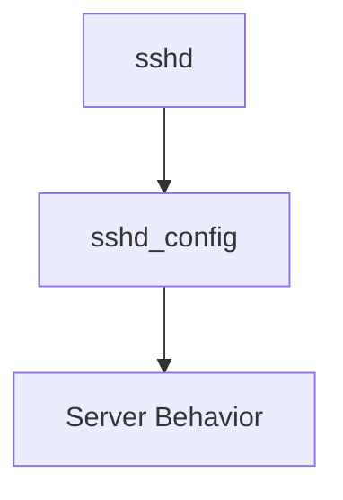

---

# Common Configuration Options

Many settings exist.

Most important:

```text
Port
PasswordAuthentication
PermitRootLogin
PubkeyAuthentication
```

---

# Default Port

SSH listens on:

```text
Port 22
```

---

Visualization


---

# Changing Port

Example:

```conf
Port 2222
```

---

Now SSH listens on:

```text
2222
```

instead of:

```text
22
```

---

Connection becomes:

```bash
ssh -p 2222 kali@192.168.1.50
```

---

Why Change Port?

Reduces:

```text
Automated Scans
Bot Attacks
```

---

Reality Check

Port changes:

```text
Do NOT improve encryption
Do NOT stop attackers
```

Only reduces noise.

---

# Password Authentication

Default:

```conf
PasswordAuthentication yes
```

---

Meaning:

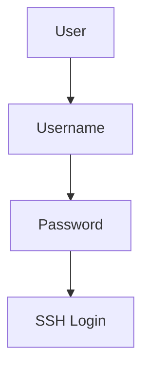

---

# Disabling Password Login

Configuration:

```conf
PasswordAuthentication no
```

---

Now:

```text
Passwords Not Allowed
```

---

Only SSH keys can authenticate.

---

Why?

Passwords can be:

```text
Guessed
Brute Forced
Leaked
```

---

SSH keys are far stronger.

---

# SSH Authentication Methods

## Password Authentication

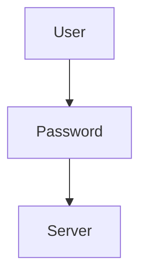

---

## Key Authentication

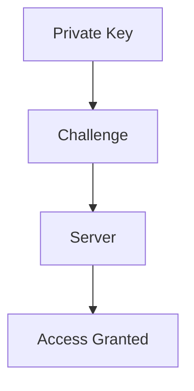

---

Much more secure.

---

# Reloading SSH

After editing:

```text
/etc/ssh/sshd_config
```

SSH must reread configuration.

---

Command:

```bash
sudo systemctl reload ssh
```

---

Difference:

|Command|Purpose|
|---|---|
|reload|Re-read config|
|restart|Stop + Start|
|start|Start|
|stop|Stop|

---

Visualization

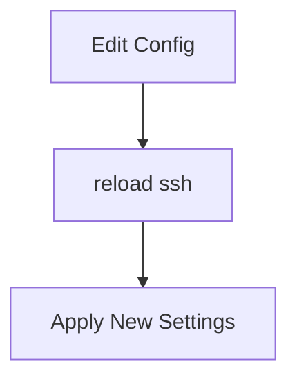

---

# SSH Host Keys

This is one of the most misunderstood SSH concepts.

---

# Client Keys vs Host Keys

People often confuse:

```text
User SSH Keys
```

with

```text
Host SSH Keys
```

---

They are different.

---

# User SSH Keys

Used for:

```text
User Authentication
```

---

Example:

```text
id_rsa
id_ed25519
```

---

# Host SSH Keys

Used for:

```text
Server Identity
```

---

Stored in:

```text
/etc/ssh/ssh_host_*
```

---

Visualization

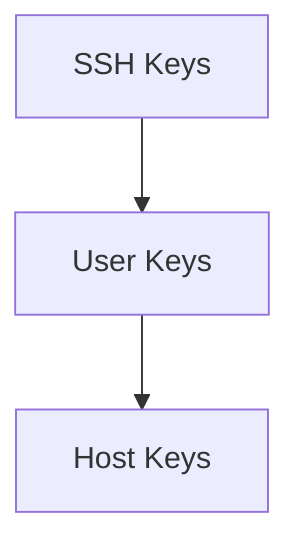

---

# Why Host Keys Exist

Imagine:

```text
You connect to server
```

Question:

```text
How do you know
it's the correct server?
```

---

Host keys solve this.

---

SSH Connection Process

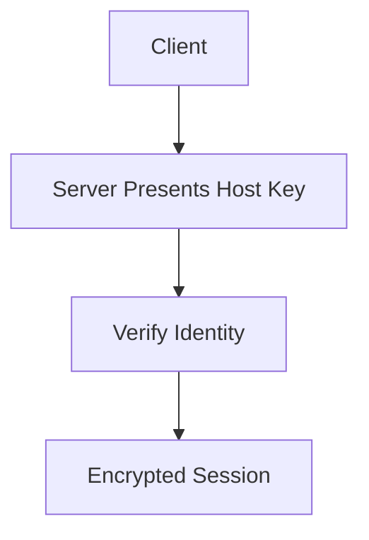

---

# Host Key Files

Examples:

```text
/etc/ssh/ssh_host_rsa_key

/etc/ssh/ssh_host_ecdsa_key

/etc/ssh/ssh_host_ed25519_key
```

---

Think:

```text
Server Certificates
```

for SSH.

---

# Why Host Keys Must Be Unique

Bad scenario:

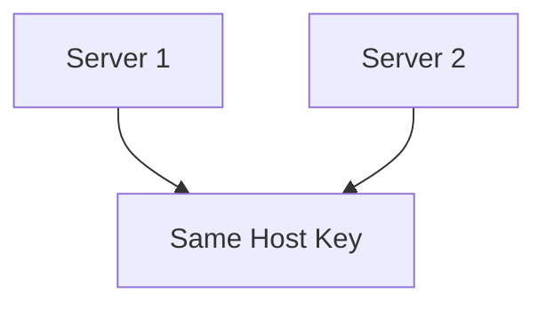

---

Now clients cannot distinguish:

```text
Server 1
from
Server 2
```

Security problem.

---

# Disk Images Problem

Common with:

```text
VM Templates
Cloud Images
ARM Images
```

---

Example:

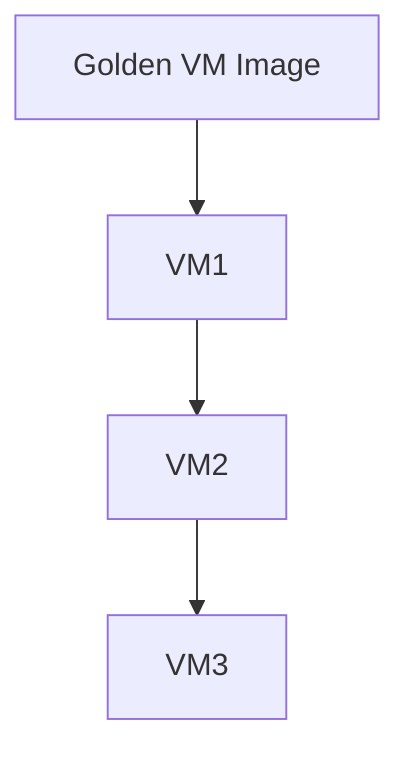

All machines inherit:

```text
Same SSH Host Keys
```

---

Bad.

---

# Fixing Cloned Host Keys

Step 1

Reset passwords.

```bash
passwd
```

---

Step 2

Delete old keys.

```bash
rm /etc/ssh/ssh_host_*
```

---

What does this do?

```text
Remove Existing Server Identity
```

---

Step 3

Generate fresh keys.

```bash
dpkg-reconfigure openssh-server
```

---

This command:

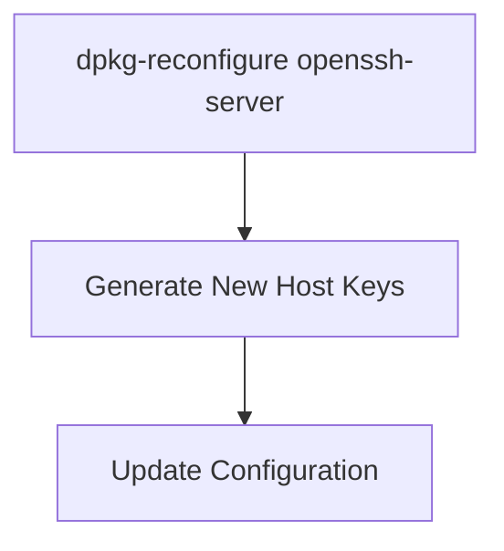

---

# What Is dpkg-reconfigure?

One of the most useful Debian/Kali commands.

Purpose:

```text
Run Package Setup Again
```

---

Example:

```bash
dpkg-reconfigure openssh-server
```

means:

```text
Reconfigure OpenSSH Package
```

---

Many packages support this.

Examples:

```text
openssh-server
tzdata
keyboard-configuration
locales
```

---

# Step 4

Restart SSH.

```bash
systemctl restart ssh
```

---

Full Process

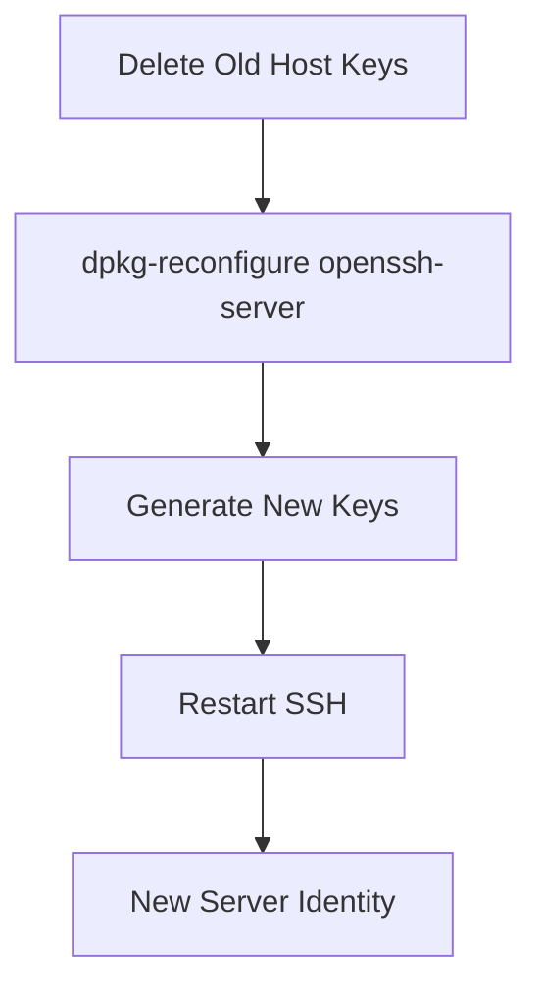

---

# Why Restart?

Because:

```text
sshd
```

must load:

```text
New Keys
```

into memory.

---

# Complete SSH Connection Process

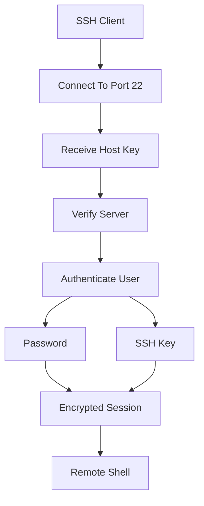

---

# Typical Kali SSH Workflow

```mermaid
flowchart TD

A["Install Kali"]

--> B["SSH Installed"]

--> C["SSH Disabled"]

--> D["systemctl start ssh"]

--> E["Edit sshd_config"]

--> F["reload ssh"]

--> G["Remote Access Ready"]

```

---

# Important Files

|File|Purpose|
|---|---|
|`/etc/ssh/sshd_config`|SSH server configuration|
|`/etc/ssh/ssh_host_*`|Server host keys|
|`~/.ssh/authorized_keys`|Allowed user public keys|
|`~/.ssh/id_rsa`|User private key|
|`~/.ssh/id_ed25519`|User private key (modern)|

---

# Important Commands

## Start SSH

```bash
systemctl start ssh
```

---

## Enable SSH At Boot

```bash
systemctl enable ssh
```

---

## Reload Configuration

```bash
systemctl reload ssh
```

---

## Restart SSH

```bash
systemctl restart ssh
```

---

## Show Status

```bash
systemctl status ssh
```

---

## Generate New Host Keys

```bash
rm /etc/ssh/ssh_host_*

dpkg-reconfigure openssh-server

systemctl restart ssh
```

---

# Quick Memory Diagram

```mermaid
flowchart TD

A["SSH"]

--> B["ssh Client"]

--> C["sshd Server"]

C --> D["Port 22"]

C --> E["sshd_config"]

C --> F["Host Keys"]

F --> G["Server Identity"]

E --> H["Password Authentication"]

E --> I["Port Configuration"]

```

### Remember

```text
ssh      = Client

sshd     = Server

Port 22  = Default SSH Port

sshd_config
          = Server Configuration

Host Keys
          = Server Identity

systemctl reload ssh
          = Apply Config Changes

dpkg-reconfigure openssh-server
          = Generate New Host Keys
```