# 6.2.3 Disabling Accounts

> Sometimes you don't want to delete a user. You only want to prevent them from logging in while preserving their files, settings, and data.

---

# Why Disable Instead of Delete?

Imagine an employee:

```text
Takes Leave
Resigns
Under Investigation
Temporary Suspension
```

You may need to:

```text
Block Login Access
```

but keep:

```text
Files
Emails
Logs
Ownership
Home Directory
```

---

# Delete vs Disable

## Delete User

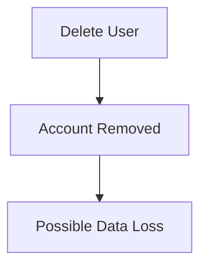

---

## Disable User

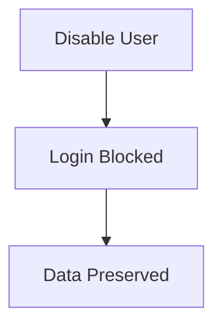

---

# Locking an Account

Command:

```bash
sudo passwd -l alice
```

Meaning:

```text
Lock User Account
```

---

# What Actually Happens?

Linux modifies:

```text
/etc/shadow
```

---

Before:

```text
alice:$y$j9T$hash...
```

After:

```text
alice:!$y$j9T$hash...
```

Notice:

```text
!
```

added at the beginning.

---

# Why Does This Work?

Authentication process:

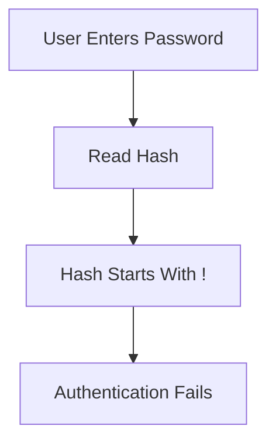

Linux sees:

```text
!
```

and immediately rejects login.

---

# Account Lock Flow

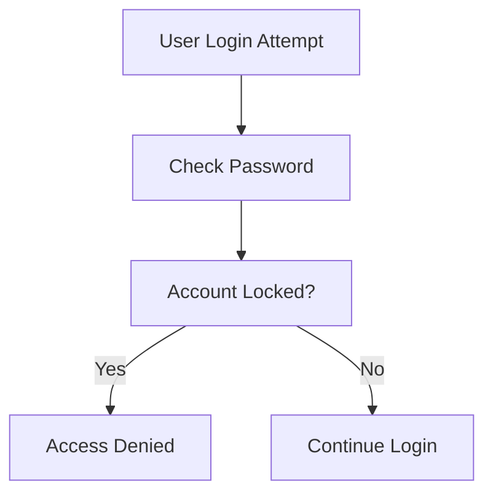

---

# Unlocking an Account

Command:

```bash
sudo passwd -u alice
```

Meaning:

```text
Unlock User
```

---

Flow:

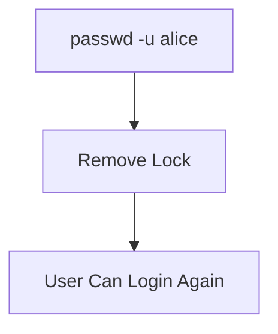

---

# Real Example

Employee goes on long leave:

```bash
sudo passwd -l alice
```

---

Returns after 6 months:

```bash
sudo passwd -u alice
```

---

Everything remains:

```text
Home Directory
SSH Keys
Documents
Configurations
```

---

# Verify Lock Status

Check:

```bash
sudo passwd -S alice
```

Example:

```text
alice L
```

Meaning:

```text
L = Locked
```

---

Possible values:

|Status|Meaning|
|---|---|
|P|Password Set|
|L|Locked|
|NP|No Password|

---

# Disabling vs Expiring

These are different.

---

## Lock Account

```bash
passwd -l alice
```

Blocks:

```text
Password Authentication
```

---

## Expire Account

```bash
chage -E 2026-12-31 alice
```

Blocks:

```text
Entire Account
```

after a date.

---

# Practical Use Cases

|Scenario|Action|
|---|---|
|Vacation|Lock|
|Suspension|Lock|
|Investigation|Lock|
|Employee Left|Lock First|
|Temporary Contractor|Expire Account|

---

# 6.2.4 Managing Unix Groups

---

# Why Groups Exist

Without groups:

```text
Permission
must be assigned
user by user
```

Terrible for administration.

---

Imagine:

```text
100 Users
Need Docker Access
```

Without groups:

```text
Configure 100 Users Individually
```

---

With groups:

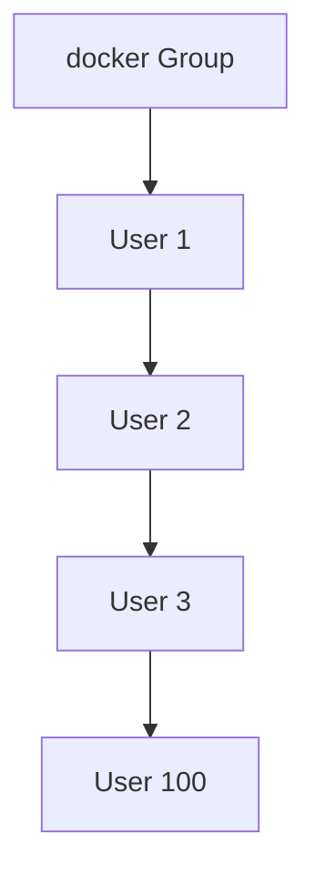

One configuration.

Everyone inherits permissions.

---

# Linux Group Database

Stored in:

```text
/etc/group
```

and

```text
/etc/gshadow
```

---

# Group Structure

Example:

```text
docker:x:999:alice,bob
```

---

Breakdown:

```text
Group Name : docker

Password   : x

GID        : 999

Members    : alice,bob
```

---

# Creating Groups

Command:

```bash
sudo addgroup developers
```

---

Flow:

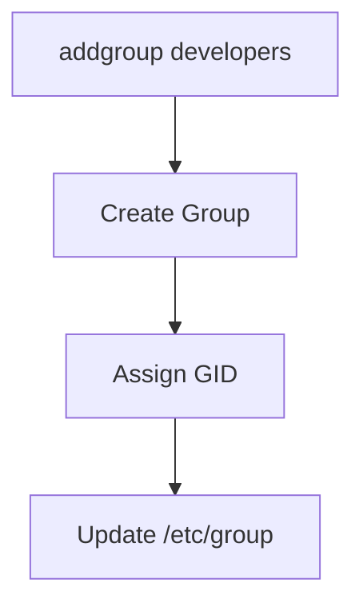

---

# Deleting Groups

Command:

```bash
sudo delgroup developers
```

---

Flow:

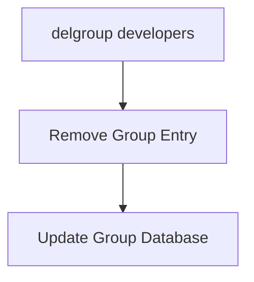

---

# Modifying Groups

Command:

```bash
sudo groupmod
```

Used to change:

```text
Group Name
Group ID
```

---

Example

Change group name:

```bash
sudo groupmod -n devs developers
```

---

Result:

```text
developers
↓
devs
```

---

# Group IDs (GID)

Just like users have:

```text
UID
```

Groups have:

```text
GID
```

---

Example:

```text
sudo      GID=27

docker    GID=999

alice     GID=1001
```

---

# Group Passwords

Rarely used today.

Managed with:

```bash
gpasswd
```

---

Set group password:

```bash
sudo gpasswd groupname
```

---

Remove group password:

```bash
sudo gpasswd -r groupname
```

---

# Why Group Passwords Exist?

Historically:

```text
Users Could Join Groups
Using Group Passwords
```

Today:

```text
Rarely Used
```

because administrators directly assign memberships.

---

# Adding Users to Groups

Most common task.

Command:

```bash
sudo adduser alice docker
```

---

Result:

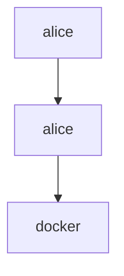

---

# Verify Membership

```bash
groups alice
```

Output:

```text
alice : alice docker sudo
```

---

Alternative:

```bash
id alice
```

Output:

```text
uid=1001(alice)
gid=1001(alice)
groups=1001(alice),27(sudo),999(docker)
```

---

# Primary Group vs Secondary Groups

Very important concept.

---

# Primary Group

Created automatically.

Example:

```text
User: alice

Primary Group: alice
```

---

Files created by default:

```text
alice:alice
```

---

# Secondary Groups

Additional memberships.

Example:

```text
alice
sudo
docker
wireshark
```

---

Visualization

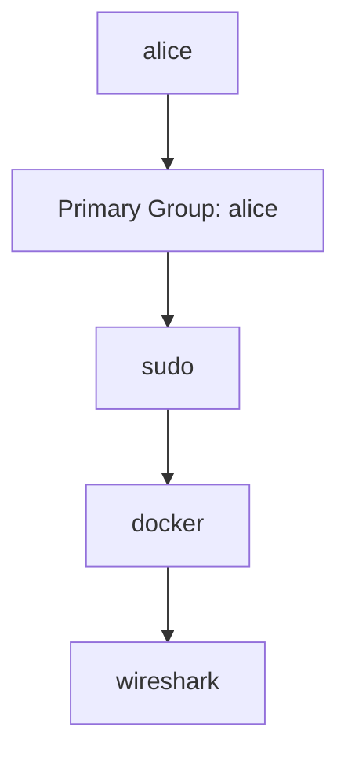

---

# Working With Multiple Groups

A user can belong to many groups.

Example:

```text
alice
```

belongs to:

```text
sudo
docker
developers
wireshark
```

---

Question:

```text
Which group owns new files?
```

Usually:

```text
Primary Group
```

---

# newgrp Command

Temporarily switch primary group.

Example:

```bash
newgrp developers
```

---

Flow:

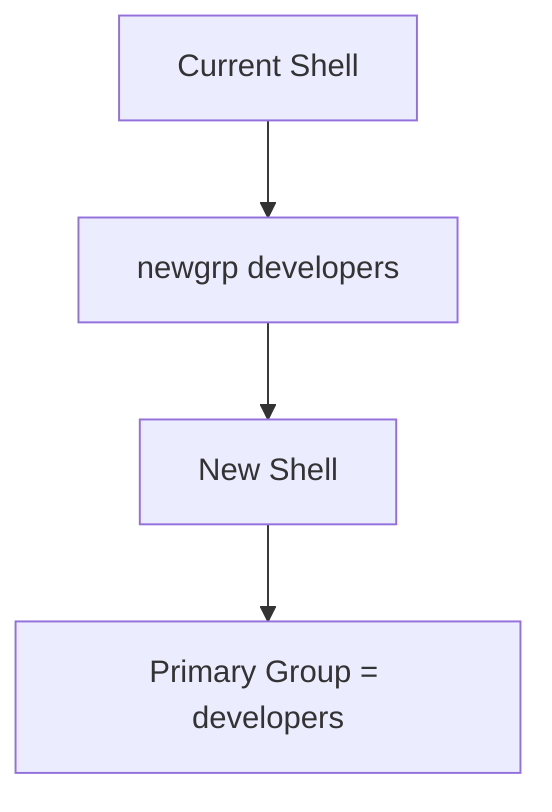

---

# Why Use newgrp?

Shared project directory:

```text
/dev/project
```

All files should belong to:

```text
developers
```

---

Instead of:

```text
alice
```

---

# sg Command

Similar to newgrp.

But:

```text
Runs One Command
```

instead of creating a shell.

---

Example:

```bash
sg developers -c "touch testfile"
```

---

Flow:

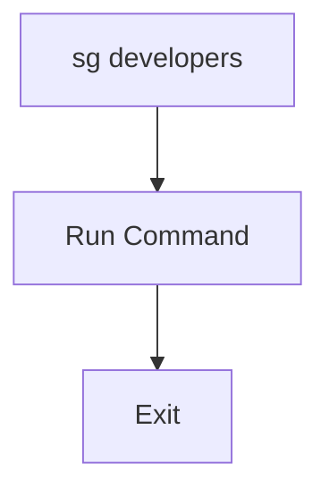

---

# The setgid Directory Bit

One of the most useful Linux permission features.

---

Problem:

Shared directory:

```text
/project
```

Users:

```text
alice
bob
charlie
```

create files.

---

Result:

```text
alice:alice

bob:bob

charlie:charlie
```

Different ownership.

Messy.

---

# Solution: setgid

Apply:

```bash
chmod g+s /project
```

---

Now:

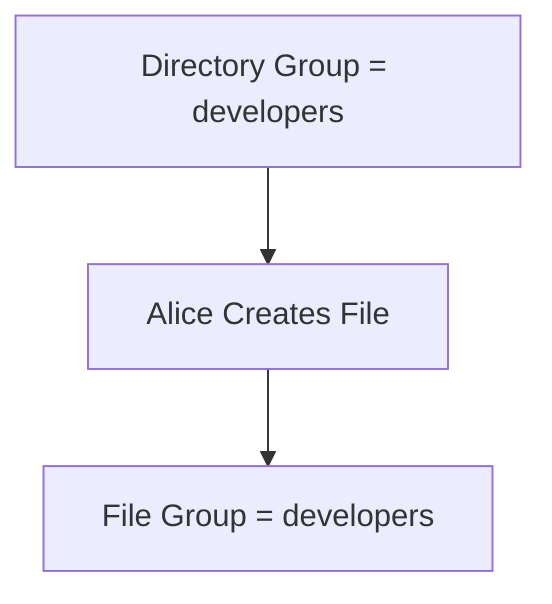

---

Every new file automatically inherits:

```text
developers
```

group.

---

# Why Is This Useful?

Perfect for:

```text
Shared Projects
Team Directories
Development Environments
```

---

# id Command

One of the most important commands.

Shows:

```text
UID
GID
Groups
```

---

Example:

```bash
id alice
```

Output:

```text
uid=1001(alice)

gid=1001(alice)

groups=1001(alice),27(sudo),999(docker)
```

---

Visualization

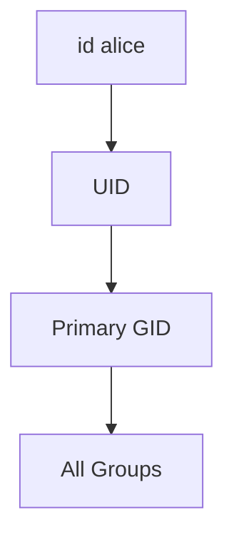

---

# Complete User-Group Relationship

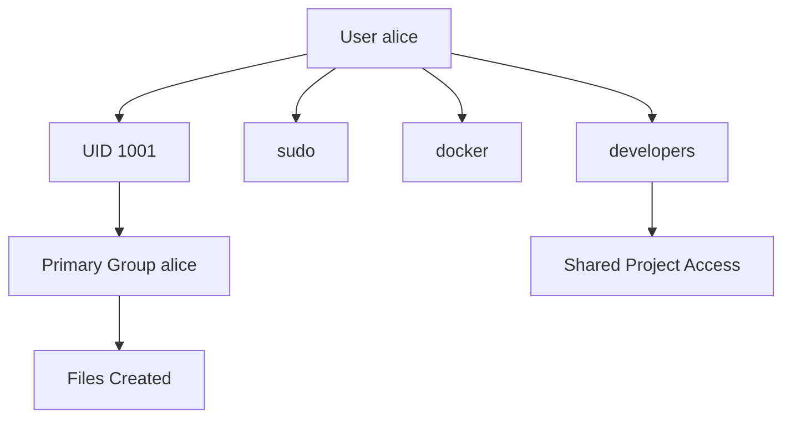

---

# User and Group Administration Workflow

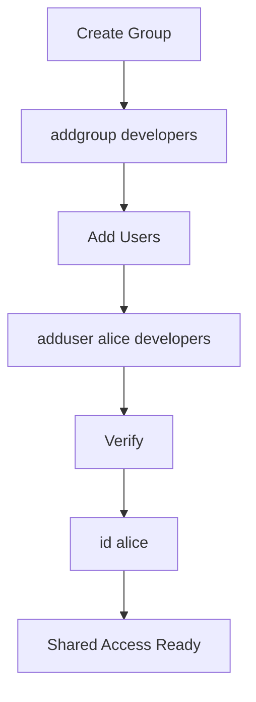

---

# Exam / Lab Notes

## Lock Account

```bash
passwd -l alice
```

---

## Unlock Account

```bash
passwd -u alice
```

---

## Create Group

```bash
addgroup developers
```

---

## Delete Group

```bash
delgroup developers
```

---

## Modify Group

```bash
groupmod
```

---

## Add User To Group

```bash
adduser alice docker
```

---

## Change Active Group

```bash
newgrp developers
```

---

## Execute Command As Group

```bash
sg developers -c "command"
```

---

## View User Identity

```bash
id alice
```

---

## View Groups

```bash
groups alice
```

---

# Ultimate Memory Diagram

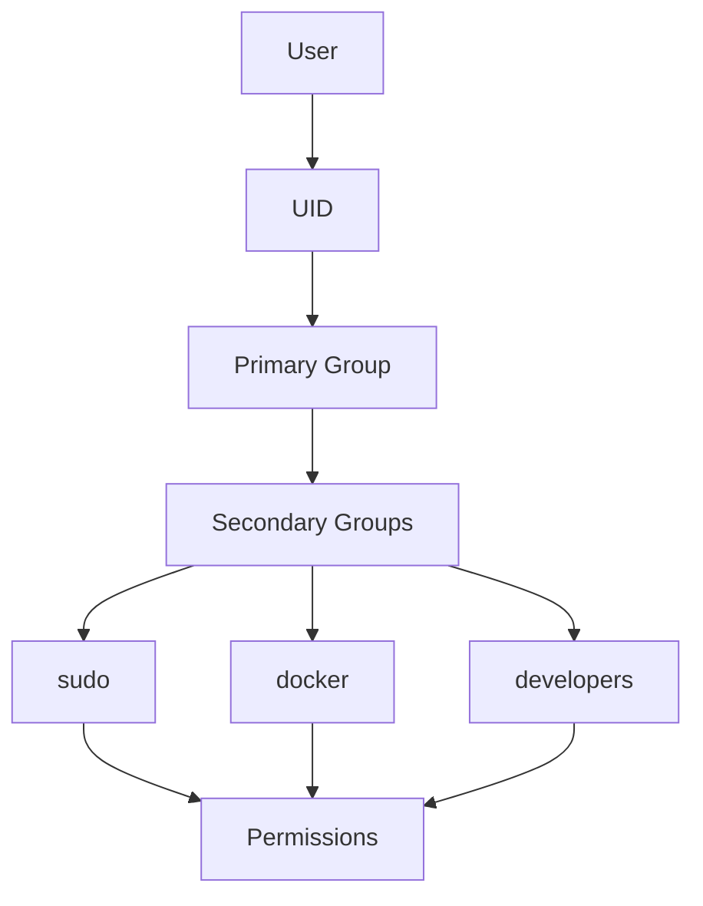

### Remember

```text
Users = People

Groups = Teams

UID = User ID

GID = Group ID

passwd -l = Lock User

addgroup = Create Team

adduser user group = Add Person To Team

id = Show Identity
```