# 6.2.2 Modifying Existing Accounts and Passwords

> Creating a user is only the beginning. Administrators frequently need to change passwords, update user information, modify login shells, and enforce password policies.

---

# Big Picture

Once a user exists:

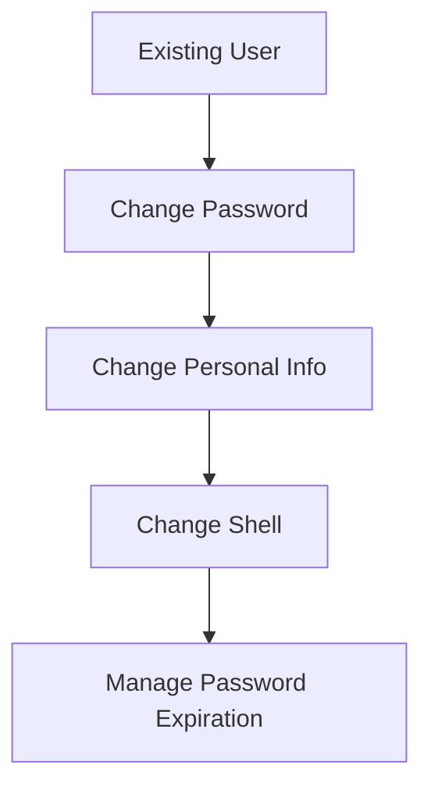

Linux provides four major tools:

|Command|Purpose|
|---|---|
|passwd|Change password|
|chfn|Change user information|
|chsh|Change login shell|
|chage|Manage password aging/expiration|

---

# Understanding Account Information

A Linux user account contains multiple pieces of information.

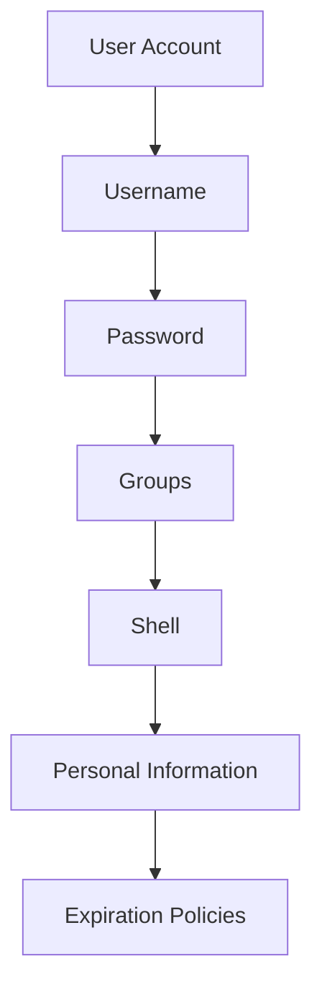

Each command modifies a different part.

---

# passwd

Most commonly used user-management command.

Purpose:

```text
Change Password
```

---

# Normal User Password Change

A user can change their own password.

Example:

```bash
passwd
```

---

Flow:

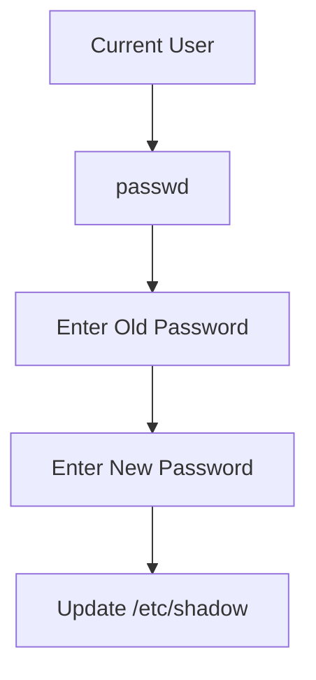

---

Example

```bash
passwd
```

Output:

```text
Current password:
New password:
Retype new password:
```

---

# Administrator Changing Someone Else's Password

Root can reset any user's password.

Example:

```bash
passwd alice
```

---

Flow:

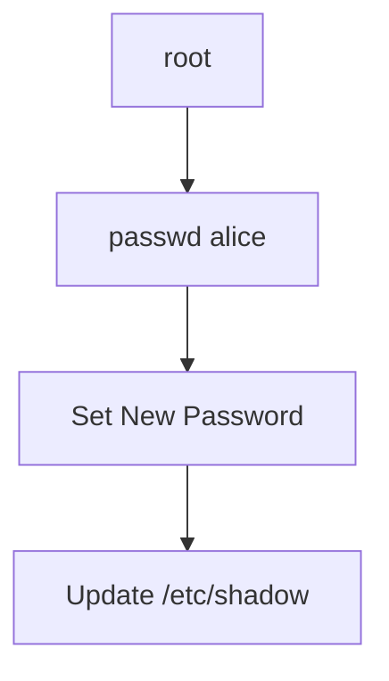

---

# What Gets Modified?

Password hashes are stored in:

```text
/etc/shadow
```

---

Before:

```text
alice:$6$abc123...
```

After password change:

```text
alice:$6$xyz987...
```

Hash changes.

---

# Password Hashing Reminder

Linux never stores:

```text
Password123
```

Instead:

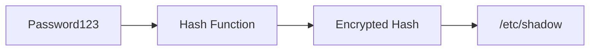

---

# Useful passwd Commands

## Change Own Password

```bash
passwd
```

---

## Change Another User's Password

```bash
sudo passwd alice
```

---

## Force Password Change Next Login

```bash
sudo passwd -e alice
```

---

Meaning:

```text
Password Expires Immediately
```

Next login:

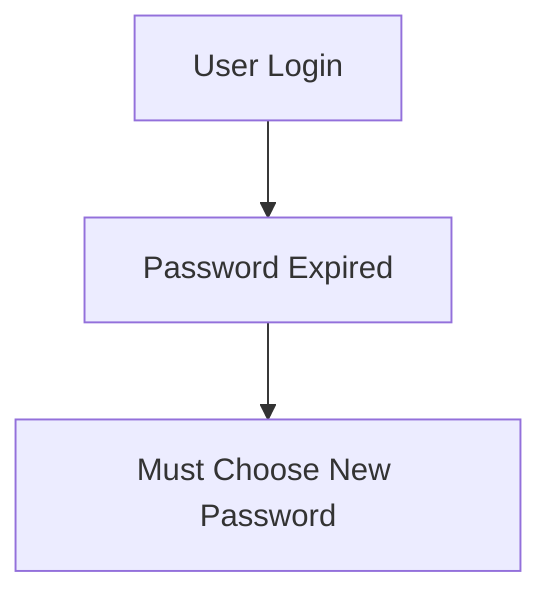

---

# Why Force Password Changes?

Example:

Administrator creates account:

```text
Username: john
Password: Welcome123
```

Security problem:

```text
Admin Knows Password
```

---

Solution:

```bash
passwd -e john
```

---

Now:

```text
John Must Create New Password
```

---

# chfn

Full form:

```text
CHange Full Name
```

Used to modify:

```text
GECOS Field
```

inside:

```text
/etc/passwd
```

---

# What Is GECOS?

Historical information field.

Stores:

```text
Real Name
Office
Phone Number
Comments
```

---

Example Entry

```text
alice:x:1001:1001:Alice Smith:/home/alice:/bin/bash
```

This section:

```text
Alice Smith
```

is GECOS.

---

# Using chfn

```bash
chfn alice
```

---

Possible prompts:

```text
Full Name:
Room Number:
Work Phone:
Home Phone:
```

---

Flow

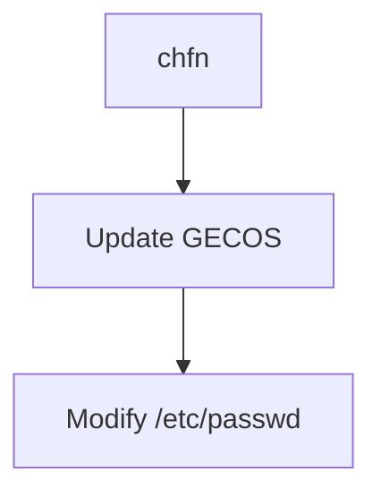

---

# Why Does This Exist?

Useful in:

```text
Universities
Large Enterprises
Shared Systems
```

where users need contact information.

---

# chsh

Full form:

```text
CHange SHell
```

Used to change:

```text
Default Login Shell
```

---

# What Is a Shell?

After login:

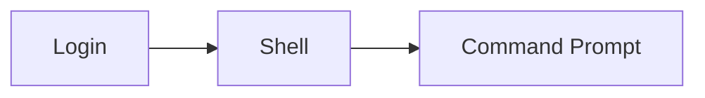

Shell is the program that interprets commands.

---

# Common Shells

|Shell|Description|
|---|---|
|bash|Default on many Linux systems|
|zsh|Advanced interactive shell|
|sh|Basic shell|
|fish|User-friendly shell|
|nologin|Prevent logins|

---

# Current Shell

Check:

```bash
echo $SHELL
```

Example:

```text
/bin/bash
```

---

# Change Shell

Example:

```bash
chsh -s /bin/zsh
```

---

Result:

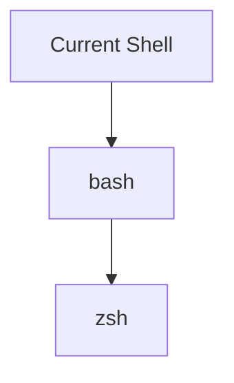

---

# What Gets Modified?

Inside:

```text
/etc/passwd
```

---

Before:

```text
alice:x:1001:1001::/home/alice:/bin/bash
```

After:

```text
alice:x:1001:1001::/home/alice:/bin/zsh
```

---

# Why Switch Shells?

Examples:

```text
Better Autocomplete
Themes
Plugins
Productivity Features
```

---

# Special Shell: nologin

Example:

```bash
chsh -s /usr/sbin/nologin alice
```

---

Meaning:

```text
Account Exists
But Cannot Login
```

---

Useful for:

```text
Service Accounts
System Accounts
Applications
```

---

# /etc/shells

Linux only allows approved shells.

List:

```bash
cat /etc/shells
```

Example:

```text
/bin/bash
/bin/sh
/bin/zsh
```

---

Why?

Security.

Prevents users from setting:

```text
Random Program
```

as login shell.

---

# chage

Full form:

```text
CHange AGE
```

Used to manage:

```text
Password Aging
Expiration Policies
```

---

# Why Password Aging Exists

Imagine:

```text
Password Never Changes
```

Problems:

```text
Leaked Password
Old Password
Compromised Password
```

could remain valid forever.

---

# Password Lifecycle

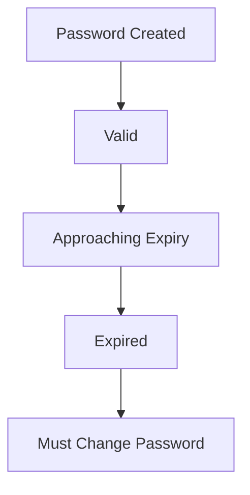

---

# View Current Password Policy

```bash
sudo chage -l alice
```

---

Example Output

```text
Last password change
Password expires
Password inactive
Account expires
```

---

# Understanding Output

## Last Password Change

```text
When password was changed
```

---

## Password Expires

```text
When password becomes invalid
```

---

## Account Expires

```text
When account itself becomes unusable
```

---

# Set Password Expiration

Example:

```bash
sudo chage -M 90 alice
```

Meaning:

```text
Password Valid For 90 Days
```

---

Flow:

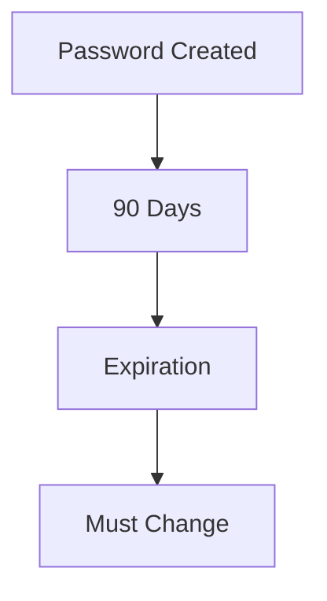

---

# Force Immediate Expiration

Alternative method:

```bash
passwd -e alice
```

---

Result:

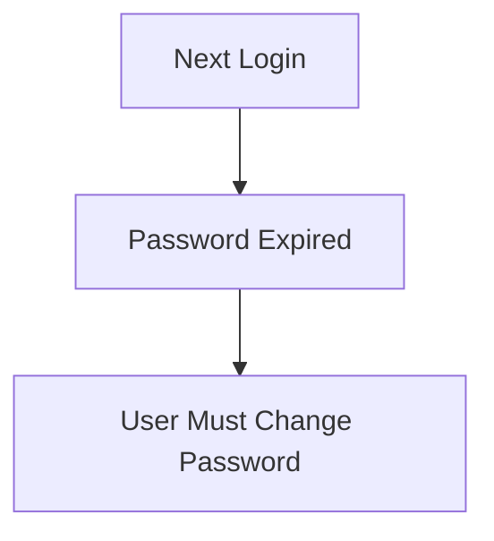

---

# Real Enterprise Example

New employee joins.

Administrator creates:

```text
Username: alice
Password: Welcome123
```

Then:

```bash
passwd -e alice
```

---

First login:

```text
Current Password:
New Password:
Confirm Password:
```

Administrator never learns final password.

---

# Which File Does Each Command Modify?

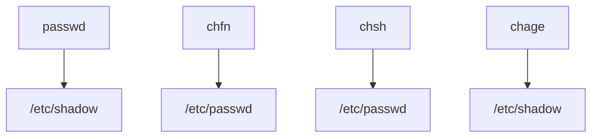

---

# Practical Workflow

New employee account:

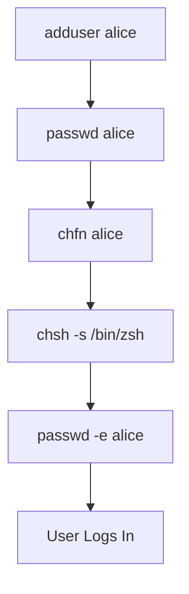

---

# Exam / Lab Notes

## Change Own Password

```bash
passwd
```

---

## Change User Password

```bash
sudo passwd alice
```

---

## Force Password Change

```bash
sudo passwd -e alice
```

---

## Change User Information

```bash
chfn alice
```

---

## Change Login Shell

```bash
chsh -s /bin/zsh
```

---

## View Password Policy

```bash
sudo chage -l alice
```

---

## Set Password Expiry

```bash
sudo chage -M 90 alice
```

---

# Quick Memory Diagram

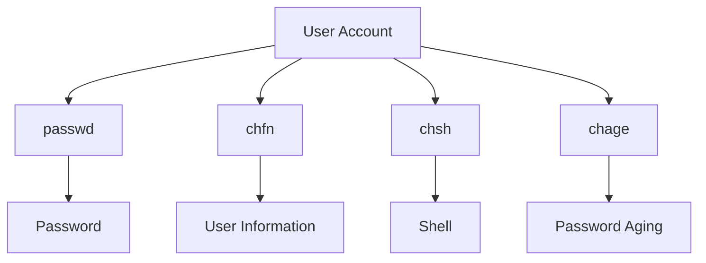

### Remember

```text
passwd = Change Password

chfn = Change Full Name

chsh = Change Shell

chage = Change Password Age
```

---

### End of Section 3

Next section:

```text
6.2.3 Disabling Accounts
6.2.4 Managing Groups

passwd -l
passwd -u

addgroup
delgroup
groupmod
gpasswd

newgrp
sg
setgid directories
id command
```

This is where Linux group permissions and multi-user administration really start to connect together.