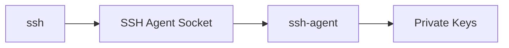
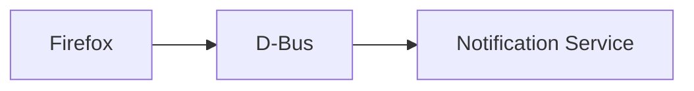
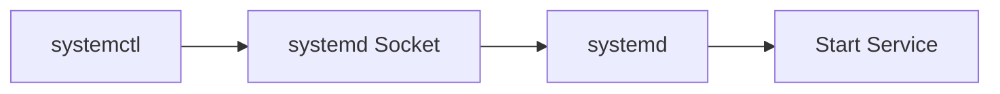
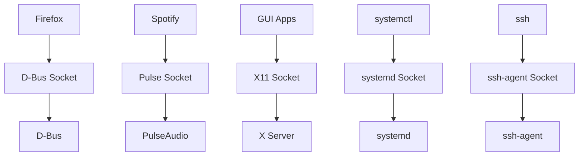
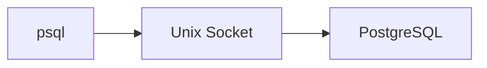

![[Pasted image 20260606024453.png]]
Perfect. This output is actually a great example of **Unix Domain Sockets** in a real Linux system.

The first thing to notice:

```bash
ss -xl
```

shows:

```text
Unix sockets only
```

(`-x` = Unix sockets)

---

# Why Don't You See PostgreSQL?

Because PostgreSQL isn't running.

Verify:

```bash
systemctl status postgresql
```

or

```bash
pg_lsclusters
```

I would expect something like:

```text
inactive
```

or

```text
down
```

which explains why you don't see:

```text
/var/run/postgresql/.s.PGSQL.5432
```

---

# Let's Analyze The Ones You Do Have

---

# 1. SSH Agent Socket

```text
/home/kali/.ssh/agent/s.lfOu3aJaky.agent.onmfyKd9Zj
```

This belongs to:

```text
ssh-agent
```

---

Remember SSH keys?

Instead of repeatedly entering:

```text
Passphrase
```

ssh-agent keeps keys in memory.

---

Flow:



---

Think:

```text
Password Manager
for SSH Keys
```

---

# 2. X11 Socket

```text
/tmp/.X11-unix/X0
```

Very important.

This is your graphical desktop.

---

Every GUI application talks through it.

Example:


---

Without this socket:

```text
No GUI
```

---

# 3. D-Bus Socket

```text
/run/dbus/system_bus_socket
```

One of Linux's most important sockets.

---

D-Bus is:

```text
Inter-Process Communication Bus
```

---

Example:

Firefox asks:

```text
"Open a notification"
```

---

Through:



---

Almost every desktop application uses D-Bus.

---

# 4. PulseAudio Socket

```text
/run/user/1000/pulse/native
```

Audio system.

---

Example:


---

# 5. PipeWire Socket

```text
/run/user/1000/pipewire-0
```

Modern replacement for:

```text
PulseAudio
JACK
```

---

Used for:

```text
Audio
Video
Screen Sharing
```

---

Example:


---

# 6. GPG Sockets

```text
/run/user/1000/gnupg/S.gpg-agent
```

and

```text
S.gpg-agent.browser
S.gpg-agent.extra
S.gpg-agent.ssh
```

---

Used by:

```text
GPG
Encryption
Signing
SSH Key Storage
```

---

Flow:


---

# 7. systemd Sockets

You have many:

```text
/run/systemd/private
/run/systemd/io.systemd.Manager
/run/systemd/journal/stdout
```

---

These are internal communication channels for:

```text
systemd
```

---

Example:

When you run:

```bash
systemctl start ssh
```

it doesn't directly manipulate services.

It talks through these sockets.

---

Flow:



---

# 8. SSH Local Socket

```text
/run/ssh-unix-local/socket
```

Interesting.

This belongs to OpenSSH.

Used internally by SSH services.

---

# 9. Smart Card Socket

```text
/run/pcscd/pcscd.comm
```

Used for:

```text
Smart Cards
YubiKeys
CAC Cards
```

---

Flow:


---

# Understanding The Columns

Example:

```text
u_str LISTEN 0 4096 /run/dbus/system_bus_socket
```

---

### u_str

```text
Unix Stream Socket
```

Equivalent to:

```text
TCP
```

but local only.

---

### LISTEN

Means:

```text
Waiting For Connections
```

Same as:

```text
TCP LISTEN
```

---

### Local Address

Example:

```text
/run/dbus/system_bus_socket
```

This is literally:

```text
The Socket File
```

on disk.

---

# Socket Types You'll See

|Type|Meaning|
|---|---|
|u_str|Unix Stream|
|u_dgr|Unix Datagram|
|u_seq|Unix Sequenced Packet|

---

Most common:

```text
u_str
```

which behaves similarly to TCP.

---

# Visualizing Your Kali

Right now your machine looks roughly like:



---

# The PostgreSQL Socket You're Looking For

When PostgreSQL is started:

```bash
sudo systemctl start postgresql
```

you should see something like:

```text
/var/run/postgresql/.s.PGSQL.5432
```

Then:

```bash
ss -xl | grep PGSQL
```

would show:

```text
u_str LISTEN
/var/run/postgresql/.s.PGSQL.5432
```

and the architecture becomes:



---

For your Kali VM, the most important sockets to remember are:

```text
/run/dbus/system_bus_socket
    → Linux message bus

/tmp/.X11-unix/X0
    → Graphical desktop

/run/user/1000/pulse/native
    → Audio

/run/systemd/private
    → systemd

/home/kali/.ssh/agent/*
    → SSH agent

/var/run/postgresql/.s.PGSQL.5432
    → PostgreSQL (when running)
```

These are some of the most common Unix sockets you'll encounter while learning Kali, Linux internals, Docker, SSH, PostgreSQL, and systemd.

