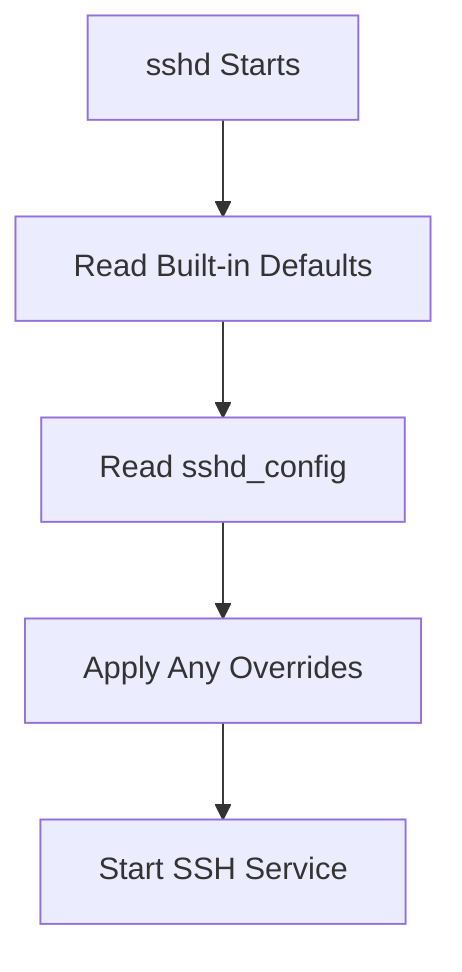
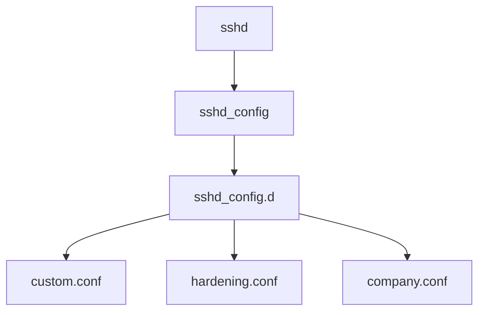
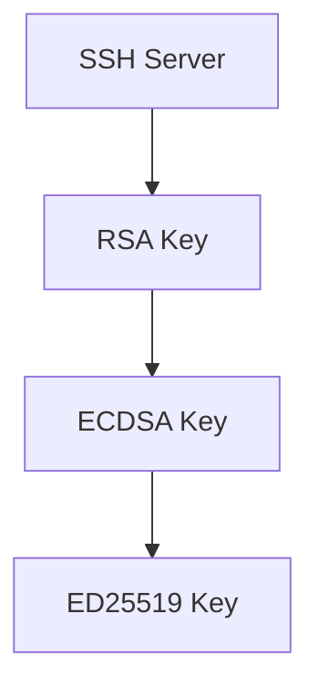
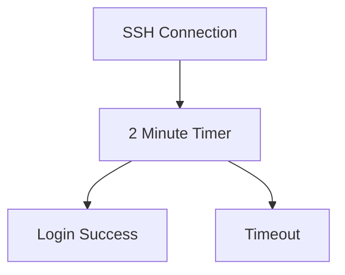
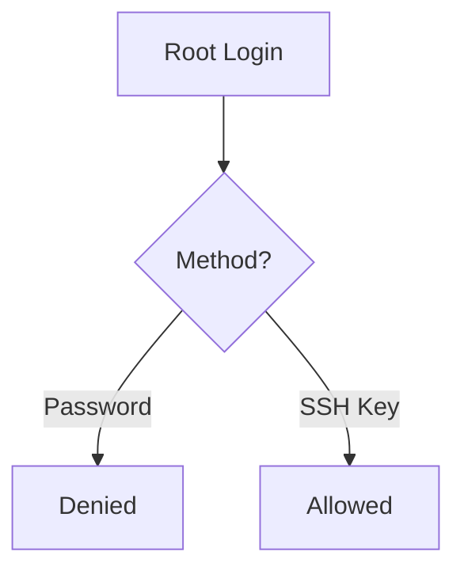
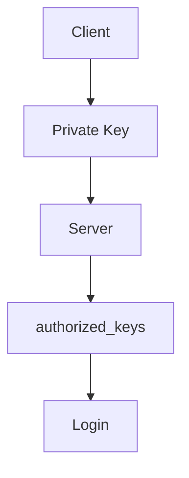
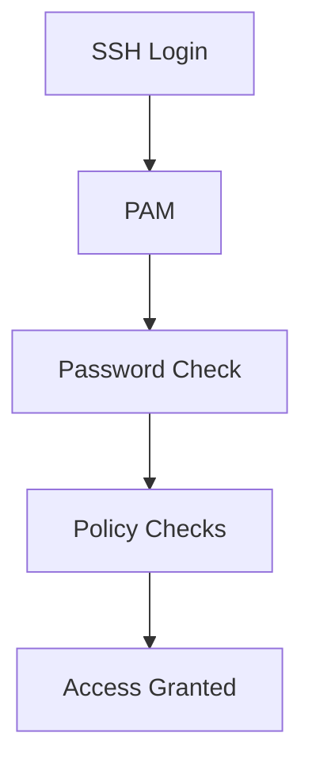
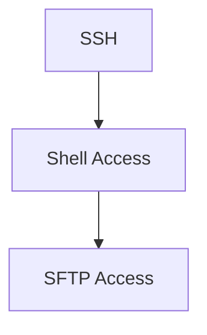

```
┌──(kali㉿kali-klcp-1)-[~]
└─$ cat /etc/ssh/sshd_config            

# This is the sshd server system-wide configuration file.  See
# sshd_config(5) for more information.

# This sshd was compiled with PATH=/usr/local/bin:/usr/bin:/bin:/usr/games

# The strategy used for options in the default sshd_config shipped with
# OpenSSH is to specify options with their default value where
# possible, but leave them commented.  Uncommented options override the
# default value.

Include /etc/ssh/sshd_config.d/*.conf

#Port 22
#AddressFamily any
#ListenAddress 0.0.0.0
#ListenAddress ::

#HostKey /etc/ssh/ssh_host_rsa_key
#HostKey /etc/ssh/ssh_host_ecdsa_key
#HostKey /etc/ssh/ssh_host_ed25519_key

# Ciphers and keying
#RekeyLimit default none

# Logging
#SyslogFacility AUTH
#LogLevel INFO

# Authentication:

#LoginGraceTime 2m
#PermitRootLogin prohibit-password
#StrictModes yes
#MaxAuthTries 6
#MaxSessions 10

#PubkeyAuthentication yes

# Expect .ssh/authorized_keys2 to be disregarded by default in future.
#AuthorizedKeysFile     .ssh/authorized_keys .ssh/authorized_keys2

#AuthorizedPrincipalsFile none

#AuthorizedKeysCommand none
#AuthorizedKeysCommandUser nobody

# For this to work you will also need host keys in /etc/ssh/ssh_known_hosts
#HostbasedAuthentication no
# Change to yes if you don't trust ~/.ssh/known_hosts for
# HostbasedAuthentication
#IgnoreUserKnownHosts no
# Don't read the user's ~/.rhosts and ~/.shosts files
#IgnoreRhosts yes

# To disable tunneled clear text passwords, change to "no" here!
#PasswordAuthentication yes
#PermitEmptyPasswords no

# Change to "yes" to enable keyboard-interactive authentication.  Depending on
# the system's configuration, this may involve passwords, challenge-response,
# one-time passwords or some combination of these and other methods.
# Beware issues with some PAM modules and threads.
KbdInteractiveAuthentication no

# Kerberos options
#KerberosAuthentication no
#KerberosOrLocalPasswd yes
#KerberosTicketCleanup yes
#KerberosGetAFSToken no

# GSSAPI options
#GSSAPIAuthentication no
#GSSAPICleanupCredentials yes
#GSSAPIStrictAcceptorCheck yes
#GSSAPIKeyExchange no

# Set this to 'yes' to enable PAM authentication, account processing,
# and session processing. If this is enabled, PAM authentication will
# be allowed through the KbdInteractiveAuthentication and
# PasswordAuthentication.  Depending on your PAM configuration,
# PAM authentication via KbdInteractiveAuthentication may bypass
# the setting of "PermitRootLogin prohibit-password".
# If you just want the PAM account and session checks to run without
# PAM authentication, then enable this but set PasswordAuthentication
# and KbdInteractiveAuthentication to 'no'.
UsePAM yes

#AllowAgentForwarding yes
#AllowTcpForwarding yes
#GatewayPorts no
X11Forwarding yes
#X11DisplayOffset 10
#X11UseLocalhost yes
#PermitTTY yes
PrintMotd no
#PrintLastLog yes
#TCPKeepAlive yes
#PermitUserEnvironment no
#Compression delayed
#ClientAliveInterval 0
#ClientAliveCountMax 3
#UseDNS no
#PidFile /run/sshd.pid
#MaxStartups 10:30:100
#PermitTunnel no
#ChrootDirectory none
#VersionAddendum none

# no default banner path
#Banner none

# Allow client to pass locale and color environment variables
AcceptEnv LANG LC_* COLORTERM NO_COLOR

# override default of no subsystems
Subsystem       sftp    /usr/lib/openssh/sftp-server

# Example of overriding settings on a per-user basis
#Match User anoncvs
#       X11Forwarding no
#       AllowTcpForwarding no
#       PermitTTY no
#       ForceCommand cvs server
                                                                                                                                                            
┌──(kali㉿kali-klcp-1)-[~]
└─$ ls -l /etc/ssh/sshd_config.d/
total 0
lrwxrwxrwx 1 root root 53 Jun  4 13:32 20-systemd-userdb.conf -> /usr/lib/systemd/sshd_config.d/20-systemd-userdb.conf
                                                                                                                                                            
┌──(kali㉿kali-klcp-1)-[~]
└─$ sudo sshd -T
[sudo] password for kali: 
port 22
addressfamily any
listenaddress [::]:22
listenaddress 0.0.0.0:22
usepam yes
pamservicename sshd
logingracetime 120
x11displayoffset 10
maxauthtries 6
maxsessions 10
clientaliveinterval 0
clientalivecountmax 3
requiredrsasize 1024
streamlocalbindmask 0177
unusedconnectiontimeout none
permitrootlogin prohibit-password
ignorerhosts yes
ignoreuserknownhosts no
hostbasedauthentication no
hostbasedusesnamefrompacketonly no
pubkeyauthentication yes
kerberosauthentication no
kerberosorlocalpasswd yes
kerberosticketcleanup yes
gssapiauthentication no
gssapicleanupcredentials yes
gssapistrictacceptorcheck yes
gssapikeyexchange no
gssapistorecredentialsonrekey no
gssapikexalgorithms gss-group14-sha256-,gss-group16-sha512-,gss-nistp256-sha256-,gss-curve25519-sha256-,gss-group14-sha1-,gss-gex-sha1-
passwordauthentication yes
kbdinteractiveauthentication no
printmotd no
printlastlog yes
x11forwarding yes
x11uselocalhost yes
permittty yes
permituserrc yes
strictmodes yes
tcpkeepalive yes
permitemptypasswords no
compression yes
gatewayports no
usedns no
allowtcpforwarding yes
allowagentforwarding yes
disableforwarding no
allowstreamlocalforwarding yes
streamlocalbindunlink no
fingerprinthash SHA256
exposeauthinfo no
refuseconnection no
debianbanner yes
pidfile /run/sshd.pid
modulifile /etc/ssh/moduli
xauthlocation /usr/bin/xauth
ciphers chacha20-poly1305@openssh.com,aes128-gcm@openssh.com,aes256-gcm@openssh.com,aes128-ctr,aes192-ctr,aes256-ctr
macs umac-64-etm@openssh.com,umac-128-etm@openssh.com,hmac-sha2-256-etm@openssh.com,hmac-sha2-512-etm@openssh.com,hmac-sha1-etm@openssh.com,umac-64@openssh.com,umac-128@openssh.com,hmac-sha2-256,hmac-sha2-512,hmac-sha1
banner none
forcecommand none
chrootdirectory none
trustedusercakeys none
revokedkeys none
securitykeyprovider internal
authorizedprincipalsfile none
versionaddendum none
authorizedkeyscommand /usr/bin/userdbctl ssh-authorized-keys %u
authorizedkeyscommanduser root
authorizedprincipalscommand none
authorizedprincipalscommanduser none
hostkeyagent none
kexalgorithms mlkem768x25519-sha256,sntrup761x25519-sha512,sntrup761x25519-sha512@openssh.com,curve25519-sha256,curve25519-sha256@libssh.org,ecdh-sha2-nistp256,ecdh-sha2-nistp384,ecdh-sha2-nistp521
casignaturealgorithms ssh-ed25519,ecdsa-sha2-nistp256,ecdsa-sha2-nistp384,ecdsa-sha2-nistp521,sk-ssh-ed25519@openssh.com,sk-ecdsa-sha2-nistp256@openssh.com,rsa-sha2-512,rsa-sha2-256
hostbasedacceptedalgorithms ssh-ed25519-cert-v01@openssh.com,ecdsa-sha2-nistp256-cert-v01@openssh.com,ecdsa-sha2-nistp384-cert-v01@openssh.com,ecdsa-sha2-nistp521-cert-v01@openssh.com,sk-ssh-ed25519-cert-v01@openssh.com,sk-ecdsa-sha2-nistp256-cert-v01@openssh.com,rsa-sha2-512-cert-v01@openssh.com,rsa-sha2-256-cert-v01@openssh.com,ssh-ed25519,ecdsa-sha2-nistp256,ecdsa-sha2-nistp384,ecdsa-sha2-nistp521,sk-ssh-ed25519@openssh.com,sk-ecdsa-sha2-nistp256@openssh.com,rsa-sha2-512,rsa-sha2-256
hostkeyalgorithms ssh-ed25519-cert-v01@openssh.com,ecdsa-sha2-nistp256-cert-v01@openssh.com,ecdsa-sha2-nistp384-cert-v01@openssh.com,ecdsa-sha2-nistp521-cert-v01@openssh.com,sk-ssh-ed25519-cert-v01@openssh.com,sk-ecdsa-sha2-nistp256-cert-v01@openssh.com,rsa-sha2-512-cert-v01@openssh.com,rsa-sha2-256-cert-v01@openssh.com,ssh-ed25519,ecdsa-sha2-nistp256,ecdsa-sha2-nistp384,ecdsa-sha2-nistp521,sk-ssh-ed25519@openssh.com,sk-ecdsa-sha2-nistp256@openssh.com,rsa-sha2-512,rsa-sha2-256
pubkeyacceptedalgorithms ssh-ed25519-cert-v01@openssh.com,ecdsa-sha2-nistp256-cert-v01@openssh.com,ecdsa-sha2-nistp384-cert-v01@openssh.com,ecdsa-sha2-nistp521-cert-v01@openssh.com,sk-ssh-ed25519-cert-v01@openssh.com,sk-ecdsa-sha2-nistp256-cert-v01@openssh.com,rsa-sha2-512-cert-v01@openssh.com,rsa-sha2-256-cert-v01@openssh.com,ssh-ed25519,ecdsa-sha2-nistp256,ecdsa-sha2-nistp384,ecdsa-sha2-nistp521,sk-ssh-ed25519@openssh.com,sk-ecdsa-sha2-nistp256@openssh.com,rsa-sha2-512,rsa-sha2-256
sshdsessionpath /usr/lib/openssh/sshd-session
sshdauthpath /usr/lib/openssh/sshd-auth
persourcepenaltyexemptlist none
loglevel INFO
syslogfacility AUTH
authorizedkeysfile .ssh/authorized_keys .ssh/authorized_keys2
hostkey /etc/ssh/ssh_host_rsa_key
hostkey /etc/ssh/ssh_host_ecdsa_key
hostkey /etc/ssh/ssh_host_ed25519_key
acceptenv LANG
acceptenv LC_*
acceptenv COLORTERM
acceptenv NO_COLOR
authenticationmethods any
channeltimeout none
subsystem sftp /usr/lib/openssh/sftp-server
maxstartups 10:30:100
persourcemaxstartups none
persourcenetblocksize 32:128
permittunnel no
ipqos ef cs0
rekeylimit 0 0
permitopen any
permitlisten any
permituserenvironment no
pubkeyauthoptions none
persourcepenalties crash:90 authfail:5 noauth:1 grace-exceeded:10 refuseconnection:10 max:600 min:15 max-sources4:65536 max-sources6:65536 overflow:permissive overflow6:permissive
                              
```

The most important thing to understand is:

> Almost everything is commented out (`#`), but that DOES NOT mean SSH isn't using those settings.

OpenSSH has built-in defaults.

Your config file is basically saying:

```text
Use OpenSSH default behavior
unless explicitly overridden.
```

---

# How OpenSSH Reads This File



Example:

```conf
#Port 22
```

means:

```text
Port 22 is still used.
```

because:

```text
Commented Out
=
Use Default Value
```

NOT:

```text
Disabled
```

---

# First Important Line

```conf
Include /etc/ssh/sshd_config.d/*.conf
```

Very important.

---

## What does this mean?

SSH loads:

```text
/etc/ssh/sshd_config
```

AND THEN:

```text
every *.conf file
inside

/etc/ssh/sshd_config.d/
```

---

Visualized:



---

Check if extra configs exist:

```bash
ls -l /etc/ssh/sshd_config.d/
```

---

# Port

```conf
#Port 22
```

Current behavior:

```text
SSH listens on port 22
```

---

Check:

```bash
sudo ss -tulpn | grep ssh
```

or

```bash
sudo netstat -tulpn | grep ssh
```

Expected:

```text
*:22
```

---

# Address Family

```conf
#AddressFamily any
```

Meaning:

SSH accepts:

```text
IPv4
IPv6
```

---

Equivalent:


---

# Listen Address

```conf
#ListenAddress 0.0.0.0
#ListenAddress ::
```

Meaning:

```text
Listen on ALL interfaces
```

---

Your VM probably has:

```bash
ip addr
```

Output like:

```text
ens192
10.x.x.x

lo
127.0.0.1
```

SSH listens on:

```text
all interfaces
```

---

# Host Keys

```conf
#HostKey /etc/ssh/ssh_host_rsa_key
#HostKey /etc/ssh/ssh_host_ecdsa_key
#HostKey /etc/ssh/ssh_host_ed25519_key
```

These are the files we discussed.

Check yours:

```bash
ls -l /etc/ssh/ssh_host_*
```

---

Visualized:



---

# Logging

```conf
#SyslogFacility AUTH
#LogLevel INFO
```

Default:

```text
AUTH
INFO
```

---

Meaning:

SSH events go into logs.

Examples:

```text
Successful Login
Failed Login
Authentication Errors
```

---

Check logs:

```bash
sudo journalctl -u ssh
```

---

# Login Grace Time

```conf
#LoginGraceTime 2m
```

Meaning:

User gets:

```text
2 minutes
```

to authenticate.

---

Visualized:



---

# Root Login

```conf
#PermitRootLogin prohibit-password
```

This one is VERY important.

---

Default behavior:

```text
Root CAN login
ONLY using SSH keys
```

Root CANNOT login with:

```text
password
```

---

Visualized:



---

Check current effective config:

```bash
sudo sshd -T | grep permitrootlogin
```

---

# Maximum Login Attempts

```conf
#MaxAuthTries 6
```

Meaning:

```text
6 failed attempts
```

before disconnect.

---

# Maximum Sessions

```conf
#MaxSessions 10
```

One SSH connection may open:

```text
10 channels
```

(shells, tunnels, sftp etc.)

---

# Public Key Authentication

```conf
#PubkeyAuthentication yes
```

Default:

```text
Enabled
```

---

This means SSH keys work.

---

Authentication flow:



---

# Password Authentication

```conf
#PasswordAuthentication yes
```

Default:

```text
Password Login Allowed
```

---

Currently your Kali accepts:

```bash
ssh kali@IP
```

and password authentication.

---

If changed:

```conf
PasswordAuthentication no
```

Then:

```text
Only SSH Keys
```

---

# Empty Passwords

```conf
#PermitEmptyPasswords no
```

Meaning:

```text
Accounts with blank passwords
cannot login
```

Good.

---

# KbdInteractiveAuthentication

Your config:

```conf
KbdInteractiveAuthentication no
```

Notice:

```text
NOT commented
```

This is actually active.

---

Meaning:

```text
Disable keyboard-interactive auth
```

---

This removes things like:

```text
Challenge Questions
OTP Prompts
PAM Conversations
```

---

# PAM

```conf
UsePAM yes
```

This is active.

---

What is PAM?

```text
Pluggable Authentication Modules
```

Think:

```text
Authentication Framework
```

---

Visualized:



---

Without PAM:

```text
No password aging
No account policies
No lockout rules
```

---

# X11 Forwarding

```conf
X11Forwarding yes
```

Active.

---

Allows:

```bash
ssh -X user@server
```

to run GUI apps remotely.

---

Example:

```bash
ssh -X kali@server

firefox
```

Firefox opens on YOUR machine.

---

Visualized:


---

# PrintMotd

```conf
PrintMotd no
```

Active.

---

MOTD means:

```text
Message Of The Day
```

File:

```text
/etc/motd
```

---

SSH will NOT display it.

---

# AcceptEnv

```conf
AcceptEnv LANG LC_* COLORTERM NO_COLOR
```

Allows client to pass:

```text
Language
Locale
Terminal Color Settings
```

---

Example:

```text
en_US.UTF-8
```

passes from client to server.

---

# SFTP Subsystem

```conf
Subsystem sftp /usr/lib/openssh/sftp-server
```

Very important.

---

This enables:

```bash
sftp user@host
```

---

Visualized:



---

# What Settings Are Actually Active?

The easiest way:

```bash
sudo sshd -T
```

This shows:

```text
FINAL EFFECTIVE CONFIGURATION
```

after defaults + config files + included files.

---

For example:

```bash
sudo sshd -T | grep port
```

might show:

```text
port 22
```

---

# Commands You Should Run Now

### Check SSH Status

```bash
systemctl status ssh
```

---

### Check Active Port

```bash
sudo sshd -T | grep port
```

---

### Check Root Login Policy

```bash
sudo sshd -T | grep permitrootlogin
```

---

### Check Password Authentication

```bash
sudo sshd -T | grep passwordauthentication
```

---

### Check Effective Configuration

```bash
sudo sshd -T
```

---

# What I Notice About Your Kali

Your installation is essentially:

```text
Default OpenSSH Configuration

Password Authentication = Enabled

Root Password Login = Disabled

Public Key Authentication = Enabled

PAM = Enabled

X11 Forwarding = Enabled

SFTP = Enabled

Port = 22
```

This is a pretty standard and secure default configuration for a fresh Kali installation. The next thing I'd do is inspect:

```bash
ls -l /etc/ssh/sshd_config.d/

sudo sshd -T
```

because those commands reveal the **real effective configuration** that SSH is currently running with.