# 6.3 Configuring Services

## What Is a Service?

A **service** (or **daemon**) is a program that runs in the background and provides functionality to the system.

You usually don't interact with it directly.

Examples:

|Service|Purpose|
|---|---|
|SSH|Remote login|
|Apache|Web server|
|PostgreSQL|Database server|
|Docker|Container engine|
|NTP|Time synchronization|

---

# Service vs Normal Program

## Normal Program

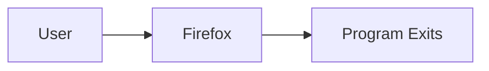

Runs when you start it.

Stops when you close it.

---

## Service (Daemon)

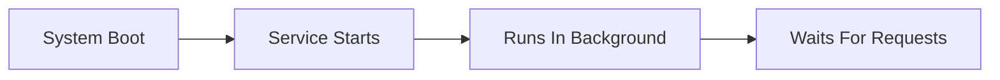

Runs continuously.

---

# What Is a Daemon?

Linux term:

```text
Daemon = Background Service
```

Examples:

```text
sshd
apache2
postgresql
systemd
```

Notice many daemon names end with:

```text
d
```

Examples:

```text
sshd
httpd
systemd
```

"d" often means:

```text
daemon
```

---

# Why Does Kali Disable Network Services By Default?

Most Linux distributions automatically start services.

Example:

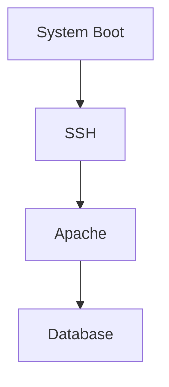

---

Kali follows a different philosophy:

```text
Security First
```

---

Default Kali:

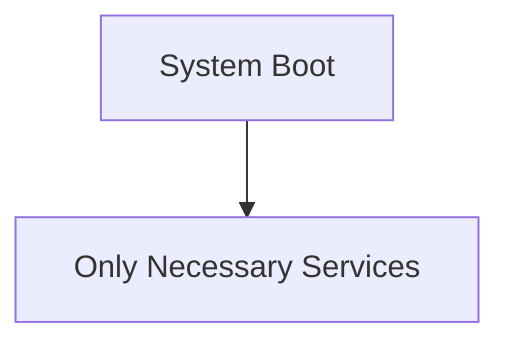

---

Why?

Because every running service creates:

```text
Attack Surface
```

---

Example

If SSH is running:

```text
Port 22 Open
```

Potential target.

If Apache is running:

```text
Port 80 Open
```

Potential target.

---

Therefore Kali prefers:

```text
Disabled Until Needed
```

---

# Configuring Services

When you install software:

```text
Install ≠ Configure
```

Many beginners think:

```bash
apt install apache2
```

means:

```text
Ready To Use
```

Not always.

You usually need configuration.

---

# How To Configure An Unknown Program

The book suggests a troubleshooting workflow.

---

# Step 1: Read Package Documentation

First place to check:

```text
/usr/share/doc/package/
```

---

Example

```text
/usr/share/doc/apache2/
```

```text
/usr/share/doc/postgresql/
```

```text
/usr/share/doc/openssh-server/
```

---

# Most Important File

Usually:

```text
/usr/share/doc/package/README.Debian
```

---

Example

```text
/usr/share/doc/apache2/README.Debian
```

---

Why Important?

Package maintainers often document:

```text
Common Problems
Configuration Changes
Debian-Specific Behavior
Examples
```

---

Workflow

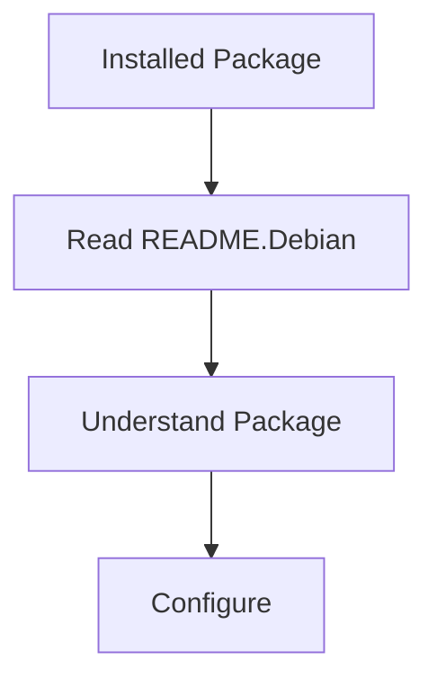

---

# Why Read README.Debian First?

Because it can save hours.

Example:

```text
Apache Not Starting
```

---

Instead of:

```text
Google For 2 Hours
```

You may find:

```text
Known Issue
Known Fix
```

inside README.

---

# Step 2: Read Official Documentation

After README:

Look at vendor documentation.

---

Example

For:

```text
Apache
```

Read:

```text
Apache Documentation
```

---

For:

```text
PostgreSQL
```

Read:

```text
PostgreSQL Documentation
```

---

General Flow

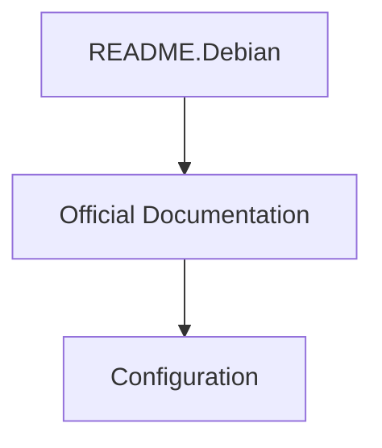

---

# Step 3: Discover Package Files

Useful command:

```bash
dpkg -L package
```

---

What Does It Mean?

```text
dpkg
```

=

```text
Debian Package Manager
```

---

Example

```bash
dpkg -L apache2
```

---

Shows:

```text
Files Installed By Package
```

---

Example Output

```text
/etc/apache2/
/usr/share/doc/apache2/
/usr/sbin/apache2
```

---

Visualization

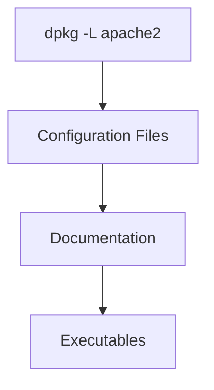

---

# Why Is This Useful?

Suppose:

```text
You Installed Apache
```

Question:

```text
Where Is The Config File?
```

Use:

```bash
dpkg -L apache2
```

to find:

```text
/etc/apache2/
```

---

# Step 4: Inspect Package Metadata

Command:

```bash
dpkg -s package
```

Example:

```bash
dpkg -s apache2
```

---

Shows:

```text
Version
Dependencies
Recommended Packages
Suggested Packages
Description
```

---

Visualization

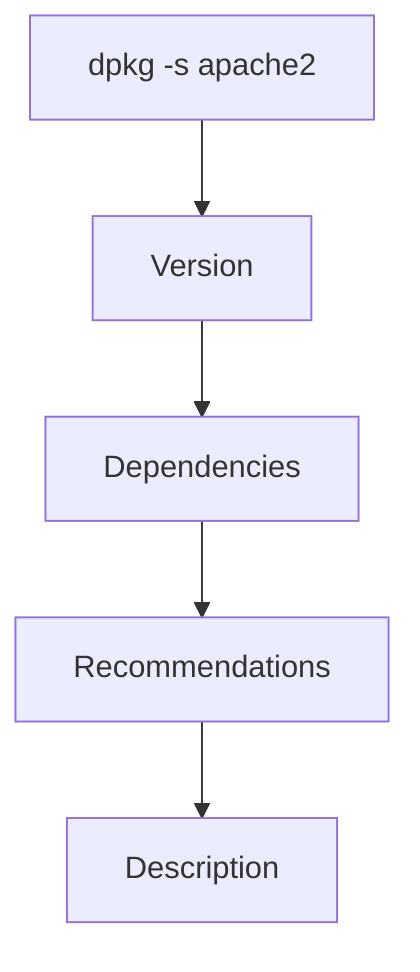

---

# Why Is This Useful?

Sometimes package metadata suggests:

```text
Extra Documentation
Useful Utilities
Plugins
```

that make configuration easier.

---

Example

You install:

```text
postgresql
```

Metadata may suggest:

```text
postgresql-client
postgresql-doc
```

---

# Step 5: Check Configuration Files

Most Linux services store configuration in:

```text
/etc
```

---

Examples

```text
/etc/ssh/

/etc/apache2/

/etc/postgresql/
```

---

Most config files are self-documented.

Example:

```conf
# Enable SSL
#SSL=off
```

---

Meaning:

```text
Comment Explains Setting
```

---

Many times configuration is simply:

```text
Remove #
```

---

Example

Before:

```conf
#SSL=on
```

After:

```conf
SSL=on
```

---

# Understanding Comments

Lines starting with:

```text
#
```

are comments.

Linux ignores them.

---

Example

```conf
# This enables HTTPS
SSL=on
```

---

Visualization

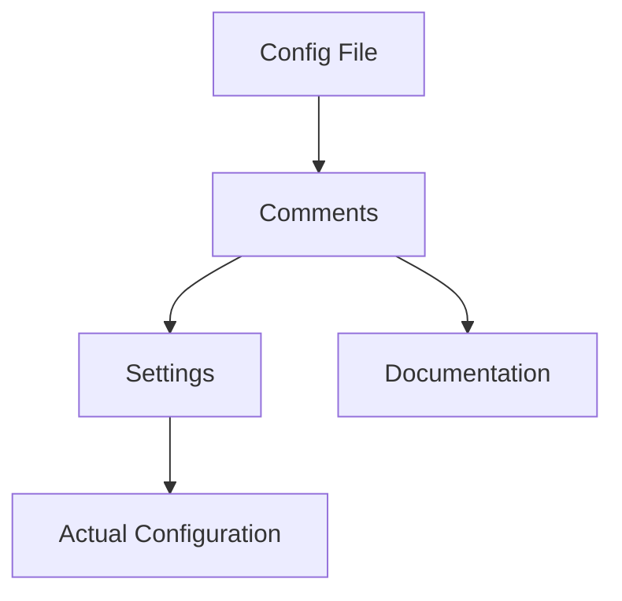

---

# Example Configuration Workflow

Imagine:

```text
Install SSH Server
```

---

Step 1

```bash
apt install openssh-server
```

---

Step 2

```bash
dpkg -L openssh-server
```

Find config location.

---

Step 3

```text
/etc/ssh/sshd_config
```

---

Step 4

Read comments:

```conf
#PermitRootLogin prohibit-password
```

---

Step 5

Modify setting.

---

Step 6

Restart service.

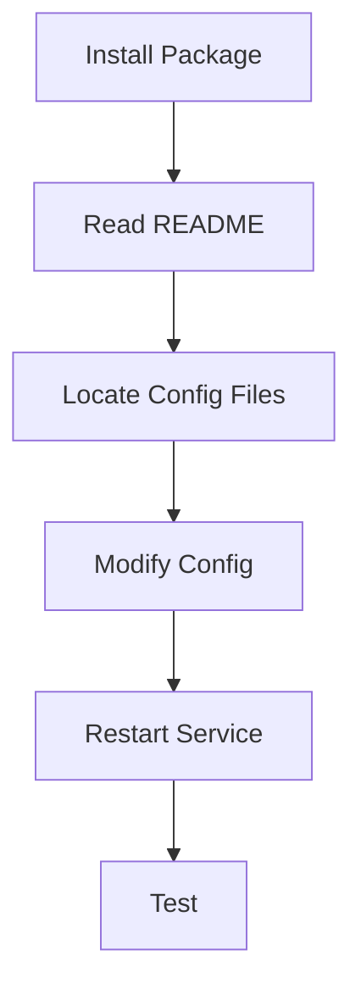

---

# Example Configuration Files Directory

Common pattern:

```text
/etc/package-name/
```

Examples:

```text
/etc/ssh/

/etc/apache2/

/etc/postgresql/

/etc/docker/
```

---

# Example Files Directory

Documentation:

```text
/usr/share/doc/package/
```

Examples:

```text
/usr/share/doc/apache2/

/usr/share/doc/postgresql/

/usr/share/doc/openssh-server/
```

---

# Example Files Provided By Package

Sometimes package ships examples.

Location:

```text
/usr/share/doc/package/examples/
```

---

Example

```text
/usr/share/doc/apache2/examples/
```

---

Purpose:

```text
Ready-Made Configurations
```

---

Instead of writing from scratch:

```text
Copy Example
Modify Example
Use Example
```

---

# Complete Service Configuration Workflow

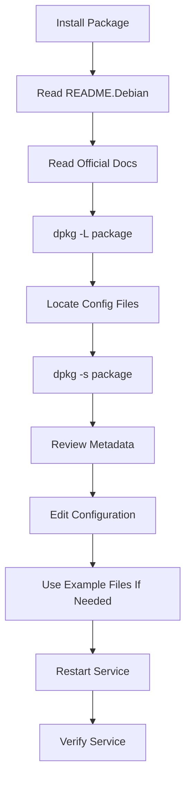

---

# Important Directories To Remember

|Directory|Purpose|
|---|---|
|`/etc`|Configuration files|
|`/usr/share/doc/package`|Documentation|
|`/usr/share/doc/package/README.Debian`|Debian-specific instructions|
|`/usr/share/doc/package/examples`|Example configurations|

---

# Important Commands

## Show Installed Files

```bash
dpkg -L package
```

Example:

```bash
dpkg -L apache2
```

---

## Show Package Information

```bash
dpkg -s package
```

Example:

```bash
dpkg -s apache2
```

---

## Find Documentation

```text
/usr/share/doc/package/
```

---

## Read Debian Notes

```text
/usr/share/doc/package/README.Debian
```

---

# Quick Memory Diagram

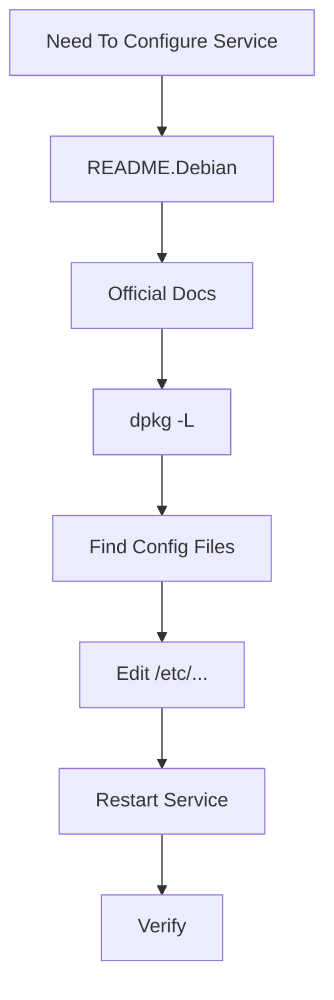

---

# Key Takeaways

```text
Service = Background Program

Daemon = Linux Background Service

Kali disables network services by default

README.Debian is usually the first place to check

dpkg -L package
    → Show package files

dpkg -s package
    → Show package metadata

/etc
    → Configuration files

/usr/share/doc
    → Documentation

/usr/share/doc/package/examples
    → Example configs
```

---

### Next Section

The next sections will become much more practical because they cover actual services:

```text
SSH (remote access)

PostgreSQL (database)

Apache (web server)
```

and how to start, stop, enable, disable, and troubleshoot them using `systemctl`.