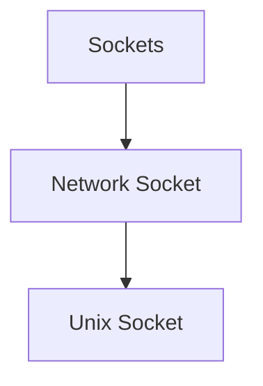
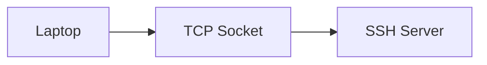
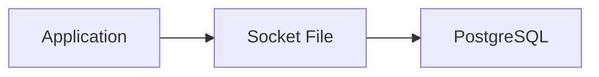
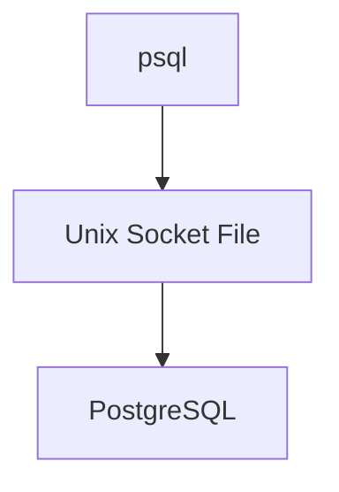
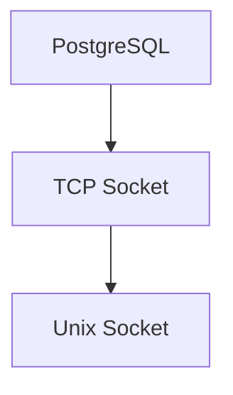
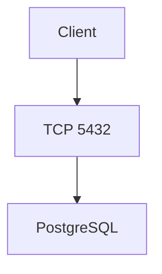
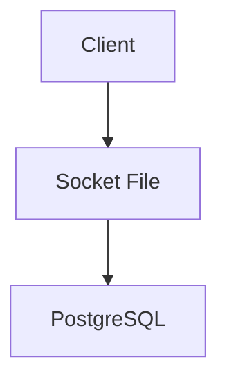
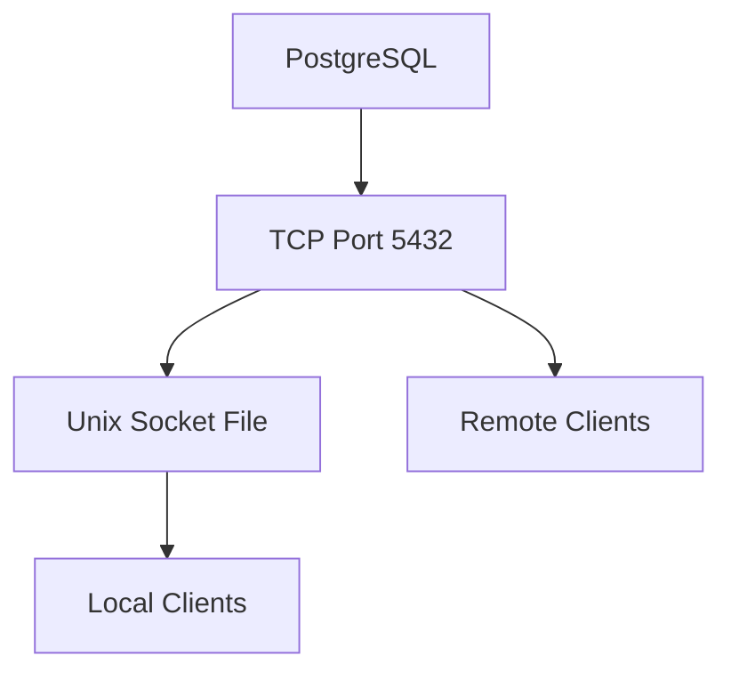
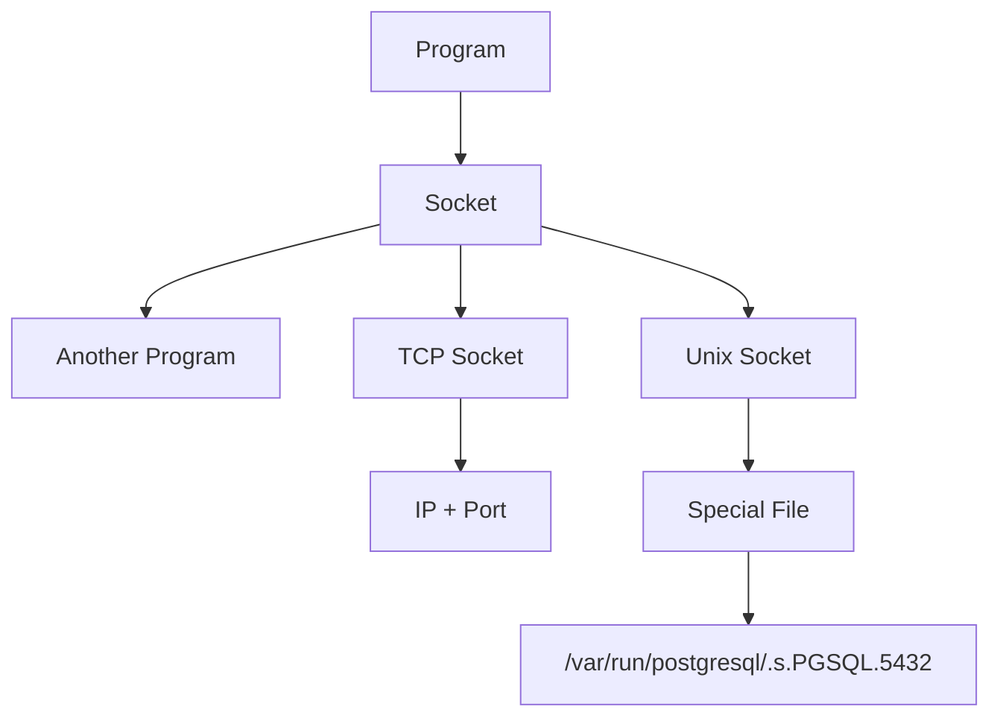

# What Is a Socket?

Think of a socket as:

```text
A communication endpoint
```

or more simply:

```text
A door through which two programs talk.
```

---

# Real World Analogy

Imagine two people in a building.

Without a socket:

```text
Person A
|
|  (cannot communicate)
|
Person B
```

With a socket:

```text
Person A
   |
   | Telephone Line
   |
Person B
```

The telephone line is the socket.

---

# Why Do We Need Sockets?

Programs run in separate memory spaces.

Example:

```text
Firefox
PostgreSQL
Apache
SSH
```

Each process is isolated.


Firefox cannot directly access PostgreSQL's memory.

They need a communication mechanism.

That mechanism is often:

```text
Socket
```

---

# Two Main Types You'll See



---

# Type 1: Network Socket (TCP/IP)

This is the most common one.

Example:

```text
SSH
HTTP
HTTPS
PostgreSQL
```

---

Example:

```bash
ssh 192.168.1.100
```

Connection:



---

SSH listens on:

```text
Port 22
```

The socket is:

```text
192.168.1.100:22
```

---

Another example:

```text
Web Server
```

Listens on:

```text
Port 80
```

Socket:

```text
192.168.1.100:80
```

---

# Type 2: Unix Domain Socket

Instead of using networking:

```text
IP Address
+
Port
```

Linux creates a special file.

Example:

```text
/var/run/postgresql/.s.PGSQL.5432
```

---

Visualized:



---

Notice:

No:

```text
IP Address
```

No:

```text
Port
```

Network stack is bypassed.

---

# PostgreSQL Example

Suppose:

```bash
su - postgres
psql
```

How does psql reach PostgreSQL?

Not through networking.

It uses:

```text
/var/run/postgresql/.s.PGSQL.5432
```

---

Flow:



---

# Why Use Unix Sockets?

They are:

### Faster

No TCP overhead.

---

### More Secure

Cannot be reached from network.

---

### Local Only

Only processes on the same machine can use them.

---

# PostgreSQL Has Both

PostgreSQL actually creates:



---

TCP:

```text
localhost:5432
```

Used for:

```text
Network Clients
```

---

Unix Socket:

```text
/var/run/postgresql/.s.PGSQL.5432
```

Used for:

```text
Local Programs
```

---

# What Is That Weird Filename?

You saw:

```text
/var/run/postgresql/.s.PGSQL.5432
```

Let's decode it.

---

`.s`

means:

```text
socket
```

---

`PGSQL`

means:

```text
PostgreSQL
```

---

`5432`

means:

```text
port number associated with this instance
```

---

So:

```text
.s.PGSQL.5432
```

roughly means:

```text
PostgreSQL socket for instance 5432
```

---

# How To View Sockets

Modern command:

```bash
ss -xl
```

Unix sockets only:

```bash
ss -xl | grep postgres
```

---

Example output:

```text
u_str LISTEN
/var/run/postgresql/.s.PGSQL.5432
```

---

Network sockets:

```bash
ss -tulpn
```

Example:

```text
tcp LISTEN 0 128 127.0.0.1:5432
```

---

# PostgreSQL Authentication Difference

This is where sockets become really important.

---

# TCP Connection

```bash
psql -h localhost
```

Uses:

```text
TCP/IP
```

Flow:



Authentication:

```text
Username
Password
```

required.

---

# Unix Socket Connection

```bash
psql
```

(no `-h`)

Uses:

```text
Unix Socket
```

Flow:



Authentication:

```text
Linux User Identity
```

often sufficient.

---

# Why Does `su - postgres` Work?

When you run:

```bash
su - postgres
```

you become:

```text
Linux User = postgres
```

Then:

```bash
psql
```

connects through:

```text
Unix Socket
```

PostgreSQL sees:

```text
Linux User = postgres
```

and says:

```text
"You're already the PostgreSQL admin."
```

No password needed.

---

# Socket vs Port

Many people confuse these.

### Port

```text
Network communication
```

Example:

```text
5432
22
80
443
```

---

### Unix Socket

```text
Filesystem communication
```

Example:

```text
/var/run/postgresql/.s.PGSQL.5432
```

---

Visualization:



---

# Real Analogy

Imagine PostgreSQL is a bank.

### TCP Socket

```text
Road
```

Anyone can drive there.


---

### Unix Socket

```text
Internal Hallway
```

Only employees inside the building can use it.


---

# Commands Worth Trying on Your Kali

See PostgreSQL socket:

```bash
ls -l /var/run/postgresql/
```

---

Show Unix sockets:

```bash
ss -xl
```

---

Show network sockets:

```bash
ss -tulpn
```

---

See PostgreSQL listening:

```bash
ss -tulpn | grep 5432
```

---

# Quick Memory Diagram



### For PostgreSQL Remember

```text
psql
    ↓
Unix Socket
    ↓
/var/run/postgresql/.s.PGSQL.5432
    ↓
Fast Local Connection

psql -h localhost
    ↓
TCP Socket
    ↓
localhost:5432
    ↓
Network Connection
```

This distinction becomes very important later when you learn **Docker, systemd, Apache, Nginx, SSH forwarding, reverse proxies, and inter-process communication (IPC)** because Unix sockets are used everywhere in Linux.