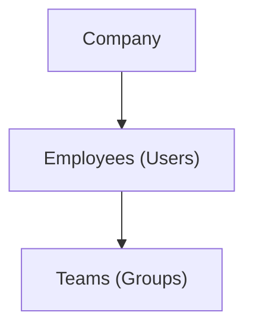
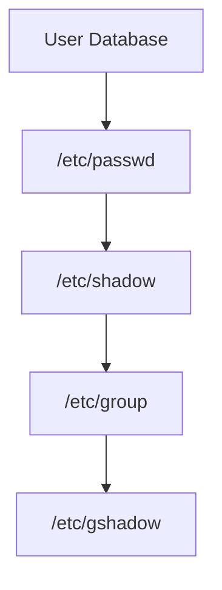
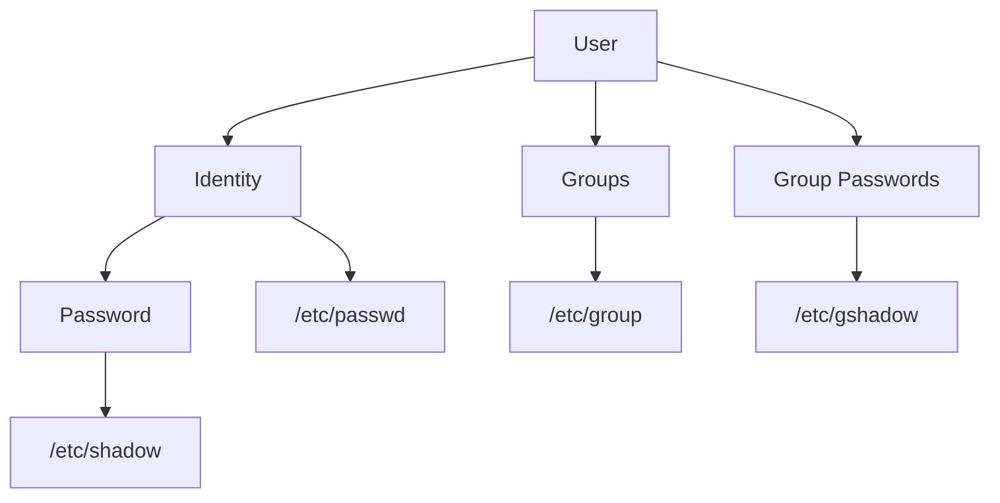
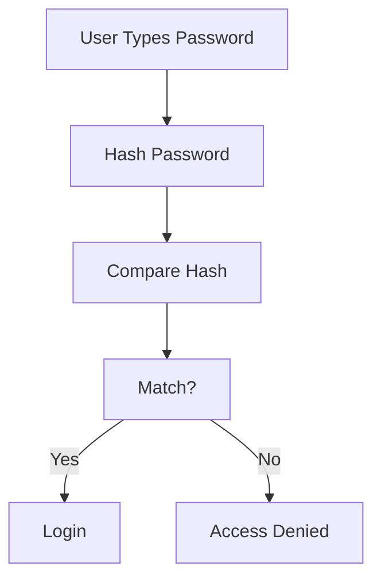
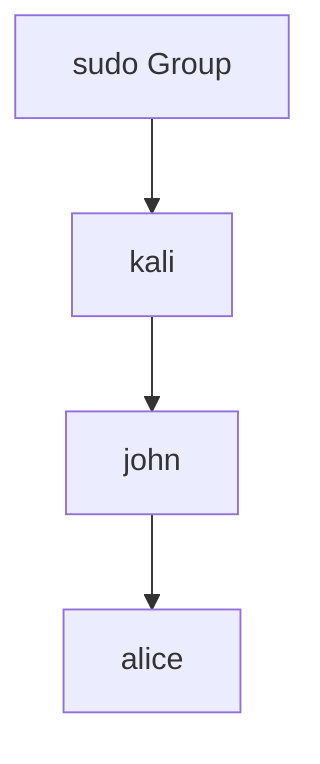
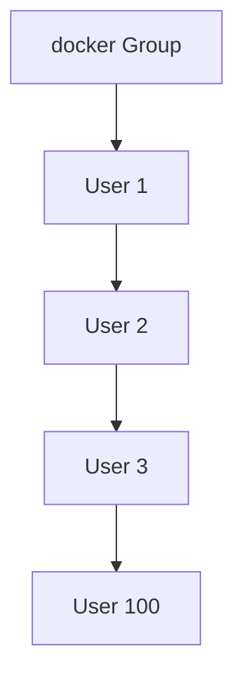
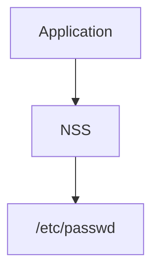
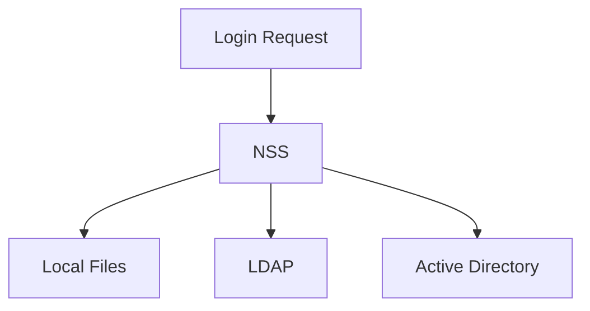
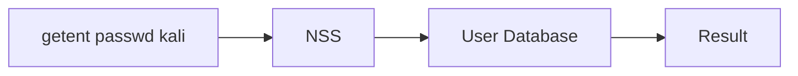
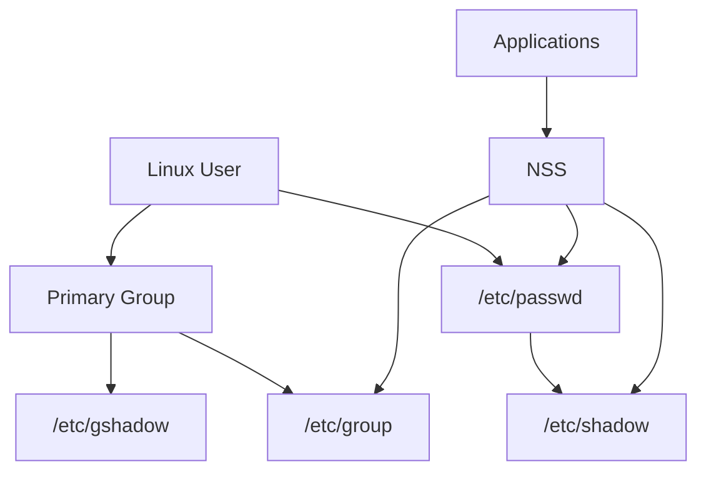

# 6.2 Managing Unix Users and Groups - Part 1

## Understanding Linux Users, Groups, and User Databases

---

# Why Do Users Exist?

Imagine everyone logged into Linux as:

```text
root
```

There would be problems:

```text
Anyone can:
- Delete files
- Change system configuration
- Install malware
- Stop services
- Modify passwords
```

Linux solves this by using:

```text
Users
+
Groups
+
Permissions
```

---

# Real World Analogy

Think of a company.



Example:

```text
User:
    Aditya
    John
    Alice

Groups:
    Network Team
    HR Team
    Docker Team
```

A person belongs to one or more teams.

Linux works exactly the same way.

---

# Linux Identity Model

Every user has:

```text
Username
UID
Primary Group
Home Directory
Shell
Password
```

---

Example:

```text
Username: kali

UID: 1000

Group: kali

Home: /home/kali

Shell: /bin/bash
```

---

# User Database Files

Linux stores user information in files.



---

# The Four Important Files

|File|Purpose|
|---|---|
|/etc/passwd|User information|
|/etc/shadow|User passwords|
|/etc/group|Group information|
|/etc/gshadow|Group passwords|

---

# Think of Them Like This



---

# /etc/passwd

Despite the name:

```text
passwd
```

does NOT usually contain passwords.

It stores:

```text
Username
UID
GID
Home Directory
Shell
```

---

Example

```text
kali:x:1000:1000:Kali User:/home/kali:/bin/bash
```

---

Let's Decode It

```text
kali:x:1000:1000:Kali User:/home/kali:/bin/bash
```

Split by colons:

```text
Field 1 = Username

Field 2 = Password Placeholder

Field 3 = UID

Field 4 = GID

Field 5 = Description

Field 6 = Home Directory

Field 7 = Login Shell
```

---

# Field 1 - Username

```text
kali
```

User logs in as:

```bash
ssh kali@server
```

---

# Field 2 - x

Historically:

```text
Passwords stored here
```

Problem:

```text
Everyone can read /etc/passwd
```

Very bad.

Modern Linux stores:

```text
x
```

instead.

Actual password is moved to:

```text
/etc/shadow
```

---

# Field 3 - UID

UID =

```text
User Identifier
```

Linux actually recognizes users by:

```text
UID
```

not username.

---

Example

```text
UID 0 = root

UID 1000 = kali

UID 1001 = alice
```

---

# Important

Linux sees:

```text
UID 0
```

and immediately thinks:

```text
Super User
```

Regardless of username.

---

Example

```text
eviladmin:x:0:0:...
```

Still has:

```text
root privileges
```

because UID=0.

---

# Field 4 - GID

GID =

```text
Group Identifier
```

Represents user's primary group.

Example:

```text
UID = 1000

GID = 1000
```

Usually:

```text
User kali
belongs to group kali
```

---

# Field 5 - GECOS

Strange historical field.

Contains:

```text
Real Name
Phone Number
Office
Comments
```

Example:

```text
John Smith
```

or

```text
Kali User
```

---

# Field 6 - Home Directory

Example:

```text
/home/kali
```

---

Think:

```text
User's personal folder
```

---

Contents:

```text
Downloads
Desktop
Pictures
Documents
```

---

# Field 7 - Login Shell

Example:

```text
/bin/bash
```

When user logs in:


---

Other examples:

```text
/bin/bash

/bin/zsh

/bin/sh

/usr/sbin/nologin
```

---

# /etc/shadow

Actual passwords live here.

```text
/etc/shadow
```

---

Why?

Because:

```text
Only root can read it
```

---

# Example

```text
kali:$y$j9T$......:19999:0:99999:7:::
```

---

Notice:

```text
Long Random String
```

Not actual password.

---

# Password Hashes

Linux never stores:

```text
password123
```

Instead:

```text
password123
↓
Hash Function
↓
Random Looking Value
```

Stored in:

```text
/etc/shadow
```

---

# Authentication Process

When logging in:



---

# Why Hashes?

If someone steals:

```text
/etc/shadow
```

they still don't know:

```text
Original Password
```

---

# /etc/group

Stores group information.

Example:

```text
sudo:x:27:kali,john
```

---

Meaning:

```text
Group Name = sudo

GID = 27

Members:
    kali
    john
```

---

# Why Groups?

Without groups:

```text
Permission
must be assigned
user by user
```

Painful.

---

Instead:



Give permission once:

```text
sudo group
```

Everyone inherits it.

---

# Common Groups

|Group|Purpose|
|---|---|
|sudo|Administrative access|
|docker|Docker access|
|audio|Sound devices|
|video|Graphics devices|
|wireshark|Packet capture|
|kali-trusted|Kali specific permissions|

---

# /etc/gshadow

Equivalent of:

```text
/etc/shadow
```

but for groups.

Stores:

```text
Group Passwords
Group Administration Data
```

---

Usually rarely touched manually.

---

# Why Does Linux Need Both Users And Groups?

Imagine:

```text
100 Users
```

Need access to:

```text
Docker
```

Without groups:

```text
Configure 100 users
individually
```

---

With groups:



Grant permission once.

Done.

---

# Name Service Switch (NSS)

This is the hidden magic.

---

Question:

```text
Where does Linux find users?
```

Answer:

```text
NSS
```

(Name Service Switch)

---

# User Lookup Flow



---

But NSS can also use:

```text
LDAP
Active Directory
NIS
Local Files
```

---

Example



---

# /etc/nsswitch.conf

Controls NSS behavior.

Example:

```text
passwd: files systemd
group: files systemd
shadow: files
```

Meaning:

```text
Check local files first
```

---

# getent Command

One of the most important commands in Linux administration.

---

Think:

```text
getent
=
Ask NSS For Information
```

---

Instead of:

```bash
cat /etc/passwd
```

Use:

```bash
getent passwd
```

Why?

Because NSS may use:

```text
LDAP
AD
Remote Sources
```

not just local files.

---

# Example

```bash
getent passwd kali
```

Output:

```text
kali:x:1000:1000:Kali User:/home/kali:/bin/bash
```

---

Flow



---

# Why Kali Uses getent Instead of cat

Bad:

```bash
cat /etc/passwd
```

Only local users.

---

Good:

```bash
getent passwd
```

Works for:

```text
Local Users
LDAP Users
AD Users
NIS Users
```

---

# Quick Memory Diagram



---

# Commands To Remember From This Section

```bash
getent passwd
```

Show user database.

---

```bash
getent passwd kali
```

Show specific user.

---

```bash
cat /etc/passwd
```

View local users.

---

```bash
cat /etc/group
```

View groups.

---

```bash
cat /etc/shadow
```

View password hashes (root only).

---

### End of Section 1

Next section should be:

```text
6.2.1 Creating User Accounts

adduser
/etc/skel
UID allocation
home directory creation
group creation
supplementary groups
```

which is where Linux user administration starts becoming practical.