# 6.2.1 Creating User Accounts

> Creating a user in Linux is much more than just assigning a username. Linux automatically creates an identity, home directory, group membership, configuration files, permissions, and login environment.

---

# Big Picture

When you create a user:

```bash
adduser alice
```

Linux performs multiple actions behind the scenes.

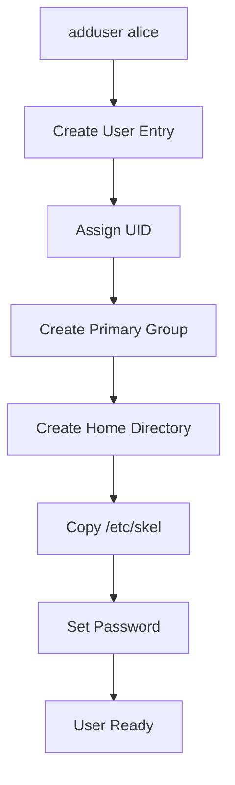

---

# Why Create Multiple Users?

Imagine Kali is installed on:

```text
Laptop
Server
Lab Machine
Shared VM
```

Not everyone should use:

```text
root
```

or

```text
kali
```

Instead:

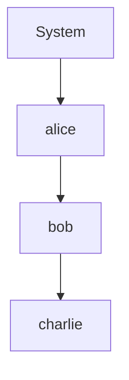

Each user gets:

```text
Own Files
Own Password
Own Settings
Own Permissions
```

---

# The adduser Command

Most common command:

```bash
sudo adduser alice
```

---

# What Happens?

Linux starts asking questions:

```text
New password:
Retype password:
Full Name:
Room Number:
Work Phone:
Home Phone:
Other:
```

---

Example:

```bash
sudo adduser alice
```

Output:

```text
Adding user alice
Creating home directory
Copying files from /etc/skel
```

---

# Why Use adduser Instead of useradd?

Linux actually has two tools:

|Tool|Purpose|
|---|---|
|useradd|Low-level|
|adduser|Friendly wrapper|

---

## useradd

```bash
useradd alice
```

Very minimal.

May not:

```text
Create Home Directory
Create Password
Ask Questions
```

---

## adduser

```bash
adduser alice
```

Automatically:

```text
Creates Home
Creates Group
Copies Templates
Prompts For Password
```

Much easier.

---

# User Creation Flow

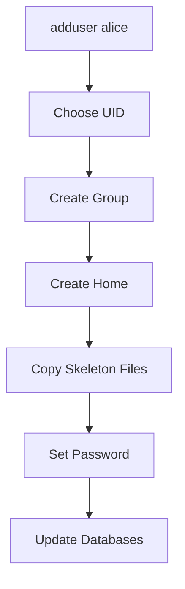

---

# User Identifier (UID)

Every user gets:

```text
UID
```

User Identifier.

Example:

```text
root      UID=0
kali      UID=1000
alice     UID=1001
bob       UID=1002
```

---

# Why UID Matters

Linux internally recognizes:

```text
UID
```

not username.

---

Example

These are effectively identical:

```text
alice UID=1001
```

```text
wonderwoman UID=1001
```

because Linux cares about:

```text
1001
```

---

# Viewing UID

```bash
id alice
```

Example:

```text
uid=1001(alice)
gid=1001(alice)
```

---

# Where Are UID Rules Stored?

Configuration file:

```text
/etc/adduser.conf
```

---

This file controls:

```text
Minimum UID
Maximum UID
Default Shell
Group Behavior
Home Directory Rules
```

---

# Home Directory Creation

Every user receives:

```text
/home/username
```

Example:

```text
/home/alice
```

---

Directory Structure

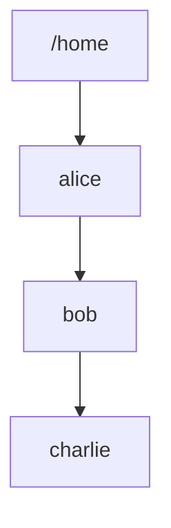

---

# Why Home Directories Exist

User data lives here.

Example:

```text
Downloads
Documents
Pictures
Desktop
SSH Keys
Browser Data
```

---

Example

```text
/home/alice/Documents
/home/alice/Downloads
/home/alice/.ssh
```

---

# Ownership

Home directory belongs to the user.

Example:

```bash
ls -ld /home/alice
```

Output:

```text
drwx------ alice alice
```

Meaning:

```text
Owner = alice
Group = alice
```

---

# What Is /etc/skel?

One of the most important concepts.

When a user is created:

Linux copies:

```text
/etc/skel
```

into the new home directory.

---

Think:

```text
User Home Template
```

---

Example

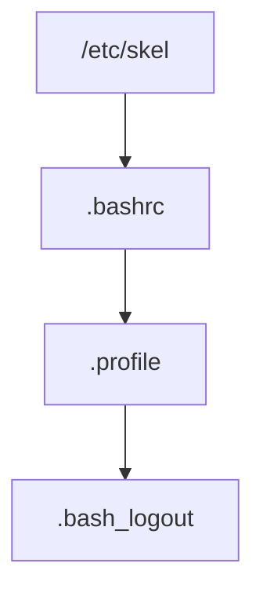

---

When creating alice:

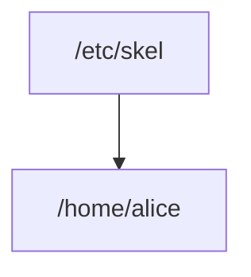

Files are copied automatically.

---

# Why Does Linux Do This?

Without templates:

New user gets:

```text
Empty Directory
```

No shell configuration.

No environment settings.

---

With templates:

```text
Ready To Use Environment
```

immediately after creation.

---

# Real Example

Skeleton:

```text
/etc/skel/.bashrc
```

gets copied to:

```text
/home/alice/.bashrc
```

---

# Administrator Trick

Want every new user to receive:

```text
company.txt
```

Place it in:

```text
/etc/skel
```

Every future user gets it automatically.

---

# User's Primary Group

Linux automatically creates a group.

Example:

```bash
adduser alice
```

creates:

```text
User : alice

Group : alice
```

---

Visualized

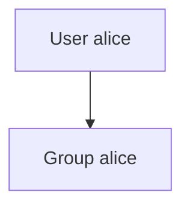

---

# Why Create Separate Groups?

Makes permissions easier.

Example:

```text
alice creates file.txt
```

Ownership becomes:

```text
alice:alice
```

---

# User Databases Updated

When user is created:

Multiple files change.

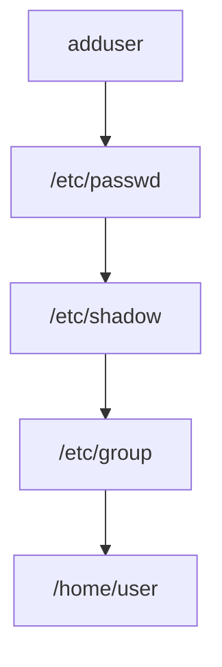

---

# Example /etc/passwd Entry

```text
alice:x:1001:1001::/home/alice:/bin/bash
```

Meaning:

```text
Username = alice

UID = 1001

GID = 1001

Home = /home/alice

Shell = bash
```

---

# Supplementary Groups

A user can belong to multiple groups.

Example:

```text
alice
```

belongs to:

```text
alice
docker
sudo
wireshark
```

---

Visualized

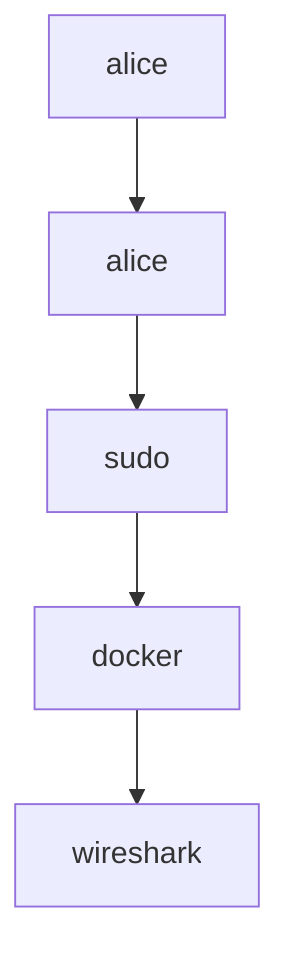

---

# Why Additional Groups?

Groups grant permissions.

---

## Docker Example

Group:

```text
docker
```

Allows:

```bash
docker ps
docker run
docker build
```

without root.

---

## Wireshark Example

Group:

```text
wireshark
```

Allows:

```text
Packet Capture
```

without root.

---

# Adding User To Group

Syntax:

```bash
sudo adduser user group
```

Example:

```bash
sudo adduser alice docker
```

---

Result:

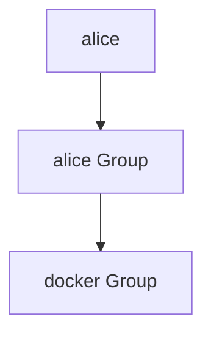

---

# Verify Group Membership

```bash
groups alice
```

Example:

```text
alice : alice docker sudo
```

---

Alternative:

```bash
id alice
```

Output:

```text
uid=1001(alice)
gid=1001(alice)
groups=1001(alice),27(sudo),999(docker)
```

---

# Common Kali Groups

|Group|Purpose|
|---|---|
|sudo|Administrative access|
|docker|Docker control|
|wireshark|Packet capture|
|audio|Sound devices|
|video|GPU/display devices|
|plugdev|USB device access|
|netdev|Network device access|

---

# What Happens During Login?

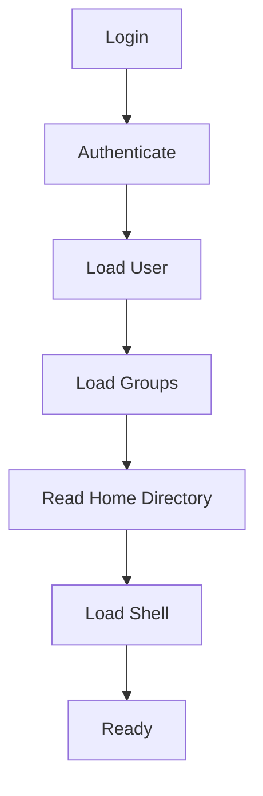

---

# Exam / Lab Notes

## Create User

```bash
sudo adduser alice
```

---

## Add User To Group

```bash
sudo adduser alice docker
```

---

## Show User Info

```bash
id alice
```

---

## Show Groups

```bash
groups alice
```

---

## Home Directory

```text
/home/alice
```

---

## Template Directory

```text
/etc/skel
```

---

## User Database Files

```text
/etc/passwd
/etc/shadow
/etc/group
```

---

# Quick Memory Diagram

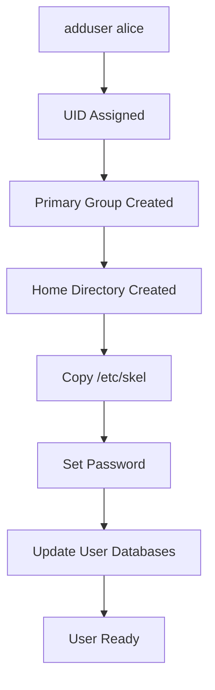

### Remember

```text
adduser
=
Create Identity
+
Create Group
+
Create Home
+
Copy Templates
+
Set Password
```

---

### End of Section 2

Next section:

```text
6.2.2
Modifying Existing Accounts

passwd
chfn
chsh
chage

Password Expiration
Shell Changes
User Information Changes
```

This section is where Linux user administration becomes much more interesting because you'll learn how to modify, lock, expire, and manage existing accounts.