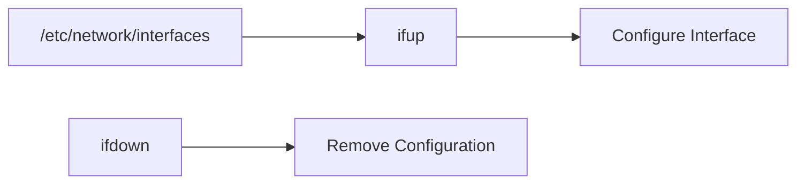
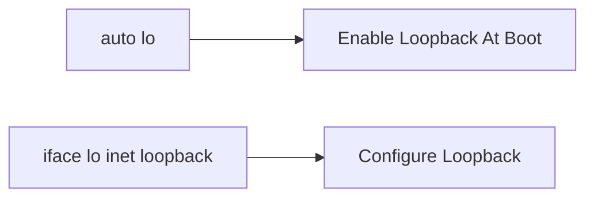
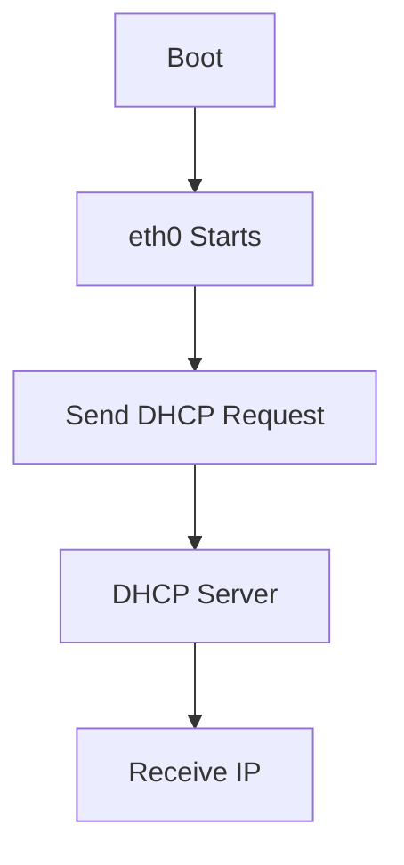
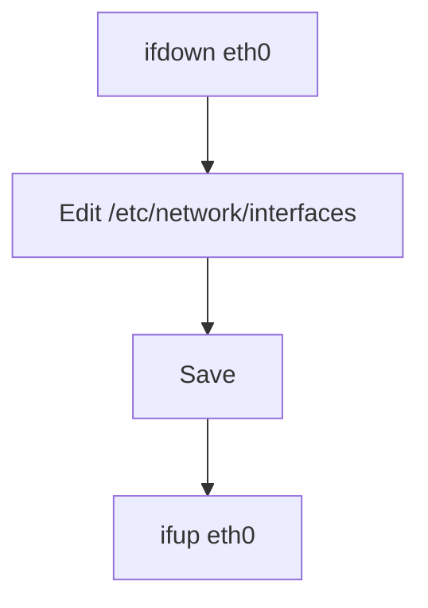
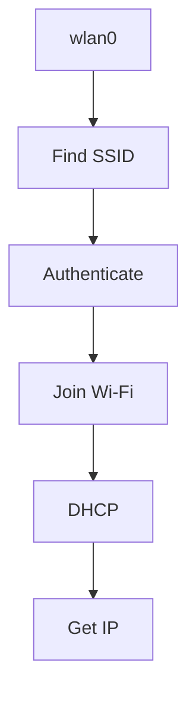
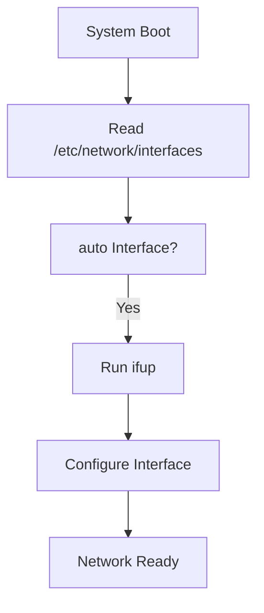
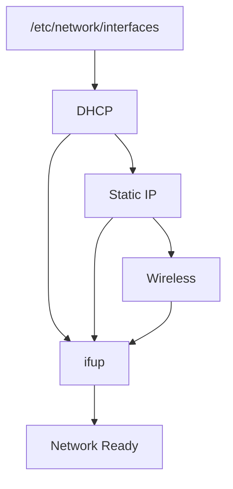

# 6.1.2 Network Configuration with ifupdown

When no GUI is available, Kali can configure networking using the **ifupdown** package and the configuration file:

> ```
> /etc/network/interfaces
> ```


---

# Big Picture

Linux networking using ifupdown works like this:



Think:

```text
interfaces file = Configuration

ifup = Apply Configuration

ifdown = Remove Configuration
```

---

# Main Components

|Component|Purpose|
|---|---|
|`/etc/network/interfaces`|Network configuration file|
|`ifup`|Bring interface up|
|`ifdown`|Bring interface down|
|`networking service`|Applies configuration during boot|

---

# Why sudo?

Network configuration is an administrative task.

Normal users cannot usually:

```text
Change IP Address
Modify Routes
Enable Interfaces
Configure Gateways
```

Need:

```text
sudo
```

or

```text
root
```

---

# sudo

Syntax:

```bash
sudo command
```

Example:

```bash
sudo ifdown eth0
```

Meaning:

```text
Run ifdown with administrative privileges
```

---

# Becoming Root

Instead of typing:

```bash
sudo command1
sudo command2
sudo command3
```

You can become root.

```bash
sudo su --login
```

or

```bash
sudo su -
```

Result:

```text
kali@host:~$
        ↓
root@host:~#
```

---

# Why Use Root?

Useful when performing many administrative tasks.

Example:

```bash
ifdown eth0
nano /etc/network/interfaces
ifup eth0
```

No need to type sudo repeatedly.

---

# Network Interfaces

A network interface is simply a network adapter.

Examples:

```text
eth0
eth1
wlan0
lo
```

---

# Common Interfaces

|Interface|Meaning|
|---|---|
|lo|Loopback|
|eth0|Ethernet|
|eth1|Second Ethernet|
|wlan0|Wireless|

---

# Loopback Interface (lo)

Every Linux system has:

```text
lo
```

Loopback IP:

```text
127.0.0.1
```

Purpose:

```text
Computer talks to itself
```

---

## Why Is Loopback Important?

Many services use:

```text
localhost
127.0.0.1
```

Examples:

- Databases
    
- Web servers
    
- Local applications
    

---

# Loopback Configuration

Always present:

```bash
auto lo
iface lo inet loopback
```

---

Meaning



---

# DHCP Configuration

Most common setup.

---

## Configuration

```bash
auto eth0
iface eth0 inet dhcp
```

---

## Breakdown

### auto eth0

```text
Automatically start interface at boot
```

---

### iface eth0 inet dhcp

Breakdown:

|Part|Meaning|
|---|---|
|iface|Configure Interface|
|eth0|Interface Name|
|inet|IPv4|
|dhcp|Obtain IP Automatically|

---

## What Happens?



---

# Example DHCP Assignment

Router provides:

```text
IP Address = 192.168.1.10
Mask       = 255.255.255.0
Gateway    = 192.168.1.1
DNS        = 8.8.8.8
```

Everything automatic.

---

# Static IP Configuration

Used when the machine must always have the same IP.

Examples:

```text
Servers
Firewalls
Routers
Management Interfaces
```

---

## Configuration

```bash
auto eth0

iface eth0 inet static

address 192.168.0.3

netmask 255.255.255.0

broadcast 192.168.0.255

network 192.168.0.0

gateway 192.168.0.1
```

---

# Understanding Each Field

## address

```text
My IP Address
```

Example:

```text
192.168.0.3
```

---

## netmask

Defines network size.

Example:

```text
255.255.255.0
```

Equivalent:

```text
/24
```

---

## network

Network address.

Example:

```text
192.168.0.0
```

---

## broadcast

Broadcast address.

Example:

```text
192.168.0.255
```

Used when sending traffic to:

```text
Everyone On Network
```

---

## gateway

Router IP.

Example:

```text
192.168.0.1
```

Used for reaching:

```text
Internet
Other Networks
```

---

# Static IP Visualized


---

# Bringing Interfaces Down

Disable interface:

```bash
ifdown eth0
```

Result:

```text
Interface Disabled
IP Removed
Routes Removed
```

---

# Bringing Interfaces Up

Enable interface:

```bash
ifup eth0
```

Result:

```text
Read Configuration
Apply Settings
Interface Active
```

---

# Typical Workflow

After editing configuration:



---

# Wireless Networking

Wireless interfaces usually:

```text
wlan0
```

require:

```text
wpasupplicant
```

---

# What Is wpa_supplicant?

Program that handles:

```text
Wi-Fi Authentication
WPA
WPA2
WPA3
```

Without it:

```text
Cannot Join Protected Wireless Networks
```

---

# Wireless Example

```bash
iface wlan0 inet dhcp

wpa-ssid MyNetWork

wpa-psk plaintextsecret
```

---

# Breakdown

### iface wlan0 inet dhcp

```text
Use DHCP For Wi-Fi
```

---

### wpa-ssid

```text
Wireless Network Name
```

Example:

```text
MyNetWork
```

---

### wpa-psk

```text
Wi-Fi Password
```

Example:

```text
plaintextsecret
```

---

# Wireless Connection Flow



---

# Complete ifupdown Flow



---

# Exam / Lab Notes

## DHCP

```bash
auto eth0
iface eth0 inet dhcp
```

Automatically gets:

```text
IP
Mask
Gateway
DNS
```

---

## Static IP

```bash
iface eth0 inet static
```

Manually define:

```text
address
netmask
network
broadcast
gateway
```

---

## Loopback

```bash
auto lo
iface lo inet loopback
```

Always present.

---

## Wireless

```bash
iface wlan0 inet dhcp

wpa-ssid MyWiFi

wpa-psk password
```

---

## Key Commands

```bash
sudo su -
```

Become root.

```bash
ifdown eth0
```

Disable interface.

```bash
ifup eth0
```

Enable interface.

```bash
nano /etc/network/interfaces
```

Edit network configuration.

---

# Quick Memory Diagram



### Remember

```text
interfaces = Configuration

ifup = Apply

ifdown = Remove

wpa_supplicant = Wi-Fi Authentication
```