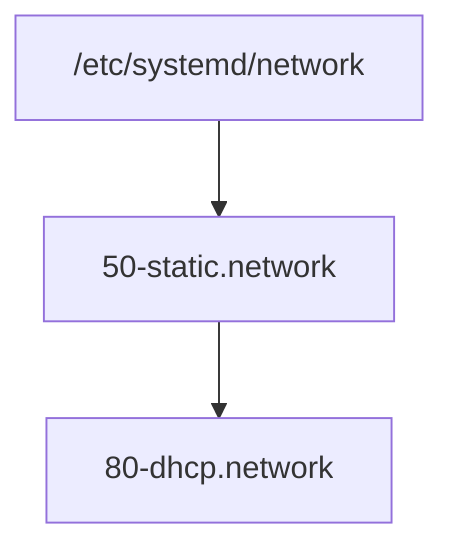
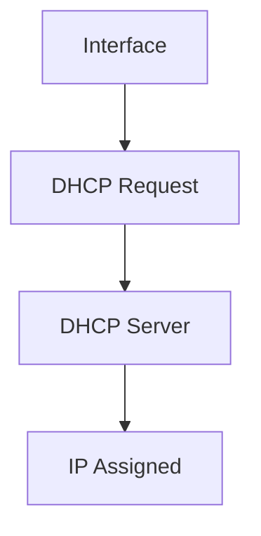
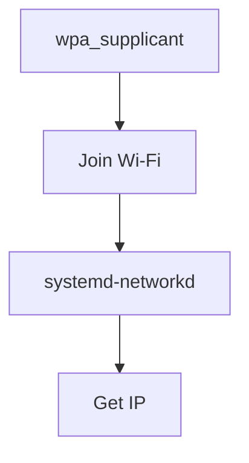
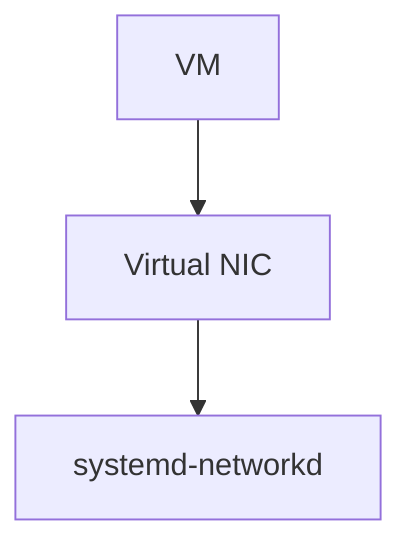
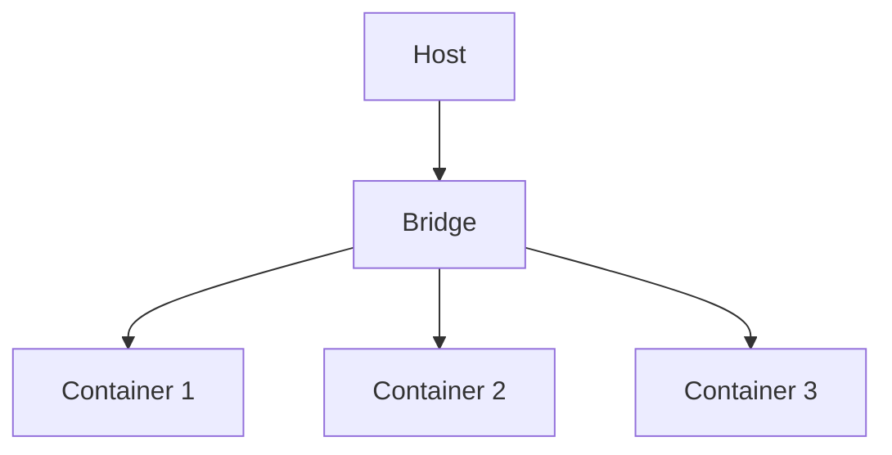
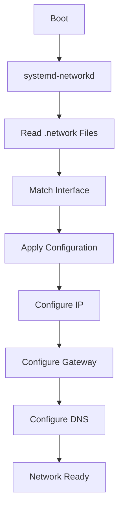
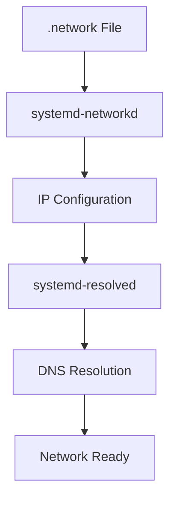

# 6.1.3 Network Configuration with systemd-networkd

> **systemd-networkd** is the modern alternative to **ifupdown**. It is lightweight, fast, integrated with systemd, and especially popular in servers, VMs, containers, and cloud environments.

---

# Big Picture

Historically:

```text
Debian/Kali
    ↓
ifupdown
```

Modern approach:

```text
systemd
    ↓
systemd-networkd
```

---

# Networking Tools Comparison

|Tool|Typical Usage|
|---|---|
|ifupdown|Traditional Debian/Kali|
|NetworkManager|Desktop Systems|
|systemd-networkd|Servers, VMs, Containers|
|wpa_supplicant|Wi-Fi Authentication|

---

# Where Does systemd-networkd Fit?

## Traditional ifupdown


---

## systemd-networkd


---

# Why Was It Created?

Problems with older approaches:

```text
ifupdown
    ↓
Debian Specific

NetworkManager
    ↓
Heavy
Desktop Focused
```

Goal:

```text
Small
Fast
Systemd Integrated
Distribution Independent
```

---

# Configuration Files

Configuration files live in:

```text
/etc/systemd/network/
```

---

Typical file:

```text
50-static.network
```

or

```text
80-dhcp.network
```

---

# Directory Structure



---

# Why File Names Start With Numbers?

Example:

```text
10-file.network
50-file.network
80-file.network
```

Systemd processes them in order.

```text
10
 ↓
50
 ↓
80
```

Similar to:

```text
ACL Sequence Numbers
```

in Cisco.

---

# Structure of a .network File

Every file has two main sections:

```text
[Match]

[Network]
```

---

# [Match] Section

Purpose:

```text
Which Interface?
```

---

Example:

```ini
[Match]
Name=enp2s0
```

Meaning:

```text
Apply This Configuration
Only To enp2s0
```

---

# [Network] Section

Purpose:

```text
How Should It Be Configured?
```

Example:

```ini
[Network]
DHCP=yes
```

Meaning:

```text
Get IP Automatically
```

---

# Static IP Example

File:

```text
/etc/systemd/network/50-static.network
```

Configuration:

```ini
[Match]
Name=enp2s0

[Network]
Address=192.168.0.15/24
Gateway=192.168.0.1
DNS=8.8.8.8
```

---

# Breakdown

## Match

```ini
Name=enp2s0
```

Apply only to:

```text
enp2s0
```

---

## Address

```ini
Address=192.168.0.15/24
```

Equivalent:

```text
IP Address = 192.168.0.15
Mask       = 255.255.255.0
```

---

## Gateway

```ini
Gateway=192.168.0.1
```

Router IP.

Used to reach:

```text
Internet
Other Networks
```

---

## DNS

```ini
DNS=8.8.8.8
```

DNS Server.

Used for:

```text
google.com
↓
142.250.x.x
```

resolution.

---

# Static Configuration Visualization


---

# DHCP Example

File:

```text
/etc/systemd/network/80-dhcp.network
```

Configuration:

```ini
[Match]
Name=en*

[Network]
DHCP=yes
```

---

# Understanding Name=en*

This is a wildcard.

```text
en*
```

matches:

```text
enp0s3
enp2s0
ens160
ens192
```

---

Think:

```text
Any Interface
Starting With "en"
```

---

# DHCP Flow



---

# Why Different Interface Names?

Old Linux:

```text
eth0
eth1
```

Modern Linux:

```text
enp2s0
ens160
ens192
```

Called:

```text
Predictable Network Interface Names
```

---

# Why Enable systemd-networkd?

By default:

```text
Disabled
```

because Kali normally uses:

```text
ifupdown
```

or

```text
NetworkManager
```

---

# Enable Services

```bash
systemctl enable systemd-networkd

systemctl enable systemd-resolved
```

Meaning:

```text
Start Automatically At Boot
```

---

# Start Immediately

```bash
systemctl start systemd-networkd

systemctl start systemd-resolved
```

Meaning:

```text
Start Right Now
```

---

# What Is systemd-resolved?

Very important.

---

## Purpose

Provides:

```text
DNS Resolution
```

---

Without DNS:

```text
google.com
```

cannot become:

```text
142.250.x.x
```

---

# DNS Flow


---

# Why Modify resolv.conf?

Linux traditionally uses:

```text
/etc/resolv.conf
```

for DNS servers.

---

Normally:

```text
nameserver 8.8.8.8
```

appears here.

---

With systemd-resolved:

```text
/etc/resolv.conf
```

must point to:

```text
/run/systemd/resolve/resolv.conf
```

---

Command:

```bash
ln -sf \
/run/systemd/resolve/resolv.conf \
/etc/resolv.conf
```

---

Visualization:


---

# Wireless Limitation

Important exam point.

---

## systemd-networkd Handles

```text
IP Address
Routes
Gateway
DNS
Virtual Interfaces
```

---

## systemd-networkd Does NOT Handle

```text
Wi-Fi Authentication
```

No:

```text
SSID
WPA2
WPA3
Password
```

support.

---

# Solution

Use:

```text
wpa_supplicant
```

---

Wireless Flow:



---

# Why Is It Popular In VMs?

Imagine VMware.

Interfaces are usually:

```text
ens160
ens192
```

Simple.

No Wi-Fi.

No desktop.

---

Perfect fit.



---

# Why Is It Popular In Containers?

Containers create many virtual interfaces.

Example:

```text
veth
bridge
tap
tun
```

systemd-networkd was designed for these scenarios.

---

# Real Container Scenario



systemd-networkd manages all sides consistently.

---

# ifupdown vs systemd-networkd

|Feature|ifupdown|systemd-networkd|
|---|---|---|
|Traditional Debian Tool|✅|❌|
|Integrated With systemd|❌|✅|
|Lightweight|✅|✅|
|Wi-Fi Support Built-in|Better|Limited|
|Containers|Basic|Excellent|
|VMs|Good|Excellent|
|Cloud Environments|Good|Excellent|

---

# Complete systemd-networkd Flow



---

# Exam / Lab Notes

## Static Configuration

```ini
[Match]
Name=enp2s0

[Network]
Address=192.168.0.15/24
Gateway=192.168.0.1
DNS=8.8.8.8
```

---

## DHCP Configuration

```ini
[Match]
Name=en*

[Network]
DHCP=yes
```

---

## Enable Services

```bash
systemctl enable systemd-networkd
systemctl enable systemd-resolved
```

---

## Start Services

```bash
systemctl start systemd-networkd
systemctl start systemd-resolved
```

---

## Fix DNS

```bash
ln -sf \
/run/systemd/resolve/resolv.conf \
/etc/resolv.conf
```

---

# Quick Memory Diagram



### Remember

```text
ifupdown
    = Traditional Debian Networking

systemd-networkd
    = Modern Systemd Networking

systemd-resolved
    = DNS Resolution

wpa_supplicant
    = Wi-Fi Authentication
```