---

# First: WTF is systemd?

Before systemd existed:

```text
Linux Boots
↓
Runs Scripts
↓
Starts Services
```

Very messy.

---

Today:

```text
Linux Boots
↓
systemd Starts
↓
systemd Starts Everything Else
```

---

Think:

```text
systemd = Operating System Manager
```

or

```text
systemd = Boss of all processes
```

---

When your Kali boots:

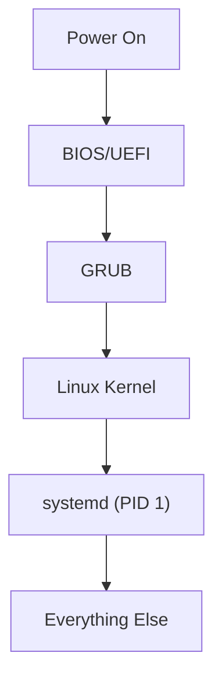

---

# What is PID 1?

Check:

```bash
ps -p 1
```

You'll see:

```text
PID TTY TIME CMD
1 ? 00:00:01 systemd
```

---

Meaning:

```text
systemd is literally the first userspace process.
```

Everything eventually descends from it.

---

# What Does systemd Manage?

Examples:

```text
SSH
Apache
PostgreSQL
Docker
NetworkManager
Cron
```

---

Visualized:

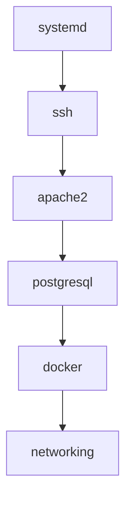

---

# What Is A Service?

A service is just:

```text
A program running in the background
```

Example:

```text
sshd
postgres
apache2
```

---

# What Is A Unit?

This is where systemd terminology becomes annoying.

The book says:

```text
Unit
```

You think:

```text
Service
```

---

Not exactly.

---

A Unit is:

```text
Anything systemd manages
```

---

Examples:

|Unit Type|Example|
|---|---|
|service|ssh.service|
|target|multi-user.target|
|mount|home.mount|
|timer|apt.timer|
|socket|ssh.socket|

---

Visualized:

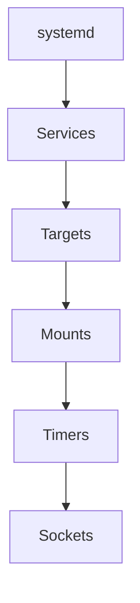

---

Most of the time you'll only care about:

```text
*.service
```

---

# What Is A Service File?

Example:

```text
/lib/systemd/system/ssh.service
```

---

Think:

```text
Instruction file for systemd
```

---

Example:

```ini
[Service]
ExecStart=/usr/sbin/sshd
```

---

Meaning:

```text
To start SSH
run:

/usr/sbin/sshd
```

---

Visualized:

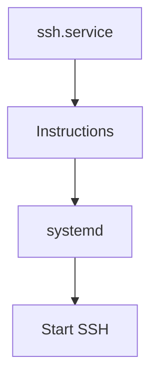

---

# Let's Decode ssh.service

---

## [Unit]

```ini
[Unit]
Description=OpenBSD Secure Shell server
```

Human readable description.

---

```ini
After=network.target
```

Means:

```text
Start SSH only AFTER networking exists.
```

---

Visualized:


---

Because:

```text
SSH without networking
makes no sense.
```

---

# [Service]

This tells systemd HOW to run it.

---

## ExecStart

```ini
ExecStart=/usr/sbin/sshd -D
```

Means:

```text
This command starts SSH.
```

---

Equivalent:

```bash
/usr/sbin/sshd -D
```

---

# ExecReload

```ini
ExecReload=/bin/kill -HUP $MAINPID
```

Used when you run:

```bash
systemctl reload ssh
```

---

Instead of restarting:

```text
Tell SSH:
Reload your config.
```

---

# Restart=on-failure

```ini
Restart=on-failure
```

Very useful.

---

Visualized:

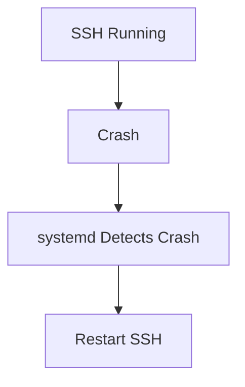

---

This is why systemd is awesome.

---

# What Is A Target?

This is the thing confusing you most.

---

Think:

```text
Target = Desired System State
```

---

Example:

```text
graphical.target
```

means:

```text
Linux Desktop
```

---

Example:

```text
multi-user.target
```

means:

```text
Normal Linux Server
```

---

Visualized:

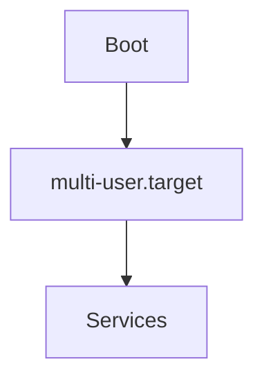

---

# What Happens During Boot?

Systemd says:

```text
I need graphical.target
```

---

graphical.target says:

```text
I need:

networking
ssh
display manager
```

---

Then systemd starts all of them.

---

Visualized:

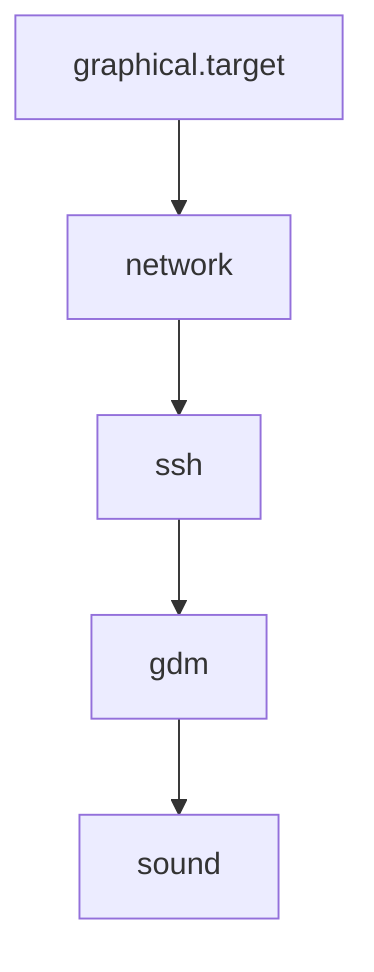

---

# NOW THE IMPORTANT PART

# WTF DOES systemctl enable DO?

Most people think:

```bash
systemctl enable ssh
```

means:

```text
Start SSH
```

WRONG.

---

It means:

```text
Start SSH on future boots.
```

---

Not:

```text
Start SSH right now.
```

---

# Example

Before:

```bash
systemctl status ssh
```

might show:

```text
inactive
disabled
```

---

You run:

```bash
systemctl enable ssh
```

---

Result:

```text
inactive
enabled
```

Still not running.

---

Why?

Because enable only affects:

```text
Future boots
```

---

# How Does enable Work?

This is where symlinks come in.

---

Imagine:

```text
ssh.service
```

exists here:

```text
/lib/systemd/system/ssh.service
```

---

systemctl enable creates:

```text
/etc/systemd/system/multi-user.target.wants/ssh.service
```

---

But it's NOT a copy.

It's a:

```text
Symlink
```

---

# WTF Is A Symlink?

Think:

```text
Windows Shortcut
```

or

```text
Mac Alias
```

---

Example:

Real file:

```text
/lib/systemd/system/ssh.service
```

Shortcut:

```text
/etc/systemd/system/multi-user.target.wants/ssh.service
```

---

Visualized:

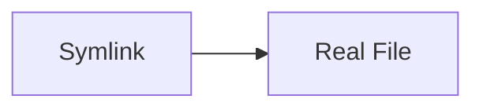

---

Linux shows:

```text
ssh.service -> /lib/systemd/system/ssh.service
```

Meaning:

```text
This points there.
```

---

# Why Create A Symlink?

Because during boot:

systemd checks:

```text
multi-user.target.wants
```

---

Everything inside that folder:

```text
Must Start At Boot
```

---

Visualized:

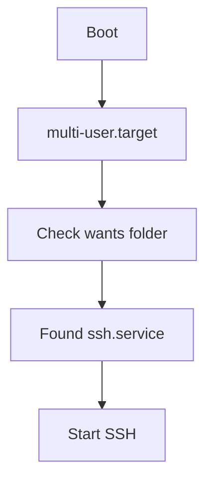

---

# Let's Decode The PostgreSQL Example

Initially:

```bash
systemctl status postgresql
```

shows:

```text
disabled
inactive
```

---

Translation:

```text
Not Running
Won't Start At Boot
```

---

Then:

```bash
systemctl enable postgresql
```

creates:

```text
/etc/systemd/system/multi-user.target.wants/postgresql.service
```

---

Visualized:


---

Now:

```text
enabled
inactive
```

means:

```text
Will Start At Boot
But Not Running Yet
```

---

Then:

```bash
systemctl start postgresql
```

Now:

```text
enabled
active
```

means:

```text
Running Now
And
Will Start At Next Boot
```

---

# Start vs Enable

The most important table:

|Command|Effect|
|---|---|
|start|Start now|
|stop|Stop now|
|restart|Restart now|
|reload|Reload config|
|enable|Start at boot|
|disable|Don't start at boot|

---

Visualized:

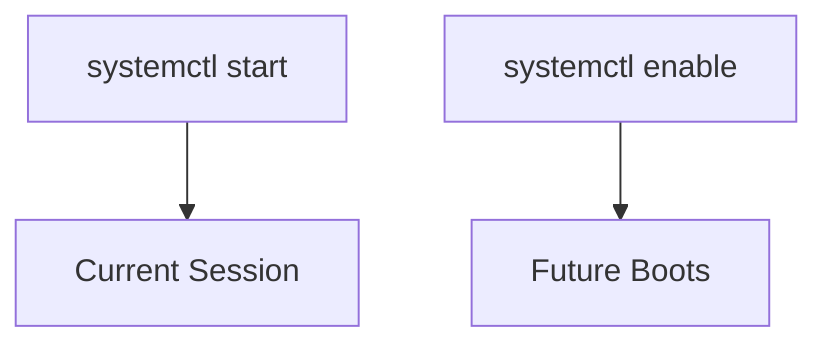

---

# Why Did PostgreSQL Show

```text
active (exited)
```

instead of

```text
active (running)
```

Good catch.

That's because:

```text
postgresql.service
```

isn't the actual database process.

It's a wrapper.

---

Visualized:

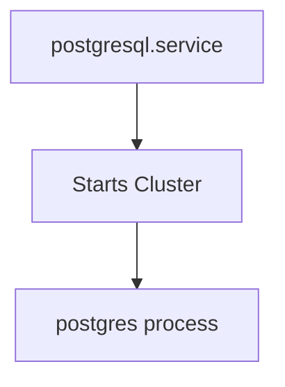

---

The wrapper finishes:

```text
active (exited)
```

because:

```text
Its job is done.
```

---

Actual database process:

```bash
ps aux | grep postgres
```

---

# The Big Picture

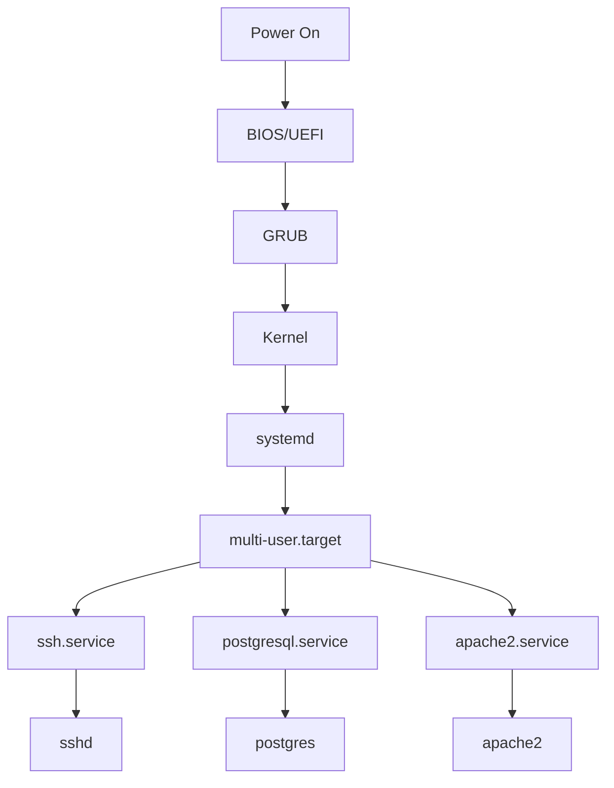

---

# Commands To Memorize

```bash
systemctl status ssh
```

Show status

---

```bash
systemctl start ssh
```

Start now

---

```bash
systemctl stop ssh
```

Stop now

---

```bash
systemctl restart ssh
```

Restart

---

```bash
systemctl reload ssh
```

Reload config

---

```bash
systemctl enable ssh
```

Start at boot

---

```bash
systemctl disable ssh
```

Don't start at boot

---

For your Kali VM, the mental model should be:

```text
systemd = Boss

service file = Instructions

target = Goal

enable = Create boot-time shortcut

start = Run now

symlink = Shortcut pointing to real file
```

Once you understand **symlink = shortcut**, 90% of the confusion in that chapter disappears.