# 2. Chains, Rules, Conditions, Targets, and iptables Syntax

> Source: Kali Linux Documentation

---

# 2.1 Understanding Chains

A **chain** is simply an ordered list of rules.

When a packet enters a chain:

1. Rule 1 is checked
    
2. Rule 2 is checked
    
3. Rule 3 is checked
    
4. Continue until match
    
5. If no match → use default policy
    

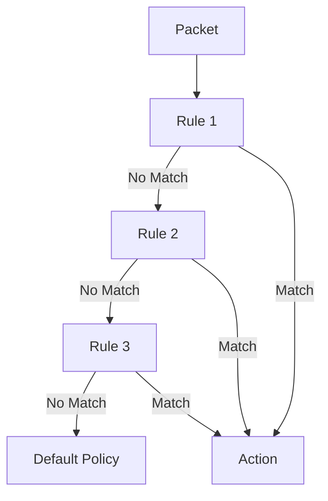

---

# 2.2 Standard Chains

Netfilter contains predefined chains.

---

## INPUT Chain

Handles packets destined for the firewall itself.

Examples:

- SSH to firewall
    
- HTTP server on firewall
    
- Ping to firewall
    

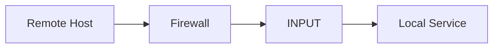

Example:

```text
Laptop ----SSH----> Firewall
```

Packet enters:

```text
INPUT
```

---

## OUTPUT Chain

Handles packets generated by the firewall.

Examples:

- Firewall sending ping
    
- Firewall downloading updates
    
- Firewall opening SSH session
    

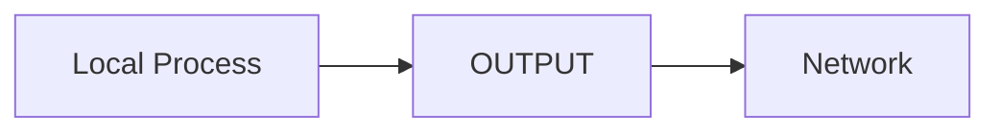

Example:

```bash
ping 8.8.8.8
```

Packet traverses:

```text
OUTPUT
```

---

## FORWARD Chain

Handles packets passing through the firewall.

Firewall is neither:

- Source
    
- Destination
    

It simply routes traffic.

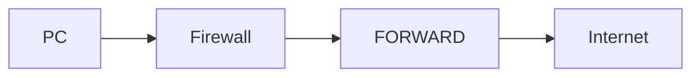

Example:

```text
LAN User ---> Internet
```

Packet traverses:

```text
FORWARD
```

---

# 2.3 NAT Chains

The NAT table contains different chains.

---

## PREROUTING

Packet arrives.

Modify destination before routing decision.

Common use:

- DNAT
    
- Port forwarding
    

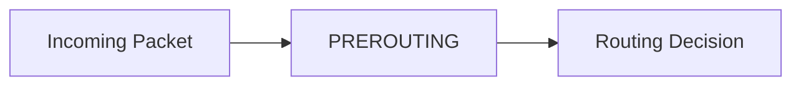

Example:

```text
Public IP:80
    ↓
Internal Server:80
```

---

## POSTROUTING

Packet is leaving.

Modify source address.

Common use:

- SNAT
    
- MASQUERADE
    

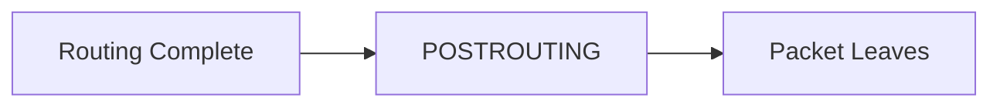

---

## NAT Flow Example

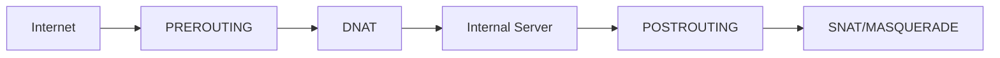

---

# 2.4 What is a Rule?

A rule consists of:

```text
Conditions + Action
```

General format:

```bash
iptables [command] chain conditions -j action
```

Example:

```bash
iptables -A INPUT -p tcp --dport 22 -j ACCEPT
```

Meaning:

```text
IF protocol = TCP
AND destination port = 22

THEN ACCEPT
```

---

# 2.5 Anatomy of an iptables Rule

```bash
iptables -A INPUT -p tcp -s 10.0.0.5 --dport 22 -j ACCEPT
```

Breakdown:

|Part|Meaning|
|---|---|
|-A|Append|
|INPUT|Chain|
|-p tcp|TCP traffic|
|-s 10.0.0.5|Source IP|
|--dport 22|Destination port|
|-j ACCEPT|Action|

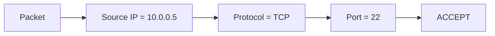

---

# 2.6 Conditions (Match Criteria)

Conditions decide whether a rule matches.

---

## Protocol Match

```bash
-p tcp
```

```bash
-p udp
```

```bash
-p icmp
```

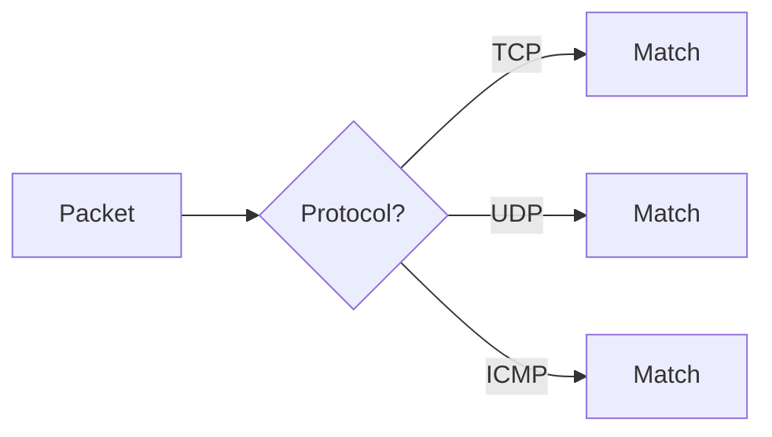

---

## Source Address Match

```bash
-s 192.168.1.10
```

Specific host.

---

```bash
-s 192.168.1.0/24
```

Entire subnet.

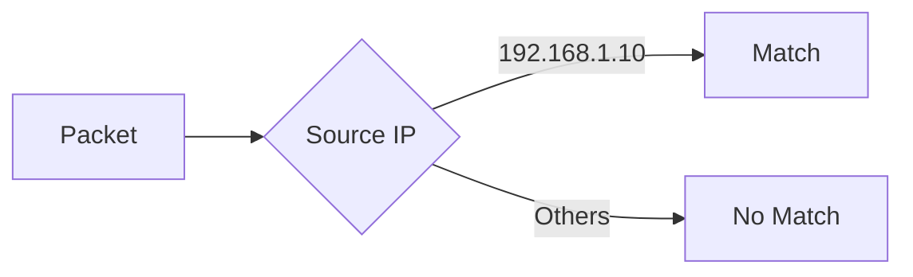

---

## Destination Address Match

```bash
-d 10.10.10.5
```

Example:

```bash
iptables -A OUTPUT -d 8.8.8.8 -j DROP
```

Block traffic to Google DNS.

---

## Incoming Interface Match

```bash
-i eth0
```

Only packets entering via eth0.

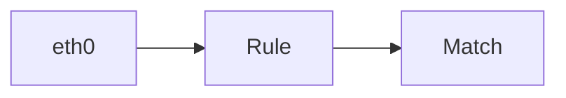

---

## Outgoing Interface Match

```bash
-o eth1
```

Only packets leaving through eth1.

---

## Port Matching

### Source Port

```bash
--sport 53
```

DNS responses.

---

### Destination Port

```bash
--dport 22
```

SSH.

```bash
--dport 80
```

HTTP.

```bash
--dport 443
```

HTTPS.

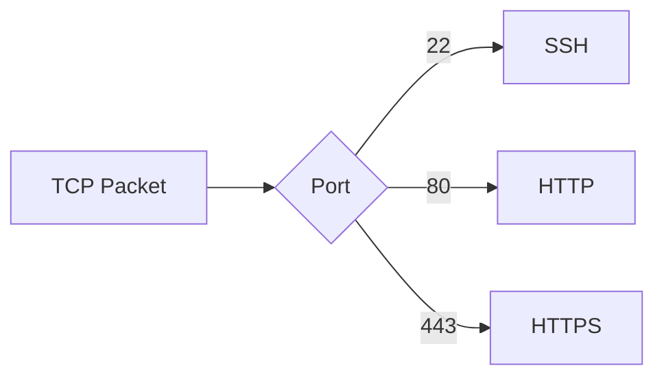

---

# 2.7 Connection States

Netfilter tracks connections.

This is called:

```text
Connection Tracking
```

---

## NEW

First packet of a connection.

Example:

```text
TCP SYN
```

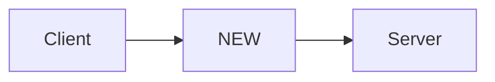

---

## ESTABLISHED

Connection already exists.

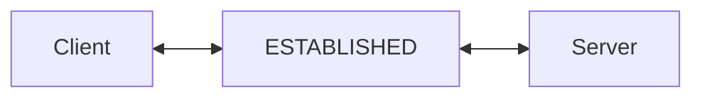

---

## RELATED

New connection related to existing one.

Example:

```text
FTP Control Channel
     ↓
FTP Data Channel
```

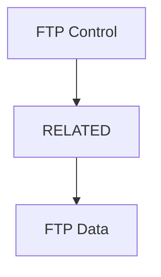

---

## Common Rule

```bash
iptables -A INPUT \
-m state \
--state ESTABLISHED,RELATED \
-j ACCEPT
```

Meaning:

```text
Allow return traffic
Allow related traffic
```

This is one of the most important firewall rules.

---

# 2.8 Negating Conditions

Add:

```bash
!
```

before a condition.

Example:

```bash
iptables -A INPUT ! -p tcp -j DROP
```

Meaning:

```text
If NOT TCP
DROP
```

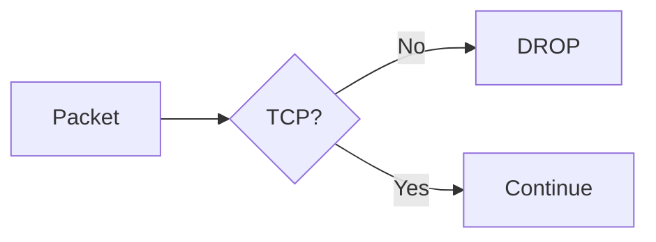

---

# 2.9 Targets (Actions)

Targets determine packet fate.

---

## ACCEPT

Allow packet.

```bash
-j ACCEPT
```

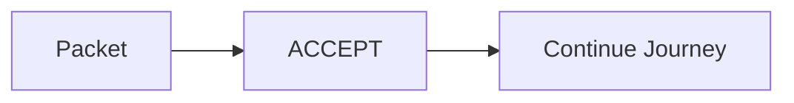

---

## DROP

Silently discard.

```bash
-j DROP
```

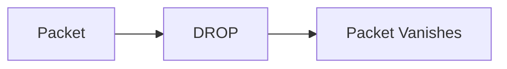

Attacker receives no response.

---

## REJECT

Actively refuse.

```bash
-j REJECT
```

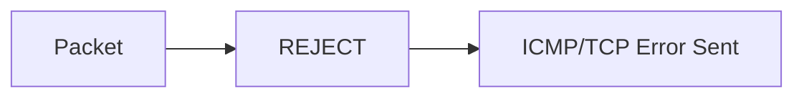

---

## LOG

Log packet.

Processing continues afterward.

```bash
-j LOG
```

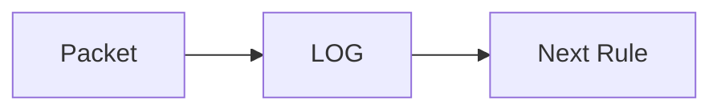

Important:

```text
LOG does NOT stop processing
```

Usually followed by:

```bash
-j DROP
```

or

```bash
-j REJECT
```

---

## RETURN

Return to calling chain.

```bash
-j RETURN
```

```mermaid
flowchart TD

    A["Custom Chain"]

    --> B["RETURN"]

    --> C["Previous Chain"]
```

---

# 2.10 NAT Targets

---

## SNAT

Change source IP.

```mermaid
flowchart LR

    A["192.168.1.10"]

    --> B["SNAT"]

    --> C["203.0.113.10"]
```

---

## DNAT

Change destination IP.

```mermaid
flowchart LR

    A["203.0.113.10"]

    --> B["DNAT"]

    --> C["192.168.1.100"]
```

---

## MASQUERADE

Special SNAT.

Used when public IP changes dynamically.

Common:

```text
Home Router
```

```bash
-j MASQUERADE
```

---

## REDIRECT

Redirect traffic locally.

```mermaid
flowchart LR

    A["Port 80"]

    --> B["REDIRECT"]

    --> C["Proxy Port"]
```

---

# 2.11 Rule Evaluation Example

Rule Set:

```bash
iptables -A INPUT -s 10.0.0.5 -j DROP

iptables -A INPUT -p tcp --dport 22 -j ACCEPT
```

Packet:

```text
Source = 10.0.0.5
Port = 22
```

Processing:

```mermaid
flowchart TD

    A["Packet"]

    --> B["Rule 1 Source=10.0.0.5"]

    B --> C["DROP"]

    C --> D["Stop Processing"]
```

Rule 2 is never reached.

---

# 2.12 Important Principle

Always remember:

```text
iptables is processed
TOP → BOTTOM
```

Therefore:

```text
Specific rules first
General rules later
```

Bad:

```bash
iptables -A INPUT -j DROP

iptables -A INPUT -p tcp --dport 22 -j ACCEPT
```

SSH will never work.

---

# Quick Summary

```mermaid
mindmap
 root[Chains and Rules]
    INPUT
    OUTPUT
    FORWARD
    PREROUTING
    POSTROUTING
    Conditions
      Source
      Destination
      Protocol
      Port
      Interface
      State
    Actions
      ACCEPT
      DROP
      REJECT
      LOG
      RETURN
    NAT
      SNAT
      DNAT
      MASQUERADE
```

---

# Next Section

**3. iptables Commands and Rule Management**

We'll cover:

- `-L`
    
- `-A`
    
- `-I`
    
- `-D`
    
- `-F`
    
- `-P`
    
- `-N`
    
- `-X`
    
- Listing rules
    
- Rule numbering
    
- Creating custom chains
    
- Viewing counters
    
- Practical command examples before building a complete firewall.