# 6. Common Real-World Firewall Scenarios

> Source: Kali Linux Documentation

---

# 6.1 Scenario 1 — Secure SSH Server

## Goal

Allow:

- SSH (22)
    
- Existing connections
    

Block:

- Everything else
    

---

## Rules

```bash
iptables -F

iptables -P INPUT DROP
iptables -P FORWARD DROP
iptables -P OUTPUT ACCEPT

iptables -A INPUT \
-m state \
--state ESTABLISHED,RELATED \
-j ACCEPT

iptables -A INPUT \
-p tcp \
--dport 22 \
-j ACCEPT
```

---

## Packet Flow

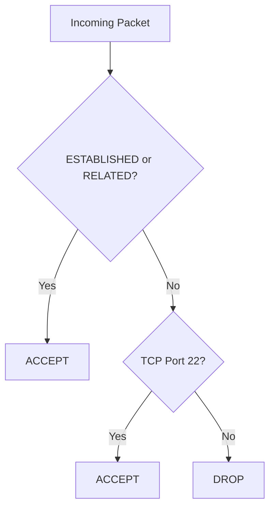

---

## Result

|Service|Status|
|---|---|
|SSH|Allowed|
|HTTP|Blocked|
|HTTPS|Blocked|
|FTP|Blocked|
|Ping|Blocked|

---

# 6.2 Scenario 2 — Web Server

## Goal

Allow:

- SSH
    
- HTTP
    
- HTTPS
    

Block everything else.

---

## Rules

```bash
iptables -F

iptables -P INPUT DROP

iptables -A INPUT \
-m state \
--state ESTABLISHED,RELATED \
-j ACCEPT

iptables -A INPUT \
-p tcp \
--dport 22 \
-j ACCEPT

iptables -A INPUT \
-p tcp \
--dport 80 \
-j ACCEPT

iptables -A INPUT \
-p tcp \
--dport 443 \
-j ACCEPT
```

---

## Flow

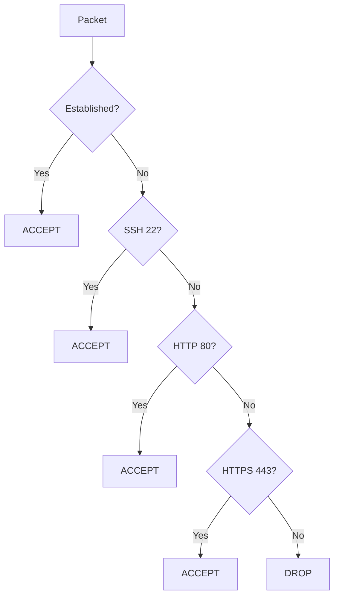

---

# 6.3 Scenario 3 — Restrict SSH to Admin Network

## Goal

Only allow:

```text
192.168.1.0/24
```

to access SSH.

---

## Rules

```bash
iptables -A INPUT \
-s 192.168.1.0/24 \
-p tcp \
--dport 22 \
-j ACCEPT
```

---

## Packet Flow

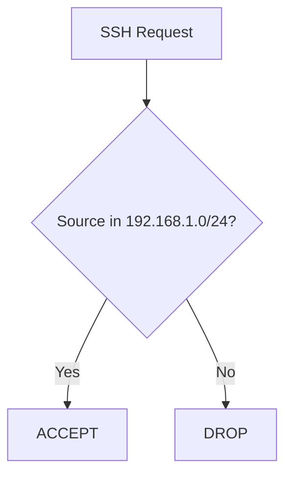

---

## Why?

Instead of:

```text
Entire Internet
```

trying to brute force SSH,

only trusted networks can connect.

---

# 6.4 Scenario 4 — Block a Malicious Host

Suppose:

```text
10.0.1.5
```

is attacking.

---

## Rule

```bash
iptables -A INPUT \
-s 10.0.1.5 \
-j DROP
```

---

## Flow

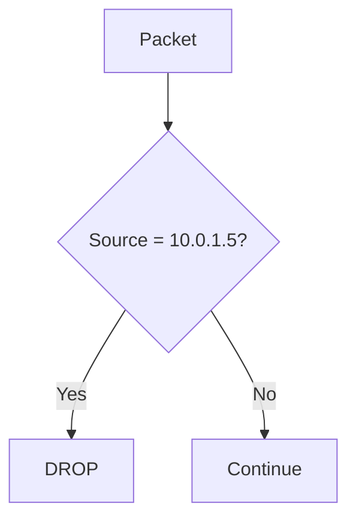

---

# 6.5 Scenario 5 — Block an Entire Subnet

Suppose attacker traffic originates from:

```text
31.13.74.0/24
```

---

## Rule

```bash
iptables -A INPUT \
-s 31.13.74.0/24 \
-j DROP
```

---

## Effect

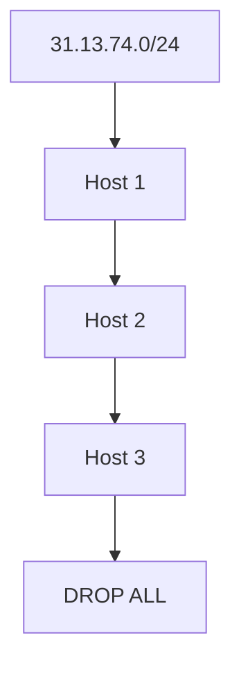

---

# 6.6 Scenario 6 — Allow Internal Network

Allow:

```text
192.168.1.0/24
```

to access server.

---

## Rule

```bash
iptables -A INPUT \
-s 192.168.1.0/24 \
-j ACCEPT
```

---

## Typical Use

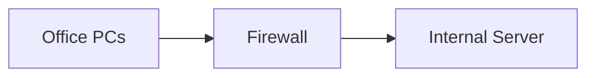

---

# 6.7 Scenario 7 — Home Router NAT

## Goal

Allow LAN devices to use Internet.

---

### Interfaces

```text
eth0 = Internet

eth1 = LAN
```

---

## Forward Traffic

```bash
iptables -A FORWARD -j ACCEPT
```

---

## NAT

```bash
iptables -t nat \
-A POSTROUTING \
-o eth0 \
-j MASQUERADE
```

---

## Flow

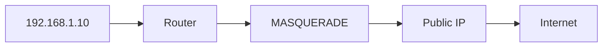

---

# 6.8 Scenario 8 — Internet Sharing

Laptop acting as router.

---

## Example

```text
WiFi --> Internet

Ethernet --> Lab Devices
```

---

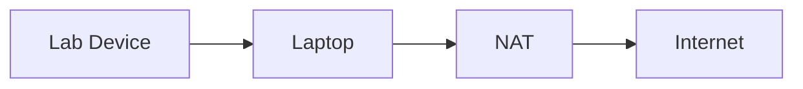

---

## Rules

```bash
iptables -A FORWARD -j ACCEPT

iptables -t nat \
-A POSTROUTING \
-o wlan0 \
-j MASQUERADE
```

---

# 6.9 Scenario 9 — Port Forwarding

Public traffic:

```text
203.0.113.10:80
```

Forward to:

```text
192.168.1.100:80
```

---

## Rule

```bash
iptables -t nat \
-A PREROUTING \
-p tcp \
--dport 80 \
-j DNAT \
--to-destination 192.168.1.100:80
```

---

## Flow

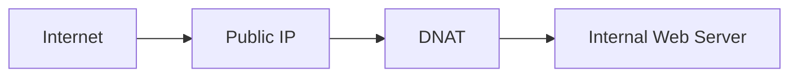

---

# 6.10 Scenario 10 — Transparent Proxy

Intercept web traffic.

---

## Rule

```bash
iptables -t nat \
-A PREROUTING \
-p tcp \
--dport 80 \
-j REDIRECT \
--to-ports 3128
```

---

## Flow

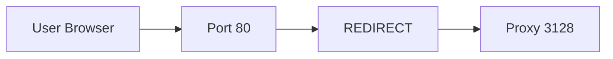

---

# 6.11 Scenario 11 — Log and Drop

Useful for investigations.

---

## Log Rule

```bash
iptables -A INPUT \
-j LOG \
--log-prefix "FW_DROP: "
```

---

## Drop Rule

```bash
iptables -A INPUT \
-j DROP
```

---

## Flow

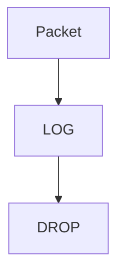

---

## Check Logs

```bash
journalctl -f
```

or

```bash
tail -f /var/log/syslog
```

---

# 6.12 Scenario 12 — Basic DDoS Mitigation

Drop known attackers.

---

## Rule

```bash
iptables -A INPUT \
-s 10.0.1.5 \
-j DROP
```

---

## Multiple Attackers

```bash
iptables -A INPUT \
-s 10.0.1.5 \
-j DROP

iptables -A INPUT \
-s 10.0.1.6 \
-j DROP

iptables -A INPUT \
-s 10.0.1.7 \
-j DROP
```

---

## Better Structure

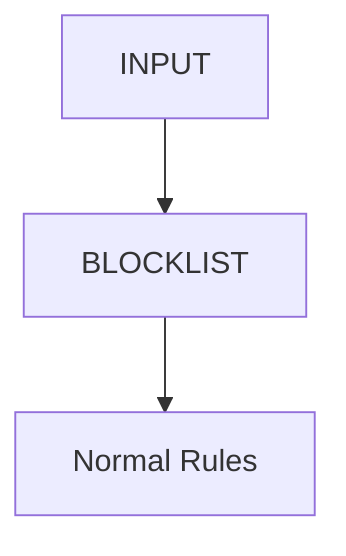

---

### Create Blocklist Chain

```bash
iptables -N BLOCKLIST
```

---

### Send Traffic There

```bash
iptables -A INPUT -j BLOCKLIST
```

---

### Add Attackers

```bash
iptables -A BLOCKLIST \
-s 10.0.1.5 \
-j DROP

iptables -A BLOCKLIST \
-s 10.0.1.6 \
-j DROP
```

---

# 6.13 Scenario 13 — Allow Ping

ICMP.

---

## Rule

```bash
iptables -A INPUT \
-p icmp \
-j ACCEPT
```

---

## Flow

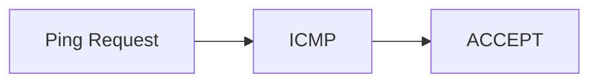

---

# 6.14 Scenario 14 — Block Ping

```bash
iptables -A INPUT \
-p icmp \
-j DROP
```

---

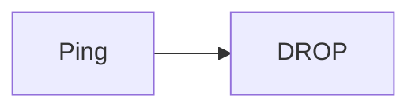

---

# 6.15 Scenario 15 — Production Linux Server

Most common real-world setup.

---

## Rules

```bash
iptables -F

iptables -P INPUT DROP
iptables -P FORWARD DROP
iptables -P OUTPUT ACCEPT

iptables -A INPUT \
-m state \
--state ESTABLISHED,RELATED \
-j ACCEPT

iptables -A INPUT \
-p tcp \
--dport 22 \
-j ACCEPT

iptables -A INPUT \
-p tcp \
--dport 80 \
-j ACCEPT

iptables -A INPUT \
-p tcp \
--dport 443 \
-j ACCEPT

iptables -A INPUT \
-j LOG \
--log-prefix "FW_DROP: "

iptables -A INPUT \
-j DROP
```

---

## Complete Packet Flow

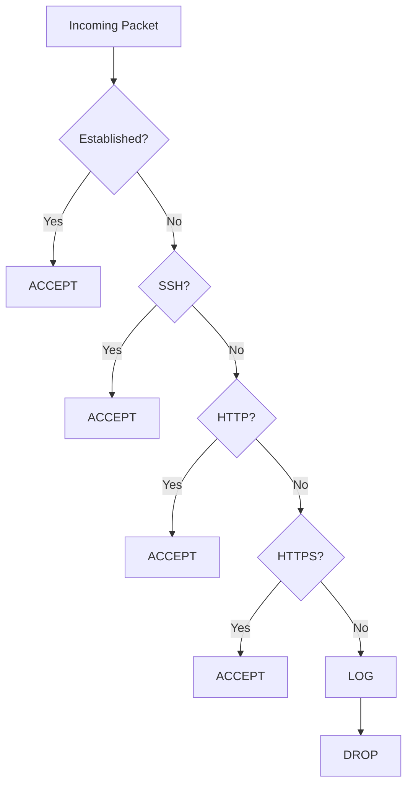

---

# Scenario Selection Cheat Sheet

|Goal|Chain|Table|Action|
|---|---|---|---|
|Allow SSH|INPUT|filter|ACCEPT|
|Allow Web|INPUT|filter|ACCEPT|
|Block IP|INPUT|filter|DROP|
|Block Subnet|INPUT|filter|DROP|
|Allow LAN|INPUT|filter|ACCEPT|
|NAT Internet|POSTROUTING|nat|MASQUERADE|
|Port Forward|PREROUTING|nat|DNAT|
|Transparent Proxy|PREROUTING|nat|REDIRECT|
|Log Traffic|INPUT|filter|LOG|
|Default Block|INPUT|filter|DROP Policy|

---

# Master Mind Map

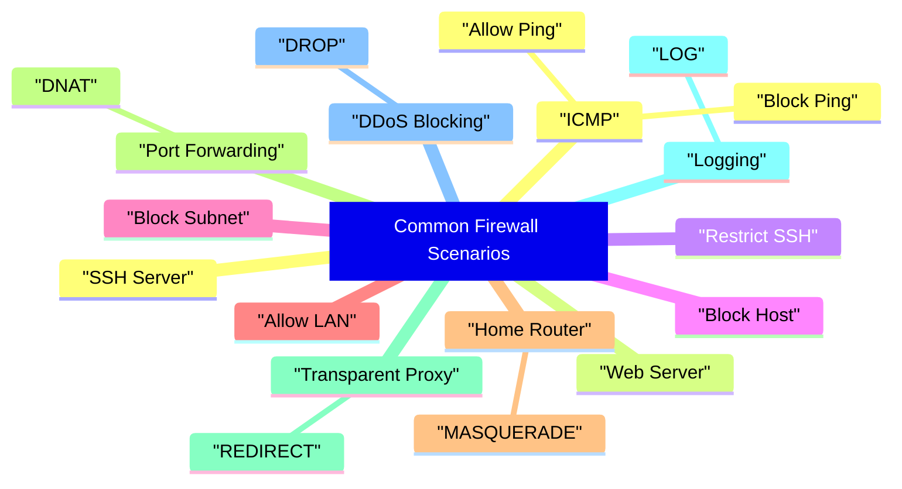

---

# Next Section (Recommended)

**7. Advanced Netfilter Topics**

- Custom Chains in depth
    
- Connection Tracking Internals (`conntrack`)
    
- Stateful Firewall Design
    
- NAT Deep Dive (SNAT vs DNAT vs MASQUERADE)
    
- Packet Traversal through all Tables
    
- Raw Table
    
- Mangle Table
    
- Logging Architecture (`LOG` vs `ULOG`)
    
- ICMP and ICMPv6
    
- IPv6 Firewalling with `ip6tables`
    
- Troubleshooting with `tcpdump`, `conntrack`, and `iptables -v` counters
    

This is where iptables starts becoming the foundation for understanding enterprise firewalls like Cisco ASA, Cisco FTD, Palo Alto, Check Point, and Linux-based security appliances.