# 8. Monitoring, Logging, and File Integrity

> Source: Kali Linux Documentation

---

# 8.1 Why Monitoring Matters

Security is not only about:

- Confidentiality
    
- Integrity
    

It is also about:

- Availability
    

As an administrator, you need to know:

- Is the system healthy?
    
- Is a service failing?
    
- Has a file changed unexpectedly?
    
- Is someone attacking the system?
    
- Is a process consuming too many resources?
    

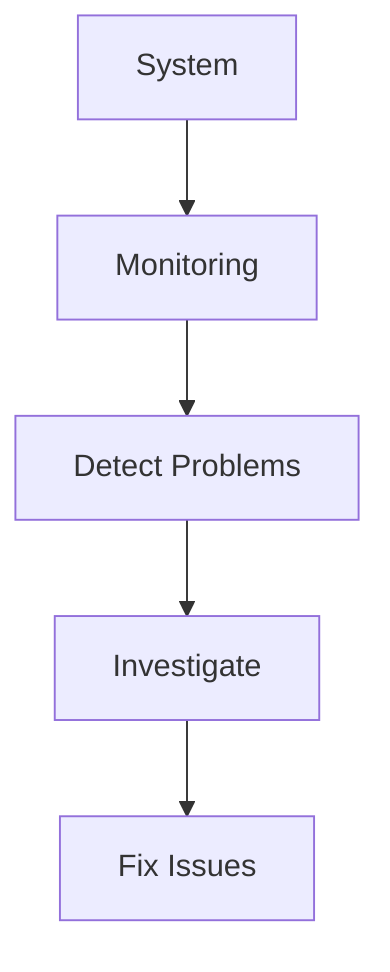

---

# 8.2 Monitoring Categories

Linux monitoring generally falls into three areas:

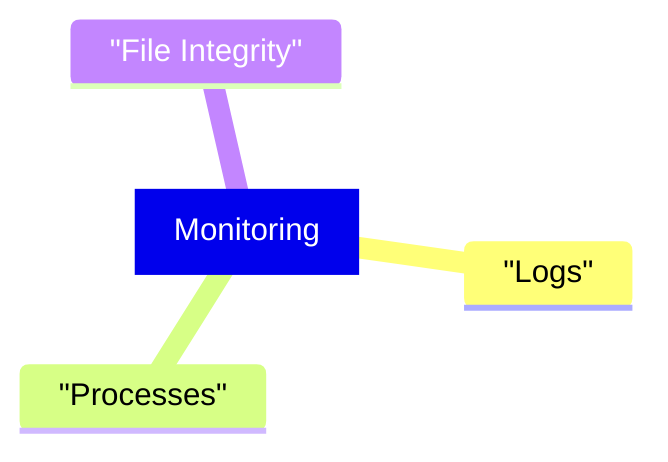

|Area|Purpose|
|---|---|
|Logs|Detect attacks and errors|
|Processes|Detect resource abuse|
|File Integrity|Detect unauthorized modifications|

---

# 8.3 Log Monitoring with Logcheck

## What is Logcheck?

Logcheck automatically reviews system logs and emails suspicious entries to administrators.

Think of it as:

```text
Automated Log Analyst
```

---

## How It Works

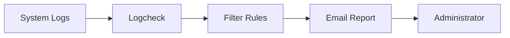

---

## Installation

```bash
apt install logcheck
```

---

## Log Files Monitored

Configuration:

```bash
/etc/logcheck/logcheck.logfiles
```

Contains:

```text
Which log files should be analyzed
```

---

# 8.4 Logcheck Reporting Levels

Logcheck supports different verbosity levels.

---

## Paranoid

Most verbose.

```text
Almost everything is reported
```

Best for:

- Firewalls
    
- Critical servers
    
- Security appliances
    

---

## Server

Default mode.

```text
Good balance between noise and useful alerts
```

Best for:

- Linux servers
    
- Application servers
    

---

## Workstation

Least verbose.

```text
Many messages ignored
```

Best for:

- User desktops
    
- Personal systems
    

---

## Comparison

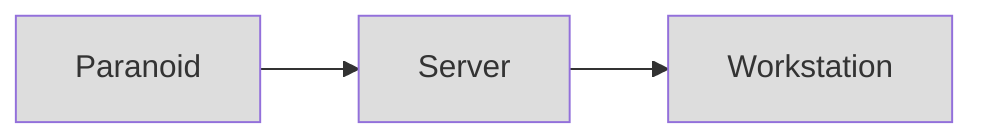

```text
More Messages  -----------------> Fewer Messages
```

---

# 8.5 Understanding Logcheck Rules

Logcheck classifies messages into categories.

---

## Cracking Attempts

Stored in:

```bash
/etc/logcheck/cracking.d/
```

Examples:

- SSH brute force
    
- Password guessing
    
- Login attacks
    

---

## Ignored Cracking Attempts

```bash
/etc/logcheck/cracking.ignore.d/
```

---

## Security Violations

```bash
/etc/logcheck/violations.d/
```

Examples:

- Unauthorized access
    
- Security warnings
    

---

## Ignored Violations

```bash
/etc/logcheck/violations.ignore.d/
```

---

## System Events

Everything else.

Filtered using:

```bash
/etc/logcheck/ignore.d.*
```

---

## Classification Flow

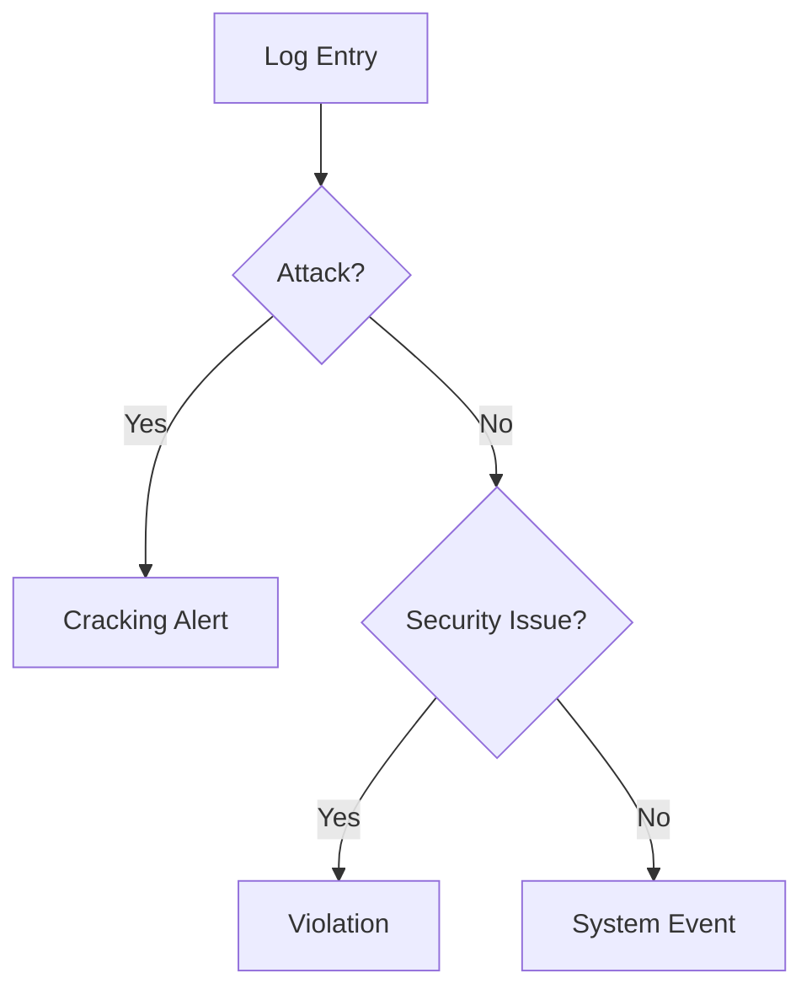

---

# 8.6 Useful Bash Shortcut

The documentation introduces:

```bash
touch file{1,2,3}.txt
```

Equivalent to:

```bash
touch file1.txt file2.txt file3.txt
```

---

## Expansion Process

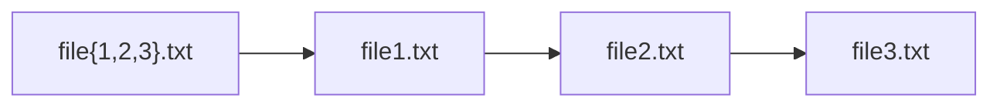

---

# 8.7 Real-Time Monitoring with top

## What is top?

Shows:

- Running processes
    
- CPU usage
    
- Memory usage
    
- Load information
    

Real-time.

---

## Launch

```bash
top
```

---

## View

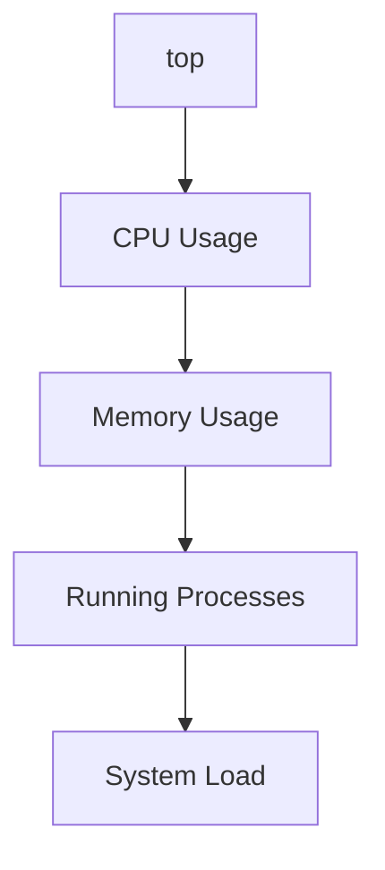

---

# 8.8 Important top Commands

|Key|Function|
|---|---|
|P|Sort by CPU|
|M|Sort by Memory|
|T|Sort by CPU Time|
|N|Sort by PID|
|k|Kill Process|
|r|Change Priority|

---

## Example Investigation

System is slow.

Run:

```bash
top
```

Output:

```text
PID 1234
python
99% CPU
```

Immediately suspicious.

---

## Troubleshooting Flow

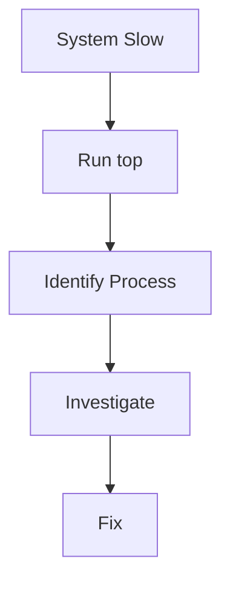

---

# 8.9 GUI Alternatives

## XFCE

```bash
xfce4-taskmanager
```

---

## GNOME

```bash
gnome-system-monitor
```

---

## KDE

```bash
ksysguard
```

---

## Comparison

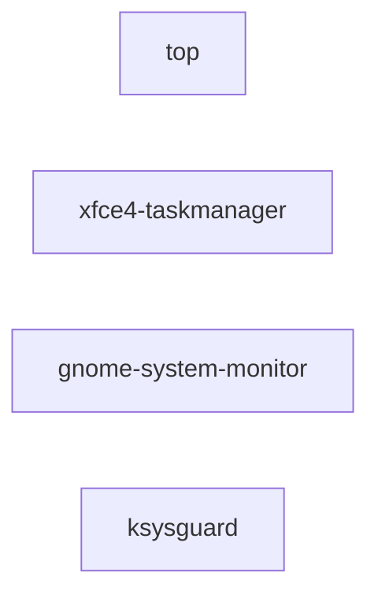

---

# 8.10 Detecting File Changes

After installation, system files rarely change.

Unexpected modifications can indicate:

- Malware
    
- Rootkits
    
- Attackers
    
- Misconfiguration
    

---

## Goal

Detect:

```text
Who changed what?
```

---

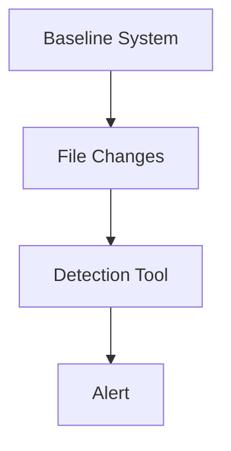

---

# 8.11 dpkg --verify

## Purpose

Verify installed package files.

Command:

```bash
dpkg -V
```

or

```bash
dpkg --verify
```

---

## How It Works

Debian stores checksums.

Location:

```bash
/var/lib/dpkg/info/
```

When files differ:

```text
Verification Failure
```

---

## Example

```bash
dpkg -V
```

Output:

```text
??5?????? /lib/systemd/system/ssh.service
```

---

## Meaning of "5"

```text
Checksum Mismatch
```

File content changed.

---

## Verification Flow

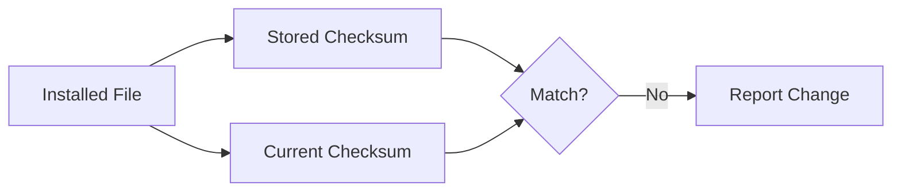

---

# 8.12 What Is a Fingerprint?

A fingerprint is:

```text
A hash of a file
```

Examples:

- MD5
    
- SHA1
    
- SHA256
    

---

## Concept

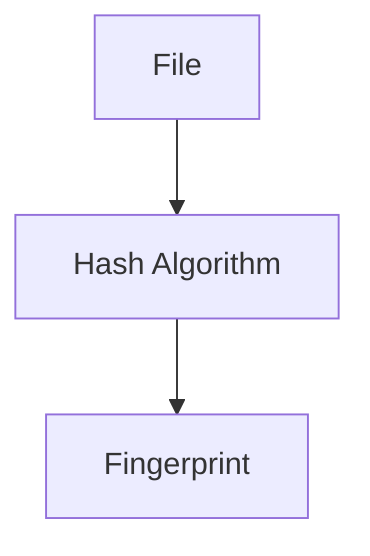

---

## Important Property

Tiny file change:

```text
Huge hash change
```

Called:

```text
Avalanche Effect
```

---

# 8.13 AIDE (Advanced Intrusion Detection Environment)

One of the most important file integrity tools.

---

## Purpose

Detect:

- File modifications
    
- Permission changes
    
- Timestamp changes
    
- New files
    
- Deleted files
    

---

## Installation

```bash
apt update

apt install aide
```

---

# 8.14 AIDE Architecture

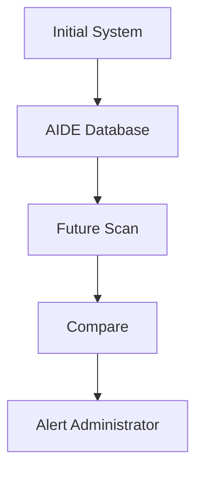

---

# 8.15 Initializing AIDE

Create baseline:

```bash
aideinit
```

Database created:

```bash
/var/lib/aide/aide.db
```

---

# 8.16 Daily Operation

Runs automatically.

```bash
/etc/cron.daily/aide
```

---

Checks:

```text
Current System
      vs
Stored Database
```

---

# 8.17 AIDE Logs

Stored in:

```bash
/var/log/aide/
```

---

## Flow

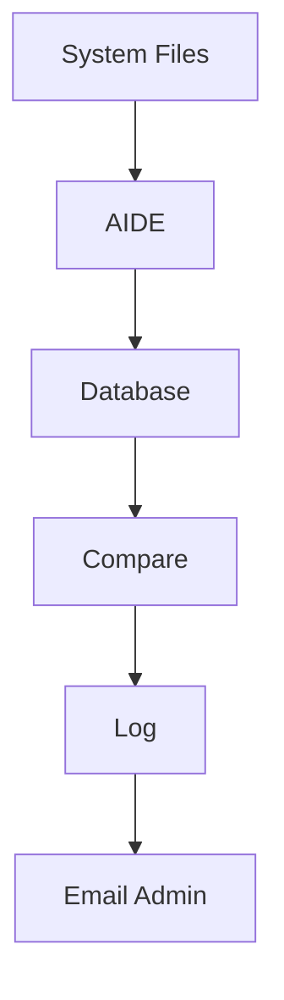

---

# 8.18 Protecting the AIDE Database

Important limitation:

If attacker gains root access:

```text
Attacker can modify database
```

and hide evidence.

---

## Better Practice

Store database on:

- Read-only media
    
- External storage
    
- Secure backup location
    

---

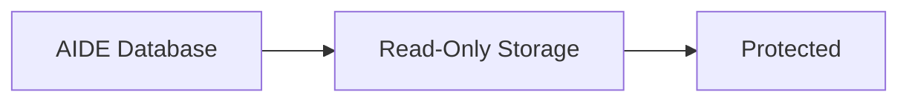

---

# 8.19 AIDE Configuration Files

Main config:

```bash
/etc/aide/aide.conf
```

Additional configs:

```bash
/etc/aide/aide.conf.d/
```

---

# 8.20 Similar Tools

---

## Tripwire

Similar to AIDE.

Additional feature:

```text
Digitally signed configuration
```

---

## Samhain

Provides:

- File monitoring
    
- Rootkit detection
    
- Centralized monitoring
    

---

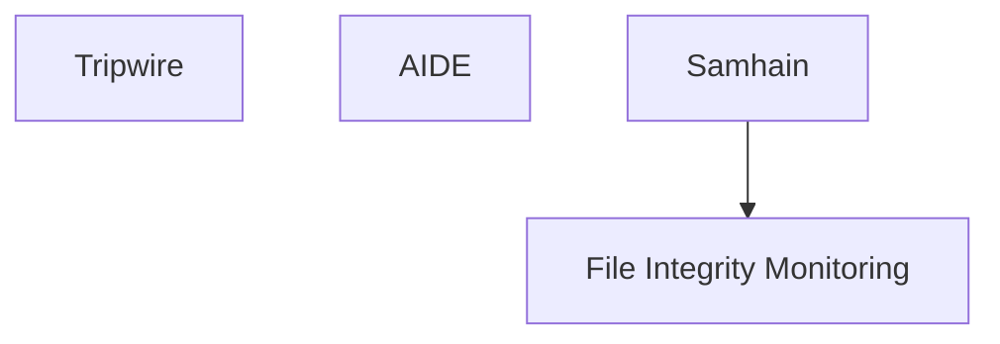

---

# 8.21 Rootkit Detection Tools

---

## chkrootkit

Install:

```bash
apt install chkrootkit
```

Detects known rootkits.

---

## rkhunter

Install:

```bash
apt install rkhunter
```

More extensive rootkit scanning.

---

## Flow

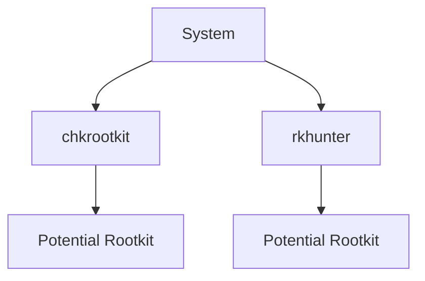

---

# 8.22 checksecurity

Collection of scripts checking:

- Empty passwords
    
- New SUID files
    
- Basic security issues
    

---

## Important

The documentation explicitly warns:

```text
Do not rely solely on checksecurity
```

Use it as one layer of defense.

---

# Final Monitoring Architecture

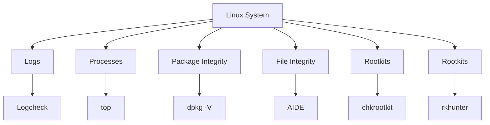

---

# Quick Cheat Sheet

|Tool|Purpose|
|---|---|
|`logcheck`|Analyze logs and email alerts|
|`top`|Real-time process monitoring|
|`dpkg -V`|Verify package files|
|`aide`|File integrity monitoring|
|`tripwire`|Signed file integrity monitoring|
|`samhain`|Centralized integrity monitoring|
|`chkrootkit`|Rootkit detection|
|`rkhunter`|Advanced rootkit detection|
|`checksecurity`|Basic security checks|

Source: Kali Linux Monitoring and Logging chapter