# Netfilter, iptables, and Firewall Fundamentals

> Source: Kali Linux Documentation

---

# 1. What is a Firewall?

A **firewall** examines network packets entering or leaving a system and decides whether to:

- Allow them
    
- Reject them
    
- Drop them
    
- Modify them
    

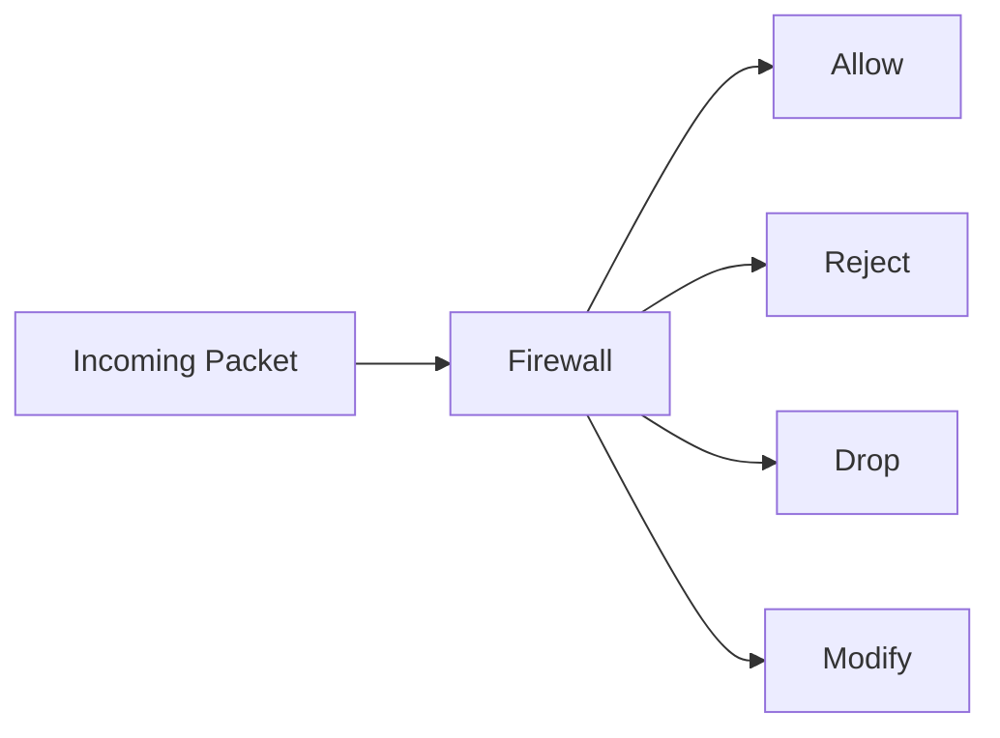

## Types of Firewalls

### Network Firewall

Protects an entire network.

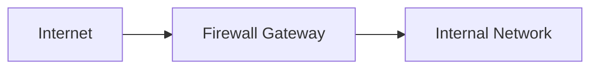

### Local Firewall

Protects a single machine.

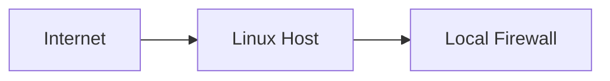

---

# 2. Netfilter Overview

Linux implements firewall functionality through **Netfilter**.

Netfilter is built directly into the Linux kernel.

Users interact with Netfilter using:

|Tool|Purpose|
|---|---|
|`iptables`|IPv4 Firewall|
|`ip6tables`|IPv6 Firewall|
|`fwbuilder`|GUI Firewall Manager|

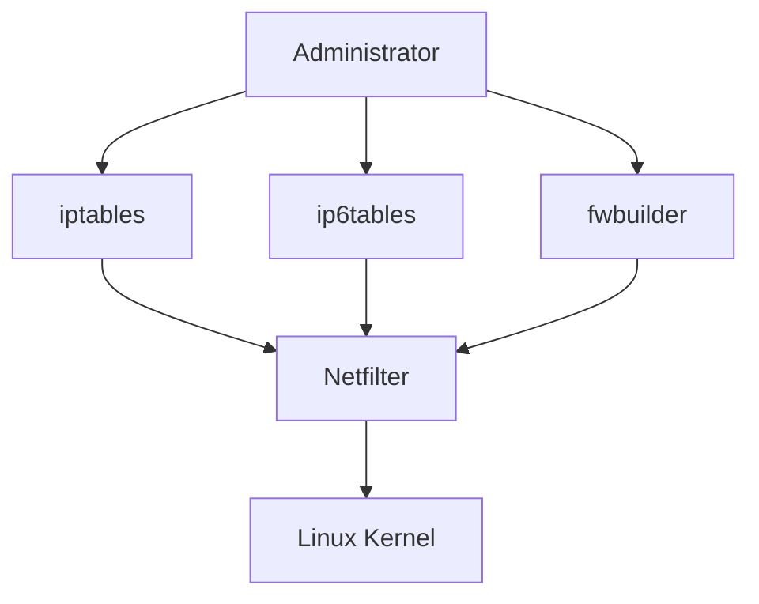

---

# 3. Why Use Netfilter?

Netfilter can:

- Allow traffic
    
- Block traffic
    
- Log traffic
    
- Perform NAT
    
- Modify packets
    
- Redirect traffic
    

Examples:

- Allow SSH
    
- Block attackers
    
- Port forwarding
    
- Transparent proxy
    
- Internet sharing
    

---

# 4. Netfilter Tables

Netfilter organizes rules into **tables**.

Each table serves a different purpose.

---

## 4.1 Filter Table

Used for packet filtering decisions.

Common actions:

- ACCEPT
    
- REJECT
    
- DROP
    

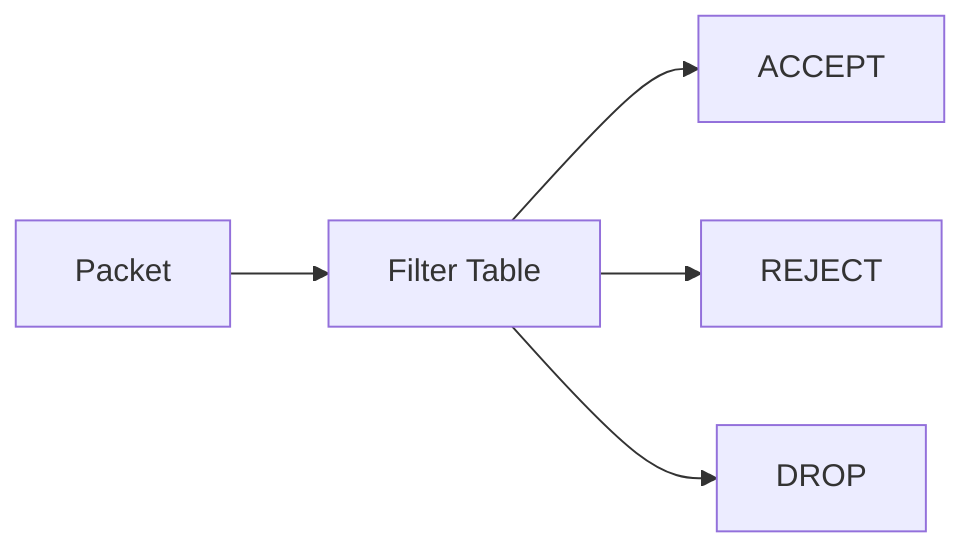

---

## 4.2 NAT Table

Used for Network Address Translation.

Functions:

- Source NAT
    
- Destination NAT
    
- Port Forwarding
    
- Masquerading
    

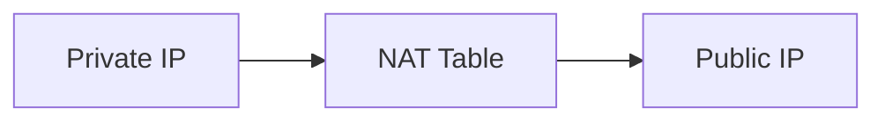

---

## 4.3 Mangle Table

Used to modify packets.

Examples:

- Change ToS
    
- Modify packet headers
    
- Advanced packet manipulation
    

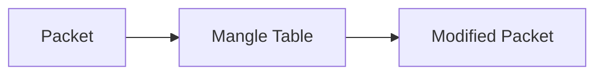

---

## 4.4 Raw Table

Processes packets before connection tracking.

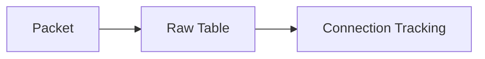

---

# 5. Packet Flow Through Netfilter

A packet can pass through several chains depending on its destination.

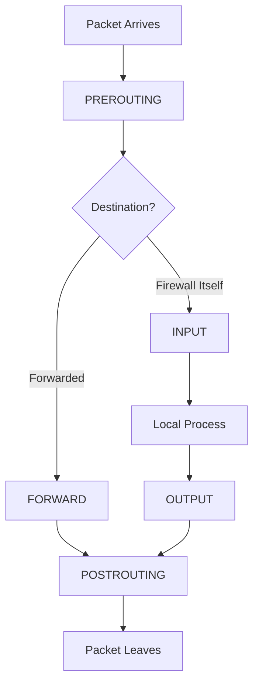

---

# 6. IPv4 vs IPv6

|Command|Protocol|
|---|---|
|`iptables`|IPv4|
|`ip6tables`|IPv6|

Both must usually be configured.

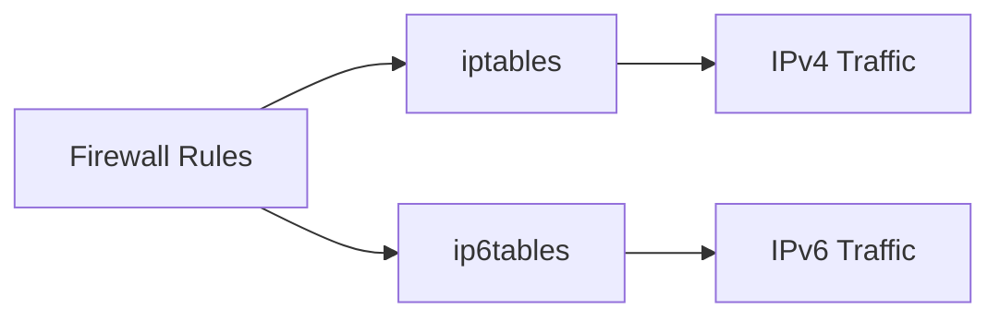

---

# 7. Core Terminology

|Term|Meaning|
|---|---|
|Packet|Unit of network communication|
|Rule|Condition + Action|
|Chain|Ordered list of rules|
|Table|Collection of chains|
|Target|Action performed|
|Policy|Default action if no rule matches|

---

# 8. Rule Processing Logic

Netfilter evaluates rules sequentially.

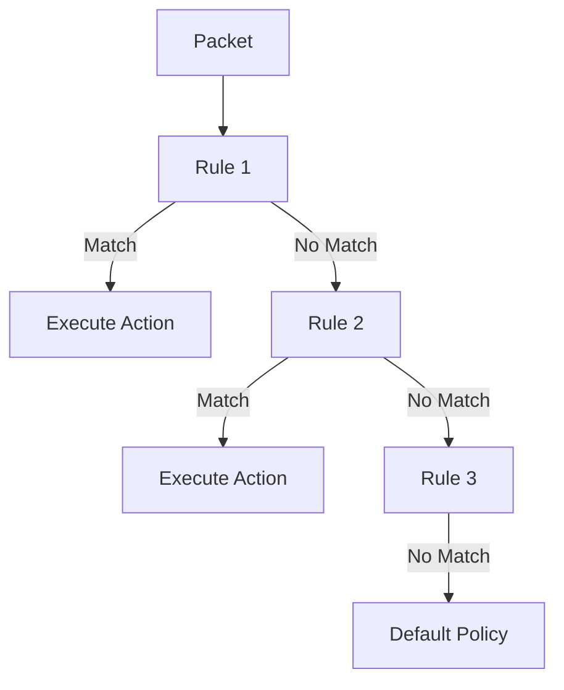

### Important

Rules are processed:

```text
Top → Bottom
```

First matching rule generally determines packet fate.

---

# 9. Default Security Concerns

Kali disables most network services by default.

When enabling services:

### Risks

- No firewall configured by default
    
- Service may listen on all interfaces
    
- Default credentials may exist
    
- Many services run as root
    

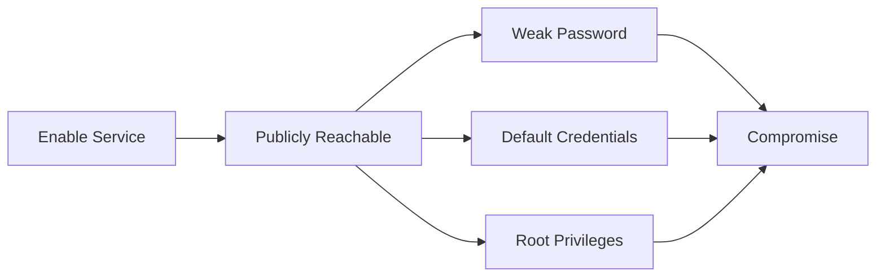

---

# 10. SSH Warning

Before enabling SSH:

1. Change default password.
    
2. Generate new SSH host keys if needed.
    
3. Restrict authentication methods.
    

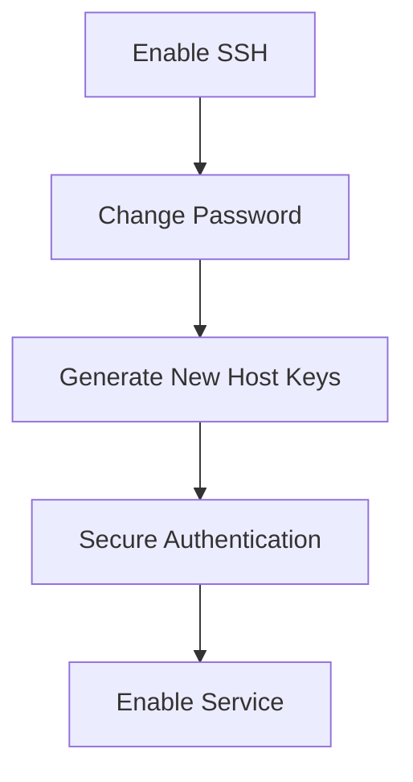

---

# Quick Summary

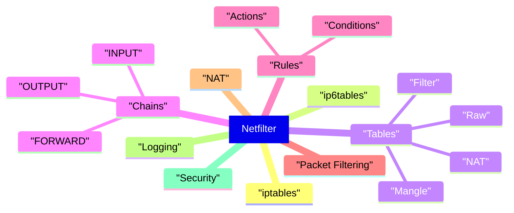

---

# Next Section

**2. Chains, Rules, Conditions, Targets, and iptables Syntax**

We'll cover:

- INPUT / OUTPUT / FORWARD
    
- PREROUTING / POSTROUTING
    
- Rule structure
    
- Conditions (`-s`, `-d`, `-p`, `-i`, `-o`)
    
- Actions (`ACCEPT`, `DROP`, `REJECT`, `LOG`)
    
- Connection states (`NEW`, `ESTABLISHED`, `RELATED`)
    
- Packet traversal examples
    
- Real packet flow diagrams
    
- How iptables actually evaluates rules internally.