# 4. Creating Firewall Rules (Real Rule Building)

> Source: Kali Linux Documentation

---

# 4.1 Firewall Design Philosophy

There are two common approaches:

---

## Allow Everything, Block Some

Default policy:

```bash
iptables -P INPUT ACCEPT
```

Then block unwanted traffic.

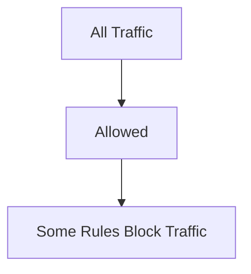

### Problem

If you forget a rule:

```text
Traffic is still allowed
```

Less secure.

---

## Deny Everything, Allow Some

Default policy:

```bash
iptables -P INPUT DROP
```

Then explicitly allow required services.

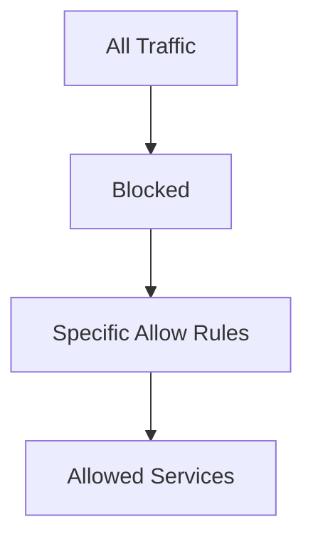

### Advantage

Much safer.

This is the preferred approach.

---

# 4.2 First Rule Every Firewall Needs

Allow existing connections.

```bash
iptables -A INPUT \
-m state \
--state ESTABLISHED,RELATED \
-j ACCEPT
```

Meaning:

```text
Allow replies
Allow related traffic
```

---

## Why?

Without it:

```text
SSH login works
SSH responses blocked
```

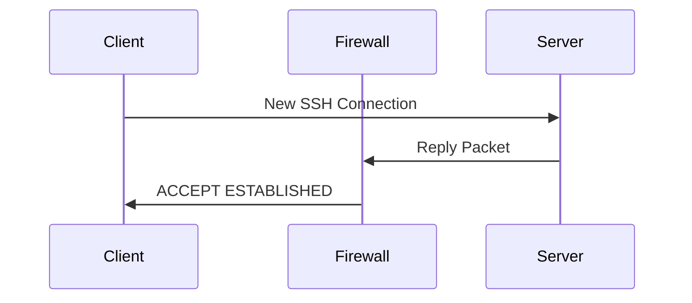

---

# 4.3 Allow SSH

SSH uses:

```text
TCP Port 22
```

Rule:

```bash
iptables -A INPUT \
-m state \
--state NEW \
-p tcp \
--dport 22 \
-j ACCEPT
```

---

## Packet Flow

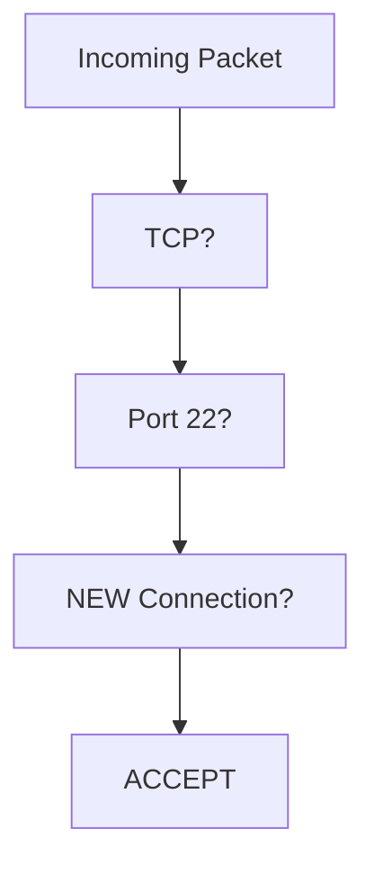

---

# 4.4 Allow Web Traffic

HTTP:

```bash
iptables -A INPUT \
-p tcp \
--dport 80 \
-j ACCEPT
```

HTTPS:

```bash
iptables -A INPUT \
-p tcp \
--dport 443 \
-j ACCEPT
```

---

## Web Server Example

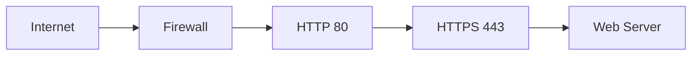

---

# 4.5 Allow IMAP

Mail server example.

Port:

```text
143
```

Rule:

```bash
iptables -A INPUT \
-p tcp \
--dport 143 \
-j ACCEPT
```

---

# 4.6 Block a Specific IP

Example:

```text
10.0.1.5
```

Rule:

```bash
iptables -A INPUT \
-s 10.0.1.5 \
-j DROP
```

Meaning:

```text
Ignore all packets
from 10.0.1.5
```

---

## Packet Flow

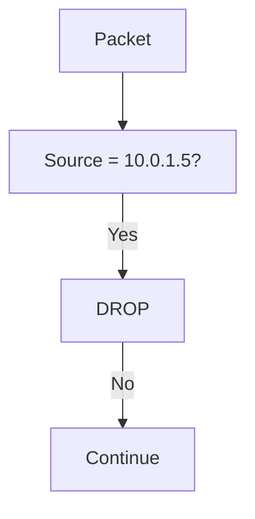

---

# 4.7 Block an Entire Subnet

Example:

```text
31.13.74.0/24
```

Rule:

```bash
iptables -A INPUT \
-s 31.13.74.0/24 \
-j DROP
```

---

## CIDR Explanation

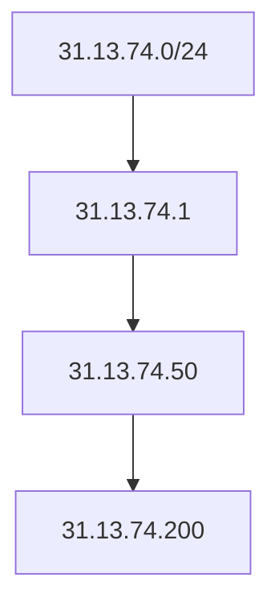

All hosts in that subnet are blocked.

---

# 4.8 Allow Specific Subnet

Allow office network.

```bash
iptables -A INPUT \
-s 192.168.1.0/24 \
-j ACCEPT
```

Meaning:

```text
Any host from office network
may connect
```

---

# 4.9 Restrict SSH to Trusted Network

Bad:

```bash
iptables -A INPUT \
-p tcp \
--dport 22 \
-j ACCEPT
```

Anyone can attempt SSH.

---

Better:

```bash
iptables -A INPUT \
-s 192.168.1.0/24 \
-p tcp \
--dport 22 \
-j ACCEPT
```

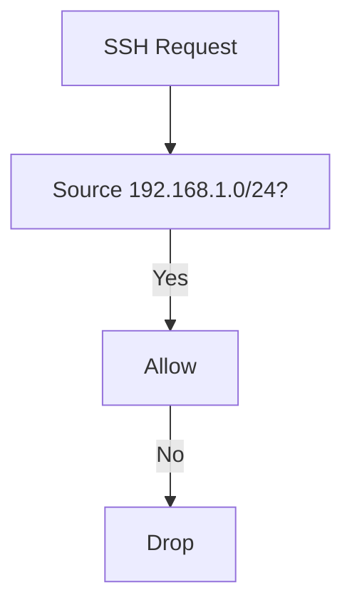

---

# 4.10 Logging Before Blocking

Useful for investigations.

---

## Step 1

Log packet.

```bash
iptables -A INPUT \
-j LOG \
--log-prefix "FW_DROP: "
```

---

## Step 2

Drop packet.

```bash
iptables -A INPUT \
-j DROP
```

---

## Why Two Rules?

LOG does not stop processing.

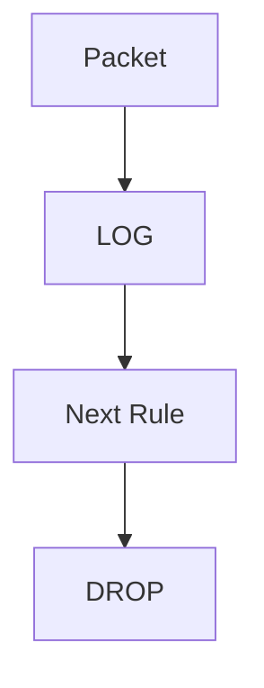

---

# 4.11 Simple Secure Server Firewall

Assume server provides:

- SSH
    
- HTTP
    
- HTTPS
    

---

## Step 1

Flush old rules.

```bash
iptables -F
```

---

## Step 2

Set default policy.

```bash
iptables -P INPUT DROP

iptables -P FORWARD DROP

iptables -P OUTPUT ACCEPT
```

---

## Step 3

Allow existing connections.

```bash
iptables -A INPUT \
-m state \
--state ESTABLISHED,RELATED \
-j ACCEPT
```

---

## Step 4

Allow SSH.

```bash
iptables -A INPUT \
-p tcp \
--dport 22 \
-j ACCEPT
```

---

## Step 5

Allow HTTP.

```bash
iptables -A INPUT \
-p tcp \
--dport 80 \
-j ACCEPT
```

---

## Step 6

Allow HTTPS.

```bash
iptables -A INPUT \
-p tcp \
--dport 443 \
-j ACCEPT
```

---

## Final Logic

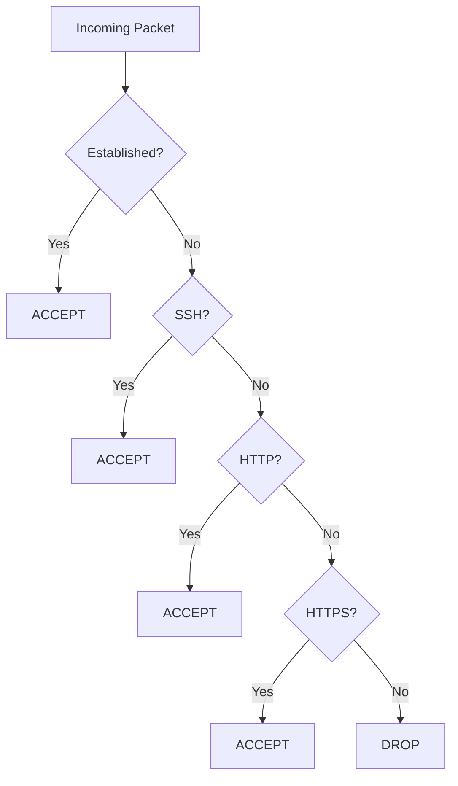

---

# 4.12 Home Router Example

Goal:

- Share Internet
    
- NAT traffic
    

---

## Allow Forwarding

```bash
iptables -A FORWARD -j ACCEPT
```

---

## Enable Masquerading

```bash
iptables -t nat \
-A POSTROUTING \
-o eth0 \
-j MASQUERADE
```

---

## Traffic Flow

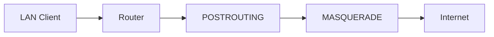

---

# 4.13 Transparent Proxy Example

Redirect web traffic.

```bash
iptables -t nat \
-A PREROUTING \
-p tcp \
--dport 80 \
-j REDIRECT \
--to-ports 3128
```

---

## Flow

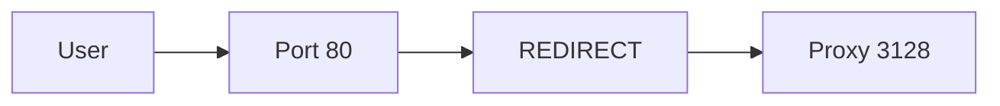

User thinks:

```text
Connected directly to website
```

Reality:

```text
Traffic passes through proxy
```

---

# 4.14 Building Rules Safely

Always:

1. Allow ESTABLISHED first
    
2. Allow management access (SSH)
    
3. Allow required services
    
4. Add logging
    
5. Drop everything else
    

---

## Recommended Structure

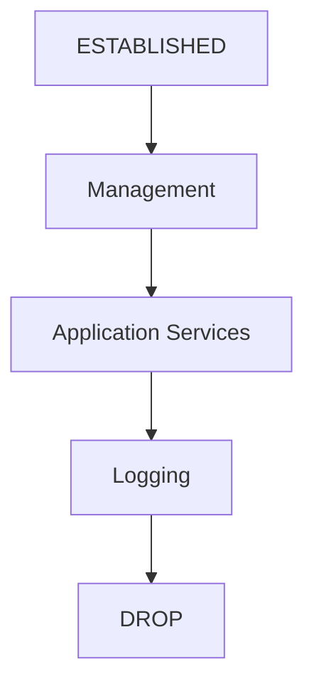

---

# 4.15 Common Beginner Mistakes

---

## Locking Yourself Out

```bash
iptables -P INPUT DROP
```

Before allowing SSH.

Result:

```text
Disconnected immediately
```

---

## Wrong Rule Order

```bash
DROP ALL
ALLOW SSH
```

SSH never reached.

---

## Forgetting ESTABLISHED

```text
Connections start
Replies blocked
```

---

## Logging Everything

```text
Huge log files
Disk fills
Performance impact
```

---

# Example Production Server Ruleset

```bash
iptables -F

iptables -P INPUT DROP
iptables -P FORWARD DROP
iptables -P OUTPUT ACCEPT

iptables -A INPUT \
-m state \
--state ESTABLISHED,RELATED \
-j ACCEPT

iptables -A INPUT \
-p tcp \
--dport 22 \
-j ACCEPT

iptables -A INPUT \
-p tcp \
--dport 80 \
-j ACCEPT

iptables -A INPUT \
-p tcp \
--dport 443 \
-j ACCEPT

iptables -A INPUT \
-j LOG \
--log-prefix "FW_DROP: "

iptables -A INPUT \
-j DROP
```

---

# Mind Map

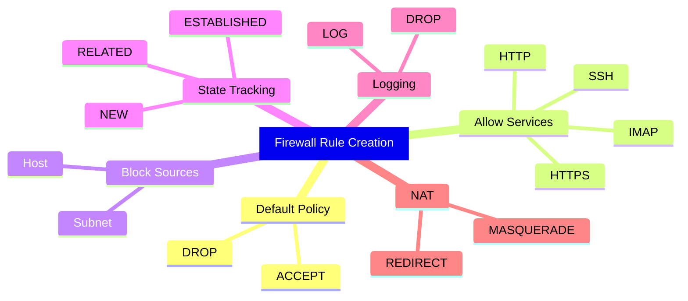

---

# Next Section

**5. Saving Rules and Loading Them Automatically at Boot**

We'll cover:

- Why rules disappear after reboot
    
- `iptables-save`
    
- `iptables-restore`
    
- `iptables-persistent`
    
- Kali/Debian boot persistence
    
- `/etc/network/interfaces` startup scripts (from the book)
    
- NetworkManager and systemd alternatives
    
- Backing up and restoring firewall configurations.