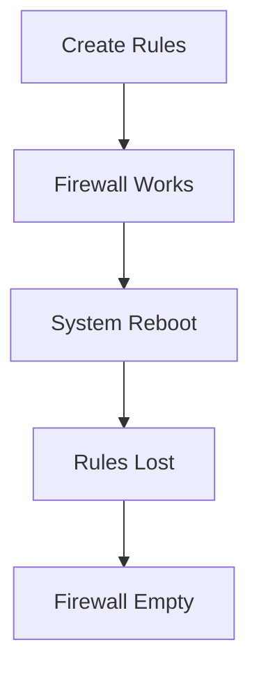
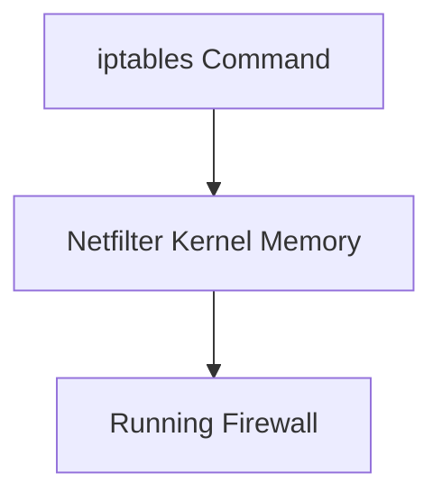
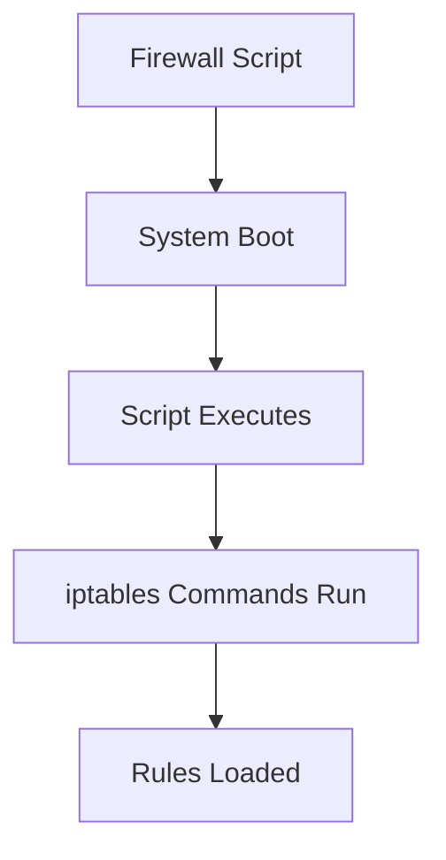
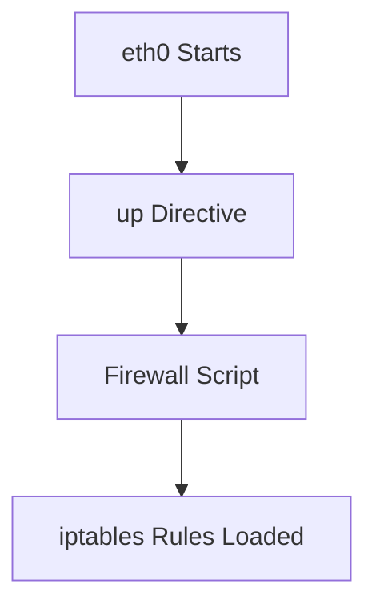
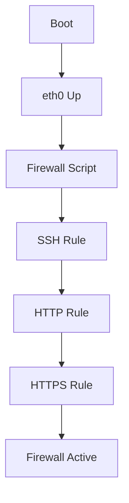
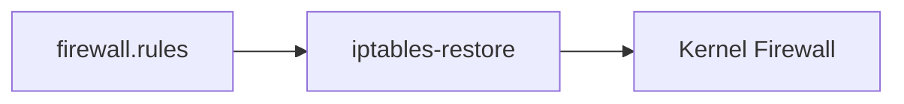
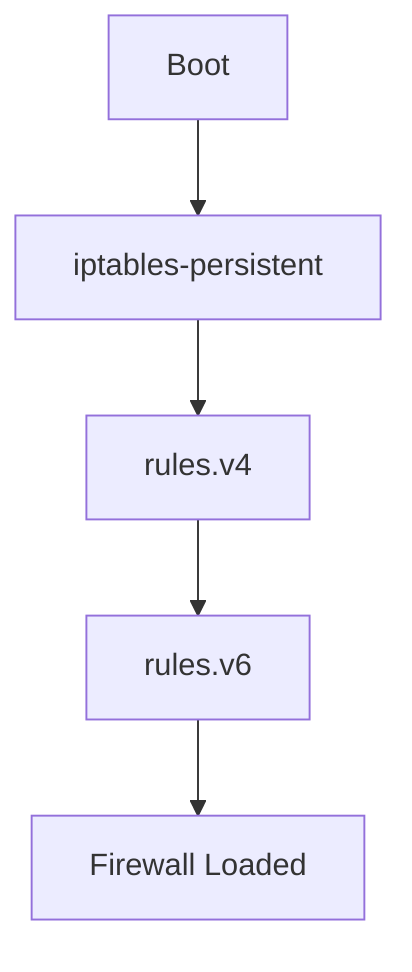
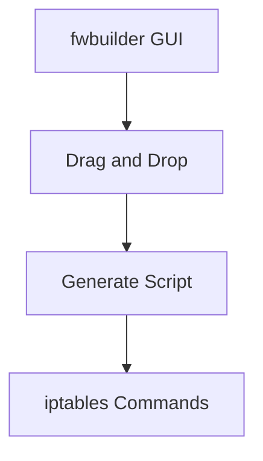
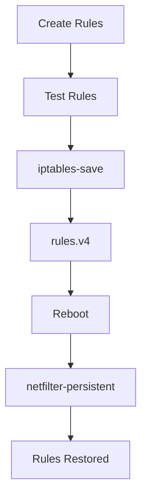
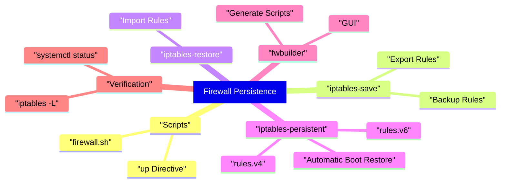

# 5. Saving Rules and Loading Them Automatically at Boot

> Source: Kali Linux Documentation

---

# 5.1 The Big Problem

When you create rules:

```bash
iptables -A INPUT -p tcp --dport 22 -j ACCEPT
```

The rule exists only in memory.

After reboot:

```text
All rules are lost
```



---

# 5.2 Why Rules Disappear

iptables modifies the running kernel firewall.



Rules are NOT automatically written to disk.

Think of it like:

```text
Running Configuration
```

instead of:

```text
Startup Configuration
```

(Cisco analogy)

---

# 5.3 Common Persistence Methods

Several methods exist.

|Method|Recommended|
|---|---|
|Firewall Script|Yes|
|iptables-save|Yes|
|iptables-restore|Yes|
|iptables-persistent|Yes|
|fwbuilder|Yes|
|Manual Commands|No|

---

# 5.4 Method 1: Firewall Script

The Kali documentation primarily discusses storing firewall commands in a script.

Example:

```bash
#!/bin/bash

iptables -F

iptables -P INPUT DROP
iptables -P FORWARD DROP
iptables -P OUTPUT ACCEPT

iptables -A INPUT \
-m state \
--state ESTABLISHED,RELATED \
-j ACCEPT

iptables -A INPUT \
-p tcp \
--dport 22 \
-j ACCEPT

iptables -A INPUT \
-p tcp \
--dport 80 \
-j ACCEPT

iptables -A INPUT \
-p tcp \
--dport 443 \
-j ACCEPT
```

Save:

```bash
/usr/local/etc/firewall.sh
```

Make executable:

```bash
chmod +x /usr/local/etc/firewall.sh
```

---

# 5.5 Firewall Script Workflow



---

# 5.6 Kali Documentation Method

Using:

```text
/etc/network/interfaces
```

You can execute a script when an interface comes up.

Example from the documentation:

```bash
auto eth0

iface eth0 inet static

    address 192.168.0.1
    network 192.168.0.0
    netmask 255.255.255.0
    broadcast 192.168.0.255

    up /usr/local/etc/arrakis.fw
```

---

## What Happens?



---

# 5.7 Understanding the "up" Directive

The important line:

```bash
up /usr/local/etc/arrakis.fw
```

Means:

```text
When interface becomes active
run this script
```

Equivalent logic:

```text
Interface Up
      ↓
Execute Firewall Script
      ↓
Apply Rules
```

---

# 5.8 Example Production Setup

Interface file:

```bash
auto eth0

iface eth0 inet dhcp

    up /usr/local/etc/firewall.sh
```

Firewall file:

```bash
/usr/local/etc/firewall.sh
```



---

# 5.9 Using iptables-save

Display current rules:

```bash
iptables-save
```

Example output:

```text
*filter

:INPUT DROP

:FORWARD DROP

:OUTPUT ACCEPT

-A INPUT -p tcp --dport 22 -j ACCEPT

COMMIT
```

---

## Save To File

```bash
iptables-save > firewall.rules
```

Now rules are stored permanently.


---

# 5.10 Using iptables-restore

Restore saved rules.

```bash
iptables-restore < firewall.rules
```



---

# 5.11 Backup and Recovery

Create backup:

```bash
iptables-save > backup.rules
```

Restore:

```bash
iptables-restore < backup.rules
```

Useful before major firewall changes.

---

# 5.12 iptables-persistent (Debian/Kali)

Most administrators use:

```bash
apt install iptables-persistent
```

During installation:

```text
Save current IPv4 rules?
Save current IPv6 rules?
```

Answer:

```text
Yes
```

---

## Where Rules Are Stored

IPv4:

```bash
/etc/iptables/rules.v4
```

IPv6:

```bash
/etc/iptables/rules.v6
```

---

## Save Current Rules

```bash
iptables-save > /etc/iptables/rules.v4
```

IPv6:

```bash
ip6tables-save > /etc/iptables/rules.v6
```

---

## Boot Process



---

# 5.13 Using fwbuilder

The documentation also mentions:

```bash
apt install fwbuilder
```

---

## What fwbuilder Does

You create:

- Networks
    
- Servers
    
- Services
    
- Firewall rules
    

using a GUI.



---

## Advantages

- Easier management
    
- Visual rule editing
    
- Generates scripts automatically
    
- Supports multiple firewall platforms
    

---

# 5.14 NetworkManager Users

The Kali book notes:

```text
If you use NetworkManager,
refer to its documentation
for startup scripts.
```

Reason:

```text
/etc/network/interfaces
```

may not manage your interfaces.

---

# 5.15 systemd-networkd Users

Same principle.

```text
Interface Up
     ↓
Run Script
     ↓
Apply Rules
```

But implementation differs.

---

# 5.16 Verify Rules After Boot

Always check:

```bash
iptables -L -n -v
```

Example:

```text
Chain INPUT (policy DROP)

ACCEPT tcp dpt:22

ACCEPT tcp dpt:80

ACCEPT tcp dpt:443
```

---

# 5.17 Troubleshooting Persistence

---

## Script Not Executing

Check:

```bash
chmod +x firewall.sh
```

---

## Wrong Path

Verify:

```bash
ls -l /usr/local/etc/firewall.sh
```

---

## Syntax Errors

Run manually:

```bash
bash -x firewall.sh
```

---

## Rules Not Loaded

Check:

```bash
iptables -L
```

---

# 5.18 Recommended Modern Kali Approach

For most Kali/Debian systems:

Install:

```bash
apt install iptables-persistent
```

Save:

```bash
iptables-save > /etc/iptables/rules.v4
```

Verify:

```bash
systemctl status netfilter-persistent
```

This is generally simpler than maintaining large startup scripts.

---

# Production Workflow



---

# Common Persistence Methods Comparison

|Method|Difficulty|Recommended|
|---|---|---|
|Manual Commands|Easy|No|
|Startup Script|Medium|Yes|
|iptables-save/restore|Medium|Yes|
|iptables-persistent|Easy|Yes|
|fwbuilder|Medium|Yes for GUI users|

---

# Mind Map



---

# Next Section

**6. Common Real-World Firewall Scenarios**

We'll build complete examples for:

- SSH server
    
- Web server
    
- Kali workstation
    
- Home router with NAT
    
- VPN gateway
    
- Transparent proxy
    
- DDoS/IP blocking
    
- Logging and monitoring
    
- Port forwarding (DNAT)
    
- Internet sharing (MASQUERADE)
    
- Beginner-to-production firewall templates with packet-flow diagrams.