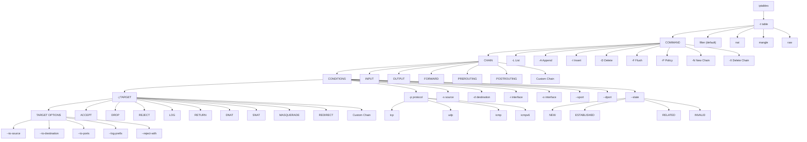
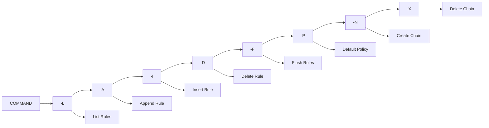
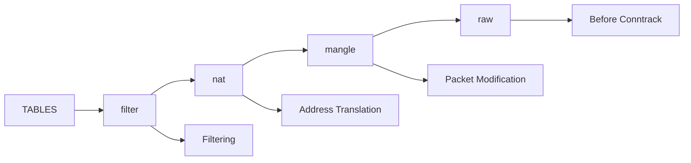
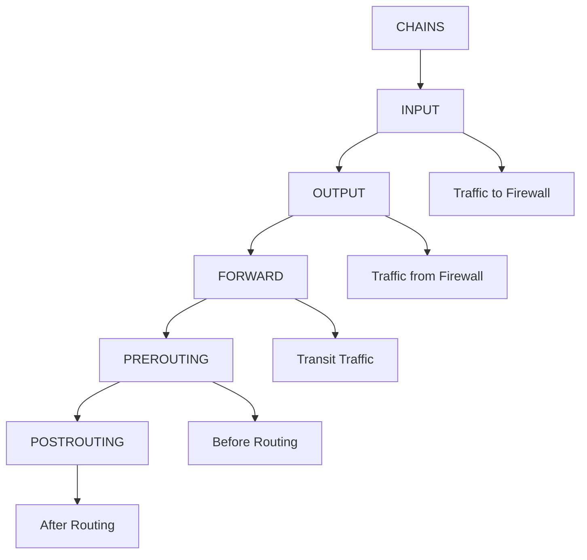
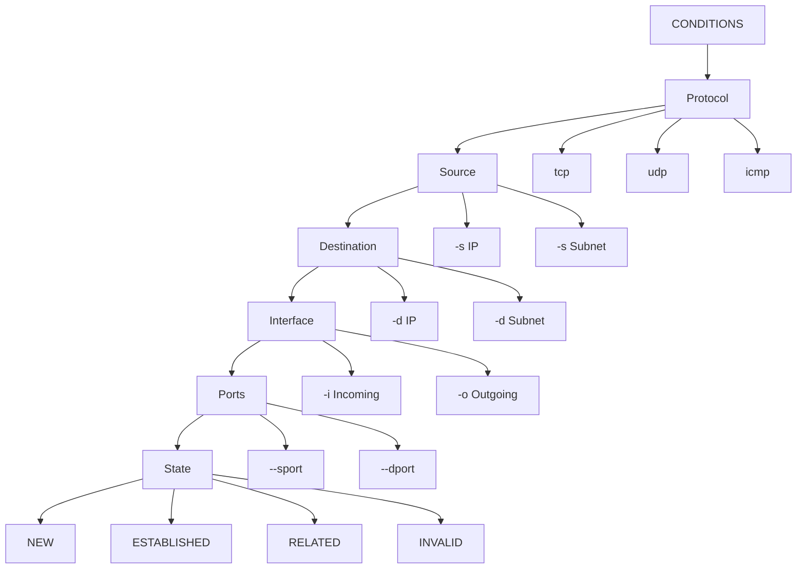
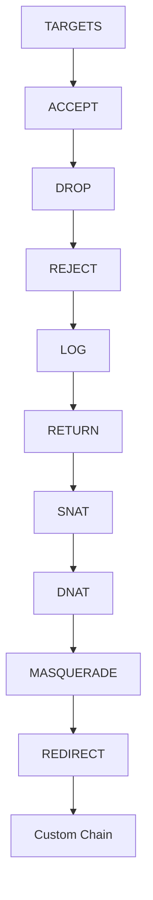
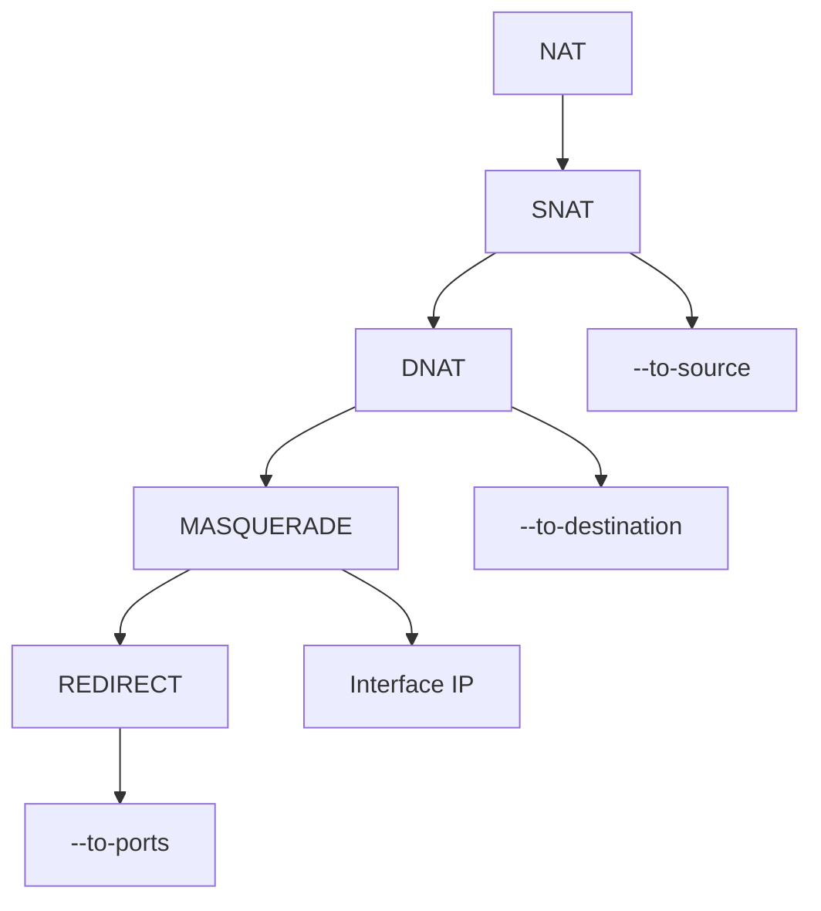

For Obsidian, I'd make it as a **reference tree** rather than a packet-flow diagram.

For Obsidian, I'd make it as a **reference tree** rather than a packet-flow diagram.

```
# iptables Command Syntax Reference

## Generic Syntax
```
iptables
    [-t table]
    COMMAND
    CHAIN
    CONDITIONS
    [-j TARGET]
    [TARGET_OPTIONS]
```
```

Example:

```bash
iptables -A INPUT -p tcp --dport 22 -j ACCEPT
```

---

## Complete iptables Structure



---

# COMMAND Reference



---

# TABLE Reference



---

# CHAIN Reference



---

# CONDITION Reference



---

# TARGET Reference



---

# NAT-Specific Syntax



---

# Real Command Formula

```text
iptables
-t <table>
<command>
<chain>
<conditions>
-j <target>
<target-options>
```

Examples:

```bash
iptables -A INPUT -p tcp --dport 22 -j ACCEPT

iptables -A INPUT -s 10.0.0.5 -j DROP

iptables -t nat -A POSTROUTING -o eth0 -j MASQUERADE

iptables -t nat -A PREROUTING -p tcp --dport 80 \
-j DNAT --to-destination 192.168.1.100:80
```

This becomes a complete "iptables grammar tree" that you can keep beside your notes and use as a cheat sheet while learning.
