# 3. iptables Commands and Rule Management

> Source: Kali Linux Documentation

---

# 3.1 How iptables Works

When you run an `iptables` command, you are modifying:

- Tables
    
- Chains
    
- Rules
    
- Policies
    

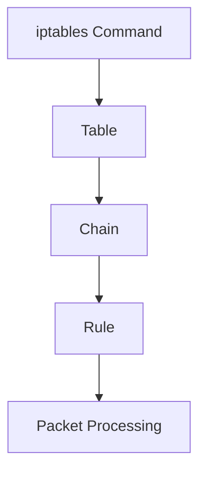

---

# 3.2 General Command Structure

```bash
iptables [command] [chain] [conditions] -j [action]
```

Example:

```bash
iptables -A INPUT -p tcp --dport 22 -j ACCEPT
```

Meaning:

```text
Append a rule
to INPUT chain
for TCP port 22
and ACCEPT traffic
```

---

# 3.3 Listing Rules (-L)

Display rules.

```bash
iptables -L
```

Example:

```bash
iptables -L INPUT
```

Output:

```text
Chain INPUT (policy ACCEPT)

target     prot  source      destination

ACCEPT     tcp   anywhere    anywhere
DROP       all   10.0.0.5    anywhere
```

---

## Numeric Output (-n)

Avoid DNS lookups.

```bash
iptables -n -L
```

Faster and clearer.

Instead of:

```text
google.com
```

You'll see:

```text
8.8.8.8
```

---

## Verbose Output (-v)

Show counters.

```bash
iptables -L -v
```

Displays:

- Packets matched
    
- Bytes matched
    
- Interface info
    

```text
pkts bytes target
1500 2M ACCEPT
```

---

## Rule Numbers

```bash
iptables -L --line-numbers
```

Example:

```text
num target prot source

1   DROP   all  10.0.0.5
2   ACCEPT tcp  anywhere
3   ACCEPT udp  anywhere
```

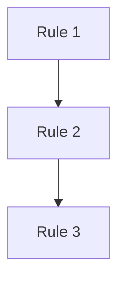

Useful for deleting rules.

---

# 3.4 Adding Rules (-A)

Append rule at end of chain.

```bash
iptables -A INPUT -p tcp --dport 22 -j ACCEPT
```

Flow:

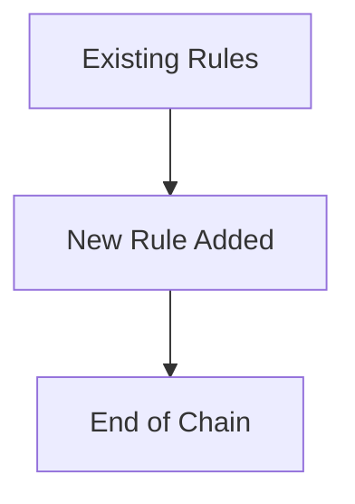

---

## Example

Allow SSH:

```bash
iptables -A INPUT -p tcp --dport 22 -j ACCEPT
```

Allow HTTP:

```bash
iptables -A INPUT -p tcp --dport 80 -j ACCEPT
```

Allow HTTPS:

```bash
iptables -A INPUT -p tcp --dport 443 -j ACCEPT
```

---

# 3.5 Inserting Rules (-I)

Insert rule at specific position.

Syntax:

```bash
iptables -I chain position rule
```

Example:

```bash
iptables -I INPUT 1 -s 10.0.0.5 -j DROP
```

Meaning:

```text
Insert rule as Rule #1
```

Before:

```text
1 ACCEPT SSH
2 ACCEPT HTTP
```

After:

```text
1 DROP 10.0.0.5
2 ACCEPT SSH
3 ACCEPT HTTP
```

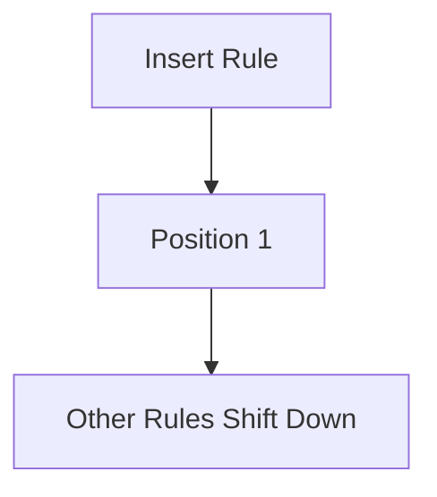

---

# 3.6 Deleting Rules (-D)

Two methods exist.

---

## Delete By Number

View numbering:

```bash
iptables -L --line-numbers
```

Delete:

```bash
iptables -D INPUT 2
```

Removes rule #2.

---

## Delete By Rule Content

```bash
iptables -D INPUT -s 10.0.0.5 -j DROP
```

iptables searches for matching rule and removes it.

---

### Important

Deleting renumbers rules.

Before:

```text
1 DROP
2 ACCEPT
3 ACCEPT
```

Delete rule 1:

```text
1 ACCEPT
2 ACCEPT
```

---

# 3.7 Flushing Rules (-F)

Remove all rules from chain.

```bash
iptables -F INPUT
```

Flush only INPUT.

---

Flush everything:

```bash
iptables -F
```

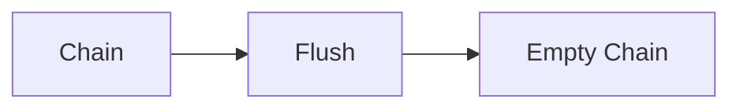

---

### Common Mistake

Flushing does NOT delete:

- Chains
    
- Policies
    

Only rules.

---

# 3.8 Default Policies (-P)

Policy is used when no rule matches.

---

## View Policy

```bash
iptables -L
```

Example:

```text
Chain INPUT (policy ACCEPT)
```

---

## Set Policy

Allow all:

```bash
iptables -P INPUT ACCEPT
```

Drop all:

```bash
iptables -P INPUT DROP
```

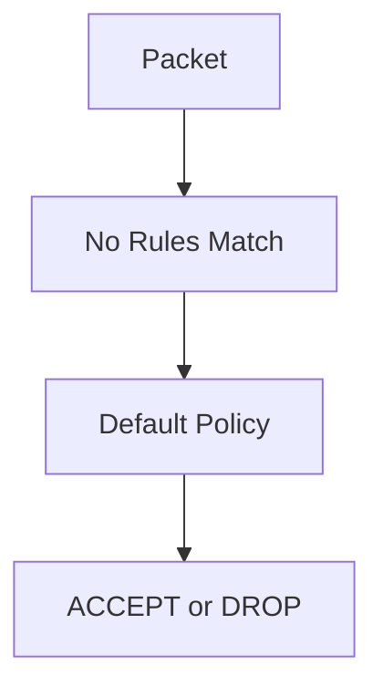

---

## Secure Firewall Model

Usually:

```bash
iptables -P INPUT DROP

iptables -P FORWARD DROP

iptables -P OUTPUT ACCEPT
```

Meaning:

```text
Block everything inbound

Allow only explicit rules

Allow outbound traffic
```

---

# 3.9 Creating Custom Chains (-N)

Create a chain.

```bash
iptables -N SSH_FILTER
```

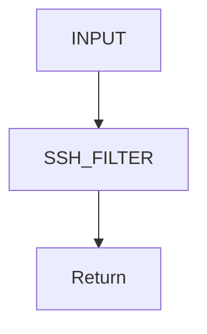

---

## Why Custom Chains?

Benefits:

- Cleaner rules
    
- Easier troubleshooting
    
- Reusable logic
    

Example:

```text
INPUT
 ├── SSH Rules
 ├── Web Rules
 └── VPN Rules
```

Can become:

```text
INPUT
 ├── SSH_CHAIN
 ├── WEB_CHAIN
 └── VPN_CHAIN
```

---

# 3.10 Jumping To Chains

Use chain name as target.

```bash
iptables -A INPUT -p tcp --dport 22 -j SSH_FILTER
```

Packet flow:

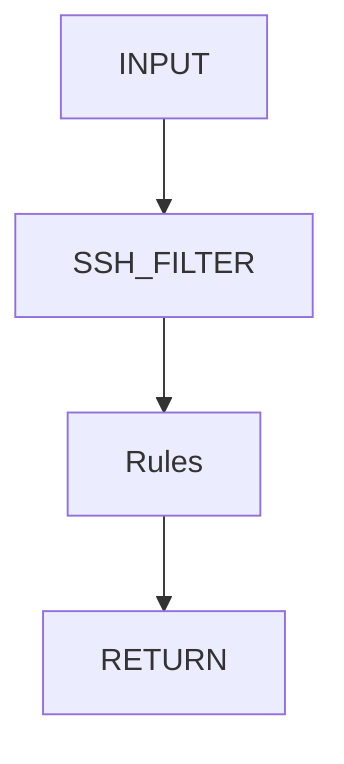

---

# 3.11 Deleting Custom Chains (-X)

Delete unused chain.

```bash
iptables -X SSH_FILTER
```

Requirements:

- Empty chain
    
- No references
    

Otherwise:

```text
Device or resource busy
```

---

# 3.12 RETURN Action

Returns processing to previous chain.

Example:

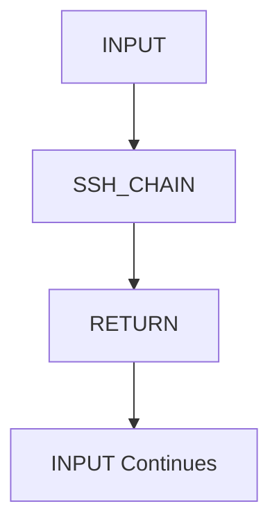

---

# 3.13 Viewing Packet Counters

Very useful for troubleshooting.

```bash
iptables -L -v -n
```

Example:

```text
pkts bytes target

100  12000 ACCEPT
50   4000  DROP
```

Meaning:

```text
100 packets matched ACCEPT

50 packets matched DROP
```

---

# 3.14 Common Administrative Commands

---

## Show All Rules

```bash
iptables -L -n -v
```

---

## Show INPUT Chain

```bash
iptables -L INPUT
```

---

## Show Rule Numbers

```bash
iptables -L --line-numbers
```

---

## Flush Everything

```bash
iptables -F
```

---

## Set Default Drop

```bash
iptables -P INPUT DROP
```

---

## Create Chain

```bash
iptables -N BLOCKLIST
```

---

## Delete Chain

```bash
iptables -X BLOCKLIST
```

---

# 3.15 Example Rule Management Session

Start:

```bash
iptables -F
```

Add rules:

```bash
iptables -A INPUT -p tcp --dport 22 -j ACCEPT

iptables -A INPUT -p tcp --dport 80 -j ACCEPT

iptables -A INPUT -s 10.0.0.5 -j DROP
```

View:

```bash
iptables -L --line-numbers
```

Output:

```text
1 ACCEPT tcp dpt:22

2 ACCEPT tcp dpt:80

3 DROP all 10.0.0.5
```

Delete HTTP:

```bash
iptables -D INPUT 2
```

View again:

```text
1 ACCEPT tcp dpt:22

2 DROP all 10.0.0.5
```

---

# 3.16 Rule Processing Order Matters

Bad Example:

```bash
iptables -A INPUT -j DROP

iptables -A INPUT -p tcp --dport 22 -j ACCEPT
```

SSH never works.

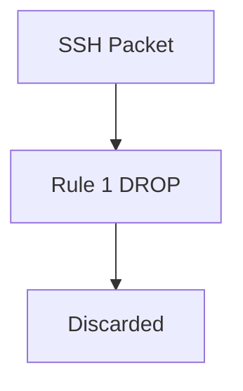

---

Correct:

```bash
iptables -A INPUT -p tcp --dport 22 -j ACCEPT

iptables -A INPUT -j DROP
```

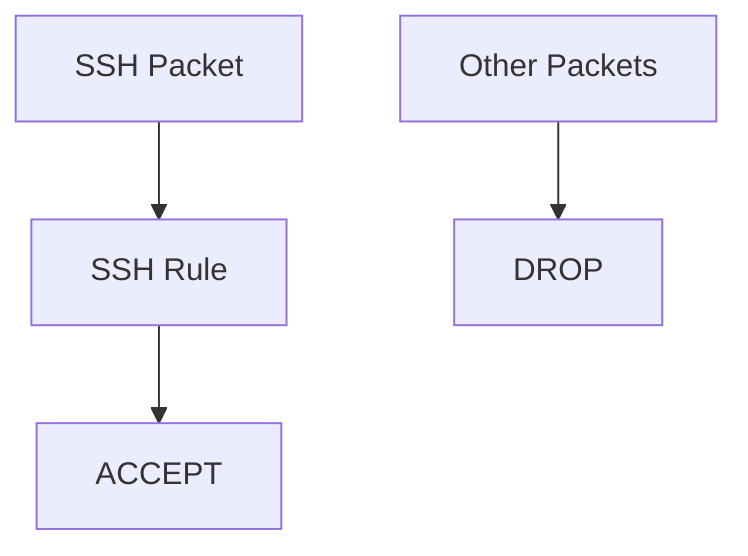

---

# Quick Reference Cheat Sheet

|Command|Purpose|
|---|---|
|`-L`|List Rules|
|`-A`|Append Rule|
|`-I`|Insert Rule|
|`-D`|Delete Rule|
|`-F`|Flush Rules|
|`-P`|Set Policy|
|`-N`|Create Chain|
|`-X`|Delete Chain|
|`-v`|Verbose|
|`-n`|Numeric Output|
|`--line-numbers`|Show Rule Numbers|

---

# Mind Map

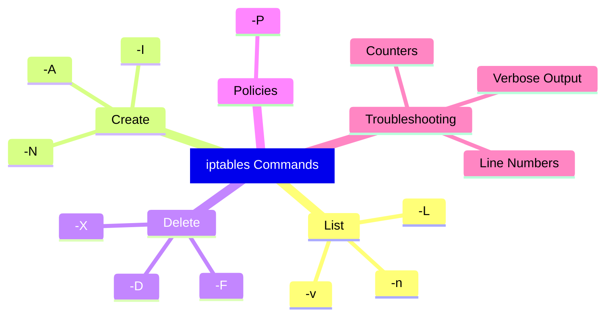

---

# Next Section

**4. Creating Firewall Rules (Real Rule Building)**

We'll cover:

- Building a firewall from scratch
    
- Allow SSH safely
    
- Allow HTTP/HTTPS
    
- Block IP addresses
    
- Allow specific subnets
    
- Stateful firewall rules (`NEW`, `ESTABLISHED`, `RELATED`)
    
- Logging before dropping
    
- Building a complete server firewall step-by-step
    
- Packet flow walkthroughs for each rule.