# Section 9.3 — Advanced APT Configuration and Usage

Up to now you've learned:

```text
Repositories
APT
dpkg
Installation
Removal
Upgrades
Troubleshooting
Frontends
```

This section explains what separates:

```text
Normal Linux Users

from

Power Users
```

You'll learn:

```text
APT Configuration
Package Priorities
Mixing Distributions
Automatic Packages
Multi-Architecture
Package Authenticity
```

---

# Section 9.3.1 — Configuring APT

Most beginners think:

```text
APT Configuration
=
One Config File
```

Historically that was true.

Modern Debian systems use:

```text
Configuration Directories
```

instead.

---

# Traditional Configuration

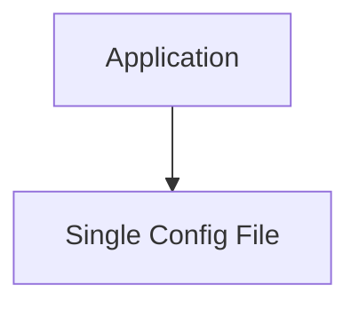

Example:

```text
/etc/program.conf
```

---

# Modern Debian Configuration

Instead of:

```text
One Giant File
```

Debian uses:

```text
Many Small Files
```

---

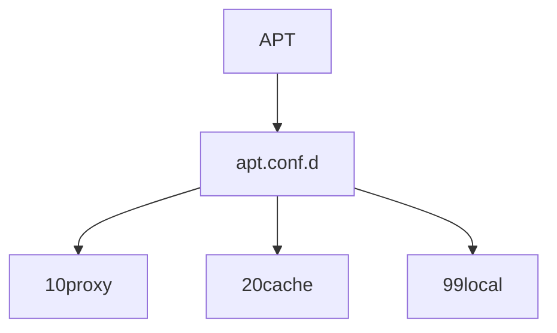

---

# The Important Directory

```text
/etc/apt/apt.conf.d/
```

APT reads every file inside.

---

# Processing Order

APT reads files:

```text
Alphabetically
```

Example:

```text
10proxy

20cache

50security

99local
```

---


Later files can override earlier settings.

---

# Why Debian Uses .d Directories

Without `.d`:

```text
Package A edits config

Package B edits config

Administrator edits config

Chaos
```

---

With `.d`:

```text
Each package drops
its own configuration file
```

No conflicts.

---

# Example APT Command Option

You already saw:

```bash
apt -o Dpkg::Options::="--force-overwrite" install zsh
```

---

Meaning:

```text
Temporarily pass
--force-overwrite
to dpkg
```

---

# Permanent Configuration

Instead of typing that every time:

Create:

```text
/etc/apt/apt.conf.d/99local
```

Contents:

```text
Dpkg::Options {
   "--force-overwrite";
}
```

---

# Configuration Hierarchy

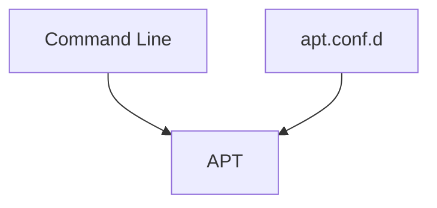

---

# Proxy Configuration

Common enterprise scenario.

---

Without Proxy


---

With Proxy

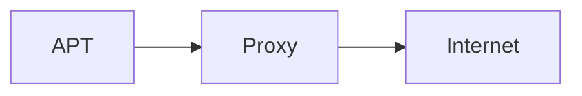

---

# HTTP Proxy

```text
Acquire::http::proxy "http://proxy:3128";
```

---

# FTP Proxy

```text
Acquire::ftp::proxy "ftp://proxy";
```

---

# Finding More Options

Manual:

```bash
man apt.conf
```

---

# Mindmap

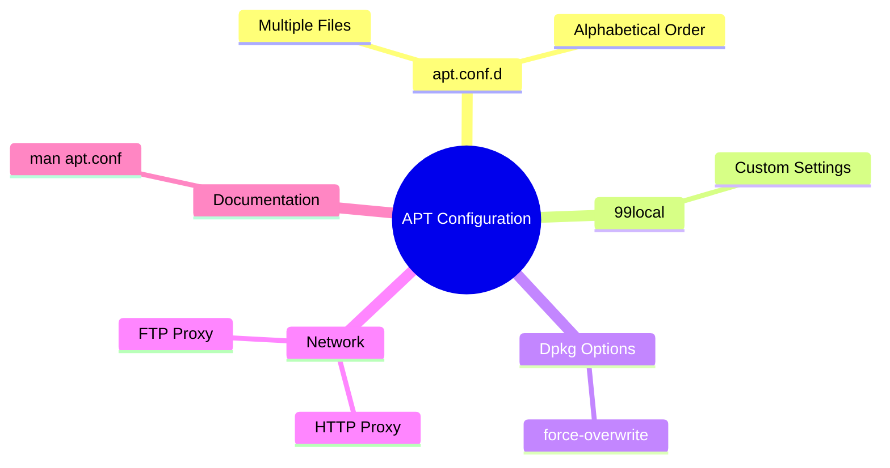

---

# Section 9.3.2 — Managing Package Priorities (APT Pinning)

This is one of the most powerful APT features.

---

# The Problem

Suppose your repositories contain:

```text
Kali Rolling

Kali Dev

Debian Unstable

Debian Experimental
```

---

Question:

```text
Which package should APT choose?
```

---

APT uses:

```text
Priorities
```

---

# Package Selection Logic

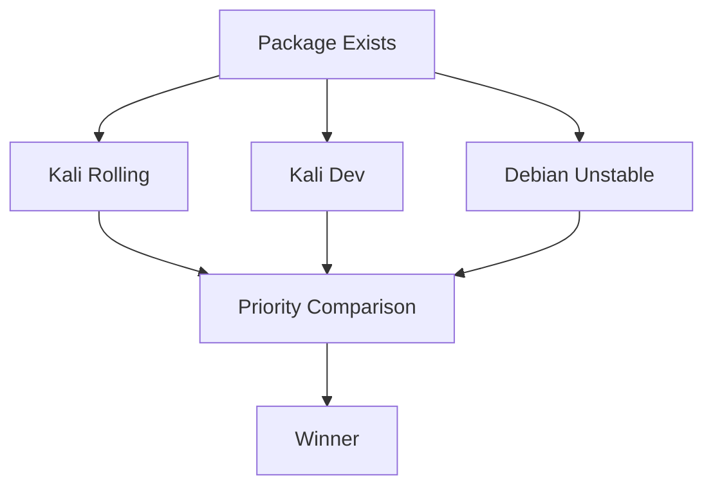

---

# Default Priorities

|Situation|Priority|
|---|---|
|Installed Package|100|
|Non-installed Package|500|
|Target Release|990|

---

# Priority Rules

### Priority < 0

```text
Never Install
```

---

### 0 - 100

```text
Install only if nothing installed
```

---

### 100 - 500

```text
Prefer newer installed versions
```

---

### 500 - 990

```text
Normal repository packages
```

---

### 990 - 1000

```text
Preferred target release
```

---

### >1000

```text
Force installation

Even downgrade
```

---

# APT Preference File

Location:

```text
/etc/apt/preferences
```

or

```text
/etc/apt/preferences.d/
```

---

# Example: Prefer Kali

```text
Package: *
Pin: release o=Kali
Pin-Priority: 900
```

---

Block Debian:

```text
Package: *
Pin: release o=Debian
Pin-Priority: -10
```

---

# Pinning Concept

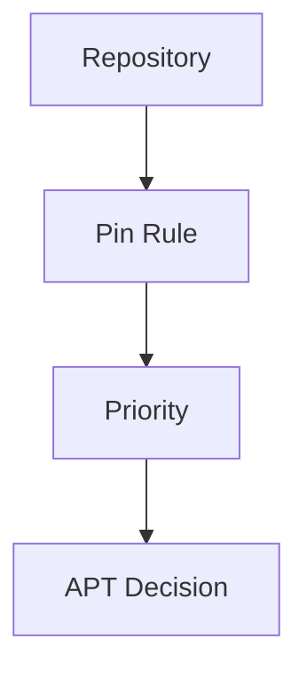

---

# Locking a Version

Example:

```text
Package: perl
Pin: version 5.22*
Pin-Priority: 1001
```

Meaning:

```text
Always keep Perl 5.22
```

---

# Useful Command

```bash
apt-cache policy
```

Shows repository priorities.

---

Specific package:

```bash
apt-cache policy nmap
```

---

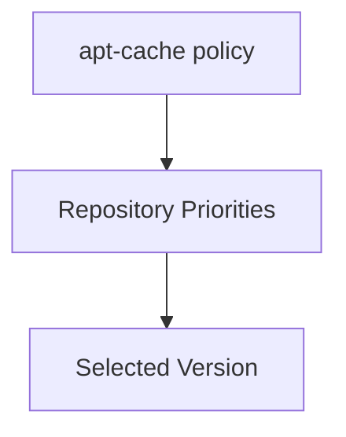

---

# Section 9.3.3 — Working With Multiple Distributions

APT can mix:

```text
Kali Rolling

Kali Dev

Debian Unstable

Debian Experimental
```

---

# Multi-Distribution Layout

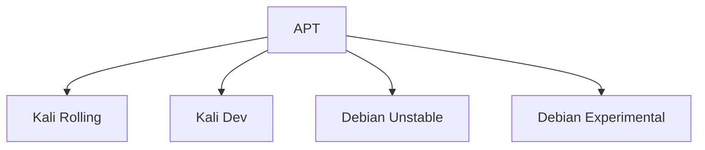

---

# Install From Another Distribution

Example:

```bash
apt install package/unstable
```

Meaning:

```text
Install package
from Debian Unstable
```

---

# Force Dependency Resolution

```bash
apt install package/unstable -t unstable
```

Meaning:

```text
Resolve dependencies
inside unstable
```

---

# Warning

Mixing repositories can create:

```text
Dependency Hell
```

---

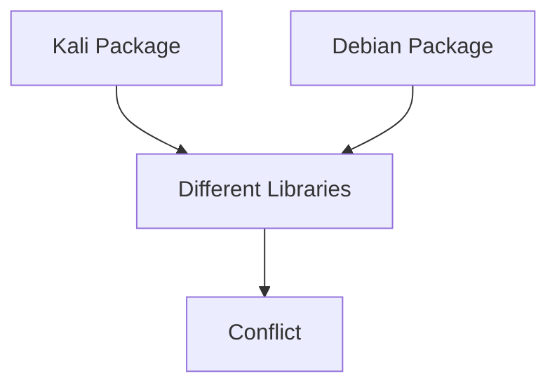

---

# Section 9.3.4 — Tracking Automatically Installed Packages

APT tracks:

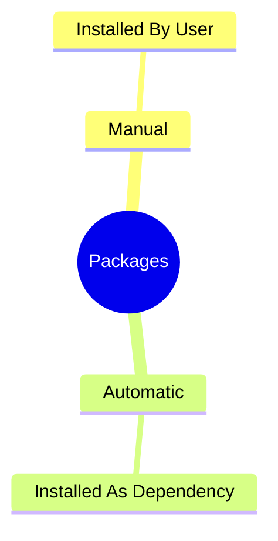

---

# Example

Install:

```bash
apt install nmap
```

---

APT also installs:

```text
libpcap

libssl

zlib
```

---

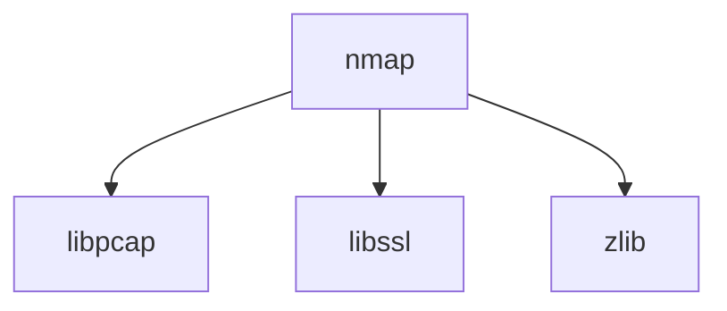

---

# Mark Automatic

```bash
apt-mark auto package
```

---

# Mark Manual

```bash
apt-mark manual package
```

---

# Remove Unused Dependencies

```bash
apt autoremove
```

---

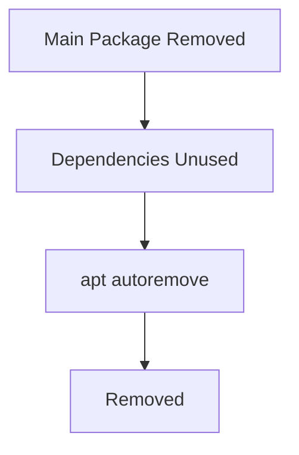

---

# Why Is Package Installed?

Very useful command:

```bash
aptitude why package
```

Example:

```bash
aptitude why python-debian
```

Output:

```text
Package A
depends on Package B
```

---

# Section 9.3.5 — Multi-Arch Support

Every package has an architecture.

Examples:

```text
amd64

i386

arm64

armhf
```

---

# Check Current Architecture

```bash
dpkg --print-architecture
```

Example:

```text
amd64
```

---

# Problem

Can an amd64 system run i386 software?

Answer:

```text
Yes
```

with Multi-Arch.

---

# Enable i386

```bash
sudo dpkg --add-architecture i386
```

---

Verify:

```bash
dpkg --print-foreign-architectures
```

Output:

```text
i386
```

---

# Multi-Arch Workflow

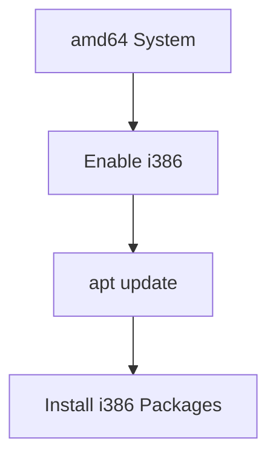

---

# Install Specific Architecture

```bash
apt install wine32:i386
```

---

Syntax:

```text
package:architecture
```

---

# Why Multi-Arch Exists

Most common use:

```text
Run 32-bit software
on 64-bit systems
```

Examples:

```text
Wine

Old Games

Legacy Software
```

---

# Section 9.3.6 — Validating Package Authenticity

This is one of the most important security features in Linux.

---

# The Threat

Suppose:

```text
Attacker Compromises Mirror
```

and replaces:

```text
nmap.deb
```

with:

```text
malicious nmap.deb
```

---

How does APT detect it?

---

# Trust Chain

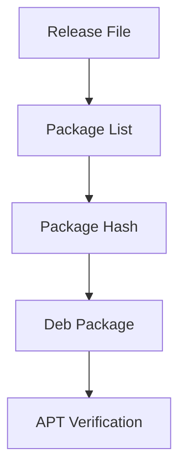

---

# Verification Layers

```text
Release.gpg Signature

↓

Packages Hashes

↓

Deb Package Hashes
```

---

# Trusted Keys

Stored in:

```text
/etc/apt/trusted.gpg.d/
```

---

# View Trusted Keys

```bash
apt-key fingerprint
```

_(Modern systems warn that apt-key is deprecated.)_

---

# Package Authenticity Workflow

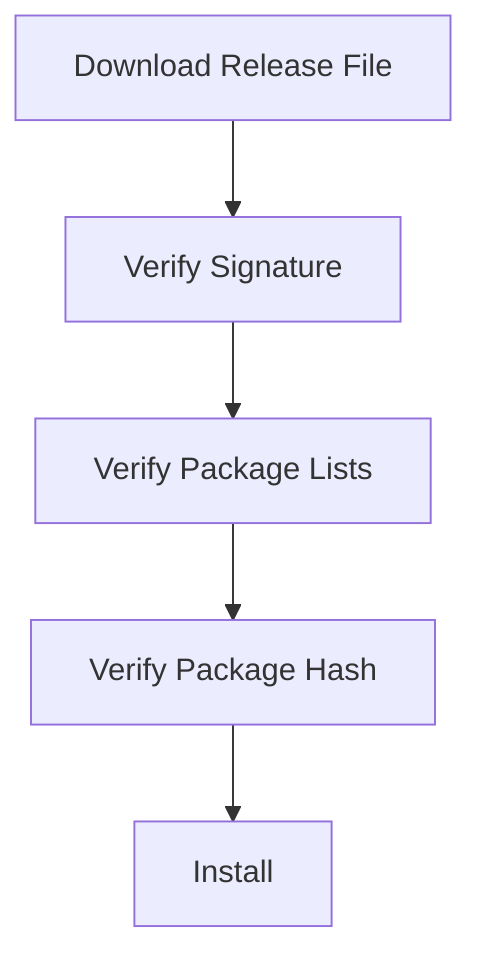

---

# Adding Third-Party Repositories

APT must trust the repository's key.

Historically:

```bash
apt-key add key.asc
```

---

Modern approach:

```text
Store GPG keys
inside trusted.gpg.d
```

---

# Why Signatures Matter

Without signatures:

```text
Anyone could modify packages
```

---

With signatures:

```text
APT knows:

Who signed package metadata

Whether files changed

Whether repository is trusted
```

---

# Mindmap Summary

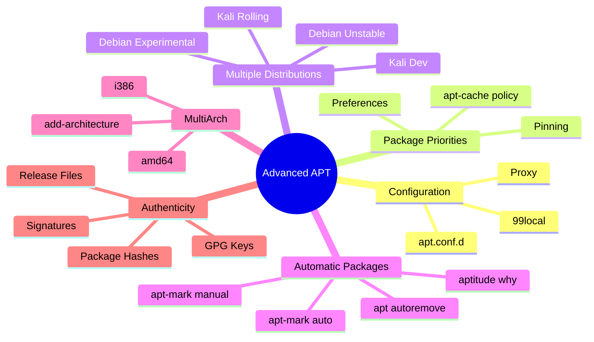

---

# Commands Worth Memorizing

```bash
man apt.conf
apt-cache policy
apt-cache policy package
apt-mark auto package
apt-mark manual package
apt autoremove
aptitude why package
dpkg --print-architecture
dpkg --add-architecture i386
dpkg --print-foreign-architectures
apt-key fingerprint
```

This chapter is where APT goes from **"I can install packages"** to **"I can completely control how packages are selected, trusted, prioritized, mixed across distributions, and installed across architectures."**