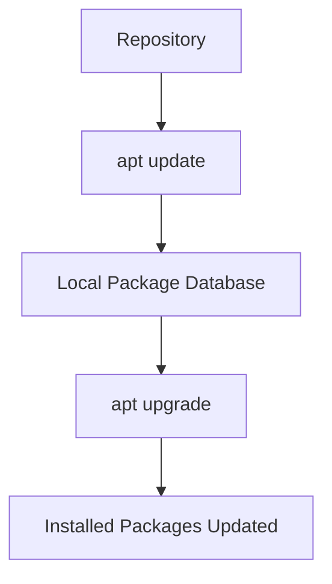
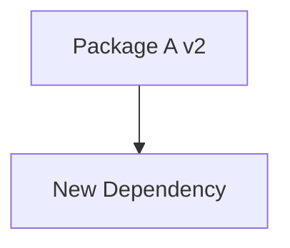
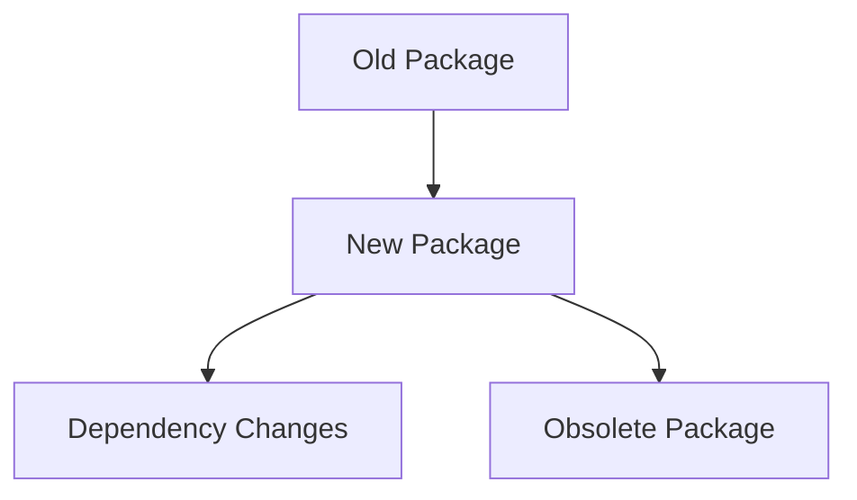
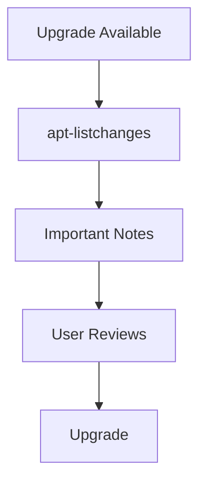
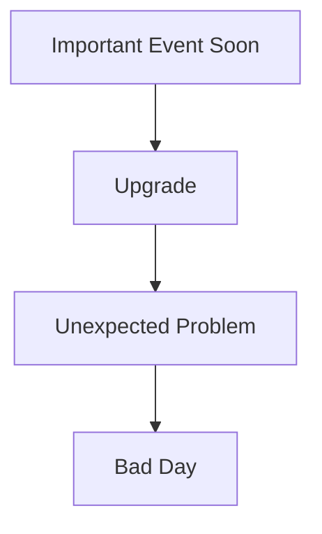
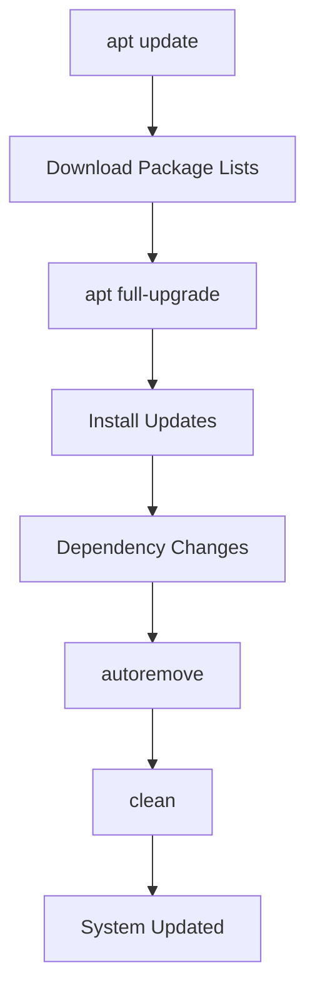
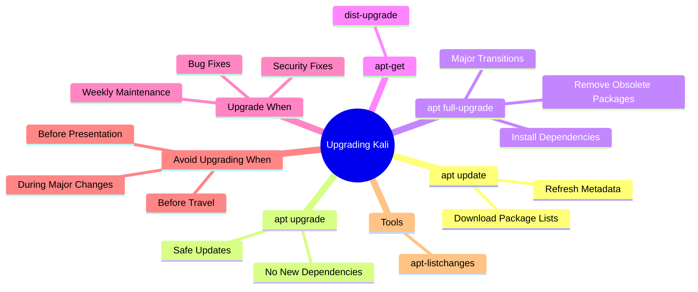

# Section 9.2.3 — Upgrading Kali Linux Properly

At first glance, upgrading Kali looks simple:

```bash
sudo apt update
sudo apt full-upgrade
```

But there's actually a lot happening behind the scenes.

Since Kali is a **rolling distribution**, understanding upgrades is critical.

---

# What Is a Rolling Distribution?

Traditional distributions work like this:

```text
Ubuntu 22.04
      ↓
Wait 6 months
      ↓
Ubuntu 22.10
      ↓
Wait 6 months
      ↓
Ubuntu 23.04
```

---

Kali works differently.


There is no:

```text
Kali 2026
Kali 2027
Kali 2028
```

for normal package updates.

Your system continuously evolves.

---

# The Upgrade Process



---

# Step 1 — apt update

```bash
sudo apt update
```

Remember:

```text
Does NOT install software
```

It only downloads:

```text
Package Lists
Versions
Dependencies
Metadata
```

from repositories.

---

Think of it like:

```text
Downloading a store catalog
```

not buying products.

---

# Step 2 — apt upgrade

```bash
sudo apt upgrade
```

APT checks:

```text
Installed Version
vs
Repository Version
```

and upgrades packages safely.

---

# Safe Upgrade Philosophy

APT tries to avoid:

```text
Removing packages
Installing unexpected packages
Changing dependencies
```

---

Example:

Current:

```text
Firefox 100
```

Repository:

```text
Firefox 101
```

APT upgrades.

Easy.

---

# Problem Scenario

Suppose:

```text
Package A Version 1
```

becomes:

```text
Package A Version 2
```

and now requires:

```text
Package B
```

---



---

Normal upgrade may refuse.

Why?

Because it would need to install something new.

APT wants the safest upgrade possible.

---

# full-upgrade

For major changes:

```bash
sudo apt full-upgrade
```

---

This allows APT to:

```text
Install new dependencies
Remove obsolete packages
Replace packages
Perform larger transitions
```

---

# upgrade vs full-upgrade

|Feature|upgrade|full-upgrade|
|---|---|---|
|Upgrade packages|✅|✅|
|Install dependencies|❌|✅|
|Remove obsolete packages|❌|✅|
|Major transitions|❌|✅|

---

# Why Kali Recommends full-upgrade

Because Kali Rolling changes constantly.

Packages frequently:

```text
Gain dependencies
Lose dependencies
Get renamed
Become obsolete
```

---



---

Therefore Kali users typically run:

```bash
sudo apt update
sudo apt full-upgrade
```

instead of only:

```bash
sudo apt upgrade
```

---

# apt-get Equivalent

APT has:

```bash
apt full-upgrade
```

Older tool:

```bash
apt-get dist-upgrade
```

These are effectively the same idea.

---

# Choosing a Target Repository

Normally:

```bash
apt upgrade
```

uses your default repository.

---

You can force:

```bash
apt -t kali-rolling upgrade
```

Meaning:

```text
Use packages from kali-rolling
```

---

# Permanent Default Repository

APT can be configured to always prefer:

```text
kali-rolling
```

using:

```text
APT::Default-Release "kali-rolling";
```

inside:

```text
/etc/apt/apt.conf.d/local
```

---

# Detecting Upgrade Problems

Sometimes upgrades contain important warnings.

Install:

```bash
sudo apt install apt-listchanges
```

---

This tool shows:

```text
NEWS
Known Issues
Breaking Changes
Upgrade Warnings
```

before upgrades happen.

---

# Why apt-listchanges Exists

Imagine:

```text
GNOME changed configuration format
```

or

```text
OpenSSL removed old algorithms
```

Without warning:

```text
Applications may break
```

---

With apt-listchanges:

```text
Read warning first
Upgrade later
```

---



---

# How Often Should You Upgrade?

Kali doesn't enforce a rule.

---

# Good Reasons To Upgrade

### Security Fixes

```text
Critical vulnerability fixed
```

Upgrade immediately.

---

### Bug Fixes

```text
Tool crashes
New version fixes bug
```

Upgrade.

---

### Before Reporting Bugs

Always update first.

Many bugs already got fixed.

---

### General Security

Upgrade regularly enough to receive fixes you didn't know existed.

---

# When NOT To Upgrade

This is equally important.

---

## Before A Presentation

Imagine:

```text
Presentation starts in 30 minutes
```

Running:

```bash
apt full-upgrade
```

is dangerous.

---



---

## Before Going Offline

Example:

```text
Travel
Customer Site
Exam
Conference
```

Don't upgrade right before leaving.

---

## During Major Desktop Transitions

Example:

```text
GNOME Major Release
```

Not all packages update simultaneously.

Temporary incompatibilities may occur.

---

## If full-upgrade Wants To Remove Important Packages

Example output:

```text
The following packages will be REMOVED:
...
```

Pause.

Investigate.

Don't blindly press Y.

---

# Kali Team Recommendation

Generally:

```text
Upgrade at least once per week
```

---

Daily upgrades are okay.

More than daily usually makes little difference because repository updates don't happen that frequently.

---

# Practical Upgrade Workflow

## Before Upgrade

Refresh package lists:

```bash
sudo apt update
```

---

Review available upgrades:

```bash
apt list --upgradable
```

---

Perform upgrade:

```bash
sudo apt full-upgrade
```

---

Clean unused dependencies:

```bash
sudo apt autoremove
```

---

Optional cleanup:

```bash
sudo apt clean
```

---

# Complete Upgrade Workflow



---

# Mindmap Summary



---

# Commands To Memorize

Refresh package database:

```bash
sudo apt update
```

Safe upgrade:

```bash
sudo apt upgrade
```

Full Kali upgrade:

```bash
sudo apt full-upgrade
```

Old equivalent:

```bash
sudo apt-get dist-upgrade
```

Show upgrade warnings:

```bash
sudo apt install apt-listchanges
```

---

# Most Important Kali Rule

```text
Ubuntu users usually run:

apt update
apt upgrade

Kali users usually run:

apt update
apt full-upgrade
```

Because Kali is a rolling distribution and package relationships change frequently.

---

# Next Section

The next topic is **Removing vs Purging Packages**, where we'll build a much deeper mental model of:

```text
dpkg -r
dpkg -P

apt remove
apt purge

Configuration Files
User Data
Dependencies
```

and exactly what remains on the system after each operation.