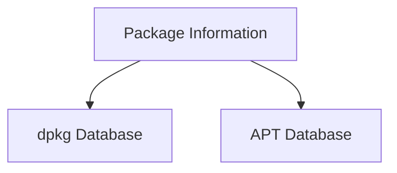
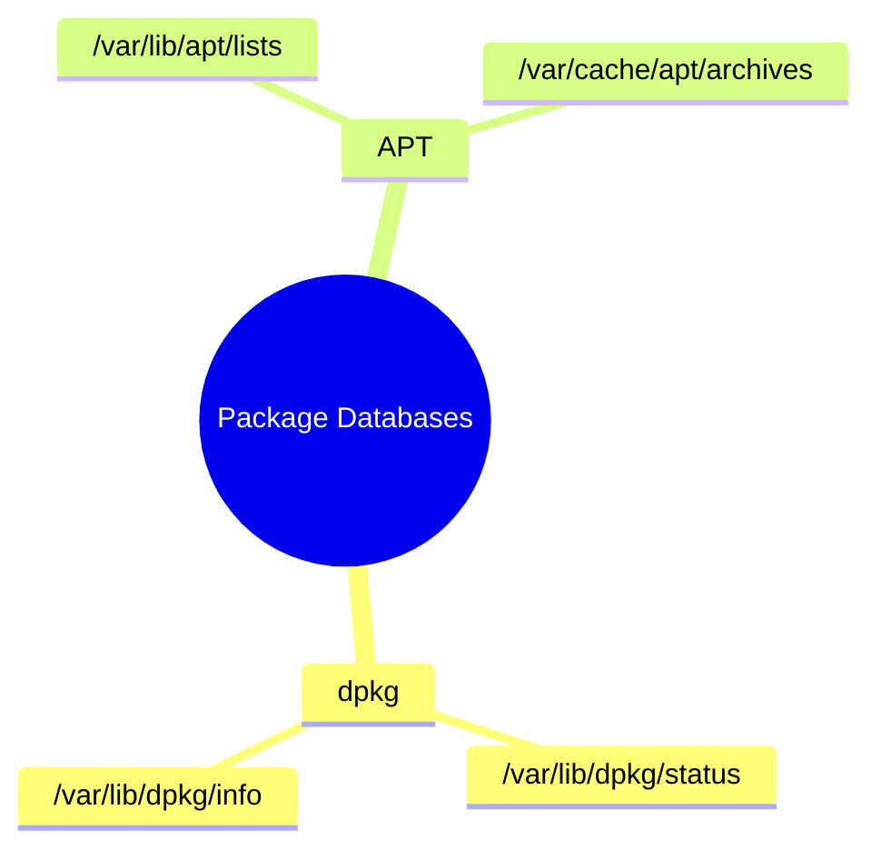
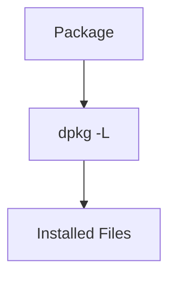
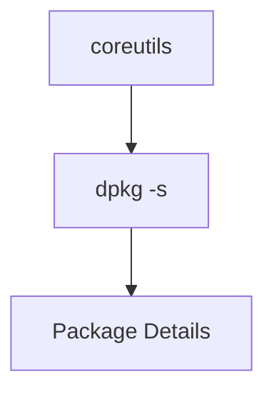
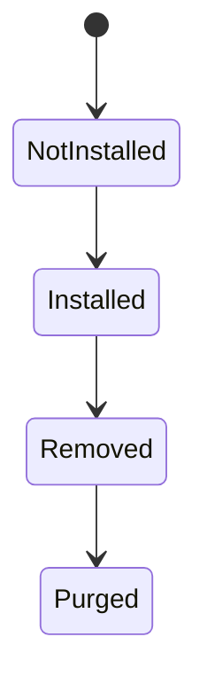
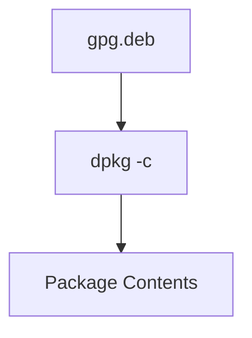
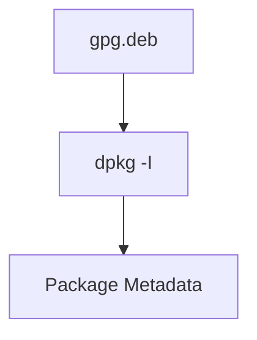
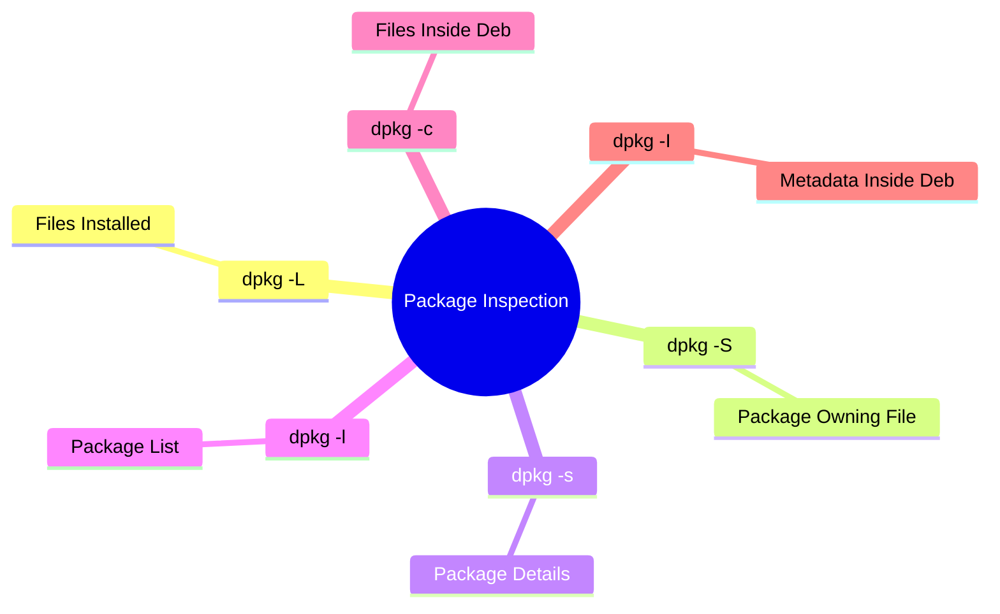
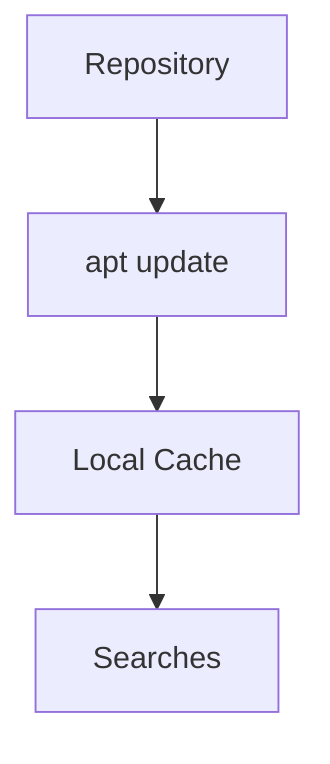
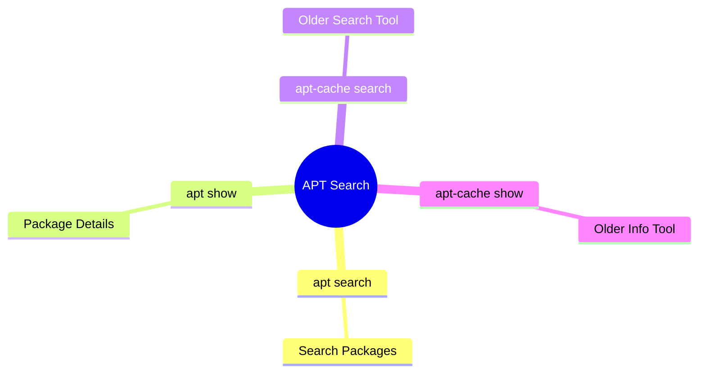

# Section 9.2.5 — Inspecting Packages (Becoming a Package Detective)

Up until now we've focused on:

```text
Installing Packages
Removing Packages
Upgrading Packages
```

But in real life, administrators spend a lot of time asking questions like:

```text
Which package installed this file?

What files belong to this package?

What version is installed?

What dependencies does it have?

What's inside this .deb file?

What package provides this command?
```

This is where package inspection tools become incredibly useful.

---

# The Two Databases You Need To Understand

Debian package management revolves around two databases.



---

# dpkg Database

Tracks:

```text
Installed Packages
Installed Files
Package Status
Configuration Scripts
```

Stored mainly in:

```text
/var/lib/dpkg/
```

---

# APT Database

Tracks:

```text
Available Packages
Repository Information
Dependencies
Package Metadata
```

Stored mainly in:

```text
/var/lib/apt/
```

---

# Package Database Layout



---

# Important dpkg Files

## Package Status

```text
/var/lib/dpkg/status
```

Contains:

```text
Installed Packages
Version Information
Package State
```

---

## Package Scripts

```text
/var/lib/dpkg/info/
```

Contains:

```text
postinst
prerm
postrm
preinst
```

scripts.

---

## Package File Lists

```text
/var/lib/dpkg/info/*.list
```

Contains:

```text
Every file installed by a package
```

---

# Think Like a Detective

Suppose you find:

```text
/usr/bin/nmap
```

Questions:

```text
Who installed it?

What package owns it?

Can I remove it?

What else belongs to that package?
```

The following commands answer these questions.

---

# dpkg -L

## List Files Installed By a Package

Command:

```bash
dpkg -L package
```

Example:

```bash
dpkg -L base-passwd
```

---

# What It Does

Shows:

```text
Every file installed by the package
```

---

Example Output

```text
/usr/sbin/update-passwd
/usr/share/doc
/usr/share/man
...
```

---

# Visualization



---

# Common Usage

Question:

```text
Where did this package install files?
```

Answer:

```bash
dpkg -L package
```

---

# dpkg -S

## Find Which Package Owns a File

Command:

```bash
dpkg -S filename
```

Example:

```bash
dpkg -S /bin/date
```

Output:

```text
coreutils: /bin/date
```

---

# Mental Model

```mermaid
flowchart TD

    A[/bin/date]

    B[dpkg -S]

    C[coreutils]

    A --> B
    B --> C
```

---

# Common Usage

Question:

```text
Which package installed this file?
```

Answer:

```bash
dpkg -S file
```

---

# dpkg -s

## Show Installed Package Information

Command:

```bash
dpkg -s package
```

Example:

```bash
dpkg -s coreutils
```

---

# Information Displayed

```text
Package Name
Version
Dependencies
Architecture
Maintainer
Description
```

---

# Example View



---

# Common Usage

Question:

```text
What version is installed?
```

Answer:

```bash
dpkg -s package
```

---

# dpkg -l

## List Packages

Command:

```bash
dpkg -l
```

Shows:

```text
Installed Packages
Removed Packages
Package Status
```

---

# Filter Packages

Example:

```bash
dpkg -l 'b*'
```

Shows packages beginning with:

```text
b
```

---

# Understanding Status Codes

You may see:

```text
ii
```

Meaning:

```text
Desired = Install
Status = Installed
```

---

Common Codes

|Code|Meaning|
|---|---|
|ii|Installed|
|rc|Removed but config remains|
|un|Unknown / not installed|

---

# Package Status Diagram



---

# Inspecting .deb Files

Everything above inspected installed packages.

Now let's inspect a package before installation.

---

# dpkg -c

## Show Contents of a .deb File

Command:

```bash
dpkg -c package.deb
```

Example:

```bash
dpkg -c gpg.deb
```

---

# What It Shows

```text
Every file inside package
```

without installing it.

---



---

# Common Usage

Question:

```text
What files will this package install?
```

Answer:

```bash
dpkg -c package.deb
```

---

# dpkg -I

## Show Package Metadata

Command:

```bash
dpkg -I package.deb
```

Example:

```bash
dpkg -I gpg.deb
```

---

# Information Displayed

```text
Version
Dependencies
Maintainer
Description
Architecture
Homepage
```

---

# Visual Representation



---

# Common Usage

Question:

```text
Can this package run on my system?
```

Question:

```text
What dependencies are required?
```

Answer:

```bash
dpkg -I package.deb
```

---

# Package Investigation Summary



---

# Understanding APT Cache

APT maintains a local cache.

Why?

Imagine every search required:

```text
Internet Connection
Repository Access
Download Metadata
```

That would be slow.

---

Instead:



---

# Important APT Cache Directories

Package Lists:

```text
/var/lib/apt/lists/
```

Downloaded Packages:

```text
/var/cache/apt/archives/
```

---

# What Happens During apt update?

```mermaid
flowchart TD

    A[Repositories]

    B[Package Metadata]

    C[/var/lib/apt/lists]

    A --> B
    B --> C
```

APT downloads metadata only.

---

# apt search

## Search Available Packages

Command:

```bash
apt search keyword
```

Example:

```bash
apt search wireless
```

---

# Common Usage

Question:

```text
What packages exist related to WiFi?
```

Answer:

```bash
apt search wireless
```

---

# apt show

## Display Package Information

Command:

```bash
apt show package
```

Example:

```bash
apt show nmap
```

---

# Shows

```text
Version
Description
Dependencies
Homepage
Maintainer
```

---

# apt-cache search

Older equivalent:

```bash
apt-cache search keyword
```

---

Example:

```bash
apt-cache search forensics
```

---

# apt-cache show

Older equivalent:

```bash
apt-cache show package
```

Example:

```bash
apt-cache show nmap
```

---

# APT Search Tools



---

# axi-cache (Better Search Engine)

Normal search:

```bash
apt-cache search forensics graphical
```

may produce poor results.

---

Better:

```bash
axi-cache search forensics graphical
```

Uses:

```text
Xapian Search Engine
Relevance Ranking
Package Tags
```

---

# Example

```bash
axi-cache search forensics graphical
```

Results:

```text
autopsy
testdisk
forensics-all-gui
...
```

ranked by relevance.

---

# The Package Detective Toolkit

|Question|Command|
|---|---|
|What files did package install?|`dpkg -L package`|
|Which package owns file?|`dpkg -S file`|
|Is package installed?|`dpkg -s package`|
|List installed packages|`dpkg -l`|
|What's inside .deb?|`dpkg -c file.deb`|
|Show .deb metadata|`dpkg -I file.deb`|
|Search packages|`apt search keyword`|
|Show package details|`apt show package`|
|Better search|`axi-cache search term`|

---

# The Commands You Will Use Most

```bash
dpkg -S /usr/bin/nmap
```

Who owns this file?

---

```bash
dpkg -L nmap
```

What files did nmap install?

---

```bash
apt search wireless
```

Find packages.

---

```bash
apt show nmap
```

Inspect package details.

---

# One-Liner Summary

```text
dpkg tools inspect installed packages.

APT tools inspect available packages.

dpkg -L = What files belong to package?

dpkg -S = Which package owns file?

apt search = Find package.

apt show = Learn about package.
```

The next major section is **9.2.6 Troubleshooting**, where you'll learn how to recover from broken upgrades, dependency problems, failed maintainer scripts, reinstall packages, read dpkg logs, downgrade packages, and repair damaged package states.