# Section 9.2.6 — Troubleshooting Debian Packages and APT

Everything works beautifully until one day:

```text
apt update
apt full-upgrade
```

and suddenly:

```text
Package Broken
Dependency Error
Upgrade Failed
Application Crashes
```

Welcome to package troubleshooting.

This section teaches you how Debian administrators diagnose and recover from package problems.

---

# The Troubleshooting Mindset

When something breaks, don't immediately:

```text
Reinstall Kali
```

Most package issues can be fixed.

Instead follow:

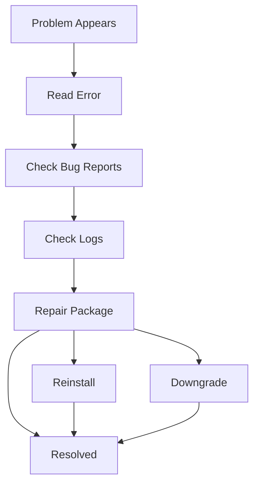

---

# Why Upgrades Sometimes Break

Even though Debian and Kali test packages heavily:

```text
Bugs Still Happen
```

Possible causes:

```text
New Bug Introduced
Changed Configuration Format
Changed Default Behavior
Broken Maintainer Script
Dependency Problems
```

---

# First Step: Check Bug Reports

Suppose:

```text
Wireshark upgraded

Wireshark crashes immediately
```

Before spending hours debugging:

Check whether everyone is seeing the same problem.

---

# Where To Check

Kali Bug Tracker

Debian Bug Tracker:

```text
https://bugs.debian.org/package
```

---

# Why Bug Reports Matter

Sometimes you find:

```text
Known Bug

Patch Available

Workaround Available

Fixed Version Available
```

---

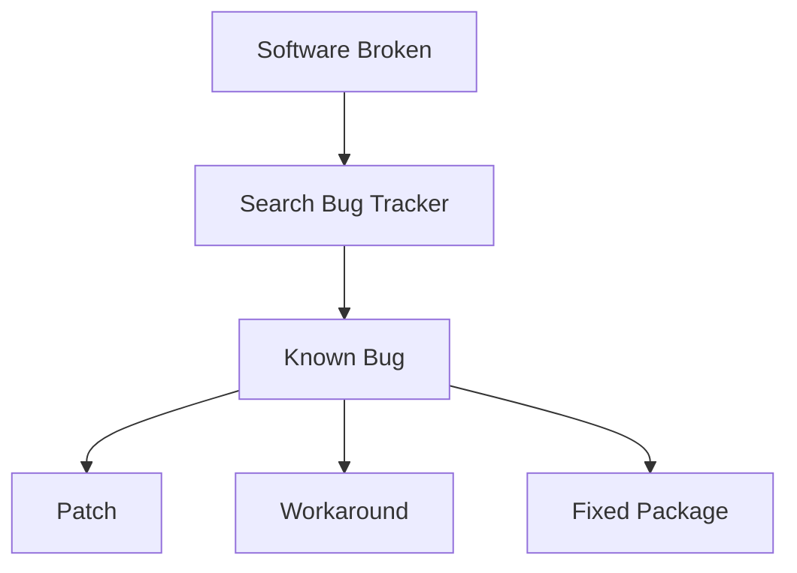

---

# Example Real Workflow

You upgrade:

```text
Burp Suite
```

Now it crashes.

You check bug tracker.

Find:

```text
Known Issue
```

with workaround:

```text
Run with Java 21
```

Problem solved.

---

# Downgrading a Broken Package

Sometimes:

```text
Version 1 Works

Version 2 Broken
```

This is called:

```text
Regression
```

---

# Regression Diagram


---

# Solution

Go back to:

```text
Version 1
```

---

# Where Can Old Packages Be Found?

## APT Cache

```text
/var/cache/apt/archives/
```

Contains previously downloaded `.deb` files.

---

## Kali Mirror Pool

Packages removed from repository often remain available for several days.

---

## Debian Snapshot

```text
https://snapshot.debian.org
```

Stores historical Debian package versions.

---

# Downgrade Workflow

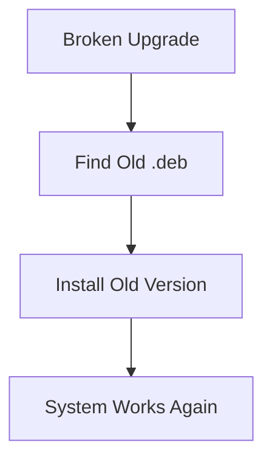

---

# Broken Maintainer Scripts

One of the most common advanced package failures.

Remember:

Every package contains scripts like:

```text
preinst
postinst
prerm
postrm
```

---

# Typical Upgrade

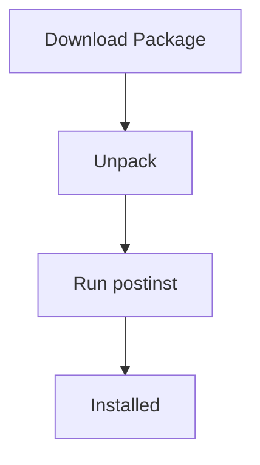

---

# What If postinst Fails?

Then package state becomes:

```text
Half Installed
Half Configured
Broken
```

---

APT often reports:

```text
Sub-process returned error
```

or

```text
dpkg returned an error code
```

---

# Where Are Maintainer Scripts Stored?

```text
/var/lib/dpkg/info/
```

---

# Debugging a Maintainer Script

Suppose:

```text
postinst script fails
```

Open it:

```bash
sudo nano /var/lib/dpkg/info/package.postinst
```

---

Add:

```bash
set -x
```

after:

```bash
#!/bin/sh
```

---

Example:

```bash
#!/bin/sh
set -x
```

---

Now rerun:

```bash
sudo dpkg --configure -a
```

Every command executed by the script will be printed.

This makes debugging much easier.

---

# What Does set -x Do?

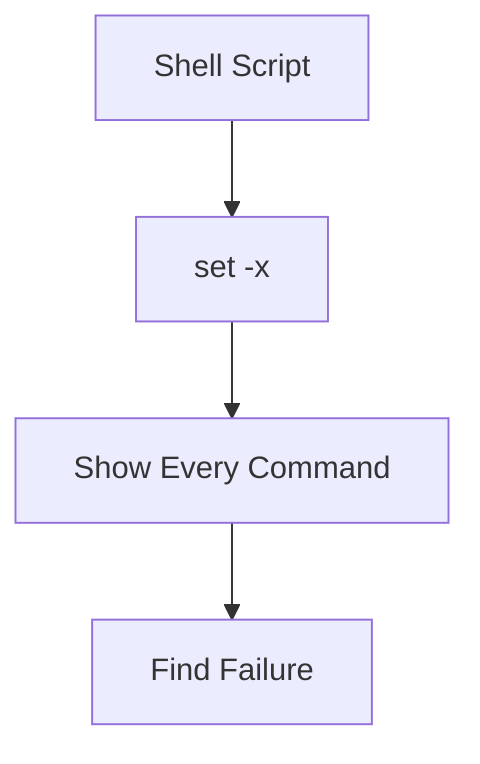

---

# Quick Dirty Workaround

Suppose line fails:

```bash
some-command
```

Temporary workaround:

```bash
some-command || true
```

Meaning:

```text
Ignore Failure
Continue
```

---

# Important Note About preinst

This technique works for:

```text
postinst
prerm
postrm
```

but NOT usually for:

```text
preinst
```

because preinst executes before installation.

---

# The dpkg Log File

Every package operation is logged.

Location:

```text
/var/log/dpkg.log
```

---

# Why This File Is Amazing

It tells you:

```text
What was installed
When it was installed
What version changed
What was removed
```

---

# Example

```bash
tail /var/log/dpkg.log
```

Output:

```text
install package
remove package
status half-installed
status installed
```

---

# Log Analysis Diagram

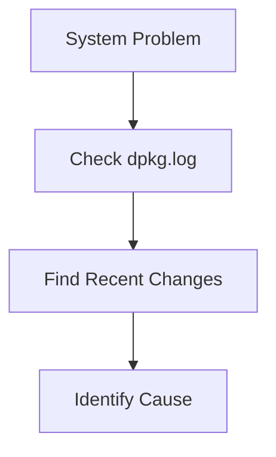

---

# Reinstalling Packages

Sometimes YOU accidentally break a package.

Example:

```bash
sudo rm /usr/bin/postfix
```

Oops.

---

APT says:

```text
Package Already Installed
```

So:

```bash
apt install postfix
```

won't help.

---

# Solution

```bash
sudo apt --reinstall install postfix
```

---

# What Happens?

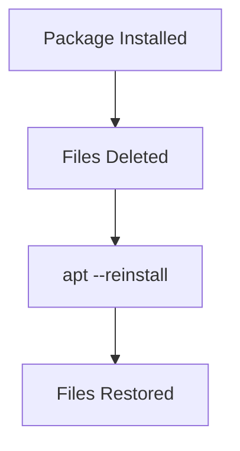

---

# Important Security Warning

Never use:

```bash
apt --reinstall
```

to recover from:

```text
Hacking
Malware
Compromise
```

Why?

Because attacker may have modified:

```text
apt
dpkg
System Libraries
Configuration Files
```

themselves.

---

# After a Real Compromise

Correct mindset:

```text
Assume Nothing Is Trustworthy
```

---

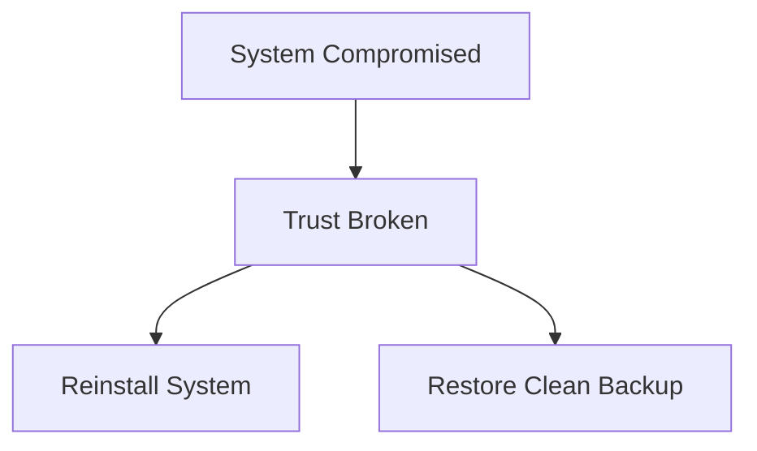

---

# Broken Dependencies

One of the most common APT problems.

Example:

```text
Package A Requires Package B
```

but:

```text
Package B Missing
```

---

APT reports:

```text
Unmet Dependencies
```

---

# Dependency Problem Diagram

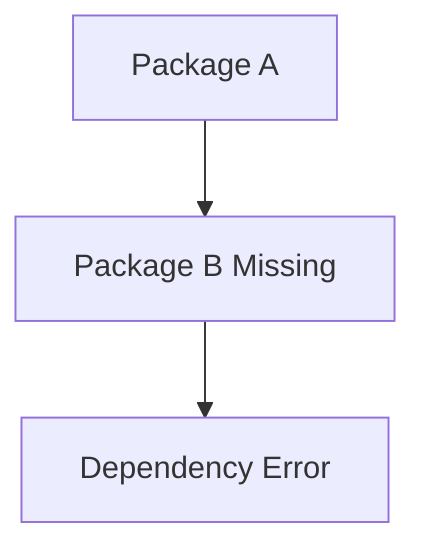

---

# Typical Error

```text
You might want to run:

apt-get -f install
```

---

# What Does -f Mean?

```text
Fix Broken Dependencies
```

---

Run:

```bash
sudo apt-get -f install
```

APT attempts to:

```text
Install Missing Dependencies
Remove Broken Packages
Repair Package State
```

---

# Emergency Hacks

Sometimes people use:

```bash
dpkg --force-*
```

Examples:

```bash
--force-overwrite
--force-depends
```

---

Danger:

```text
Package Database May Become Inconsistent
```

---

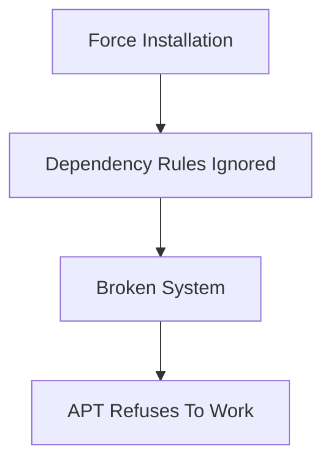

---

# Nuclear-Level Fix

If you intentionally broke dependency rules:

APT may stop working.

Advanced administrators sometimes edit:

```text
/var/lib/dpkg/status
```

manually.

---

# DO NOT Do This Normally

```text
Editing /var/lib/dpkg/status
=
Package Database Surgery
```

Only for extreme situations.

---

# Better Solutions

Usually one of these is safer:

```text
Install Missing Dependency

Downgrade Package

Upgrade Package

Recompile Package Properly
```

---

# Troubleshooting Decision Tree

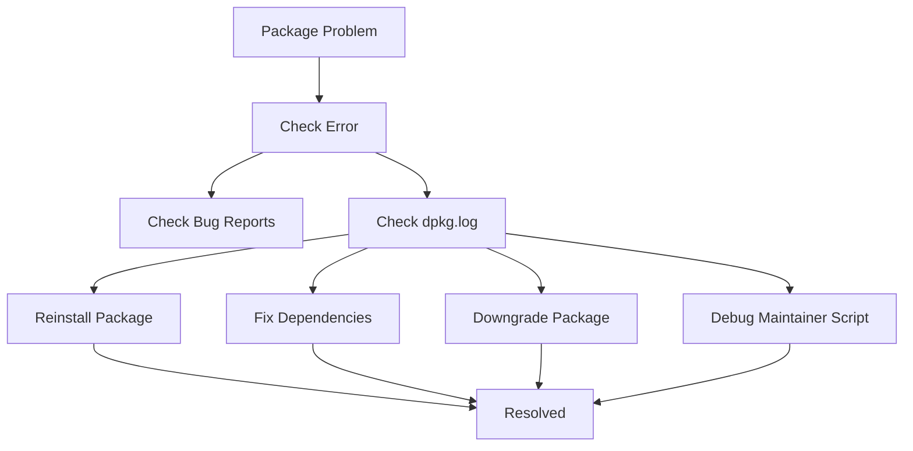

---

# Commands Every Admin Should Know

Check logs:

```bash
tail /var/log/dpkg.log
```

---

Reinstall package:

```bash
sudo apt --reinstall install package
```

---

Fix dependencies:

```bash
sudo apt-get -f install
```

---

Reconfigure unfinished packages:

```bash
sudo dpkg --configure -a
```

---

View package scripts:

```bash
ls /var/lib/dpkg/info/
```

---

# Mindmap Summary

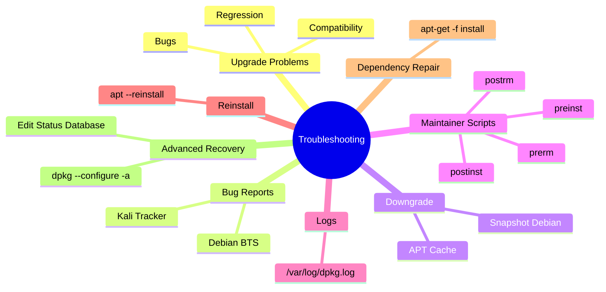

---

# The Most Important Troubleshooting Rule

```text
Read the error message first.

Most package problems fall into one of four categories:

1. Dependency Problem
2. Broken Maintainer Script
3. Package Bug
4. Bad Upgrade

And Debian already provides tools
to diagnose each one.
```