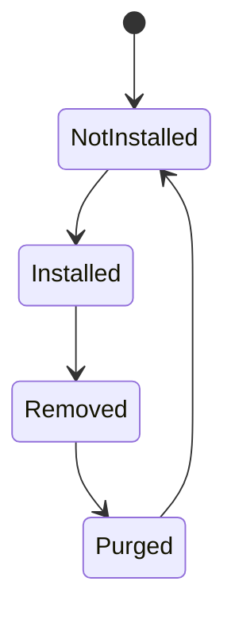
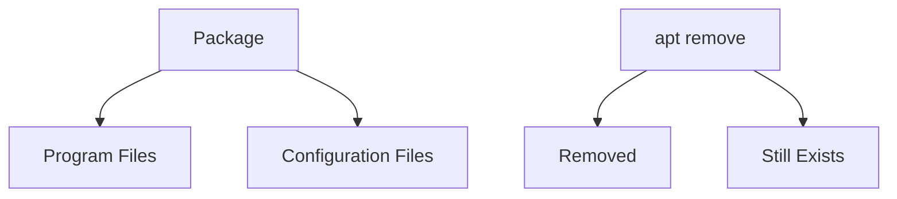
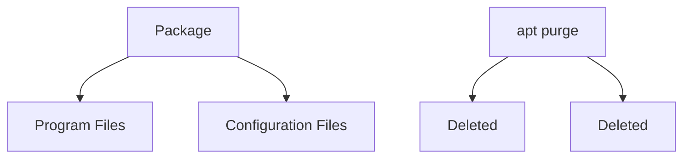
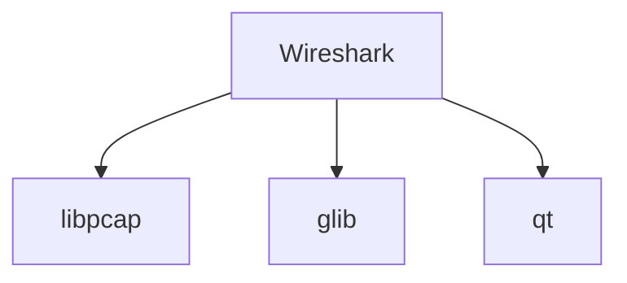
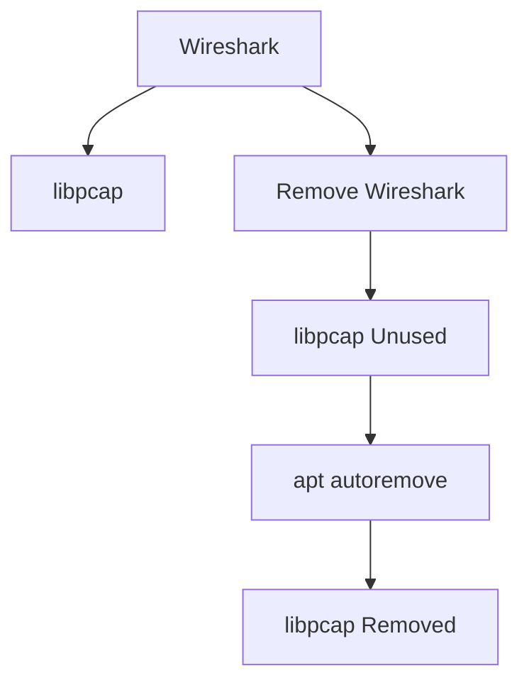
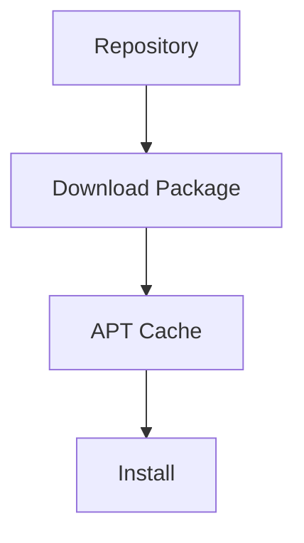
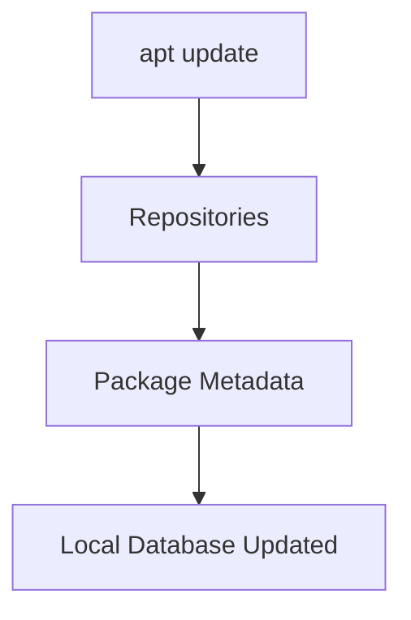
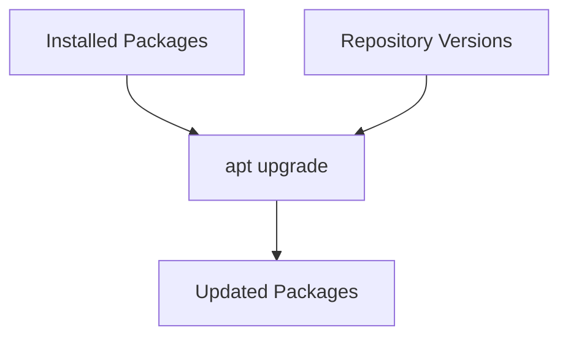
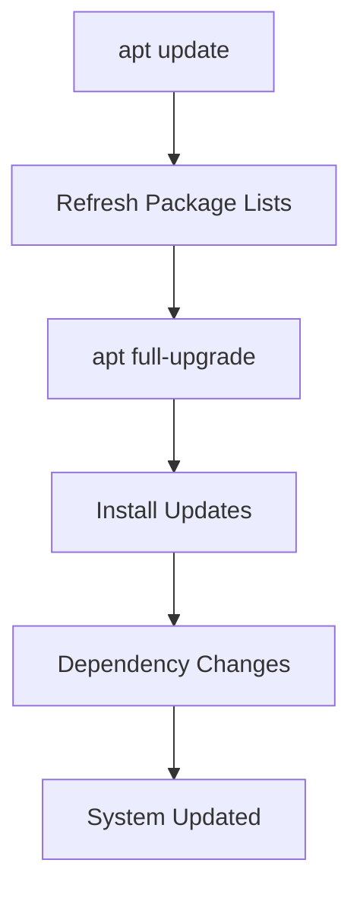
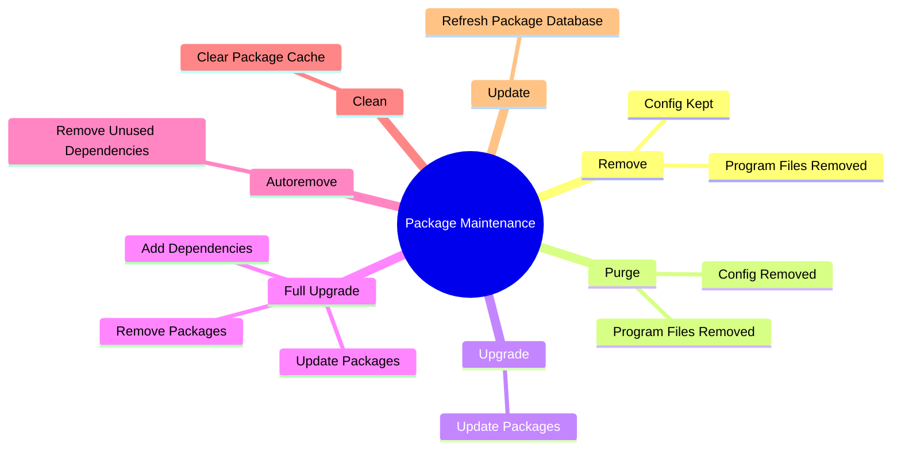

# Section 9.2.3 — Removing, Purging, Upgrading, and Cleaning Packages

Installing packages is only half the story.

Sooner or later you will want to:

```text
Remove software
Upgrade software
Remove unused dependencies
Upgrade Kali itself
Clean package cache
```

This section explains the complete package lifecycle after installation.

---

# Package Lifecycle


---

# Understanding Package States

A package can exist in different states.



---

# Installed

Package exists.

Files exist.

Configuration exists.

Example:

```text
Wireshark installed
```

Everything works.

---

# Removed

Program files removed.

Configuration files remain.

Think:

```text
Software removed
Settings kept
```

---

# Purged

Program files removed.

Configuration removed.

Think:

```text
Software removed
Settings removed
```

---

# Remove vs Purge

This is one of the most important Debian concepts.

---

## Remove

Command:

```bash
sudo apt remove wireshark
```

---

APT removes:

```text
Executable files
Libraries
Program files
```

but keeps:

```text
Configuration files
```

---



---

## Purge

Command:

```bash
sudo apt purge wireshark
```

---

APT removes:

```text
Program files
Configuration files
```

Everything.

---



---

# Real Example

Suppose:

```text
Apache Web Server
```

stores configuration in:

```text
/etc/apache2/
```

---

After:

```bash
sudo apt remove apache2
```

you may still have:

```text
/etc/apache2/
```

---

After:

```bash
sudo apt purge apache2
```

the directory disappears.

---

# Why Keep Configurations?

Imagine:

```text
Uninstall Firefox

Later reinstall Firefox
```

APT can restore:

```text
Preferences
Settings
Customizations
```

because configuration files survived.

---

# Remove vs Purge Summary

|Action|Program Files|Config Files|
|---|---|---|
|remove|❌ Removed|✅ Kept|
|purge|❌ Removed|❌ Removed|

---

# What About Dependencies?

Suppose:

```text
Wireshark
```

requires:

```text
libpcap
glib
qt
```

---



---

When Wireshark is removed:

```bash
sudo apt remove wireshark
```

dependencies remain.

Why?

Because another package may still need them.

---

# Autoremove

APT keeps track of:

```text
Packages explicitly installed
Packages installed as dependencies
```

---

When a dependency is no longer needed:

```bash
sudo apt autoremove
```

removes it.

---

Example:



---

# Why autoremove Matters

Without autoremove:

```text
Unused libraries accumulate
Disk space wasted
System becomes cluttered
```

---

# Cleaning Package Cache

APT downloads packages before installation.

Stored in:

```text
/var/cache/apt/archives/
```

---

Example:

```text
nmap.deb
wireshark.deb
curl.deb
```

may remain even after installation.

---

# Cache Concept



---

# Clean Cache

Command:

```bash
sudo apt clean
```

Removes:

```text
Downloaded package files
```

---

Useful when:

```text
Disk space low
Cache very large
```

---

# Clean vs Autoremove

|Command|Purpose|
|---|---|
|autoremove|Remove unused packages|
|clean|Remove downloaded package files|

---

# Upgrading Packages

Repositories constantly receive updates.

Example:

```text
Installed:
Nmap 7.95

Repository:
Nmap 8.00
```

---

How does APT know?

Because of:

```bash
sudo apt update
```

---

# apt update

Downloads:

```text
Package Lists
Versions
Dependency Information
```

NOT packages themselves.

---



---

# apt upgrade

Command:

```bash
sudo apt upgrade
```

APT upgrades installed packages.

---

Example:

```text
curl 8.0 → 8.1
nmap 7.95 → 8.00
vim 9.0 → 9.1
```

---



---

# What apt upgrade Will NOT Do

APT tries to be safe.

It refuses operations that require:

```text
Removing packages
Installing additional packages
Major dependency changes
```

---

# Example

Current:

```text
Package A
```

New version requires:

```text
Package B
```

---

Regular upgrade may refuse.

---

# full-upgrade

Command:

```bash
sudo apt full-upgrade
```

Older name:

```bash
sudo apt-get dist-upgrade
```

---

This allows:

```text
Install new dependencies
Remove obsolete packages
Perform larger transitions
```

---

# upgrade vs full-upgrade

|Command|Installs New Dependencies|Removes Packages|
|---|---|---|
|upgrade|❌|❌|
|full-upgrade|✅|✅|

---

# Why Kali Users Use full-upgrade

Kali Rolling changes constantly.

Packages frequently:

```text
Gain dependencies
Lose dependencies
Get renamed
```

---

Therefore Kali documentation often recommends:

```bash
sudo apt update
sudo apt full-upgrade
```

instead of only:

```bash
sudo apt upgrade
```

---

# Typical Kali Update Workflow



---

# Complete Maintenance Commands

Update package database:

```bash
sudo apt update
```

Upgrade packages:

```bash
sudo apt upgrade
```

Full rolling-system upgrade:

```bash
sudo apt full-upgrade
```

Remove package:

```bash
sudo apt remove package
```

Remove package and configuration:

```bash
sudo apt purge package
```

Remove unused dependencies:

```bash
sudo apt autoremove
```

Clear package cache:

```bash
sudo apt clean
```

---

# Real-World Analogy

Imagine renting an apartment.

---

## Install

```text
Move in
```

---

## Remove

```text
Move out
Leave furniture
```

---

## Purge

```text
Move out
Take furniture
Take everything
```

---

## Upgrade

```text
Renovate apartment
```

---

## Autoremove

```text
Throw away unused junk
```

---

## Clean

```text
Empty download folder
```

---

# Mindmap Summary



---

# Commands Every Kali User Should Memorize

```bash
sudo apt update
```

Refresh repository information.

---

```bash
sudo apt full-upgrade
```

Upgrade Kali completely.

---

```bash
sudo apt install package
```

Install package.

---

```bash
sudo apt remove package
```

Remove package.

---

```bash
sudo apt purge package
```

Remove package and configuration.

---

```bash
sudo apt autoremove
```

Remove unused dependencies.

---

```bash
sudo apt clean
```

Remove cached `.deb` files.

---

# The Mental Model

```text
update        = Learn what updates exist

upgrade       = Install safe updates

full-upgrade  = Fully update system

remove        = Uninstall software

purge         = Uninstall software + settings

autoremove    = Remove unused dependencies

clean         = Remove downloaded package files
```

The next major topic is usually **APT package searching, package information, package databases, and package inspection tools** (`apt search`, `apt show`, `dpkg -l`, `dpkg -L`, `apt-cache`, etc.), where you'll learn how to investigate packages before installing them.