# Section 9.2 — Basic Package Interaction

So far you've learned:

```text
Repository = Package Warehouse

APT = Smart Package Manager

dpkg = Low-Level Package Installer
```

Now we finally start using them.

This section answers:

```text
How do packages actually get installed?

What happens when I run apt install?

What does dpkg really do?

What is unpacking?

What is configuring?

What are triggers?
```

---

# The Package Lifecycle

Every package goes through roughly the same journey.


---

# Two Ways To Install Software

There are two major methods:

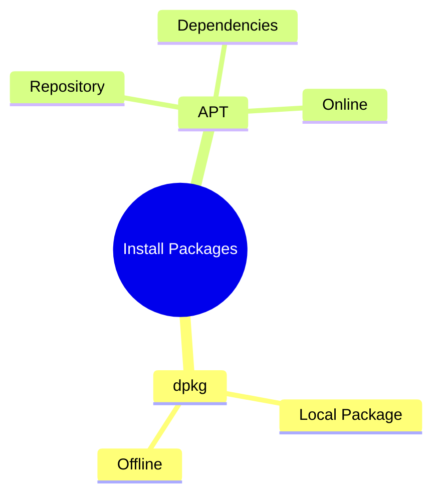

---

# Method 1 — dpkg

Think:

```text
I already have the .deb file
```

Example:

```text
man-db_2.9.3-2_amd64.deb
```

Install:

```bash
sudo dpkg -i man-db_2.9.3-2_amd64.deb
```

---

# What Happens Internally?

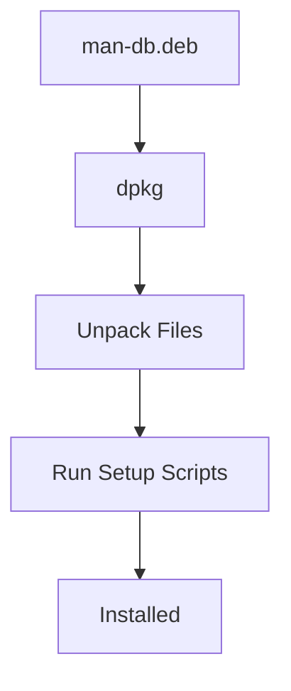

The `-i` option actually performs two operations automatically.

---

# Step 1 — Unpack

Unpacking means:

```text
Extract files from the .deb archive
```

Similar to:

```bash
unzip package.zip
```

except files are copied into system locations.

---

Example:

Inside package:

```text
/usr/bin/man
/usr/share/man
/etc/manpath.config
```

dpkg extracts them.

---

# Step 2 — Configure

After files exist:

```text
Run package setup scripts
Create databases
Generate indexes
Register services
```

---

# Installation Workflow

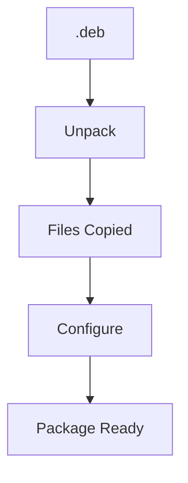

---

# Doing It Manually

Instead of:

```bash
sudo dpkg -i package.deb
```

You can perform both steps yourself.

---

# Only Unpack

```bash
sudo dpkg --unpack package.deb
```

This extracts files but does not configure them.

---

State:

```text
Files exist

Package not fully installed
```

---

# Only Configure

```bash
sudo dpkg --configure package-name
```

This runs configuration scripts.

---

# Visualizing Installation

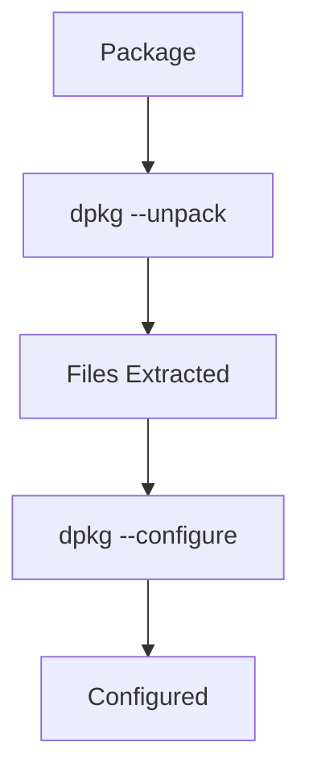

---

# Why Separate Them?

APT actually does this behind the scenes.

```text
Download

Unpack

Resolve Dependencies

Configure
```

Separating phases gives APT more control.

---

# What Are Triggers?

You may see messages like:

```text
Processing triggers for man-db

Processing triggers for mime-support
```

Many people ignore them.

Let's understand them.

---

# Trigger Concept

Imagine:

```text
A package installs documentation
```

The documentation database must be updated.

Instead of every package doing this itself:

```text
Package says:
"Hey man-db, something changed."
```

---

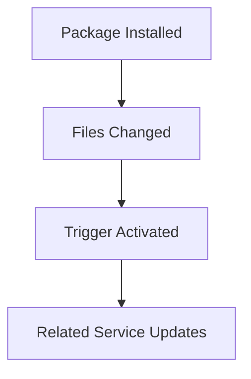

---

# Example: man-db

Package installs:

```text
/usr/share/man
```

Trigger fires:

```text
Update manual page database
```

Automatically.

---

# Example: mime-support

Package installs:

```text
/usr/lib/mime/packages
```

Trigger fires:

```text
update-mime
```

to rebuild MIME mappings.

---

# Trigger Analogy

Imagine a library.

---

A new book arrives.

Instead of librarian checking every shelf constantly:

```text
Book Arrival
      ↓
Notification
      ↓
Update Catalog
```

That's essentially a trigger.

---

# dpkg Error Handling

Sometimes installation fails.

---

Example:

```text
Dependency Missing
```

or

```text
File Already Exists
```

---

dpkg normally stops.

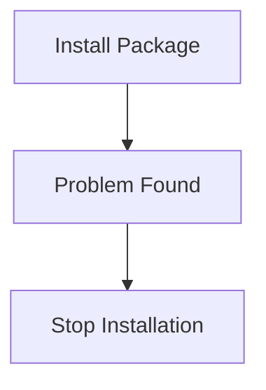

---

# Force Options

dpkg has many:

```bash
dpkg --force-*
```

options.

View them:

```bash
dpkg --force-help
```

---

# Most Common Force Option

```bash
dpkg --force-overwrite
```

Used when:

```text
Two packages contain the same file
```

---

# File Collision

Example:

Package A contains:

```text
/usr/bin/example
```

Package B contains:

```text
/usr/bin/example
```

---

dpkg sees:

```text
Conflict
```

and refuses installation.

---

# Collision Diagram

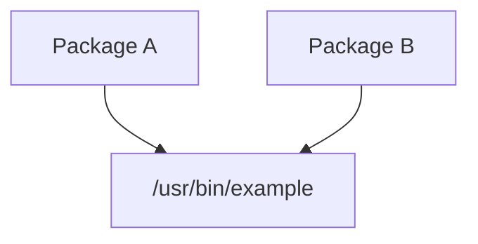

---

# Overwriting Anyway

```bash
sudo dpkg -i --force-overwrite package.deb
```

This tells dpkg:

```text
Replace existing file
Continue installation
```

---

# Important Warning

```text
Force options are emergency tools.

Normal package installations
should rarely require them.
```

Even Kali documentation recommends avoiding them unless necessary.

---

# Installing Packages With APT

Most of the time you won't use dpkg directly.

You'll use:

```bash
sudo apt install package
```

---

Example:

```bash
sudo apt install kali-tools-gpu
```

APT automatically:

1. Finds package
    
2. Finds dependencies
    
3. Downloads packages
    
4. Calls dpkg
    
5. Configures packages
    

---

# APT Installation Flow

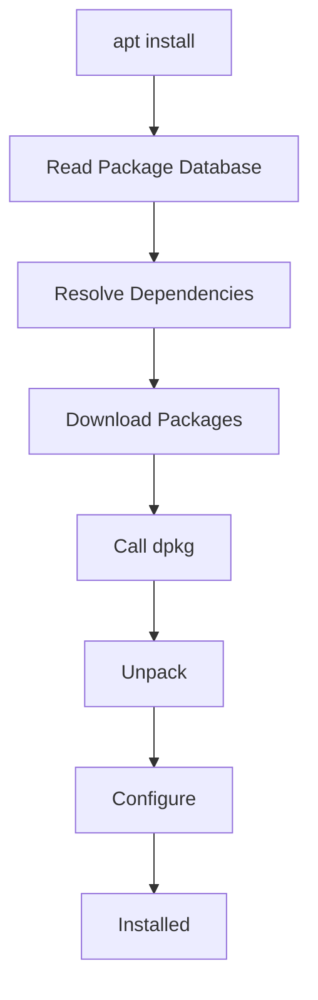

---

# Example Dependency Resolution

Suppose:

```bash
sudo apt install kali-tools-gpu
```

APT notices:

```text
Requires:
  oclgausscrack
  truecrack
```

APT downloads them automatically before installing the requested package.

---

# Dependency Tree

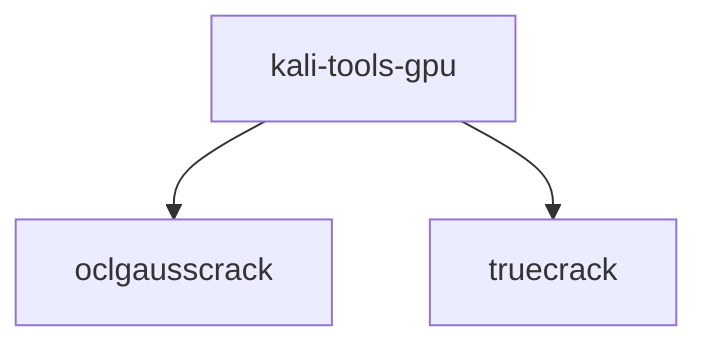

---

# Installing Specific Versions

APT can install a specific version.

Example:

```bash
sudo apt install zsh=5.7.1-1
```

---

# Why Use Specific Versions?

Possible reasons:

```text
Testing
Rollback
Compatibility
Troubleshooting
```

---

# Installing From Specific Repositories

Example:

```bash
sudo apt install zsh/kali-dev
```

Meaning:

```text
Install zsh from kali-dev repository
```

instead of the default repository.

---

# Version Selection Flow

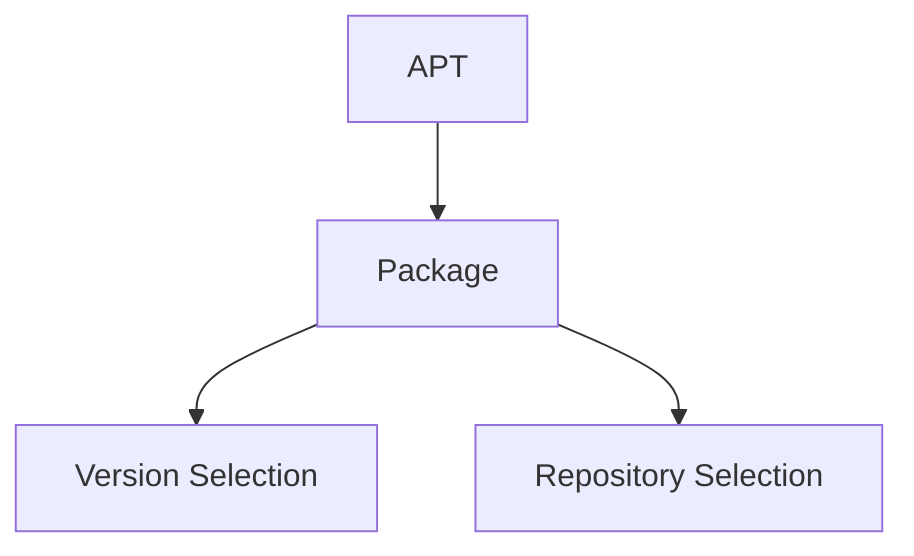

---

# APT Can Also Pass Options To dpkg

Example:

```bash
apt -o Dpkg::Options::="--force-overwrite" install zsh
```

APT forwards the option to dpkg.

---

# Real Relationship Between APT and dpkg

This is what actually happens every time:

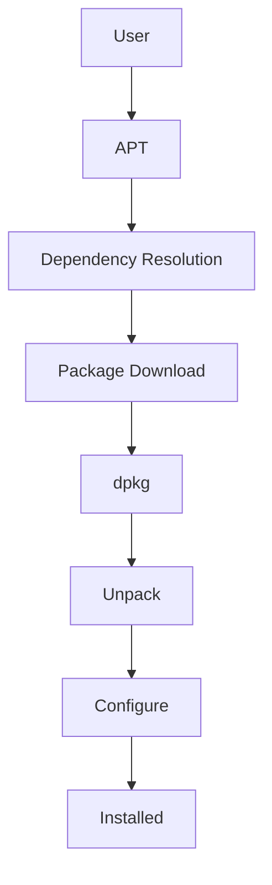

---

# Mindmap Summary

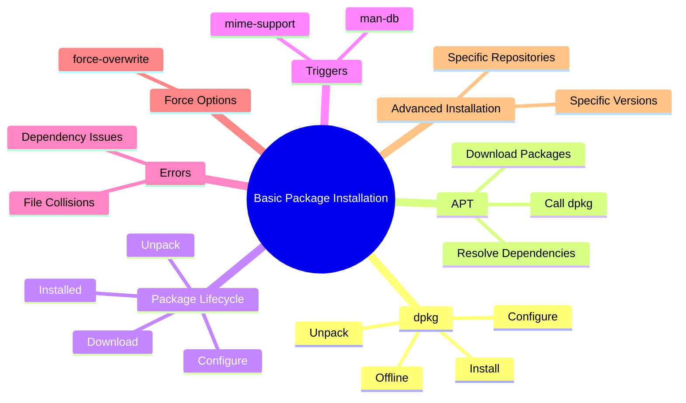

---

# Commands To Remember

Initialize package database:

```bash
sudo apt update
```

Install package:

```bash
sudo apt install package
```

Install local package:

```bash
sudo dpkg -i package.deb
```

Only unpack:

```bash
sudo dpkg --unpack package.deb
```

Configure package:

```bash
sudo dpkg --configure package
```

Show force options:

```bash
dpkg --force-help
```

Install specific version:

```bash
sudo apt install package=version
```

Install from repository:

```bash
sudo apt install package/distribution
```

---

# The One Thing To Remember

```text
dpkg installs packages.

APT manages packages.

APT downloads packages,
resolves dependencies,
and then uses dpkg
to unpack and configure them.
```

The next section is usually **Removing, Purging, Upgrading packages and understanding package states**, where you'll learn the difference between:

```text
remove
purge
upgrade
full-upgrade
autoremove
```

and how APT keeps your system clean.