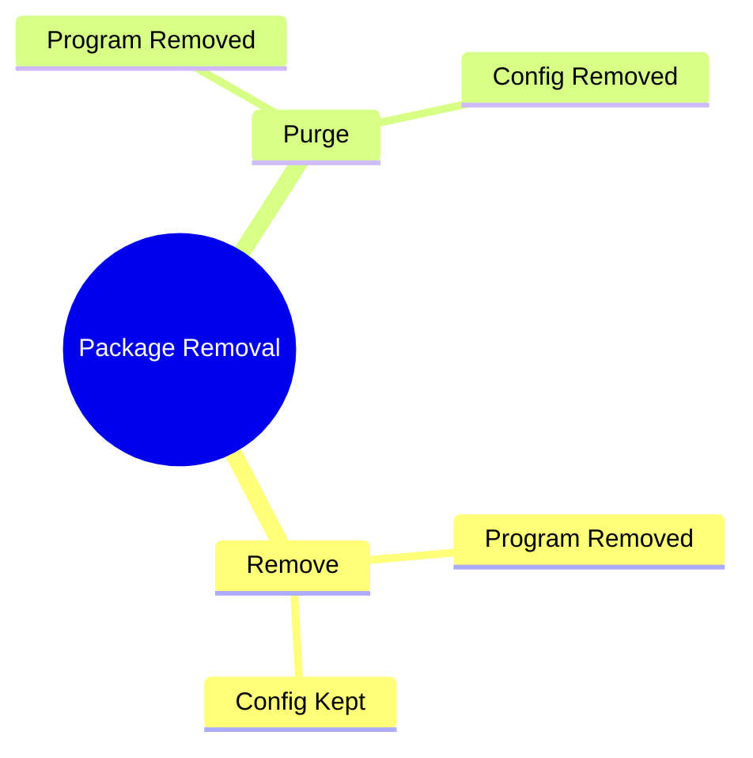
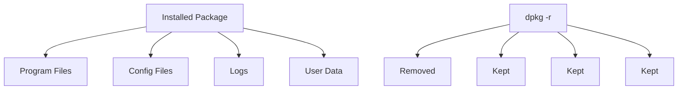
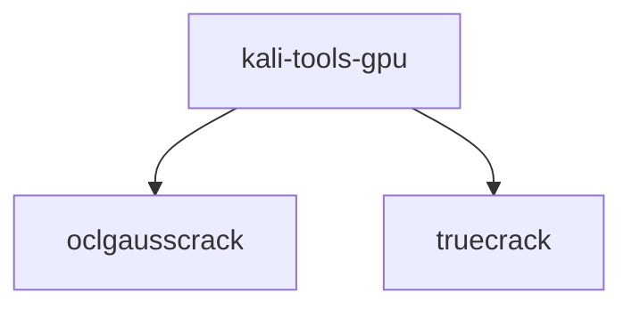
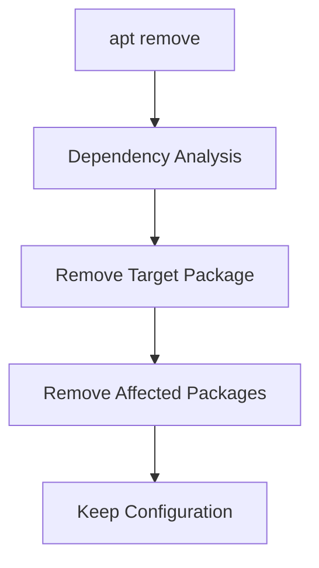
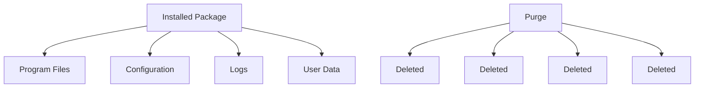
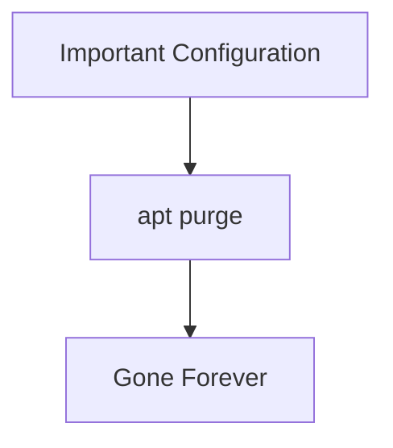
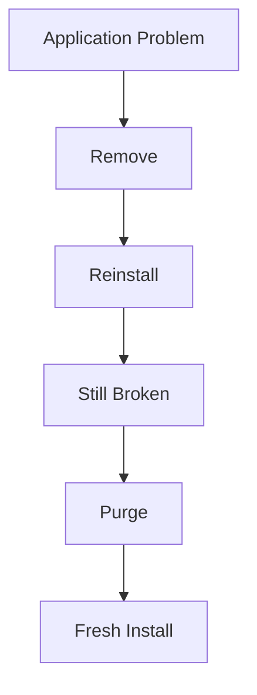
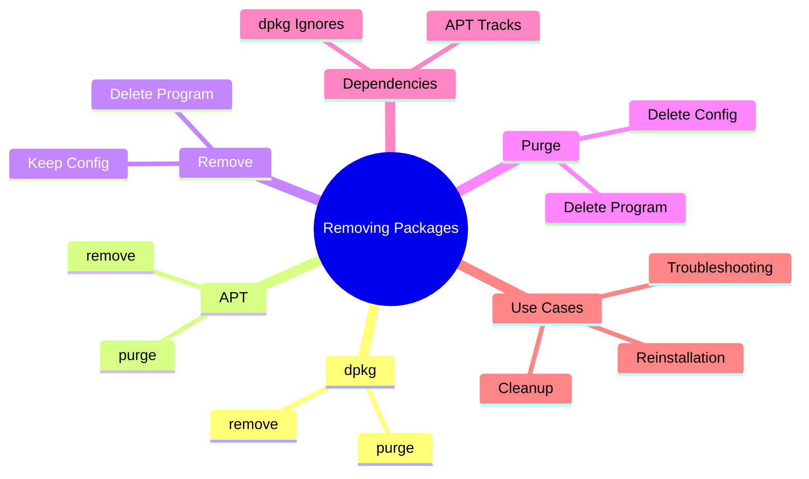

# Section 9.2.4 — Removing and Purging Packages

Installing software is easy.

The harder question is:

```text
How do I completely remove software?
```

Debian provides multiple removal methods because sometimes you want:

```text
Remove only the program

OR

Remove everything including configuration
```

Understanding this distinction is extremely important.

---

# Package Removal Lifecycle


---

# Two Removal Levels



---

# Method 1 — dpkg Remove

Command:

```bash
sudo dpkg -r package
```

or

```bash
sudo dpkg --remove package
```

Example:

```bash
sudo dpkg --remove kali-tools-gpu
```

---

# What Happens During Remove?

Suppose package installs:

```text
/usr/bin/program
/etc/program.conf
/var/log/program.log
```

---

After:

```bash
sudo dpkg -r package
```

APT removes:

```text
/usr/bin/program
```

but leaves behind:

```text
/etc/program.conf
/var/log/program.log
```

and other user-generated data.

---

# Visualizing Remove



---

# Why Keep Configuration Files?

Imagine:

```text
Remove Apache

Later reinstall Apache
```

Wouldn't it be nice if:

```text
Virtual Hosts
SSL Configurations
Custom Settings
```

were still there?

That's why remove exists.

---

# Mental Model

```text
remove = uninstall application

keep settings
```

---

# What About Dependencies?

This surprises many beginners.

Suppose:

```text
kali-tools-gpu
```

depends on:

```text
oclgausscrack
truecrack
```

---



---

Removing package:

```bash
sudo dpkg -r kali-tools-gpu
```

does NOT remove dependencies.

---

Why?

Because dpkg doesn't understand dependency trees.

Remember:

```text
dpkg = Low-Level Installer
```

---

# Removing with APT

Most users use:

```bash
sudo apt remove package
```

---

Example:

```bash
sudo apt remove kali-tools-gpu
```

APT is smarter.

It can automatically remove packages that depend on the package being removed.

---

# APT Removal Workflow



---

# Special APT Syntax

APT has a neat trick.

You can install and remove packages in the same command.

---

Example:

```bash
sudo apt install package1 package2-
```

Meaning:

```text
Install package1

Remove package2
```

---

Likewise:

```bash
sudo apt remove package1+ package2
```

Meaning:

```text
Install package1

Remove package2
```

---

# Why Does This Exist?

Suppose APT proposes:

```text
Install A
Install B
Install C
```

but you don't want:

```text
C
```

You can exclude it during dependency resolution.

---

# Remove vs Purge

This is the most important concept.

---

## Remove

```bash
sudo apt remove package
```

Result:

```text
Program Files Removed

Configuration Kept
```

---

## Purge

```bash
sudo apt purge package
```

Result:

```text
Program Files Removed

Configuration Removed
```

---

# Purge Visualized



---

# dpkg Purge

Command:

```bash
sudo dpkg -P package
```

or

```bash
sudo dpkg --purge package
```

---

Example:

```bash
sudo dpkg -P debian-cd
```

Output:

```text
Removing package
Purging configuration files
```

---

# apt Purge

Equivalent:

```bash
sudo apt purge package
```

---

Example:

```bash
sudo apt purge apache2
```

APT removes:

```text
Application
Configuration
Dependencies no longer needed
```

---

# Why Purge Is Dangerous

Imagine:

```text
MariaDB Server
```

stores:

```text
Database Configuration
Custom Tuning
```

---

After:

```bash
sudo apt purge mariadb-server
```

those settings may disappear forever.

---



---

# Real-World Analogy

Think of renting a house.

---

## Remove

```text
Move out

Leave furniture behind
```

---

## Purge

```text
Move out

Take furniture

Take curtains

Take light bulbs

Leave empty house
```

---

# Remove vs Purge Table

|Action|Program Files|Config Files|User Data|
|---|---|---|---|
|dpkg -r|❌ Remove|✅ Keep|✅ Keep|
|apt remove|❌ Remove|✅ Keep|✅ Keep|
|dpkg -P|❌ Remove|❌ Remove|❌ Remove|
|apt purge|❌ Remove|❌ Remove|❌ Remove|

_(Conceptually; exact behavior depends on package design.)_

---

# When Should You Use Remove?

Use when:

```text
You may reinstall later

You want to preserve settings

You're troubleshooting
```

---

Examples:

```text
Firefox
Apache
Nginx
VS Code
```

---

# When Should You Use Purge?

Use when:

```text
Configuration corrupted

Fresh installation needed

Software permanently removed
```

---

Examples:

```text
Broken database server

Broken web server

Bad application configuration
```

---

# Typical Workflow

Remove application:

```bash
sudo apt remove package
```

---

If reinstall doesn't solve issue:

```bash
sudo apt purge package
```

---

Reinstall clean:

```bash
sudo apt install package
```

---



---

# Mindmap Summary



---

# Commands To Memorize

Remove package:

```bash
sudo apt remove package
```

---

Purge package:

```bash
sudo apt purge package
```

---

Remove using dpkg:

```bash
sudo dpkg -r package
```

---

Purge using dpkg:

```bash
sudo dpkg -P package
```

---

# The One-Liner To Remember

```text
remove = uninstall software

purge = uninstall software + erase configuration
```

---

# Next Section: Inspecting Packages

Now we'll move into the detective tools of Debian:

```text
dpkg -L
dpkg -S
dpkg -s
dpkg -l

dpkg -c
dpkg -I

apt search
apt show
apt-cache search
apt-cache show
```

These commands answer questions like:

```
What files did this package install?

Which package owns this file?

Is this package installed?

What's inside this .deb file?

What dependencies does this package have?
```
