# Section 9.1.2 — Deep Dive into `sources.list`

Before using APT, you need to understand one critical file:

```text
/etc/apt/sources.list
```

Without it:

```text
APT cannot find packages
APT cannot update
APT cannot install software
```

Think of it as:

```text
APT's GPS
```

It tells APT:

```text
Where packages are located
```

---

# Why sources.list Exists

APT does not magically know:

```text
Where nmap lives
Where Wireshark lives
Where Metasploit lives
```

It must be told.

---

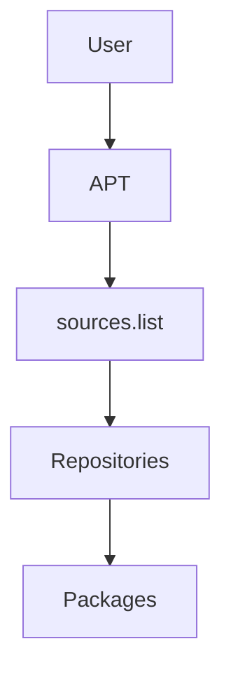

---

# Viewing the File

```bash
cat /etc/apt/sources.list
```

or

```bash
less /etc/apt/sources.list
```

---

# Example Kali sources.list

```text
# Main Kali repository
deb http://http.kali.org/kali kali-rolling main contrib non-free
```

This single line tells APT almost everything it needs to know.

---

# Anatomy of a Repository Entry

```text
deb http://http.kali.org/kali kali-rolling main contrib non-free
```

Split into:

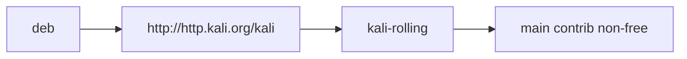

---

# Part 1 — Source Type

First field:

```text
deb
```

Means:

```text
Binary Packages
```

Ready-to-install software.

---

Another possible value:

```text
deb-src
```

Means:

```text
Source Packages
```

Source code only.

---

# Binary vs Source Packages

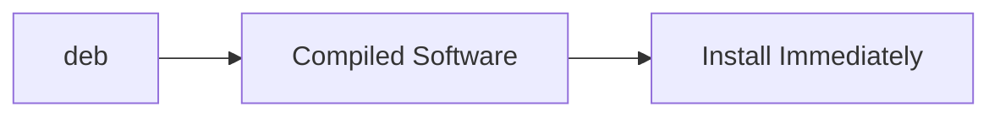

---

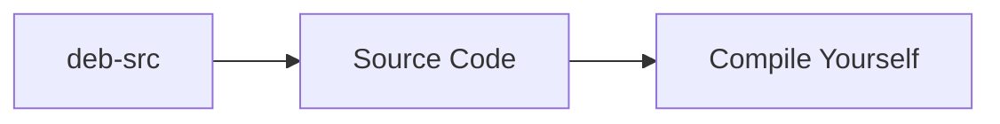

---

# Part 2 — Repository URL

Example:

```text
http://http.kali.org/kali
```

This is the repository location.

Think:

```text
Warehouse Address
```

---

APT visits:

```text
http://http.kali.org/kali
```

to download package information and packages.

---

# Different URL Types

APT supports multiple repository locations.

---

## HTTP Repository

```text
http://server/repository
```

Most common.

---

## FTP Repository

```text
ftp://server/repository
```

Older style.

---

## Local Directory

```text
file:///path/to/repository
```

Useful for:

```text
Offline Systems
Internal Repositories
USB Repositories
```

---

## Optical Media

```text
cdrom:
```

Used for:

```text
DVD
CD
Blu-ray
```

installations.

---

# Repository Source Types

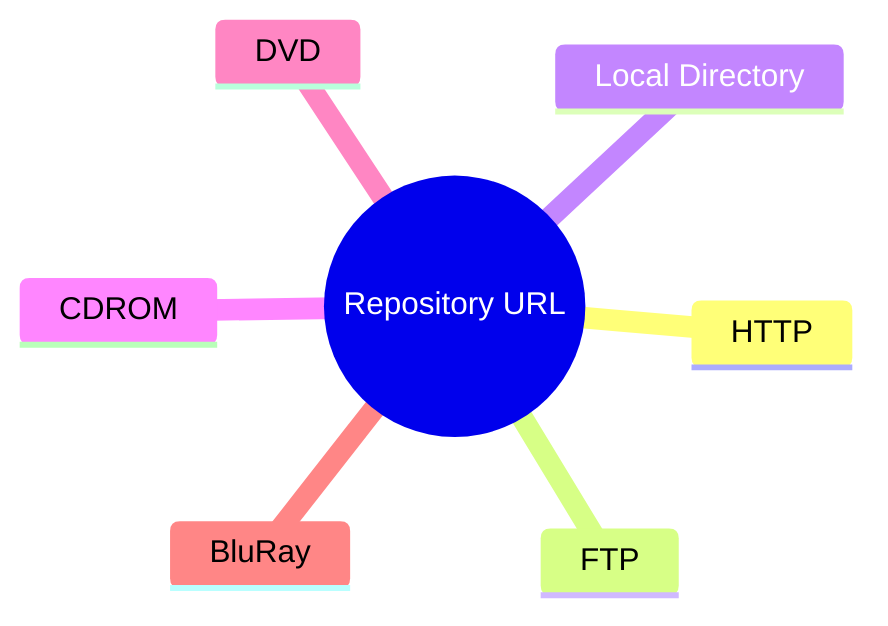

---

# Understanding CDROM Repositories

Example:

```text
deb cdrom:[Kali Linux DVD]/ kali-rolling main
```

This means:

```text
Packages are stored on a physical disk
```

---

Problem:

```text
DVD may not be inserted
```

Unlike network repositories which are always reachable.

---

Therefore Debian provides:

```bash
apt-cdrom add
```

which scans the disc and registers it with APT.

---

# CDROM Workflow

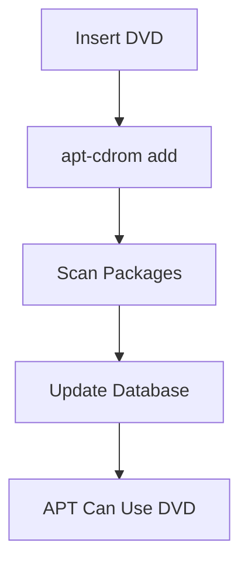

---

# Part 3 — Distribution

Example:

```text
kali-rolling
```

This tells APT:

```text
Which package collection to use
```

Think:

```text
Repository
 ├── kali-rolling
 ├── kali-dev
 └── others
```

---

# Repository Structure

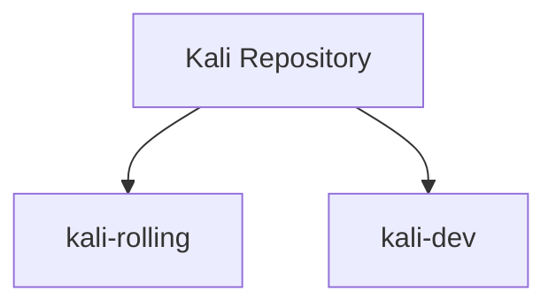

---

# Part 4 — Components

Example:

```text
main contrib non-free
```

These are repository sections.

---

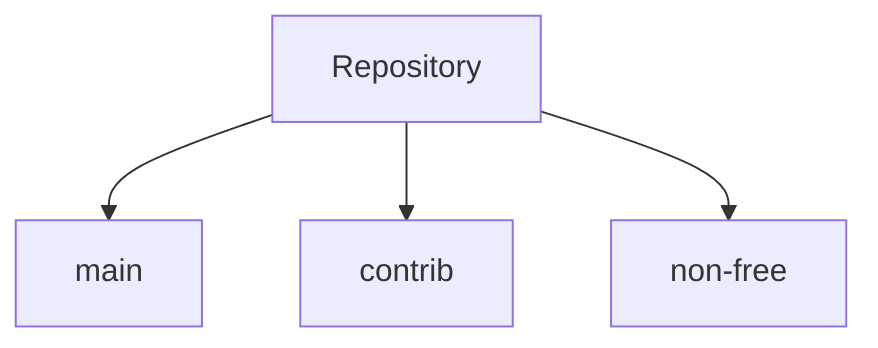

---

# What Is main?

Contains software that fully follows Debian's Free Software Guidelines.

Examples:

```text
nmap
vim
curl
john
hydra
```

---

# What Is non-free?

Contains software that:

```text
Cannot be considered fully free/open-source
```

but may still be legally distributable.

Examples:

```text
Firmware
Drivers
Vendor Utilities
```

---

# What Is contrib?

Contains open-source software that depends on non-free components.

Think:

```text
Software is free
Dependencies are not
```

---

Example:

```text
VirtualBox
```

Some build requirements or runtime pieces may be proprietary.

---

# Debian vs Kali Defaults

## Debian

By default:

```text
main
```

only.

---

## Kali

By default:

```text
main
contrib
non-free
```

all enabled.

---

# Visualizing Components

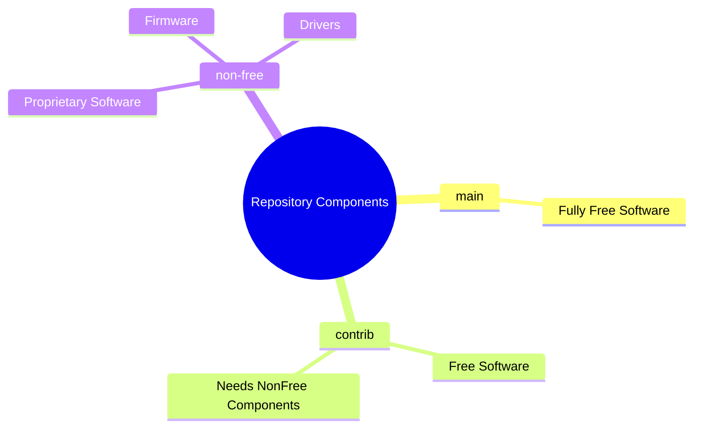

---

# The Standard Kali Repository

Most users only need:

```text
deb http://http.kali.org/kali kali-rolling main contrib non-free
```

This is the standard Kali configuration.

---

# Section 9.1.3 — Kali Repositories

Kali has several repositories.

Most users only interact with:

```text
kali-rolling
```

---

# Kali Repository Hierarchy

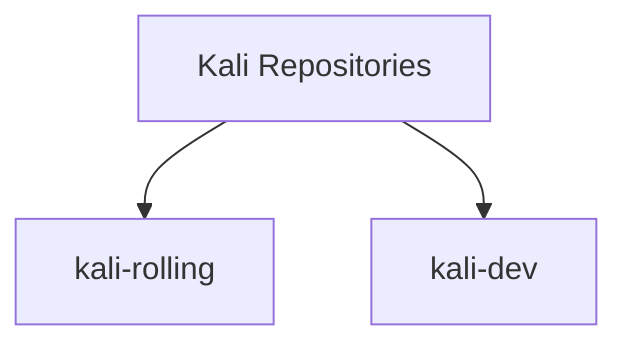

---

# Kali-Rolling

This is:

```text
The Main User Repository
```

Contains:

```text
Latest Kali Packages
Latest Debian Testing Packages
Security Tools
```

and should always be installable.

---

# Why It's Called Rolling

Traditional distributions:

```text
Release
Wait 6 months
Release Again
```

---

Rolling distributions:

```text
Continuous Updates
```

---

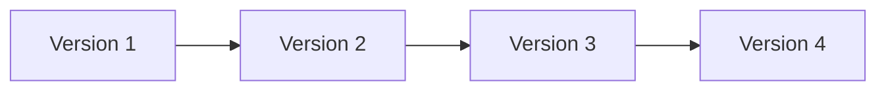

No major reinstall required.

---

# Kali-Dev

Used primarily by:

```text
Kali Developers
Package Maintainers
Testers
```

Not recommended for normal users.

---

Purpose:

```text
Dependency Testing
Package Integration
Development Work
```

---

# Important Rule

```text
Use kali-rolling

Avoid kali-dev
unless you know exactly why
you need it.
```

---

# What Is http.kali.org?

Many beginners think:

```text
http.kali.org
```

is the actual package server.

Not exactly.

---

It is a smart redirector.

---

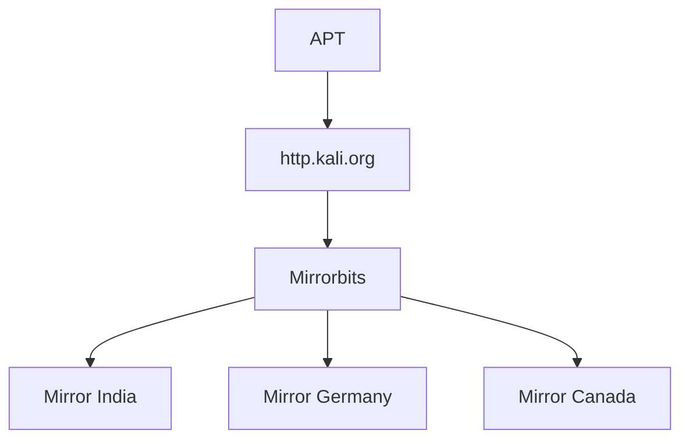

---

# Mirrorbits

Mirrorbits:

```text
Finds a nearby mirror
Checks mirror health
Redirects you automatically
```

to the best repository server.

---

# Why Mirrors Exist

Imagine one server serving:

```text
Millions of Kali Users
```

Impossible.

So Kali maintains mirrors worldwide.

---

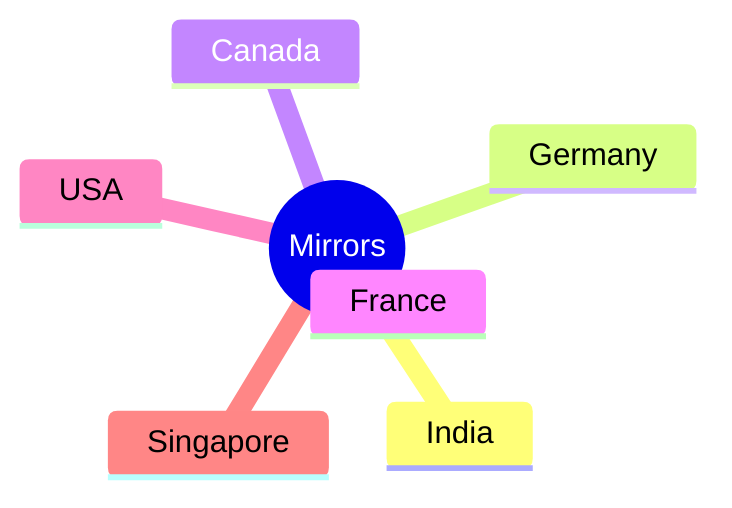

---

# How To See The Redirect

```bash
curl -sI http://http.kali.org/README
```

Example output:

```text
HTTP/1.1 302 Found
Location: http://mirror.example.org/kali/README
```

The Location field shows your actual mirror.

---

# If a Mirror Breaks

You can:

1. Edit
    

```text
/etc/apt/sources.list
```

2. Replace
    

```text
http://http.kali.org
```

with a known working mirror.

---

# Mirror List

Available via:

```text
http://http.kali.org/README?mirrorlist
```

or

```text
http://cdimage.kali.org/README?mirrorlist
```

These return known mirrors.

---

# Mindmap Summary

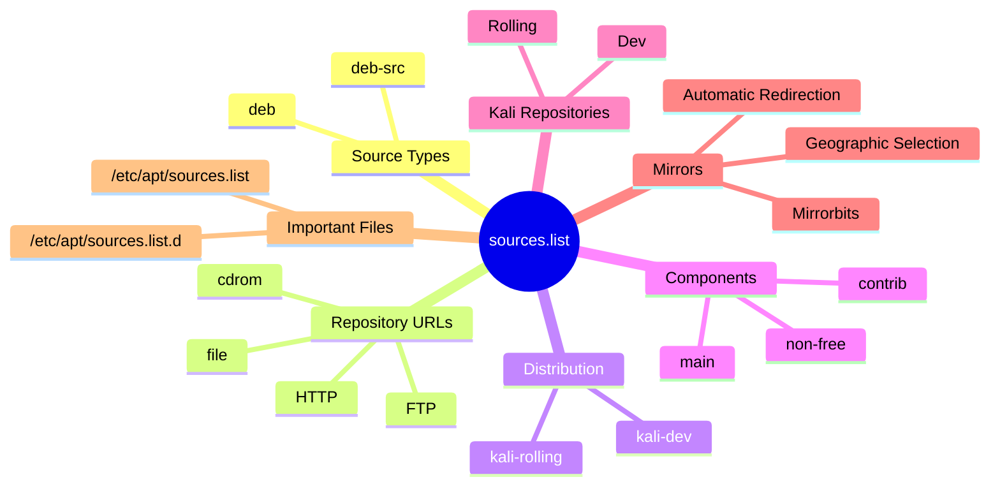

---

# Commands to Remember

View repositories:

```bash
cat /etc/apt/sources.list
```

View additional repository files:

```bash
ls /etc/apt/sources.list.d/
```

Show mirror redirection:

```bash
curl -sI http://http.kali.org/README
```

Add CD/DVD repository:

```bash
sudo apt-cdrom add
```

---

# Key Takeaways

```text
sources.list tells APT where packages live.

deb = binary packages.
deb-src = source packages.

main = fully free software.
contrib = free software needing non-free components.
non-free = proprietary software.

kali-rolling is the normal repository.

http.kali.org is a smart mirror redirector,
not the actual repository server.
```

Next comes **9.2 Basic Package Interaction**, where APT finally becomes practical: `apt update`, `apt install`, `dpkg -i`, unpacking packages, configuring packages, triggers, dependencies, and the complete lifecycle of package installation.