# Section 9.1.2 — Repositories, Package Sources, and `/etc/apt/sources.list`

Now that you understand:

```text
APT = Smart package manager

dpkg = Actual installer
```

the next question is:

> Where does APT get packages from?

---

# Imagine There Were No Repositories

Suppose you want to install:

```text
nmap
```

How would APT find it?

It needs a location that stores packages.

Just like:

```text
Google Play Store stores Android Apps

Apple App Store stores iPhone Apps

APT Repositories store Linux Packages
```

---

# What Is a Repository?

A repository is simply:

```text
A storage location containing packages
```

Repositories can exist on:

- Web servers
    
- FTP servers
    
- Local directories
    
- DVDs
    
- USB drives
    
- Internal company servers
    

---

# Repository Concept

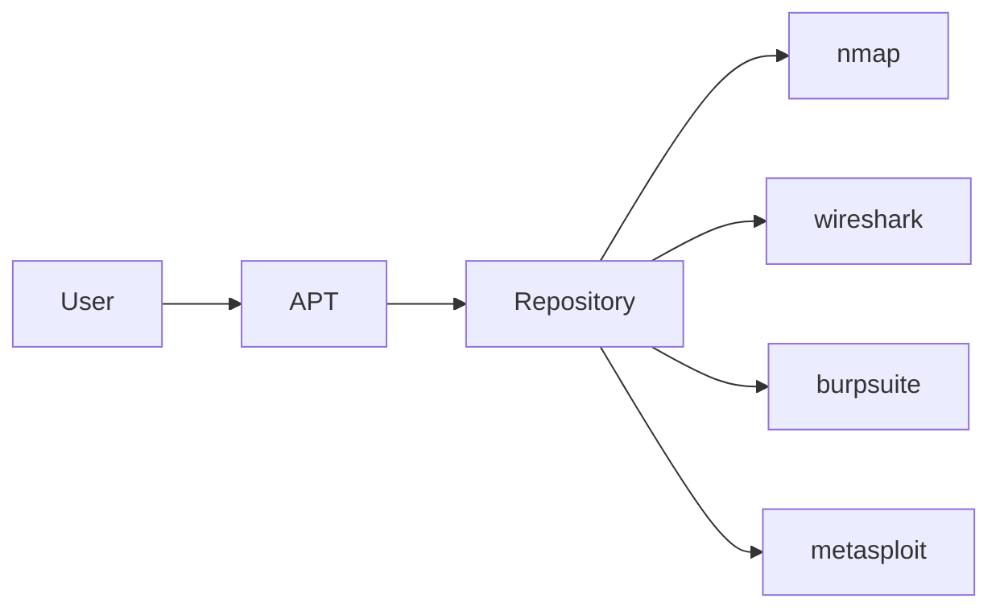

---

# Think of a Repository Like a Warehouse

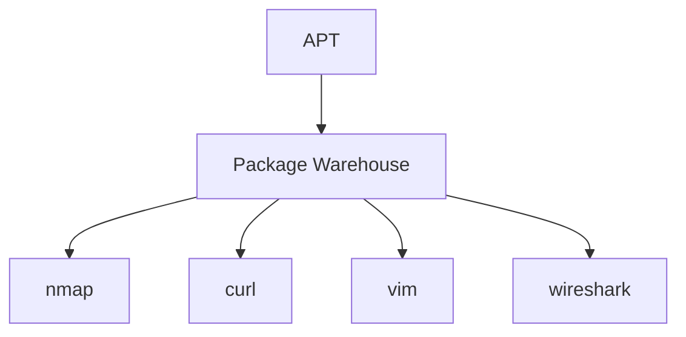

APT goes to the warehouse and says:

```text
Give me nmap
```

Repository responds:

```text
Here is nmap

It also needs:
libpcap
libssl
zlib
```

APT downloads everything.

---

# Package Source vs Source Package

This is one of the most confusing concepts in Debian.

The word:

```text
source
```

has two completely different meanings.

---

# Package Source

Means:

```text
Location where packages are stored
```

Examples:

```text
Kali Repository
DVD
FTP Server
Web Server
Local Folder
```

Think:

```text
Package Source = Package Store
```

---

# Source Package

Means:

```text
Source code of software
```

Example:

```text
nmap source code
```

Contains:

```text
.c files
.h files
build scripts
```

Think:

```text
Source Package = Recipe
```

---

# Comparison

|Term|Meaning|
|---|---|
|Package Source|Where packages come from|
|Source Package|Source code package|

---

# Easy Memory Trick

Imagine a pizza.

---

## Package Source

```text
Pizza Shop
```

Where you obtain the pizza.

---

## Source Package

```text
Pizza Recipe
```

How pizza is made.

---

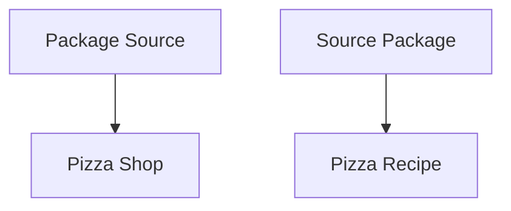

---

# How Does APT Know Repositories Exist?

APT reads:

```text
/etc/apt/sources.list
```

This file tells APT:

```text
Where packages live
```

---

# Repository Lookup Process

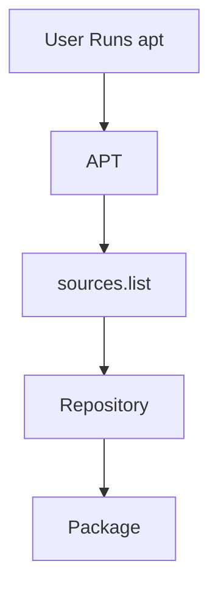

---

# Viewing Repository Configuration

```bash
cat /etc/apt/sources.list
```

or

```bash
less /etc/apt/sources.list
```

---

# Example Kali Repository Entry

```text
deb http://http.kali.org/kali kali-rolling main contrib non-free
```

Looks scary.

Let's break it down.

---

# Anatomy of a Repository Line

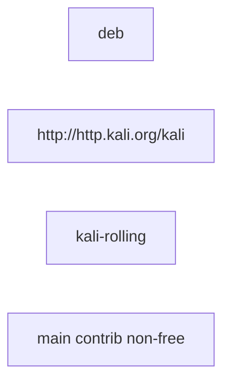

---

# Part 1 — deb

```text
deb
```

means:

```text
Binary Packages
```

APT should download ready-to-install packages.

---

# Part 2 — Repository URL

```text
http://http.kali.org/kali
```

means:

```text
Location of repository
```

Think:

```text
Warehouse Address
```

---

# Part 3 — Distribution

```text
kali-rolling
```

means:

```text
Which package collection to use
```

For Kali:

```text
kali-rolling
```

is the normal distribution.

---

# Part 4 — Components

```text
main contrib non-free
```

These are package categories.

---

# Repository Structure

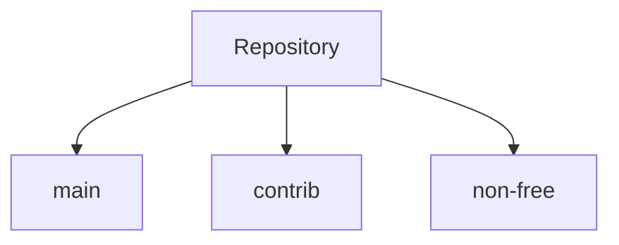

---

# Main

Contains:

```text
Fully supported open-source software
```

Examples:

```text
nmap
vim
curl
```

---

# Contrib

Contains:

```text
Open-source software
that depends on
non-open-source software
```

---

# Non-Free

Contains:

```text
Software not completely open source
```

Often includes:

```text
Firmware
Drivers
Vendor Software
```

---

# Real Example

Suppose your WiFi card requires:

```text
Broadcom Firmware
```

APT may install it from:

```text
non-free
```

---

# What Happens During apt update?

Most beginners think:

```bash
apt update
```

downloads software.

It doesn't.

---

# apt update Actually Does

```text
Downloads package lists
```

APT asks repositories:

```text
What packages do you have?
What versions?
What dependencies?
```

---

# apt update Workflow

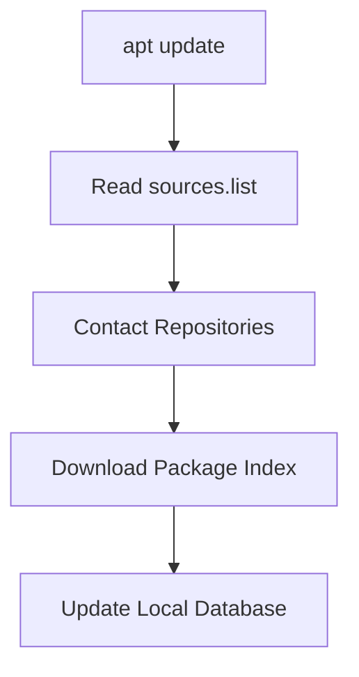

---

# Package Index

Think of it as:

```text
Repository Catalog
```

Like Amazon's product catalog.

Not the products themselves.

---

# Example

Repository contains:

```text
100,000 Packages
```

APT doesn't download all 100,000.

It downloads:

```text
Package Names
Versions
Dependencies
Descriptions
```

only.

---

# Why apt update Is Important

Without updating:

APT's local database may be old.

Example:

Repository has:

```text
nmap 8.0
```

Your system still thinks:

```text
nmap 7.9
```

exists.

---

# apt update Fixes This

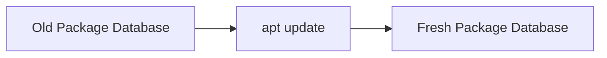

---

# What Happens During apt install?

Example:

```bash
sudo apt install nmap
```

APT:

1. Checks package database
    
2. Finds nmap
    
3. Finds dependencies
    
4. Downloads packages
    
5. Calls dpkg
    
6. Installs software
    

---

# Full Installation Flow

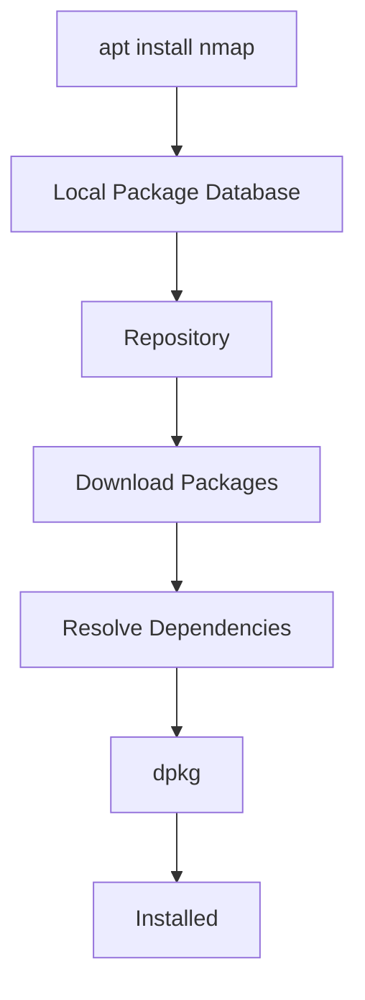

---

# Where Are Repository Definitions Stored?

Historically:

```text
/etc/apt/sources.list
```

Modern Debian/Kali also use:

```text
/etc/apt/sources.list.d/
```

---

# Why sources.list.d Exists

Instead of one giant file:

```text
sources.list
```

APT can load multiple files.

---

Example:

```text
sources.list

docker.list

google-chrome.list

virtualbox.list
```

---

# Modern Repository Layout

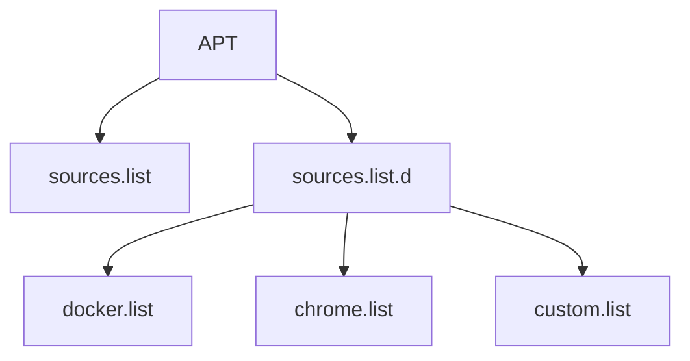

---

# Why This Matters for Kali Users

Many security tools are not included in Kali.

You may later add repositories for:

```text
Docker
Visual Studio Code
Google Chrome
Hashicorp
Cisco Tools
```

APT will read them automatically.

---

# Mindmap Summary

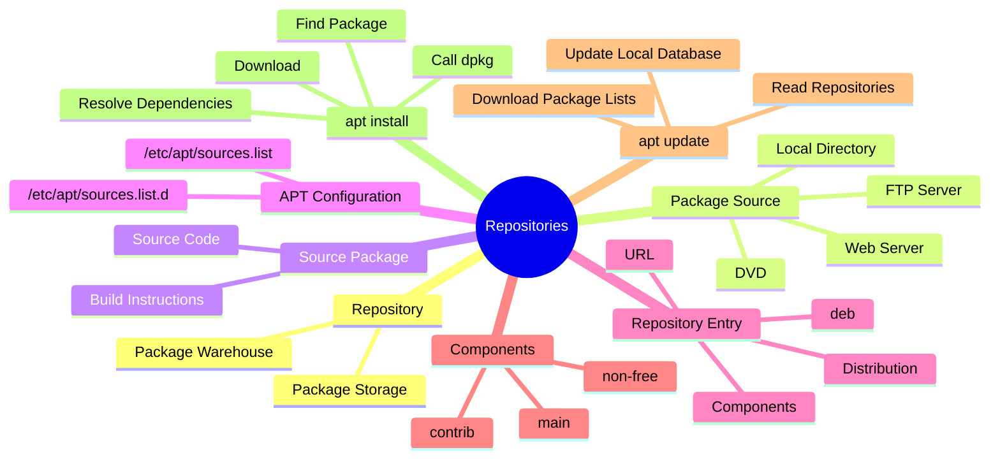

---

# Commands You Should Remember

View repositories:

```bash
cat /etc/apt/sources.list
```

List additional repositories:

```bash
ls /etc/apt/sources.list.d/
```

Refresh package information:

```bash
sudo apt update
```

Install package:

```bash
sudo apt install <package>
```

---

# Before Moving On

You should now understand:

### What is a repository?

```text
A storage location containing packages.
```

### What is a package source?

```text
A repository where packages are stored.
```

### What is a source package?

```text
A package containing source code.
```

### What does apt update do?

```text
Downloads repository package lists,
not actual software.
```

### What file tells APT where repositories are?

```text
/ etc / apt / sources.list
```

(remove the spaces when typing)

---

The next section should be **how Debian packages are actually built internally** — unpacking a `.deb`, understanding package metadata, control files, maintainer scripts, dependency declarations, and how `dpkg` keeps track of installed packages. That's where Debian packaging starts becoming really interesting.