# Section 9.2.7 — Frontends: aptitude and Synaptic

Until now you've learned:

```text
APT = Package Management Engine

dpkg = Package Installer
```

But neither of these are really the user interface.

Historically, Debian developers built a library called:

```text
libapt-pkg
```

which contains most of APT's package management logic.

---

# Architecture Overview

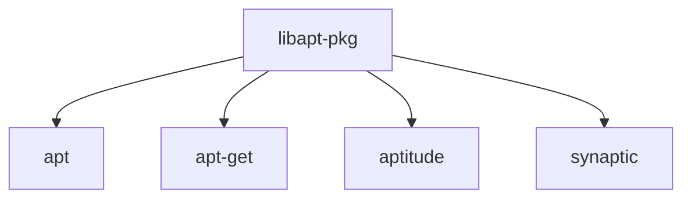

Think:

```text
libapt-pkg = Engine

apt = Command-Line Interface

aptitude = Advanced Interface

synaptic = GUI Interface
```

---

# Why Frontends Exist

Package management involves:

```text
Searching Packages
Viewing Dependencies
Installing Software
Removing Software
Upgrading System
Resolving Conflicts
```

Different users prefer different interfaces.

---

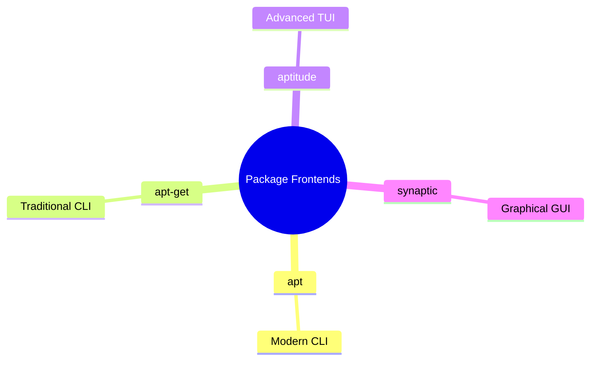

---

# What Is aptitude?

aptitude is:

```text
An Interactive Package Manager
```

It runs inside a terminal.

Think:

```text
A GUI-like package manager
inside a terminal window
```

---

# Installing aptitude

```bash
sudo apt install aptitude
```

---

# Starting aptitude

```bash
sudo aptitude
```

---

# Interface Layout

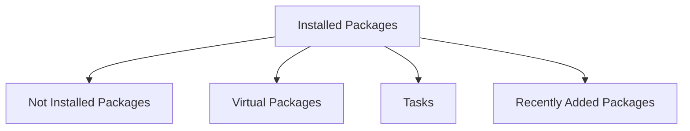

Packages are grouped into categories.

---

# Package Tree Structure

Unlike apt:

```bash
apt search nmap
```

which shows a flat list,

aptitude uses:

```text
Category Tree
```

---

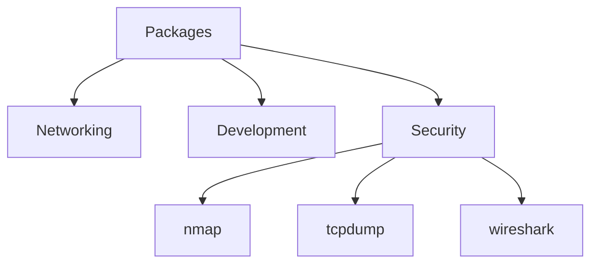

---

# Navigating aptitude

Expand category:

```text
Enter
+
```

Collapse category:

```text
-
```

or fold branches.

---

# Package Actions

|Key|Action|
|---|---|
|+|Install|
|-|Remove|
|_|Purge|
|u|Update Package Lists|
|U|Full Upgrade Preparation|
|g|Apply Changes|
|q|Quit|

---

# Typical Workflow

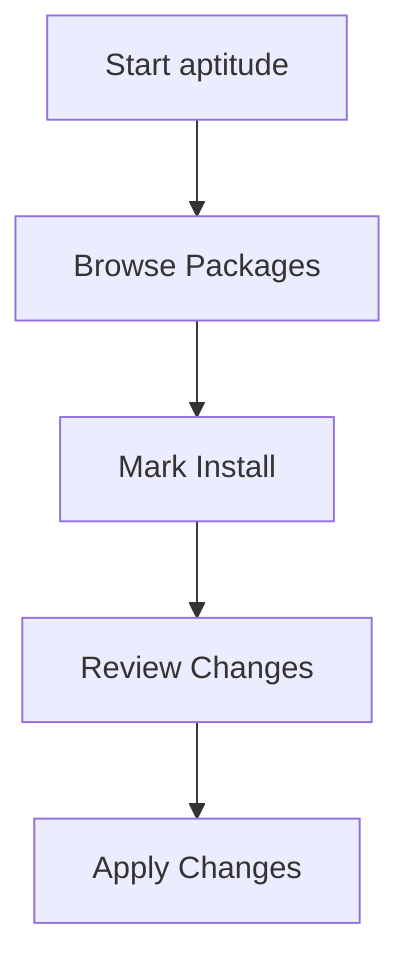

---

# Why Administrators Like aptitude

APT typically says:

```text
Package A depends on Package B
```

and gives one solution.

---

aptitude often provides:

```text
Solution 1

Solution 2

Solution 3
```

for dependency conflicts.

This makes it much smarter in difficult package situations.

---

# Better Dependency Solver

Suppose:

```text
Package A requires B

Package C conflicts with B
```

APT might fail.

---

aptitude tries multiple possibilities.

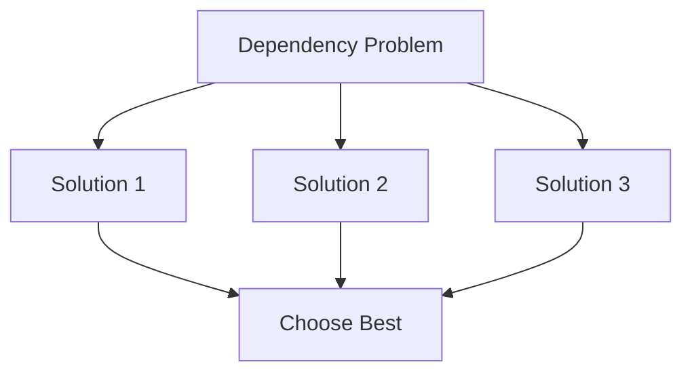

---

# Finding Broken Packages

If dependency problems exist:

```text
Broken Packages: 3
```

appears at the top.

Press:

```text
b
```

to jump directly to broken packages.

---

# Package Search in aptitude

Press:

```text
/
```

Then search.

Example:

```text
nmap
```

---

# Advanced Search Patterns

Search description:

```text
~dwireless
```

Meaning:

```text
Packages whose description contains wireless
```

---

Search package section:

```text
~ssecurity
```

Meaning:

```text
Packages in security section
```

---

# Search Pattern Concept

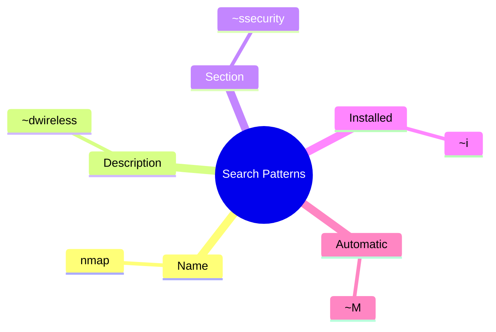

---

# Filtering Package Lists

Press:

```text
l
```

for:

```text
Limit
```

Then provide a pattern.

---

Example:

```text
~i
```

Shows:

```text
Installed Packages Only
```

---

# Automatic vs Manual Packages

Remember:

```text
APT tracks:

Manual Packages
Automatic Packages
```

---

Manual:

```text
Installed because YOU requested them
```

Automatic:

```text
Installed as dependencies
```

---

Example

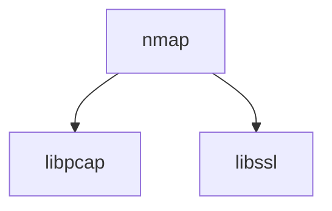

---

```text
nmap = Manual

libpcap = Automatic

libssl = Automatic
```

---

# Marking Packages Automatic

In aptitude:

```text
Shift+m
```

Marks package:

```text
Automatic
```

---

Remove automatic flag:

```text
m
```

---

Automatic packages display:

```text
A
```

next to their name.

---

# Viewing Only Manual Packages

Useful filter:

```text
~i!~M
```

Meaning:

```text
Installed

AND

Not Automatic
```

---

Translation:

```text
Show only packages
I intentionally installed
```

---

# aptitude Command-Line Mode

Many people don't know this.

aptitude is both:

```text
Interactive Program

AND

CLI Tool
```

---

Example:

```bash
aptitude search nmap
```

---

Install package:

```bash
sudo aptitude install nmap
```

---

Remove package:

```bash
sudo aptitude remove nmap
```

---

# Mass Package Operations

Example:

```bash
aptitude markauto '~slibs|~sperl'
```

This means:

```text
Mark all packages
from libs section

OR

perl section

as automatic
```

---

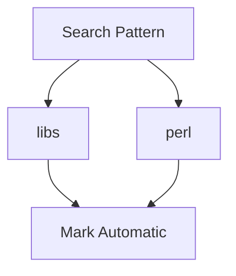

---

# Recommendations vs Suggestions

Many users confuse these.

---

# Dependency

```text
Required
```

Without it:

```text
Software may not work
```

---

# Recommendation

```text
Strongly Recommended
```

Usually useful.

---

# Suggestion

```text
Optional
```

Nice to have.

---

# Relationship Hierarchy

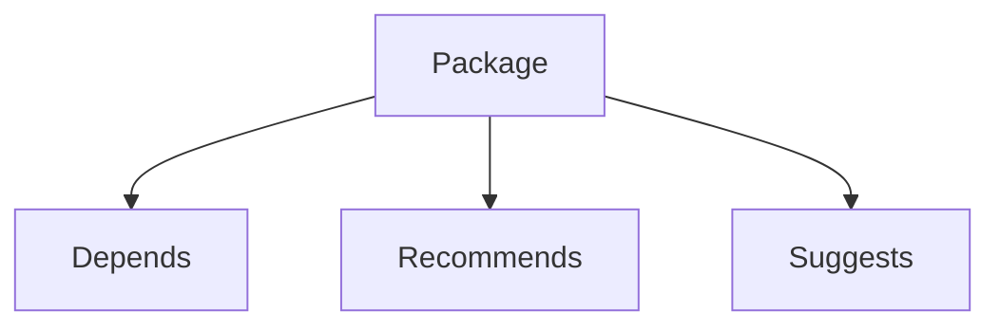

---

# Example

Suppose:

```text
GNOME
```

recommends:

```text
gdebi
```

---

aptitude automatically selects:

```text
gdebi
```

but marks it:

```text
Automatic
```

---

You can deselect it before installation.

---

# Tasks

Debian supports:

```text
Tasks
```

Think:

```text
Package Collections
```

---

Examples:

```text
Desktop Environment

Web Server

SSH Server

Forensics Toolkit
```

---

Task Structure

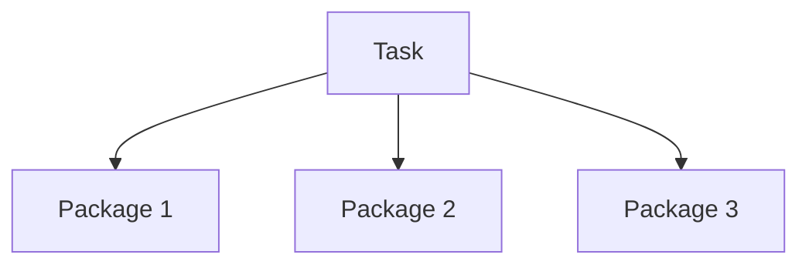

---

Instead of installing:

```text
50 Packages
```

one by one,

install:

```text
Task
```

once.

---

# Aptitude Log

Like dpkg:

```text
/var/log/dpkg.log
```

aptitude also logs activity.

Location:

```text
/var/log/aptitude
```

---

# Difference Between Logs

## dpkg Log

Low-level.

Records:

```text
Install
Unpack
Configure
Remove
```

---

## aptitude Log

High-level.

Records:

```text
Upgrade System

Install Group

Remove Group
```

---

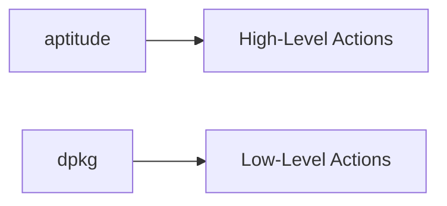

---

# What Is Synaptic?

Synaptic is:

```text
A Full Graphical Package Manager
```

Built using:

```text
GTK+
```

---

Install:

```bash
sudo apt install synaptic
```

---

Start:

```bash
synaptic
```

or

```text
Applications
→ Synaptic Package Manager
```

---

# Synaptic Architecture

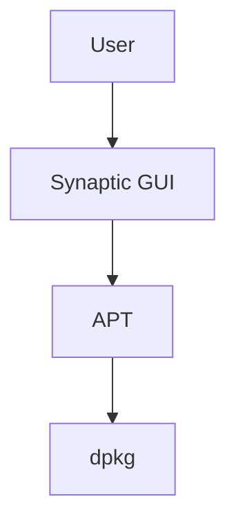

---

# What Makes Synaptic Useful?

Provides ready-made filters.

Examples:

```text
Installed Packages

Upgradable Packages

Obsolete Packages

New Packages

Broken Packages
```

---

# Synaptic Workflow

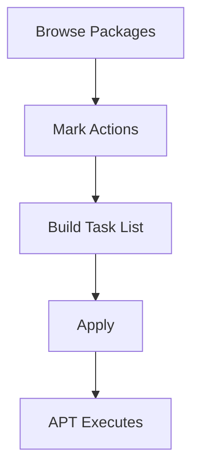

---

# Key Difference From aptitude

## aptitude

```text
Terminal-Based

Keyboard Driven

Advanced Dependency Solver
```

---

## Synaptic

```text
Graphical

Mouse Driven

Easy for Beginners
```

---

# Comparison

|Feature|apt|aptitude|synaptic|
|---|---|---|---|
|CLI|✅|✅|❌|
|Interactive UI|❌|✅||
|GUI|❌|❌|✅|
|Dependency Solver|Good|Better|Good|
|Search Patterns|Basic|Advanced|GUI Filters|
|Beginner Friendly|Medium|Medium|High|

---

# Mindmap Summary

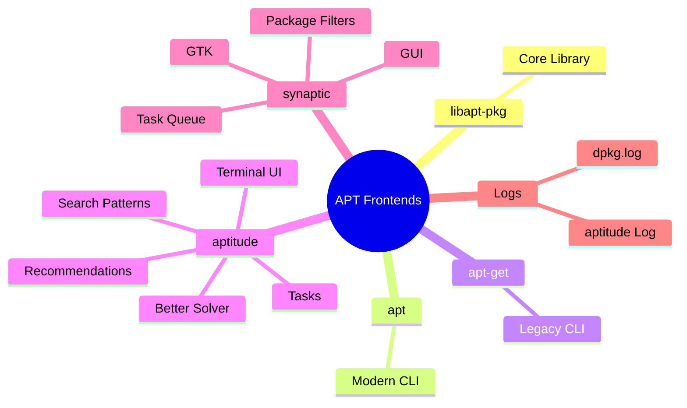

---

# Commands To Remember

Install aptitude:

```bash
sudo apt install aptitude
```

Start aptitude:

```bash
sudo aptitude
```

Search using aptitude:

```bash
aptitude search nmap
```

Install synaptic:

```bash
sudo apt install synaptic
```

Start synaptic:

```bash
synaptic
```

---

# The Mental Model

```text
dpkg = Package Installer

APT = Package Manager Engine

apt = Standard CLI Frontend

aptitude = Advanced Interactive Frontend

synaptic = Graphical Frontend
```

This completes the major package-management workflow:

```text
Repositories
    ↓
APT
    ↓
dpkg
    ↓
Installation

and

Frontends
    ↓
apt
aptitude
synaptic
```

The next big topic after this in Kali Linux Revealed is usually **package internals and creating/modifying Debian packages**, where you'll finally see how `.deb` files are structured and built.