# Section 9.4 — Digging Deep Into Debian Packages

Until now you've been using:

```text
apt install
apt remove
apt upgrade
```

without really knowing what happens internally.

This section answers:

```text
What is inside a .deb file?

How does dpkg know what to install?

How are dependencies stored?

How do installation scripts work?

How does dpkg know which files belong to a package?

How are configuration files protected?
```

This is where you stop being an APT user and start understanding how Debian packaging actually works.

---

# Mental Model

Think of a Debian package as:

```text
ZIP File
+
Metadata
+
Installation Instructions
```

---

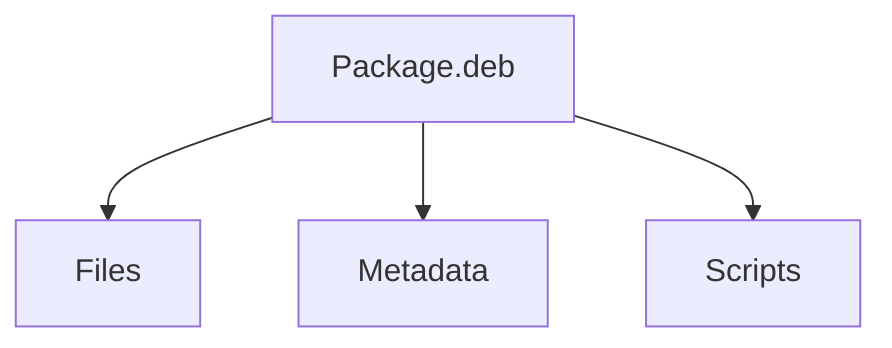

---

# Section 9.4.1 — Anatomy of a .deb Package

A Debian package is actually:

```text
ar archive
```

which contains three files.

---

# Package Structure

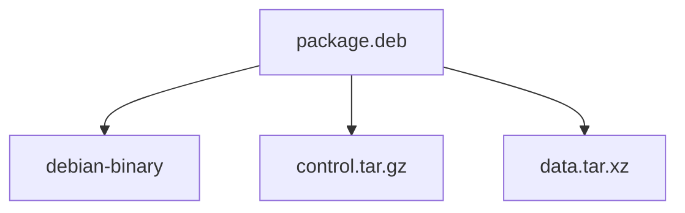

---

# View Package Structure

```bash
ar t package.deb
```

Example output:

```text
debian-binary
control.tar.gz
data.tar.xz
```

---

# debian-binary

Contains only:

```text
Package Format Version
```

Example:

```bash
ar p package.deb debian-binary
```

Output:

```text
2.0
```

---

# control.tar.gz

Contains:

```text
Metadata
Dependencies
Package Information
Scripts
Checksums
```

---

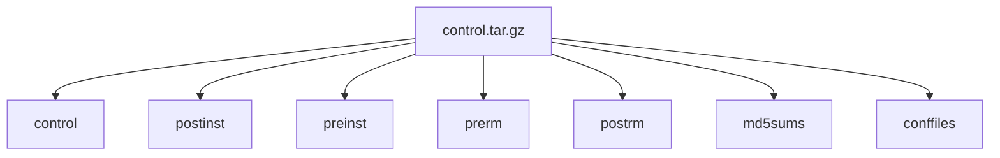

---

# data.tar.xz

Contains:

```text
Actual Files
```

that get copied into:

```text
/bin
/usr
/etc
/var
```

and elsewhere.

---

Example:

```text
/usr/bin/nmap
/usr/share/man
/etc/nmap
```

---

# Installation Flow

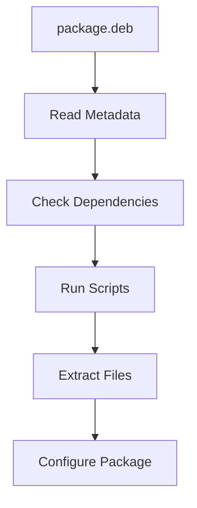

---

# Section 9.4.2 — The control File

The most important file inside a package.

Think of it as:

```text
Package Identity Card
```

---

View it:

```bash
dpkg -I package.deb
```

---

Example Fields

```text
Package
Version
Architecture
Depends
Recommends
Suggests
Breaks
Provides
Conflicts
Replaces
Description
```

---

# Control File Mindmap

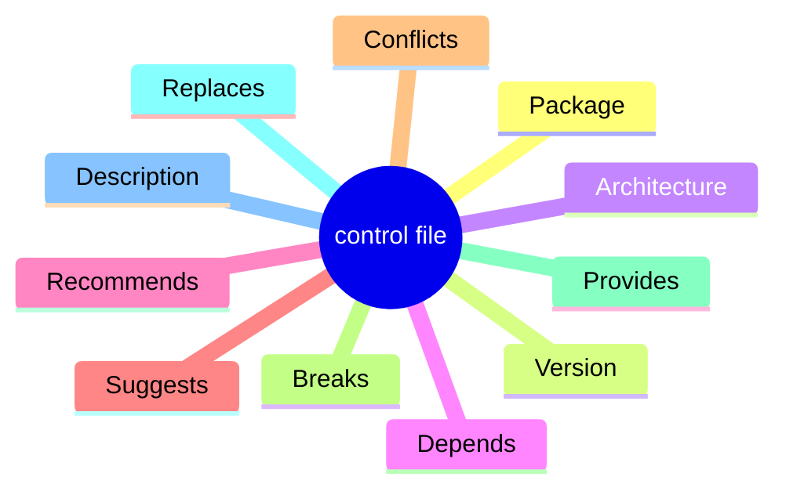

---

# Dependencies — Depends

Example:

```text
Depends:
 libc6 (>= 2.15)
 libssl3
```

Meaning:

```text
Must Be Installed
```

before package can work.

---

# Dependency Example

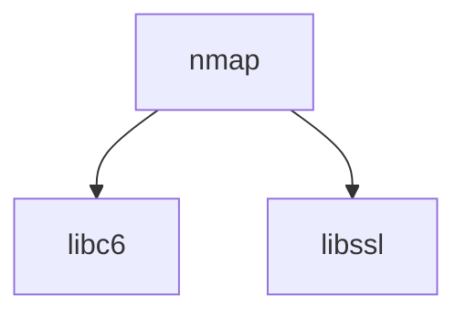

---

# Version Operators

|Operator|Meaning|
|---|---|
|<<|Less Than|
|<=|Less Than Or Equal|
|=|Equal|
|>=|Greater Than Or Equal|
|>>|Greater Than|

---

# Logical Operators

Comma:

```text
AND
```

Example:

```text
A, B
```

means:

```text
A AND B
```

---

Pipe:

```text
|
```

means:

```text
OR
```

Example:

```text
gpgv | gpgv2
```

means:

```text
Either Package Works
```

---

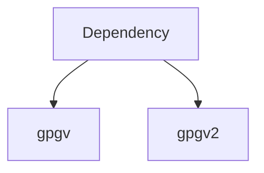

---

# Metapackages

A metapackage contains:

```text
Almost No Files
```

only dependencies.

---

Example:

```text
kali-linux-large
kali-tools-wireless
gnome
```

---

# Metapackage Concept

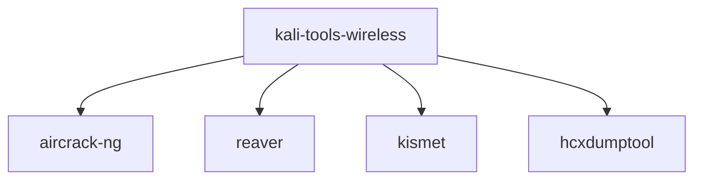

Installing one package installs everything.

---

# Pre-Depends

Stronger than Depends.

Normal:

```text
Dependency must exist
before package configuration
```

---

Pre-Depends:

```text
Dependency must exist
before installation starts
```

---

# Why Pre-Depends Is Rare

It forces strict ordering.

---

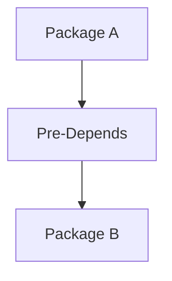

APT developers discourage excessive use.

---

# Recommends

Very useful.

Not mandatory.

---

Example:

```text
firefox
```

might recommend:

```text
language-pack
```

---

Without it:

```text
Works Fine

Less Convenient
```

---

# Suggests

Even weaker.

---

Example:

```text
wireshark
```

may suggest:

```text
tcpdump
```

---

Meaning:

```text
Nice To Have
```

but not required.

---

# Relationship Hierarchy

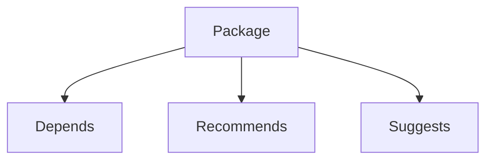

---

# Enhances

Opposite direction.

Normally:

```text
Firefox
Suggests Adblock
```

---

Enhances:

```text
Adblock
Enhances Firefox
```

---

# Conflicts

Means:

```text
Cannot Coexist
```

---

Example:

```text
Package A
Conflicts Package B
```

---

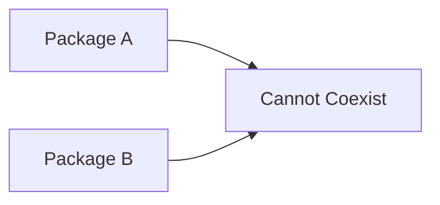

---

# Real Example

Mail Servers:

```text
postfix
sendmail
```

Usually only one should run.

---

# Breaks

Different from Conflicts.

Means:

```text
This Version
Breaks Another Version
```

---

Example:

```text
App v2

Breaks

Library v1
```

APT tries to upgrade the broken package.

---

# Provides

One of Debian's coolest features.

Creates:

```text
Virtual Packages
```

---

Example:

```text
mail-transport-agent
```

doesn't actually exist.

---

Packages providing it:

```text
postfix
sendmail
exim
```

---

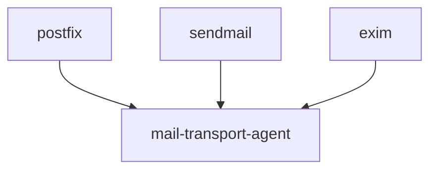

---

# Virtual Package vs Metapackage

|Metapackage|Virtual Package|
|---|---|
|Real .deb|No .deb|
|Exists Physically|Logical Name|
|Only Dependencies|Service Identifier|

---

# Replaces

Allows package to overwrite files owned by another package.

---

Without Replaces:

```text
dpkg Error

File Already Exists
```

---

With Replaces:

```text
New Package Takes Ownership
```

---

# Section 9.4.3 — Configuration Scripts

Every package may contain scripts.

Think:

```text
Automation Hooks
```

---

# Available Scripts

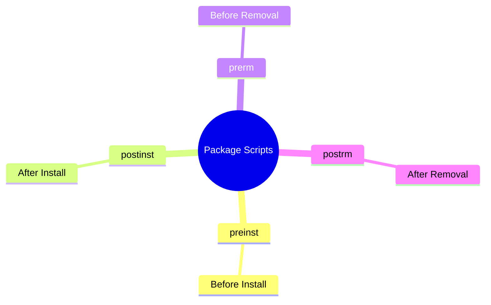

---

# Installation Timeline

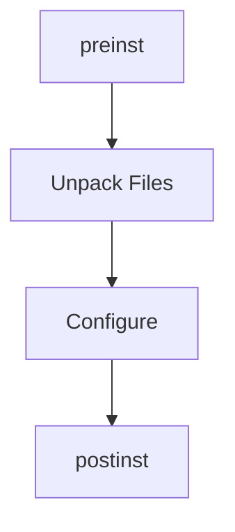

---

# Removal Timeline

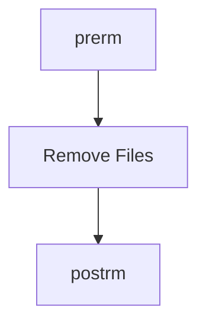

---

# Where Installed Scripts Live

```text
/var/lib/dpkg/info/
```

Example:

```text
zsh.postinst
zsh.preinst
zsh.prerm
zsh.postrm
```

---

# The dpkg Database

This directory is basically:

```text
dpkg's Brain
```

---

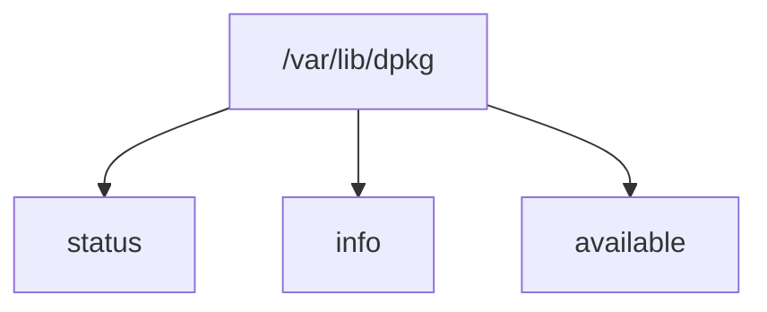

---

# Package File List

Example:

```text
/var/lib/dpkg/info/zsh.list
```

Contains:

```text
Every Installed File
```

---

Why:

```text
dpkg knows exactly
what belongs to package
```

---

# Package Status Database

File:

```text
/var/lib/dpkg/status
```

Contains:

```text
Installed Packages
Versions
States
```

---

Example:

```text
Status: install ok installed
```

---

# Section 9.4.4 — debconf

Before debconf:

Packages asked questions like:

```bash
echo "Enter Hostname"
read HOST
```

Terrible for large installs.

---

# Modern Solution

```text
debconf
```

---

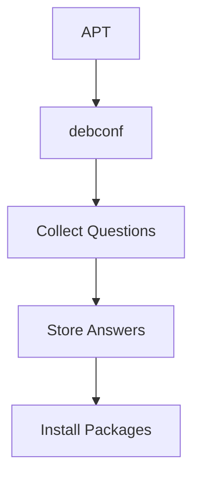

---

# Benefits

```text
Localization

GUI Interfaces

Text Interfaces

Non-Interactive Mode

Central Answer Database
```

---

# Section 9.4.5 — Checksums and Conffiles

Inside:

```text
control.tar.gz
```

you'll often see:

```text
md5sums
conffiles
```

---

# md5sums

Stores checksums.

Used by:

```bash
dpkg --verify
```

---

Purpose:

```text
Detect Modified Files
```

---

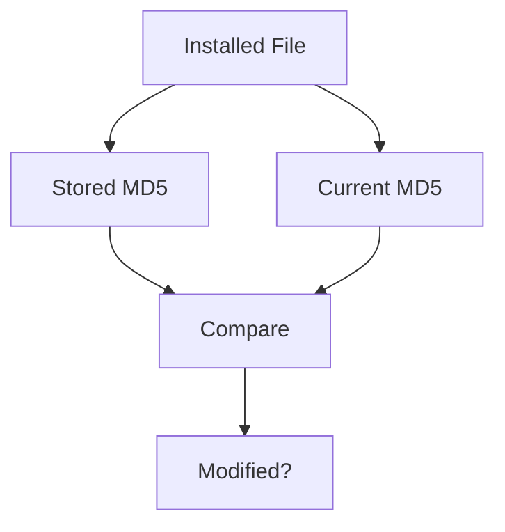

---

# conffiles

Lists:

```text
Configuration Files
```

that need special handling.

---

Example:

```text
/etc/ssh/sshd_config
/etc/apache2/apache2.conf
```

---

# Upgrade Problem

Suppose:

```text
Admin Modified Config
```

and

```text
New Package Version
Contains New Config
```

Which should win?

---

# dpkg's Decision Tree

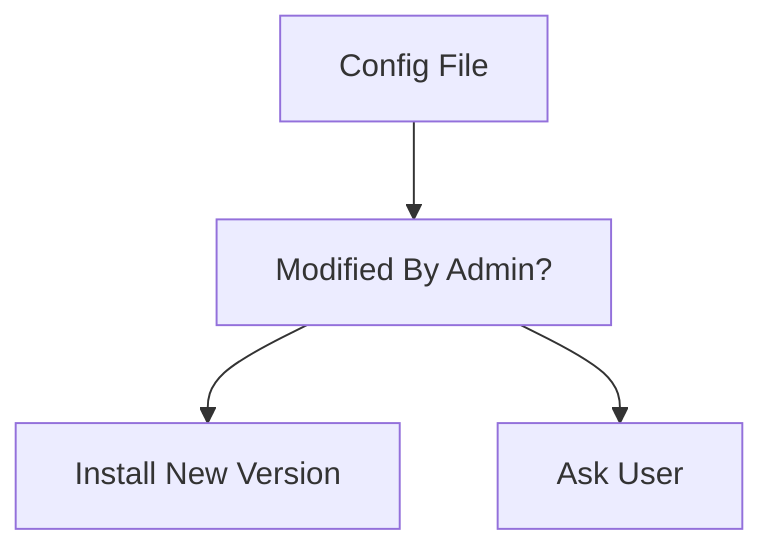

---

# Backup Files

If you keep old config:

```text
newfile.dpkg-dist
```

appears.

---

If you accept new config:

```text
oldfile.dpkg-old
```

appears.

---

# Automating Config Decisions

Keep old configs:

```bash
--force-confold
```

Use new configs:

```bash
--force-confnew
```

Auto decide:

```bash
--force-confdef
```

---

APT Example

```bash
apt \
-o DPkg::options::="--force-confdef" \
-o DPkg::options::="--force-confold" \
full-upgrade
```

---

# Complete Package Lifecycle

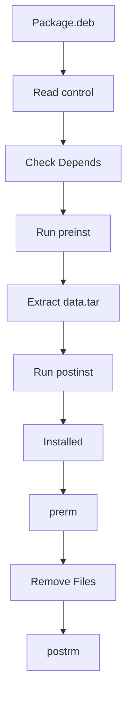

---

# Mindmap Summary

```mermaid
mindmap
  root((Debian Package Internals))

    deb

      debian-binary
      control.tar.gz
      data.tar.xz

    control

      Depends
      Recommends
      Suggests
      Conflicts
      Breaks
      Provides
      Replaces

    Scripts

      preinst
      postinst
      prerm
      postrm

    dpkg Database

      status
      info
      package lists

    debconf

      Questions
      Answers
      Automation

    Checksums

      md5sums

    Configuration

      conffiles
      dpkg-old
      dpkg-dist
```

---

# The Three Most Important Concepts

```text
1. A .deb is just an archive:
   debian-binary + control.tar + data.tar

2. control file defines package relationships:
   Depends, Recommends, Conflicts, Provides, etc.

3. dpkg maintains a complete database in:
   /var/lib/dpkg/
```

Once you understand those three concepts, almost every APT, dpkg, dependency, upgrade, reinstall, and troubleshooting behavior starts making sense.