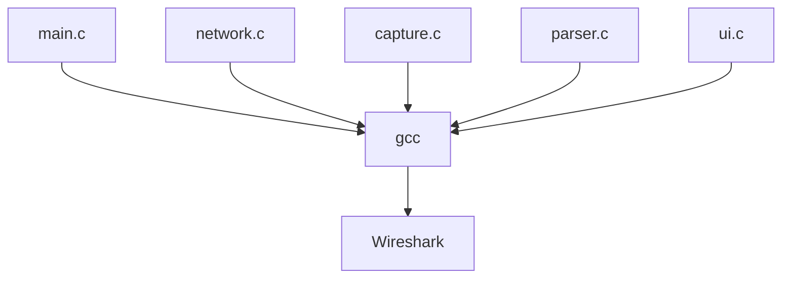
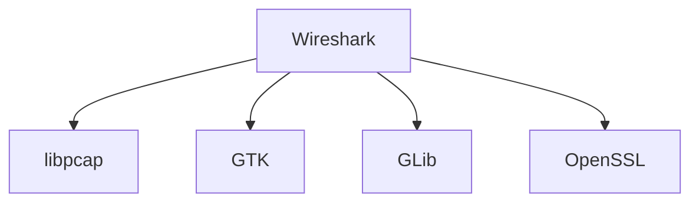
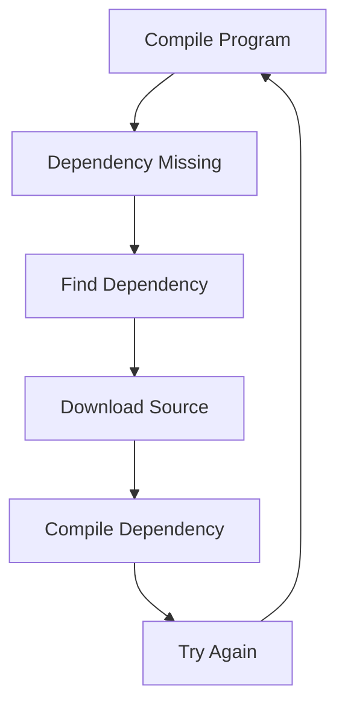
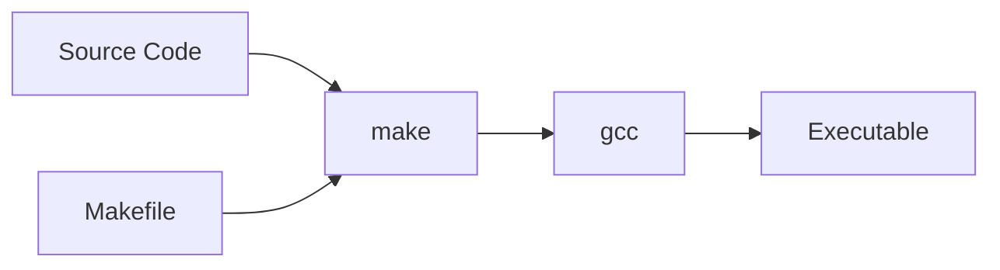
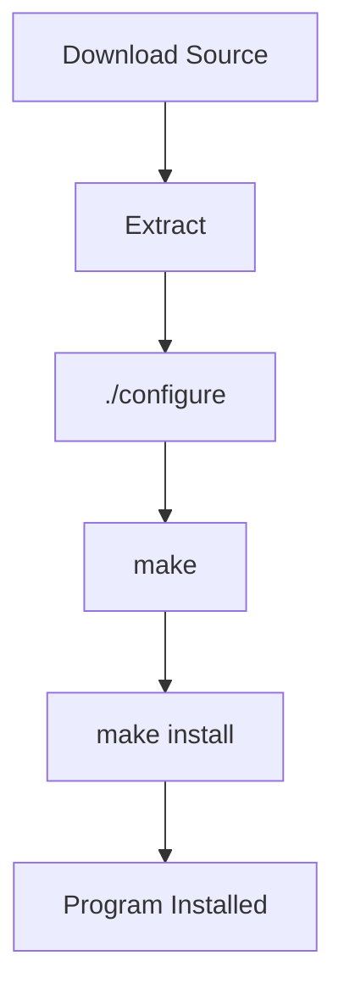
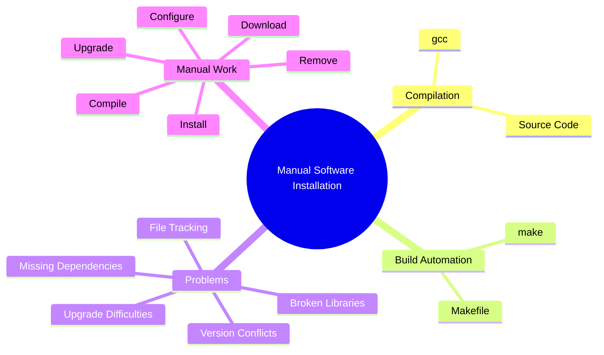

# Section 9.0 — Life Before Package Managers

Before learning **APT**, **dpkg**, repositories, and Debian packages, it helps to understand the problem they were created to solve.

If you don't understand the problem, package managers seem like unnecessary magic.

---

# The Goal

Suppose someone writes a program:

```c
#include <stdio.h>

int main() {
    printf("Hello World\n");
    return 0;
}
```

How does this become something you can run?

---

# Source Code → Executable


Example:

```bash
gcc hello.c -o hello
```

Output:

```text
hello
```

Run:

```bash
./hello
```

Result:

```text
Hello World
```

---

# What Is GCC?

GCC = GNU Compiler Collection

Think:

```text
Source Code
        ↓
      GCC
        ↓
Machine Code
```

GCC translates human-readable code into machine instructions the CPU understands.

---

# Small Programs Are Easy

One file:

```text
hello.c
```

Compile:

```bash
gcc hello.c -o hello
```

Done.

No package manager needed.

---

# Real Programs Are Huge

Imagine Wireshark.

Instead of:

```text
hello.c
```

You may have:

```text
main.c
network.c
capture.c
parser.c
ui.c
logging.c
```

and hundreds more.

---

# Compilation Becomes Complicated



Instead of one command, compilation may involve thousands of files.

---

# Libraries Enter the Picture

Most programs don't do everything themselves.

They use libraries.

Example:

```text
Program
   ↓
Uses OpenSSL
Uses GTK
Uses PCAP
Uses SQLite
```

---

# Example

Wireshark needs:

```text
libpcap
GTK
GLib
zlib
OpenSSL
```

Without them:

```text
Compilation fails
```

---

# Dependency Concept

A dependency is simply:

> Something required before another thing can work.

---



---

# The Old Days

Suppose you want Wireshark.

You download source code:

```text
wireshark.tar.gz
```

Extract it:

```bash
tar -xzf wireshark.tar.gz
```

Enter directory:

```bash
cd wireshark
```

Try compiling:

```bash
gcc ...
```

Error:

```text
Missing libpcap
```

---

# Install Missing Dependency

Find:

```text
libpcap source code
```

Download:

```text
libpcap.tar.gz
```

Compile it.

Then retry Wireshark.

---

# Another Error Appears

```text
Missing GTK
```

Install GTK.

Retry.

---

# Another Error

```text
Missing OpenSSL
```

Install OpenSSL.

Retry.

---

# Repeat Forever



This was a real Linux experience years ago.

---

# Why Make Was Invented

Imagine:

```text
main.c
network.c
capture.c
parser.c
ui.c
```

Running gcc manually becomes painful.

---

Without Make:

```bash
gcc main.c network.c parser.c capture.c ui.c ...
```

Every single time.

---

# Makefile

A Makefile describes:

```text
How to build the project
```

Example:

```make
hello: hello.c
	gcc hello.c -o hello
```

Run:

```bash
make
```

Result:

```text
make reads instructions
make runs gcc
```

---

# Build Process



---

# Why Make Is Useful

Without make:

```text
You tell gcc everything.
```

With make:

```text
You tell make.
Make tells gcc.
```

---

# Source Distribution

Before package managers, software was often distributed as:

```text
program.tar.gz
```

Containing:

```text
Source code
Documentation
Makefile
```

---

# Typical Installation Process

```bash
tar -xzf package.tar.gz

cd package

./configure

make

sudo make install
```

---

# What Does configure Do?

Checks:

```text
Do you have OpenSSL?
Do you have GTK?
Do you have libpcap?
```

and creates build settings.

---

# Traditional Build Workflow



---

# What Does make install Actually Do?

Usually copies files into:

```text
/usr/bin
/usr/lib
/usr/share
/etc
```

Example:

```text
Executable
      ↓
/usr/bin/program
```

After that:

```bash
program
```

works from anywhere.

---

# Problem With Manual Installation

Suppose later you want to remove it.

Question:

```text
Which files did it install?
```

You often don't know.

---

Package managers solve this.

---

# Another Problem: Upgrades

Version 1:

```text
Wireshark 1.0
```

Installed manually.

Later:

```text
Wireshark 2.0
```

Need to:

```text
Download
Compile
Install
Replace files
```

Yourself.

---

# Another Problem: Dependencies

You install:

```text
Program A
```

Needs:

```text
Library B
```

Later:

```text
Library B removed
```

Program A breaks.

Nothing tracks relationships.

---

# The Core Problems



---

# Real Example

Imagine installing Wireshark manually:

```text
Download Wireshark
Download libpcap
Download GTK
Download GLib
Download OpenSSL
Compile all
Install all
Track all files
Upgrade all later
```

This quickly becomes a nightmare.

---

# Why Package Managers Exist

Package managers were created to solve:

1. Dependency management
    
2. Installation tracking
    
3. Removal tracking
    
4. Upgrades
    
5. Version control
    
6. Software discovery
    

---

# Evolution


### Timeline

```text
Step 1:
Compile everything manually with gcc

Step 2:
Use make to automate builds

Step 3:
Create packages

Step 4:
Use package managers

Step 5:
APT automatically manages everything
```

---

# What You Should Remember Before Learning APT

## gcc

```text
Compiles source code into executables
```

## make

```text
Automates compilation
```

## make install

```text
Copies files into system directories
```

## Dependency

```text
Software required by another software
```

## Problem

```text
Manual installation becomes impossible at scale
```

## Solution

```text
Package managers
```

The next section (APT and dpkg) will make much more sense once you see them as tools designed to automate and organize everything described above.