# Section 9.1 — Introduction to Debian Packages, dpkg and APT

Now that we understand **why package managers exist**, let's see how Debian (and therefore Kali Linux) solved the problem.

---

# The Big Idea

Instead of distributing:

```text
Source Code
```

developers distribute:

```text
Packages
```

A package is simply:

```text
Software + Metadata + Installation Instructions
```

---

# Evolution of Software Distribution


---

# What is a Debian Package?

A Debian package is a file ending in:

```text
.deb
```

Examples:

```text
nmap_7.95.deb
wireshark_4.0.deb
curl_8.1.deb
```

Think of a `.deb` file as a ZIP archive containing everything needed to install software.

---

# Inside a Debian Package

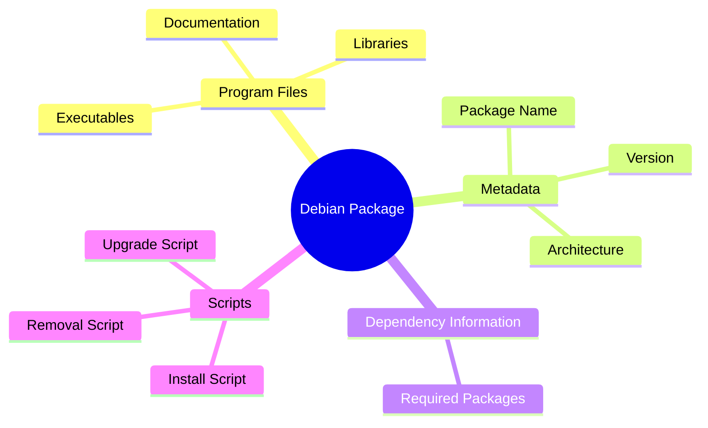

---

# Real Example

Suppose we have:

```text
wireshark.deb
```

Inside it might be:

```text
/usr/bin/wireshark
/usr/share/doc/wireshark
/usr/share/man
```

and also information such as:

```text
Requires:
    libpcap
    glib
    qt5
```

---

# What Is Metadata?

Metadata means:

```text
Data About Data
```

Example:

```text
Package Name: Wireshark
Version: 4.2
Architecture: amd64
Maintainer: Debian Team
```

---

# Why Metadata Is Important

Without metadata:

```text
System doesn't know:

What package is this?
What version?
What dependencies?
Who installed it?
```

Metadata solves that.

---

# Binary Package vs Source Package

This is where many beginners get confused.

---

## Binary Package

Contains:

```text
Already compiled software
```

Example:

```text
wireshark.deb
```

Installation:

```text
Download
Install
Run
```

No compilation required.

---

## Source Package

Contains:

```text
Source Code
Build Instructions
Patches
```

Needs compilation.

---

# Comparison

|Binary Package|Source Package|
|---|---|
|Already compiled|Source code|
|Ready to install|Must build first|
|Fast installation|Slower|
|.deb|Source archives|
|Used by most users|Used by developers|

---

# Source Package Flow


---

# Meet dpkg

The fundamental Debian package tool is:

```text
dpkg
```

Think:

```text
dpkg = Package Installer
```

---

# What dpkg Can Do

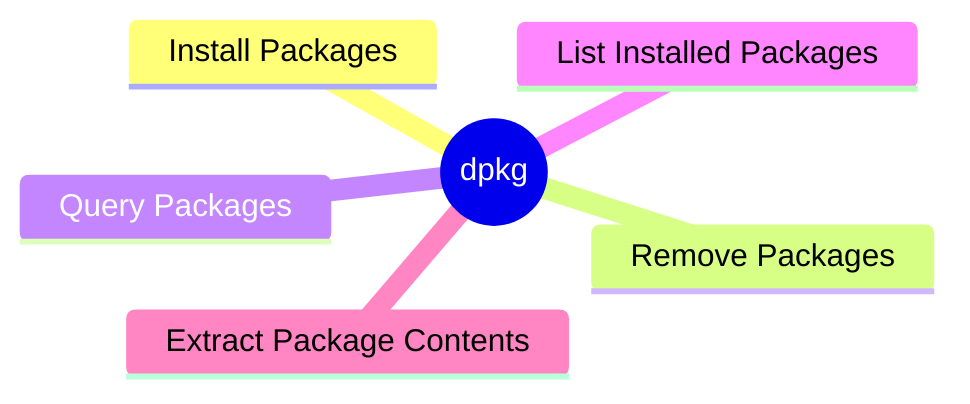

---

# Example Installation

```bash
sudo dpkg -i wireshark.deb
```

Meaning:

```text
Install this package file
```

---

# How dpkg Works

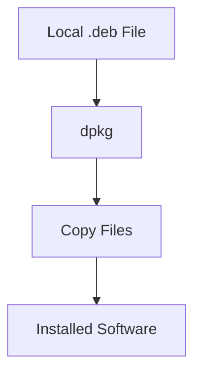

---

# Why dpkg Alone Is Not Enough

Imagine:

```text
wireshark.deb
```

requires:

```text
libpcap
glib
qt5
```

but none are installed.

---

You run:

```bash
sudo dpkg -i wireshark.deb
```

Result:

```text
Dependency missing
Dependency missing
Dependency missing
```

Installation fails.

---

# Why Does dpkg Fail?

Because dpkg only knows:

```text
1. Installed packages
2. Package file given to it
```

It does NOT know:

```text
Internet repositories
Available packages
Dependency trees
```

---

# dpkg's View of the World

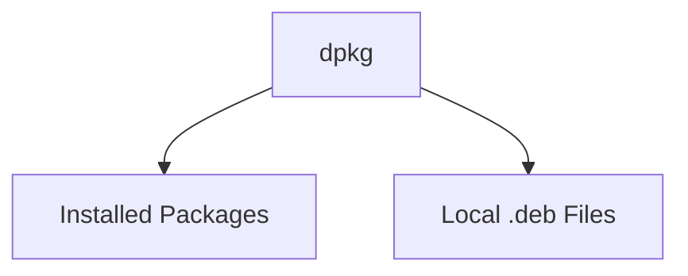

Notice what's missing?

```text
Repositories
Internet
Dependency Resolution
```

---

# Real Example

Suppose:

```text
Package A
```

needs:

```text
Package B
```

---

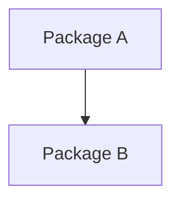

You install A:

```bash
sudo dpkg -i packageA.deb
```

dpkg responds:

```text
Package B is missing
```

and stops.

---

# Enter APT

APT stands for:

```text
Advanced Package Tool
```

APT was created to solve the limitations of dpkg.

---

# APT Is a Smart Layer Above dpkg

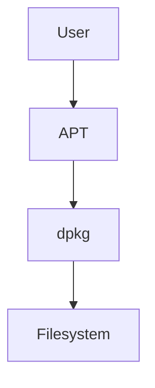

---

# What APT Adds

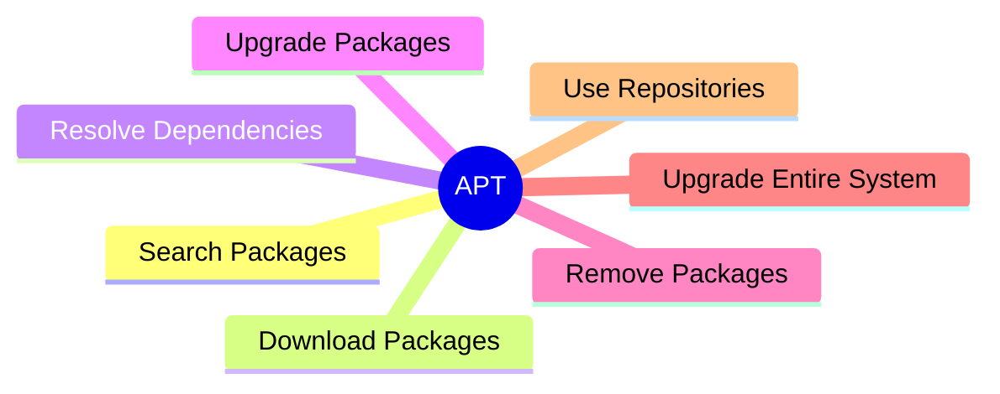

---

# Example

You type:

```bash
sudo apt install wireshark
```

APT does:

```text
Find Wireshark
Find Dependencies
Download Everything
Install Everything
```

---

# What Happens Internally

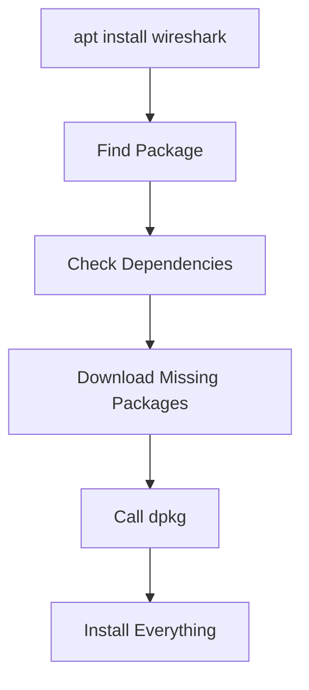

---

# The Magic of Dependency Resolution

Suppose:

```text
Wireshark
```

needs:

```text
libpcap
glib
qt5
```

---

APT builds a dependency tree.

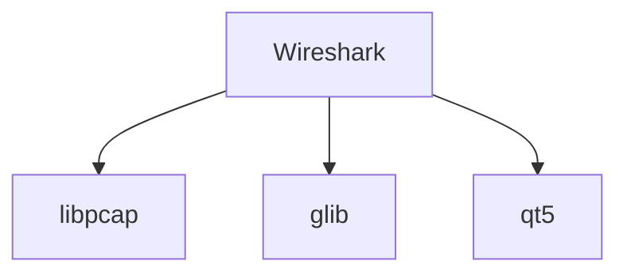

APT downloads everything automatically.

---

# APT vs dpkg

|Feature|dpkg|APT|
|---|---|---|
|Install local .deb|✅|✅|
|Resolve dependencies|❌|✅|
|Download packages|❌|✅|
|Search packages|❌|✅|
|Upgrade packages|❌|✅|
|Upgrade OS|❌|✅|
|Repository support|❌|✅|

---

# Real World Analogy

Imagine opening a restaurant.

---

## dpkg

You say:

```text
Build restaurant
```

dpkg says:

```text
You need:
Kitchen
Tables
Chairs
Staff

Come back when ready.
```

---

## APT

You say:

```text
Build restaurant
```

APT says:

```text
Need kitchen
Need chairs
Need staff

Getting everything...

Done.
```

---

# Relationship Between APT and dpkg

This is the single most important exam question.

---

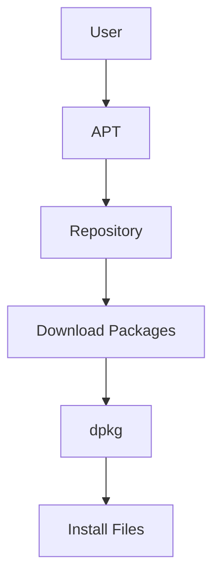

### Remember

```text
APT does NOT install files directly.

APT downloads packages,
resolves dependencies,
then hands everything to dpkg.

dpkg performs the actual installation.
```

---

# The Most Important Mental Model

Think of it like:

```text
APT = Project Manager

dpkg = Construction Worker
```

---

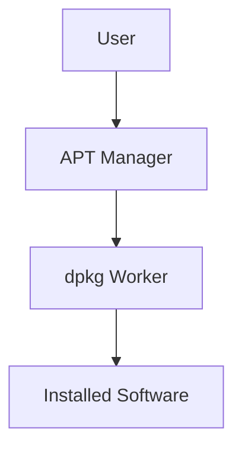

APT decides:

```text
What to install
Where to get it
Which dependencies are needed
```

dpkg simply:

```text
Installs files
Removes files
Updates files
```

---

# Quick Memory Tricks

## dpkg

```text
d = Debian
pkg = Package

Low-level package installer
```

Think:

```text
Local package worker
```

---

## APT

```text
Advanced Package Tool
```

Think:

```text
Smart package manager
```

---

# Mindmap Summary

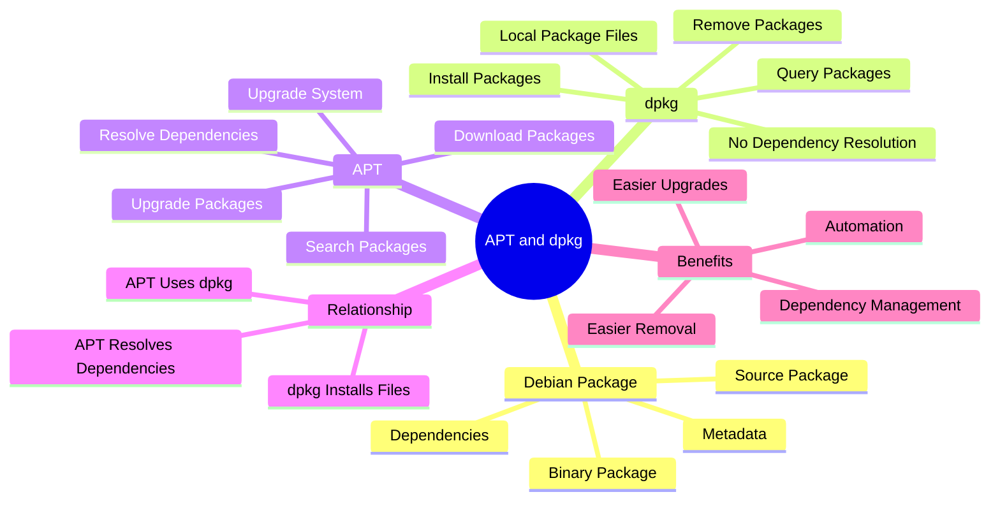

---

# Before Moving On

You should now be able to answer:

### What is a Debian package?

```text
A .deb file containing software,
metadata, dependencies, and scripts.
```

### What is dpkg?

```text
Low-level package installer.
```

### What is APT?

```text
High-level package manager that
downloads packages and resolves dependencies.
```

### Does APT replace dpkg?

```text
No.

APT uses dpkg underneath.
```

### One-line Summary

```text
dpkg installs packages.

APT finds packages, downloads packages,
resolves dependencies, then uses dpkg
to install them.
```

The next logical section is **Repositories, Package Sources, and `/etc/apt/sources.list`**, where you'll finally see **where APT gets packages from and how Kali knows what software exists.**